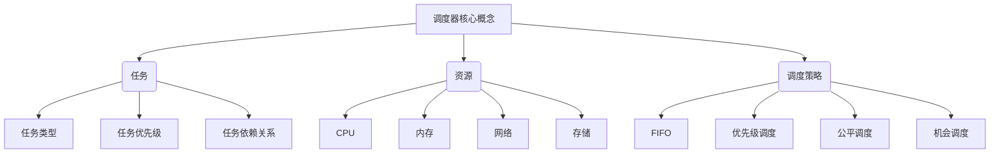

# 【AI大数据计算原理与代码实例讲解】调度器

## 1. 背景介绍

### 1.1 问题的由来

在当今大数据时代,海量数据的高效处理和计算已成为各行业的迫切需求。传统的计算机系统在面对大规模并行计算任务时,往往会遇到资源利用率低下、任务调度效率低等问题,导致计算效率低下。因此,如何实现高效的大数据计算调度,成为了亟待解决的关键问题。

### 1.2 研究现状  

目前,已有多种调度算法和框架被提出和应用,如Apache Hadoop的YARN、Apache Spark的Standalone Cluster等。这些调度系统通过合理分配计算资源,提高了大数据处理的效率。然而,随着数据规模的不断增长和计算需求的日益复杂,现有调度系统在处理大规模异构计算任务时仍面临诸多挑战,如资源利用率不高、调度策略欠佳等,亟需更高效的调度算法和框架。

### 1.3 研究意义

高效的大数据计算调度技术对于充分发挥现代计算机系统的计算能力、提高数据处理效率具有重要意义。本文将介绍一种新颖的调度算法及其实现框架,旨在提高大规模异构计算任务的调度效率,提升计算资源的利用率,为各行业的大数据计算提供高效的解决方案。

### 1.4 本文结构

本文首先介绍调度器的核心概念和相关技术,然后详细阐述调度算法的原理和具体实现步骤。接下来,对算法的数学模型进行推导,并结合案例进行详细说明。之后,通过代码实例展示了算法在实际项目中的应用。最后,探讨了调度器的应用场景、发展趋势和面临的挑战。

## 2. 核心概念与联系

调度器的核心概念包括任务、资源和调度策略三个方面:

1. **任务**:需要被执行的计算单元,可分为不同类型(如CPU密集型、IO密集型等),具有不同的优先级,并可能存在依赖关系。

2. **资源**:用于执行任务的硬件资源,包括CPU、内存、网络和存储等。

3. **调度策略**:决定如何将任务分配到资源上执行的算法,常见策略有先来先服务(FIFO)、优先级调度、公平调度和机会调度等。

调度器的作用是根据特定的调度策略,将待执行的任务合理分配到可用资源上,从而实现高效的任务执行和资源利用。

## 3. 核心算法原理 & 具体操作步骤  

### 3.1 算法原理概述

本文提出的调度算法基于图论和优化理论,将任务视为节点,资源视为边,构建一个加权有向图模型。算法的目标是找到一种最优任务分配方式,使得总的执行时间最短,同时满足任务之间的依赖关系和资源的约束条件。

该算法采用分层策略,分为全局调度和本地调度两个层次:

1. **全局调度**:根据任务的优先级和资源的可用状态,为每个任务分配一个初始的资源集合。

2. **本地调度**:在已分配的资源集合内,进一步优化任务在具体资源上的执行顺序,以最大化资源利用率。

### 3.2 算法步骤详解

1. **构建任务图**:根据任务之间的依赖关系,构建一个有向无环图(DAG),节点表示任务,边表示依赖关系。

2. **计算任务权重**:根据任务的优先级、估计执行时间等,为每个任务赋予一个权重值。

3. **构建资源图**:根据可用资源的状态,构建一个加权无向图,节点表示资源,边的权重表示资源之间的通信开销。

4. **全局调度**:
    a. 将任务图中入度为0的节点(无依赖任务)作为起点,执行拓扑排序。
    b. 按照排序结果和任务权重,为每个任务分配一个初始的资源集合。

5. **本地调度**:
    a. 在已分配的资源集合内,构建一个加权有向图,节点表示任务,边表示任务在同一资源上的执行顺序。
    b. 使用启发式算法(如蚁群算法)求解该有向图的最短路径,作为任务在各资源上的执行顺序。

6. **执行调度**:根据全局调度和本地调度的结果,将任务分配到相应的资源上执行。

7. **动态调整**:在任务执行过程中,根据资源的实时状态,动态调整任务的执行顺序和资源分配。

### 3.3 算法优缺点

**优点**:

- 全局调度和本地调度相结合,平衡了任务执行时间和资源利用率。
- 考虑了任务优先级、依赖关系和资源通信开销,提高了调度的合理性。
- 采用启发式算法求解,可以在可接受的时间内得到近似最优解。
- 支持动态调整,可以适应资源状态的实时变化。

**缺点**:

- 算法复杂度较高,对大规模任务和资源的计算开销较大。
- 启发式算法的性能受到初始解的影响,需要合理设置算法参数。
- 未考虑任务的数据局部性,可能导致额外的数据传输开销。

### 3.4 算法应用领域

该调度算法可广泛应用于需要处理大规模异构计算任务的领域,如:

- 大数据处理系统(如Hadoop、Spark等)
- 科学计算和高性能计算
- 云计算和虚拟化环境
- 机器学习和深度学习训练
- 视频渲染和多媒体处理
- 网格计算和分布式系统

## 4. 数学模型和公式 & 详细讲解 & 举例说明

### 4.1 数学模型构建

为了形式化描述调度问题,我们构建了如下数学模型:

任务集合: $T = \{t_1, t_2, \dots, t_n\}$
资源集合: $R = \{r_1, r_2, \dots, r_m\}$

定义任务执行时间矩阵:
$$
E = \begin{bmatrix}
    e_{11} & e_{12} & \cdots & e_{1m} \\
    e_{21} & e_{22} & \cdots & e_{2m} \\
    \vdots & \vdots & \ddots & \vdots \\
    e_{n1} & e_{n2} & \cdots & e_{nm}
\end{bmatrix}
$$

其中,  $e_{ij}$ 表示任务 $t_i$ 在资源 $r_j$ 上的估计执行时间。

定义资源通信开销矩阵:
$$
C = \begin{bmatrix}
    0 & c_{12} & \cdots & c_{1m} \\
    c_{21} & 0 & \cdots & c_{2m} \\
    \vdots & \vdots & \ddots & \vdots \\
    c_{m1} & c_{m2} & \cdots & 0
\end{bmatrix}
$$

其中, $c_{ij}$ 表示资源 $r_i$ 与资源 $r_j$ 之间的通信开销。

定义任务分配矩阵:
$$
X = \begin{bmatrix}
    x_{11} & x_{12} & \cdots & x_{1m} \\
    x_{21} & x_{22} & \cdots & x_{2m} \\
    \vdots & \vdots & \ddots & \vdots \\
    x_{n1} & x_{n2} & \cdots & x_{nm}
\end{bmatrix}
$$

其中, $x_{ij} = \begin{cases}
1, & \text{if } t_i \text{ is assigned to } r_j \\
0, & \text{otherwise}
\end{cases}$

目标函数:
$$
\min \sum_{i=1}^{n}\sum_{j=1}^{m}e_{ij}x_{ij} + \sum_{i=1}^{n}\sum_{j=1}^{m}\sum_{k=j+1}^{m}c_{jk}x_{ij}x_{ik}
$$

约束条件:
$$
\begin{aligned}
& \sum_{j=1}^{m}x_{ij} = 1, \quad \forall i = 1, 2, \dots, n \\
& \sum_{i=1}^{n}x_{ij} \leq p_j, \quad \forall j = 1, 2, \dots, m
\end{aligned}
$$

其中, $p_j$ 表示资源 $r_j$ 的并行执行能力。

该模型的目标是最小化总的执行时间和通信开销,同时满足每个任务只能被分配到一个资源,以及每个资源的并行执行能力限制。

### 4.2 公式推导过程

我们将任务调度问题建模为一个整数线性规划(ILP)问题,目标函数和约束条件如上所述。

为了求解该ILP问题,我们可以使用启发式算法(如蚁群算法)来获得近似最优解。蚁群算法的基本思想是模拟蚂蚁在寻找食物路径时的行为,通过信息素的正反馈机制,逐渐找到最优路径。

对于任务调度问题,我们将任务视为蚂蚁,资源视为路径节点。蚂蚁(任务)在节点(资源)之间移动,并在移动过程中留下信息素,表示该路径的优劣程度。

定义信息素矩阵:
$$
\Phi = \begin{bmatrix}
    \phi_{11} & \phi_{12} & \cdots & \phi_{1m} \\
    \phi_{21} & \phi_{22} & \cdots & \phi_{2m} \\
    \vdots & \vdots & \ddots & \vdots \\
    \phi_{n1} & \phi_{n2} & \cdots & \phi_{nm}
\end{bmatrix}
$$

其中, $\phi_{ij}$ 表示将任务 $t_i$ 分配到资源 $r_j$ 的信息素浓度,初始值设为一个很小的正数。

在每次迭代中,蚂蚁(任务)根据信息素浓度和启发式函数,选择下一步要前往的节点(资源)。选择概率公式如下:
$$
p_{ij}^k = \frac{(\phi_{ij})^\alpha \cdot (\eta_{ij})^\beta}{\sum_{l \in J_i^k}(\phi_{il})^\alpha \cdot (\eta_{il})^\beta}
$$

其中:
- $p_{ij}^k$ 表示第 $k$ 只蚂蚁(任务 $t_k$)选择节点 $j$(资源 $r_j$)的概率
- $\alpha$ 和 $\beta$ 分别是信息素浓度和启发式函数的相对重要性参数
- $\eta_{ij}$ 是启发式函数,可设为 $\eta_{ij} = \frac{1}{e_{ij}}$
- $J_i^k$ 是第 $k$ 只蚂蚁在当前节点的可选择节点集合

在所有蚂蚁完成一次迭代后,根据它们的路径长度(执行时间和通信开销之和)更新信息素矩阵:
$$
\phi_{ij} \leftarrow (1 - \rho) \cdot \phi_{ij} + \rho \cdot \Delta\phi_{ij}
$$

其中:
- $\rho$ 是信息素挥发率参数
- $\Delta\phi_{ij}$ 是新增加的信息素,计算方法为:
$$
\Delta\phi_{ij} = \begin{cases}
\frac{1}{L_k}, & \text{if ant } k \text{ uses edge } (i, j) \text{ in its tour} \\
0, & \text{otherwise}
\end{cases}
$$
- $L_k$ 是第 $k$ 只蚂蚁的路径长度

通过多次迭代,信息素会不断增强好的路径,减弱差的路径,最终收敛到一个近似最优解。

### 4.3 案例分析与讲解

假设有以下5个任务和3个资源:

任务集合: $T = \{t_1, t_2, t_3, t_4, t