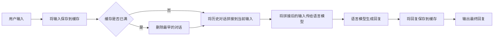

# 【LangChain编程：从入门到实践】ConversationBufferMemory

## 1. 背景介绍
### 1.1 问题的由来
随着人工智能技术的飞速发展，对话式AI系统越来越受到重视。如何让AI能够像人一样进行多轮对话，记住之前的对话内容，成为了一个亟待解决的问题。传统的对话系统通常只能进行单轮的问答，缺乏上下文记忆能力，导致对话体验不够自然流畅。

### 1.2 研究现状
目前业界已经提出了多种对话历史记忆机制，如RNN、Transformer等神经网络结构，以及基于检索的方法如DSSM等。但这些方法要么计算复杂度高，要么难以处理长对话。最近，LangChain项目提出了一种简洁高效的对话历史记忆机制ConversationBufferMemory，引起了广泛关注。

### 1.3 研究意义
ConversationBufferMemory作为一种轻量级的对话历史记忆机制，可以显著提升对话式AI系统的连贯性和交互体验，降低开发难度。深入研究其原理和实现，对于推动对话式AI的发展具有重要意义。同时其思想也可以应用到其他需要上下文感知的任务中。

### 1.4 本文结构
本文将首先介绍ConversationBufferMemory的核心概念和工作原理，然后详细讲解其算法步骤和数学模型。接着通过代码实例和应用场景说明其具体用法。最后总结其特点并展望未来的发展方向。

## 2. 核心概念与联系
ConversationBufferMemory的核心概念是对话历史缓存(Conversation Buffer)。它以先进先出(FIFO)的方式，保存了一定数量的最近对话内容，包括用户输入和AI输出。当对话超过缓存长度时，最早的对话会被自动删除。

ConversationBufferMemory通过将当前对话内容与历史缓存拼接，形成带上下文的prompt，可以让语言模型根据之前的对话内容生成更加连贯一致的回复。同时因为只保存了固定长度的最近对话，因此计算开销很小。

ConversationBufferMemory与传统RNN等方法的区别在于，它不需要在模型内部维护隐藏状态，而是将需要的上下文信息显式地保存在缓存中并输入给语言模型。这种解耦的思想使得它可以很容易地应用到不同的语言模型中。

## 3. 核心算法原理 & 具体操作步骤
### 3.1 算法原理概述
ConversationBufferMemory的工作原理可以用下面的流程图表示：

可以看到，ConversationBufferMemory的关键步骤包括：
1. 将新的对话内容保存到缓存中 
2. 检查缓存是否已满，如果已满则删除最早的对话
3. 将历史对话拼接到当前输入，形成带上下文的prompt
4. 将拼接后的输入传给语言模型，生成回复
5. 将生成的回复也保存到缓存中

通过不断重复上述步骤，ConversationBufferMemory就可以实现多轮对话的上下文记忆。

### 3.2 算法步骤详解

下面我们详细说明ConversationBufferMemory的算法步骤。

**输入：**
- `input`: 用户当前输入的对话内容
- `buffer`: 对话历史缓存，初始为空
- `max_length`: 缓存的最大长度，超过该长度时会删除最早的对话

**输出：**
- `output`: 语言模型生成的回复内容
- 更新后的`buffer`

**算法步骤：**
1. 将`input`添加到`buffer`的末尾
2. 如果`buffer`的长度超过了`max_length`:
   - 删除`buffer`的第一个元素
3. 将`buffer`中的所有对话内容拼接成一个字符串`prompt`
4. 将`prompt`传给语言模型，生成回复内容`output`
5. 将`output`添加到`buffer`的末尾
6. 返回`output`和更新后的`buffer`

可以看到，ConversationBufferMemory的算法步骤非常简单，主要就是在缓存中添加和删除对话内容，以及拼接prompt的过程。

### 3.3 算法优缺点

ConversationBufferMemory算法的主要优点有：
- 实现简单，易于理解和应用
- 计算高效，只需要进行字符串拼接操作
- 可以灵活控制记忆的对话长度
- 与具体的语言模型解耦，通用性强

当然它也有一些局限性：
- 对话历史是按照时间顺序保存的，无法显式地对关键信息进行提取和表示
- 一旦对话超过最大长度，之前的信息就无法再访问了
- 没有考虑不同对话内容的重要性，无法动态调整记忆的侧重点

但瑕不掩瑜，对于一般的多轮对话场景，ConversationBufferMemory已经可以发挥很好的作用了。

### 3.4 算法应用领域

ConversationBufferMemory 可以应用于各种需要多轮对话和上下文感知的场景，比如：

- 客服聊天机器人：用户咨询时通常会涉及到多个问题，需要机器人能够记住之前的对话内容，给出连贯的解答。
- 个人助理：用户可能会交代一系列任务或者询问相关联的信息，助理需要能够理解对话的上下文。
- 教育/陪伴型聊天机器人：模拟长对话情景，营造更自然的交互体验。
- 故事生成：根据之前的情节发展，自动生成后续的故事内容。

总之只要是需要多轮交互和信息关联的任务，都可以利用 ConversationBufferMemory 提供的上下文感知能力。

## 4. 数学模型和公式 & 详细讲解 & 举例说明
### 4.1 数学模型构建
ConversationBufferMemory 本质上可以看作一个定长队列(Fixed-size Queue)。我们可以用一个数组 $B$ 来表示这个缓存，其中每个元素 $B_i$ 代表一轮对话：

$$
B = [B_1, B_2, ..., B_n]
$$

其中 $n$ 表示缓存的最大长度，即超过 $n$ 轮对话之后，最早的对话 $B_1$ 会被删除。

每轮对话 $B_i$ 可以进一步表示为一个二元组：

$$
B_i = (Q_i, A_i)
$$

其中 $Q_i$ 表示第 $i$ 轮对话中用户的输入query，$A_i$ 表示第 $i$ 轮对话中AI生成的回答answer。

当收到一个新的用户输入 $Q_{n+1}$ 时，我们将其添加到缓存的末尾，并删除最早的一轮对话 $B_1$，得到更新后的缓存 $B'$：

$$
B' = [B_2, ..., B_n, (Q_{n+1}, A_{n+1})]
$$

然后我们将缓存中的所有对话拼接成一个上下文信息 $C$：

$$
C = Q_1 \oplus A_1 \oplus ... \oplus Q_n \oplus A_n \oplus Q_{n+1}
$$

其中 $\oplus$ 表示字符串拼接操作。最后将拼接后的上下文信息 $C$ 传给语言模型 $M$，生成新的回答 $A_{n+1}$：

$$
A_{n+1} = M(C)
$$

以上就是 ConversationBufferMemory 的主要数学模型，通过定长队列和字符串拼接操作，实现了对话历史的记忆和更新。

### 4.2 公式推导过程
上面的数学模型其实已经包含了主要的公式，这里我们再详细推导一下。

首先我们定义缓存的更新操作 $U$，它接收当前缓存 $B$ 和新的一轮对话 $(Q_{n+1}, A_{n+1})$，生成更新后的缓存 $B'$：

$$
B' = U(B, (Q_{n+1}, A_{n+1}))
$$

展开可得：

$$
\begin{aligned}
B' &= U([B_1, ..., B_n], (Q_{n+1}, A_{n+1})) \\
&= [B_2, ..., B_n, (Q_{n+1}, A_{n+1})]
\end{aligned}
$$

接着我们定义上下文拼接操作 $J$，它接收当前缓存 $B$ 和新的用户输入 $Q_{n+1}$，生成拼接后的上下文信息 $C$：

$$
C = J(B, Q_{n+1})
$$

展开可得：

$$
\begin{aligned}
C &= J([(Q_1, A_1), ..., (Q_n, A_n)], Q_{n+1}) \\
&= Q_1 \oplus A_1 \oplus ... \oplus Q_n \oplus A_n \oplus Q_{n+1}
\end{aligned}
$$

最后我们定义语言模型的生成操作 $M$，它接收拼接后的上下文信息 $C$，生成新的回答 $A_{n+1}$：

$$
A_{n+1} = M(C)
$$

综上所述，ConversationBufferMemory 的完整数学模型可以表示为：

$$
\begin{aligned}
B' &= U(B, (Q_{n+1}, A_{n+1})) \\
C &= J(B, Q_{n+1}) \\
A_{n+1} &= M(C)
\end{aligned}
$$

通过以上三个操作的循环，不断更新缓存、生成上下文和生成回答，实现了多轮对话的流程。

### 4.3 案例分析与讲解
下面我们用一个具体的例子来说明 ConversationBufferMemory 的工作过程。

假设当前的对话历史缓存为：

$$
B = [("你好", "你好,我是AI助手,有什么可以帮助你的吗?"), 
     ("今天天气怎么样?","根据天气预报,今天是晴天,温度在25℃左右,非常适合外出游玩。")]
$$

缓存的最大长度为3。现在用户输入了一个新的问题：

$$
Q_3 = "那明天呢?"
$$

我们首先将新问题添加到缓存的末尾，并删除第一轮对话，得到更新后的缓存：

$$
\begin{aligned}
B' &= U(B, (Q_3, A_3)) \\
&= [("今天天气怎么样?","根据天气预报,今天是晴天,温度在25℃左右,非常适合外出游玩。"), 
    ("那明天呢?", A_3)]
\end{aligned}
$$

注意这里 $A_3$ 还没有生成。接下来我们拼接缓存中的对话和新问题，生成上下文信息：

$$
\begin{aligned}
C &= J(B, Q_3) \\
&= "今天天气怎么样?" \oplus "根据天气预报,今天是晴天,温度在25℃左右,非常适合外出游玩。" \oplus "那明天呢?"
\end{aligned}
$$

最后将拼接后的上下文传给语言模型，生成新的回答：

$$
\begin{aligned}
A_3 &= M(C) \\
&= "根据天气预报,明天也是晴天,温度在26℃左右,和今天的天气差不多,也很适合出门玩耍。"
\end{aligned}
$$

至此我们就完成了一轮对话的处理过程，得到了更新后的缓存 $B'$ 和新的回答 $A_3$。可以看到，语言模型根据之前天气的对话上下文，生成了明天天气的回复，整个对话是连贯的。

通过不断重复这个过程，ConversationBufferMemory 就可以实现多轮对话的流畅交互，同时保持了一定的上下文记忆。当然缓存的长度是有限的，如果对话轮数超过最大长度，最早的记忆就会被遗忘。

### 4.4 常见问题解答

**Q: ConversationBufferMemory 对缓存的最大长度有什么要求吗？**

A: 缓存的最大长度是一个超