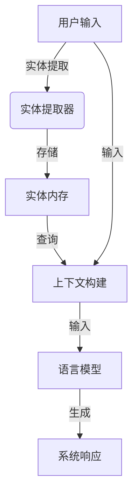

以下是《【LangChain编程：从入门到实践】ConversationEntityMemory》的技术博客正文：

# 【LangChain编程：从入门到实践】ConversationEntityMemory

## 1. 背景介绍

### 1.1 问题的由来

在自然语言处理(NLP)和对话系统领域,上下文记忆一直是一个巨大的挑战。传统的对话模型很容易忘记之前的对话历史,导致生成的响应缺乏连贯性和一致性。为了解决这个问题,研究人员提出了各种记忆机制,旨在帮助模型更好地捕获和利用对话上下文信息。

### 1.2 研究现状  

目前,主流的记忆机制包括基于注意力机制的记忆模型、外部记忆模型和实体记忆模型等。其中,实体记忆模型因其简单高效而受到广泛关注。实体记忆模型通过跟踪和存储对话中出现的实体(如人名、地名、组织机构等),来增强模型对上下文的理解和记忆能力。

### 1.3 研究意义

良好的对话记忆能力对于构建高质量的对话系统至关重要。通过有效利用上下文信息,对话系统可以生成更加连贯、相关和富有洞察力的响应,从而提高用户体验。此外,强大的记忆机制也有助于模型更好地理解复杂的语义和推理,为未来的人工智能系统奠定基础。

### 1.4 本文结构

本文将重点介绍LangChain中的ConversationEntityMemory,这是一种基于实体的对话记忆机制。我们将从以下几个方面进行全面探讨:核心概念、算法原理、数学模型、代码实现、应用场景、工具资源等,旨在为读者提供一个全面而深入的理解。

## 2. 核心概念与联系

ConversationEntityMemory是LangChain中的一种对话记忆机制,它基于实体跟踪和存储的思想。在对话过程中,该机制会自动识别和提取出现的实体(如人名、地名、组织机构等),并将它们存储在内存中。当生成新的响应时,模型可以查询和利用这些存储的实体信息,从而产生更加连贯和上下文相关的输出。

ConversationEntityMemory紧密地与LangChain的其他组件(如LLM、代理等)协同工作,为整个对话系统提供强大的记忆支持。它可以与不同的实体提取器(如SpacyEntityExtractor、FuzzyEntityExtractor等)集成,以满足不同场景的需求。

该记忆机制的核心思想是将对话视为一系列的实体交互,而非孤立的语句。通过跟踪和存储这些实体,模型可以更好地捕获对话的语义和上下文,从而生成更加自然和人性化的响应。

## 3. 核心算法原理 & 具体操作步骤

### 3.1 算法原理概述

ConversationEntityMemory的核心算法原理可以概括为以下几个步骤:

1. **实体提取**: 使用预定义的实体提取器(如SpacyEntityExtractor)从用户输入和系统响应中提取出现的实体。

2. **实体存储**: 将提取的实体存储在内存中,并与对话历史上下文相关联。

3. **上下文构建**: 在生成新的响应时,将存储的实体信息与当前的用户输入合并,形成丰富的上下文表示。

4. **响应生成**: 将丰富的上下文表示输入到语言模型(如GPT),生成与对话历史和实体信息相关的响应。

该算法的核心思想是利用实体作为对话记忆的载体,从而增强模型对上下文的理解和利用能力。通过存储和查询实体信息,模型可以更好地捕获对话的语义和连贯性,避免生成不相关或矛盾的响应。



### 3.2 算法步骤详解

1. **实体提取**

   在这一步骤中,算法使用预定义的实体提取器从用户输入和系统响应中识别和提取出现的实体。常用的实体提取器包括:

   - **SpacyEntityExtractor**: 基于Spacy库,可以识别常见的实体类型,如人名、地名、组织机构等。
   - **FuzzyEntityExtractor**: 使用模糊匹配算法,可以识别一些无法被Spacy捕获的实体。
   - **CustomEntityExtractor**: 允许用户定义自己的实体提取规则和模式。

   提取的实体将被存储在内存中,并与对话历史上下文相关联。

2. **实体存储**

   提取的实体将被存储在内存中,并与对话历史上下文相关联。内存的数据结构通常是一个字典或哈希表,其中键是实体名称,值是一个列表,存储了该实体在对话历史中出现的所有位置和上下文信息。

   例如,如果在对话中出现了"纽约"这个实体,内存中可能会存储如下信息:

   ```python
   entity_memory = {
       "纽约": [
           {"utterance_index": 0, "position": (10, 12), "context": "我来自纽约"},
           {"utterance_index": 3, "position": (5, 7), "context": "我去过纽约"},
           ...
       ]
   }
   ```

   这样,模型就可以方便地查询和利用这些实体信息,生成更加连贯和相关的响应。

3. **上下文构建**

   在生成新的响应时,算法会将存储的实体信息与当前的用户输入合并,形成丰富的上下文表示。这个上下文表示通常是一个字符串,包含了用户输入、相关实体信息以及对话历史的摘要。

   例如,假设用户输入是"我想去纽约旅游",算法可能会构建如下上下文表示:

   ```
   上下文: 我想去纽约旅游。纽约是一个著名的旅游城市,之前我们曾多次提到过它。它位于美国东北部,是世界金融中心之一。
   ```

   这个丰富的上下文表示将被输入到语言模型中,用于生成与对话历史和实体信息相关的响应。

4. **响应生成**

   最后,算法将丰富的上下文表示输入到语言模型(如GPT)中,生成与对话历史和实体信息相关的响应。语言模型将利用上下文信息,生成更加连贯、相关和富有洞察力的响应。

   例如,对于上面的上下文表示,语言模型可能会生成如下响应:

   ```
   纽约确实是一个非常棒的旅游目的地!作为美国的经济和文化中心,那里有无数值得一游的景点和活动。比如你可以参观著名的自由女神像、中央公园、大都会博物馆等。晚上还可以去体验百老汇的剧院文化。不过要注意纽约的旅游成本通常较高,做好预算规划很重要。
   ```

   这个响应不仅与用户的旅游需求相关,而且还体现了对"纽约"这个实体的深入理解和知识,从而提供了更加丰富和有价值的信息。

### 3.3 算法优缺点

**优点**:

- 简单高效:实体记忆机制的思想简单直观,实现和集成也相对容易。
- 提高连贯性:通过跟踪和利用实体信息,可以显著提高生成响应的连贯性和相关性。
- 可解释性好:实体记忆机制的工作原理易于理解和解释,有助于模型的可解释性。
- 灵活可扩展:可以与不同的实体提取器集成,满足不同场景的需求。

**缺点**:

- 依赖实体提取:算法的性能很大程度上依赖于实体提取器的质量和覆盖范围。
- 忽略上下文语义:仅关注实体信息,可能会忽略对话中的一些语义和隐含信息。
- 记忆容量有限:内存中存储的实体信息数量有限,可能无法捕获长期的对话历史。
- 无法处理抽象概念:对于一些抽象的概念和主题,实体记忆机制可能无法很好地捕获和利用。

### 3.4 算法应用领域

ConversationEntityMemory及其相关算法可以应用于各种需要对话记忆能力的场景,包括但不限于:

- 对话机器人和虚拟助手
- 客户服务和呼叫中心系统
- 智能问答和知识库系统
- 会议记录和总结系统
- 故事情节生成和叙事智能
- 个性化推荐和决策支持系统

在这些应用中,良好的对话记忆能力可以显著提高系统的响应质量、用户体验和决策效率。通过有效利用上下文信息,系统可以生成更加连贯、相关和富有洞察力的输出,从而为用户带来更好的服务和体验。

## 4. 数学模型和公式 & 详细讲解 & 举例说明

虽然ConversationEntityMemory的核心思想较为简单,但是在实现和优化过程中,仍然涉及到一些数学模型和公式。下面我们将详细介绍其中的一些关键模型和公式。

### 4.1 数学模型构建

为了量化实体在对话中的重要性,我们可以构建一个基于TF-IDF的实体重要性模型。TF-IDF(Term Frequency-Inverse Document Frequency)是一种常用的文本挖掘技术,用于评估一个词对于一个文档集或语料库的重要程度。

在ConversationEntityMemory的场景下,我们可以将每个对话历史视为一个"文档",将实体视为"词"。那么,一个实体在整个对话历史中的TF-IDF值就可以反映该实体的重要性。

具体来说,对于一个实体 $e$ 在对话历史 $D$ 中的TF-IDF值可以计算为:

$$\text{TF-IDF}(e, D) = \text{TF}(e, D) \times \text{IDF}(e)$$

其中:

- $\text{TF}(e, D)$ 表示实体 $e$ 在对话历史 $D$ 中出现的频率,可以用该实体出现的次数除以对话历史的总词数来计算。
- $\text{IDF}(e)$ 表示实体 $e$ 的逆文档频率,用于衡量该实体在整个语料库中的稀有程度。它可以计算为:

$$\text{IDF}(e) = \log \frac{N}{|\{D \in \mathcal{C}: e \in D\}|}$$

其中 $N$ 是语料库中对话历史的总数, $|\{D \in \mathcal{C}: e \in D\}|$ 表示包含实体 $e$ 的对话历史数量。

通过计算每个实体的TF-IDF值,我们可以确定哪些实体在当前对话历史中最为重要和相关。这些重要实体可以被优先考虑和利用,以生成更加准确和相关的响应。

### 4.2 公式推导过程

下面我们将详细推导TF-IDF公式,以加深对其背后原理的理解。

首先,我们定义实体 $e$ 在对话历史 $D$ 中的词频(Term Frequency)为:

$$\text{TF}(e, D) = \frac{f_{e,D}}{|D|}$$

其中 $f_{e,D}$ 表示实体 $e$ 在对话历史 $D$ 中出现的次数, $|D|$ 表示对话历史 $D$ 的总词数。

接下来,我们定义实体 $e$ 的逆文档频率(Inverse Document Frequency)为:

$$\text{IDF}(e) = \log \frac{N}{|\{D \in \mathcal{C}: e \in D\}|}$$

其中 $N$ 是语料库中对话历史的总数, $|\{D \in \mathcal{C}: e \in D\}|$ 表示包含实体 $e$ 的对话历史数量。

IDF的思想是,如果一个实体在很多对话历史中出现,那么它就不太能够很好地区分不同的对话主题,因此应该给予较低的权重。反之,如果一个实体只在少数对话历史中出现,那么它就可能对于区分不同