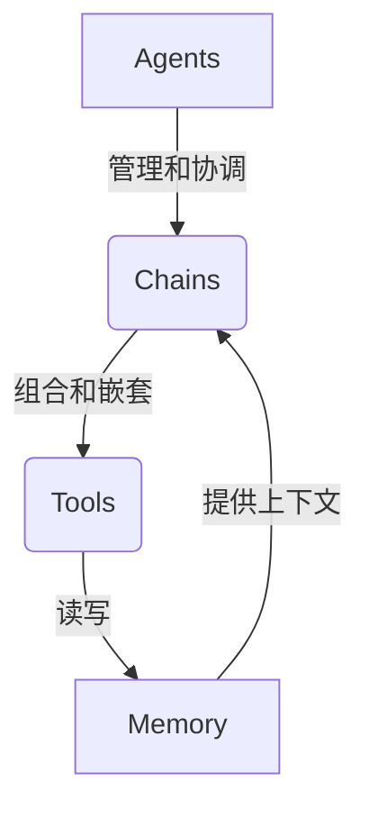

# 【LangChain编程：从入门到实践】RunnableParallel

## 1. 背景介绍

### 1.1 问题的由来

在当今快节奏的数字时代，处理海量数据和执行复杂任务已经成为许多行业的常态。传统的编程方式往往难以满足这些需求,因为它们通常是线性执行、缺乏灵活性和可扩展性。为了解决这个问题,并行编程(Parallel Programming)应运而生。

并行编程允许同时执行多个任务,从而显著提高计算效率和处理能力。然而,传统的并行编程框架往往存在着编程模型复杂、调试困难、资源管理棘手等挑战,这使得开发人员难以充分利用并行计算的优势。

### 1.2 研究现状

为了简化并行编程的复杂性,近年来出现了许多新的编程模型和框架,其中 LangChain 就是一个颇具前景的解决方案。LangChain 是一个用于构建可扩展的AI应用程序的框架,它提供了一种声明式的编程范式,使开发人员能够更加轻松地构建、组合和运行并行任务。

LangChain 的核心思想是将复杂的AI任务分解为一系列可组合的"链"(Chains),每个链代表一个独立的功能模块。这些链可以按需组合和嵌套,形成更复杂的应用程序。LangChain 还提供了一系列预构建的代理(Agents),用于管理和协调这些链的执行。

### 1.3 研究意义

LangChain 的出现为并行编程带来了全新的思路和机遇。它的声明式编程范式使得开发人员可以更加关注于任务本身,而不必过多关注底层的并行执行细节。这不仅大大简化了开发过程,还提高了代码的可读性和可维护性。

此外,LangChain 的模块化设计使得它具有出色的灵活性和可扩展性。开发人员可以根据需求轻松地组合和定制不同的链,从而构建出各种复杂的AI应用程序。这为解决现实世界中的各种挑战提供了强大的工具。

### 1.4 本文结构

本文将全面介绍 LangChain 的核心概念、原理和实践。我们将从 LangChain 的背景和设计理念入手,深入探讨其核心算法和数学模型。接下来,我们将通过实际案例和代码示例,详细说明如何使用 LangChain 构建并行应用程序。最后,我们将探讨 LangChain 的实际应用场景、未来发展趋势和面临的挑战。

## 2. 核心概念与联系

LangChain 的核心概念包括 Agents、Chains、Tools 和 Memory。这些概念相互关联,共同构建了 LangChain 的编程模型。

- **Agents**:  Agents 是 LangChain 中的核心组件,负责管理和协调整个应用程序的执行流程。它们根据当前的上下文信息和目标,选择合适的 Chains 来执行特定的任务。Agents 可以是预定义的,也可以通过训练自定义。

- **Chains**: Chains 是 LangChain 中的基本构建块,代表特定的功能模块或任务。每个 Chain 都包含一系列步骤,用于处理输入数据并产生输出结果。Chains 可以是简单的数据转换,也可以是复杂的AI模型。它们可以相互组合和嵌套,形成更复杂的应用程序。

- **Tools**: Tools 是 LangChain 中的辅助组件,提供各种功能,如数据获取、API 调用、计算等。Chains 可以调用多个 Tools 来完成特定的任务。Tools 可以是预定义的,也可以由开发人员自定义。

- **Memory**: Memory 是 LangChain 中的存储组件,用于保存和管理应用程序的上下文信息和中间结果。Chains 可以读写 Memory,以便在执行过程中保持状态和上下文。Memory 可以是内存中的数据结构,也可以是持久化的存储系统。

通过将这些概念有机结合,LangChain 提供了一种声明式的编程范式,使开发人员能够更加关注于任务本身,而不必过多关注底层的并行执行细节。这种模块化和可组合的设计,赋予了 LangChain 出色的灵活性和可扩展性。

## 3. 核心算法原理 & 具体操作步骤

### 3.1 算法原理概述

LangChain 的核心算法原理是基于一种称为 "Runnable Parallel" 的并行编程模型。该模型的核心思想是将复杂的任务分解为一系列可并行执行的子任务,并通过一种声明式的方式来描述和协调这些子任务的执行。

Runnable Parallel 模型的主要组成部分包括:

1. **Task Graph**: 任务图是对整个应用程序的抽象表示,描述了各个子任务之间的依赖关系和执行顺序。任务图可以是静态的,也可以是动态生成的。

2. **Task Scheduler**: 任务调度器负责根据任务图和当前的执行上下文,动态地安排和调度各个子任务的执行。它需要考虑子任务之间的依赖关系、可用的计算资源等因素,以确保整个应用程序的高效执行。

3. **Execution Engine**: 执行引擎是实际执行子任务的组件。它可以是单机或分布式的计算资源,如 CPU、GPU 或集群。执行引擎需要与任务调度器紧密协作,以接收和执行分配的子任务。

4. **Data Management**: 数据管理组件负责管理和传递子任务之间的数据依赖。它需要确保每个子任务都能够及时获取所需的输入数据,并将产生的输出数据传递给下游的子任务。

5. **Fault Tolerance**: 容错机制用于处理执行过程中可能发生的各种异常情况,如硬件故障、网络中断等。它需要能够检测和恢复失败的子任务,以确保整个应用程序的可靠性和正确性。

通过将复杂的任务分解为可并行执行的子任务,并采用声明式的编程范式来描述和协调这些子任务的执行,Runnable Parallel 模型可以显著提高应用程序的执行效率和可扩展性。

### 3.2 算法步骤详解

LangChain 中的 Runnable Parallel 算法可以概括为以下几个主要步骤:

1. **构建任务图**

   开发人员需要首先定义整个应用程序的任务图,描述各个子任务之间的依赖关系和执行顺序。这可以通过组合和嵌套 LangChain 中的 Chains 来实现。每个 Chain 代表一个子任务,而它们之间的组合和嵌套关系就构成了整个任务图。

2. **初始化执行上下文**

   在执行任务图之前,需要初始化执行上下文。这包括分配计算资源、加载必要的数据和模型等。LangChain 提供了多种方式来管理和传递执行上下文,如内存中的数据结构或持久化存储系统。

3. **任务调度**

   任务调度器根据任务图和当前的执行上下文,动态地安排和调度各个子任务的执行。它需要考虑子任务之间的依赖关系、可用的计算资源等因素,以确保整个应用程序的高效执行。

4. **子任务执行**

   执行引擎接收任务调度器分配的子任务,并在相应的计算资源上执行。每个子任务可以是简单的数据转换,也可以是复杂的AI模型。执行过程中产生的中间结果将被传递给下游的子任务或存储在执行上下文中。

5. **结果收集和后处理**

   当所有子任务都执行完毕后,LangChain 将收集和汇总各个子任务的输出结果,进行必要的后处理和格式化,以生成最终的应用程序输出。

6. **容错和恢复**

   如果在执行过程中发生任何异常情况,如硬件故障或网络中断,LangChain 的容错机制将会自动检测和恢复失败的子任务,以确保整个应用程序的可靠性和正确性。

通过这些步骤,LangChain 实现了对复杂任务的高效并行执行,同时提供了声明式的编程范式,使开发人员能够更加关注于任务本身,而不必过多关注底层的并行执行细节。

### 3.3 算法优缺点

Runnable Parallel 算法具有以下优点:

1. **高效并行**:通过将复杂任务分解为可并行执行的子任务,并在多个计算资源上同时执行这些子任务,可以显著提高应用程序的执行效率。

2. **声明式编程**:采用声明式的编程范式,开发人员只需要定义任务图和子任务之间的依赖关系,而不必关注底层的并行执行细节,从而大大简化了开发过程。

3. **模块化和可扩展**:LangChain 的模块化设计使得开发人员可以轻松地组合和定制不同的 Chains 和 Tools,从而构建出各种复杂的应用程序。这为解决现实世界中的各种挑战提供了强大的工具。

4. **容错和可靠性**:LangChain 的容错机制可以自动检测和恢复失败的子任务,确保整个应用程序的可靠性和正确性。

然而,Runnable Parallel 算法也存在一些潜在的缺点和挑战:

1. **任务划分困难**:将复杂的应用程序合理地划分为可并行执行的子任务并非一件容易的事情,需要对问题域有深入的理解和经验。

2. **数据依赖管理**:在并行执行过程中,管理和传递子任务之间的数据依赖关系可能会带来额外的开销和复杂性。

3. **调度开销**:动态地安排和调度大量的子任务可能会带来一定的调度开销,影响整体执行效率。

4. **资源利用率**:由于子任务之间的依赖关系和不均衡的计算负载,可能会导致部分计算资源被闲置,降低了资源利用率。

5. **调试和故障排查**:在并行执行环境下,调试和排查故障可能会变得更加困难,需要专门的工具和技术支持。

尽管存在一些挑战,但 Runnable Parallel 算法仍然是一种强大的并行编程模型,特别适合于处理复杂的AI任务和大数据应用。通过合理的任务划分、优化的数据管理和调度策略,以及良好的工程实践,可以有效地缓解和克服这些挑战。

### 3.4 算法应用领域

Runnable Parallel 算法及其在 LangChain 中的实现,可以广泛应用于各种需要高效并行计算的领域,包括但不限于:

1. **自然语言处理 (NLP)**:在自然语言处理任务中,如文本分类、机器翻译、情感分析等,往往需要处理大量的文本数据。通过将这些任务分解为可并行执行的子任务,可以显著提高处理效率。

2. **计算机视觉 (CV)**:在图像处理和计算机视觉领域,如目标检测、图像分割、视频分析等,通常需要对大量的图像或视频数据进行处理。并行计算可以加速这些计算密集型任务的执行。

3. **科学计算和模拟**:在物理模拟、气象预报、分子动力学等科学计算领域,常常需要进行大规模的数值计算和模拟。并行计算可以充分利用多个计算节点的计算能力,加快计算速度。

4. **大数据处理**:在大数据处理和分析领域,如日志分析、推荐系统、fraud检测等,往往需要处理海量的数据。并行计算可以提高数据处理的吞吐量和效率。

5. **机器学习和深度学习**:在训练大型机器学习和深度学习模型时,通常需要进行大量的迭代计算。并行计算可以加速模型训练过程,缩短训练时间。

6. **决策支持系统**:在复杂的决策支持系统中,需要综合考虑多种因