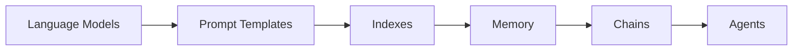

# 【LangChain编程：从入门到实践】stream

## 1. 背景介绍
### 1.1 问题的由来
随着人工智能技术的飞速发展，自然语言处理(NLP)领域也取得了巨大的进步。然而，对于许多开发者来说，构建基于语言模型的应用程序仍然是一个具有挑战性的任务。传统的NLP工具和框架通常需要大量的数据预处理、特征工程和模型训练，这对于非专业人士来说存在较高的门槛。

### 1.2 研究现状
近年来，随着Transformer等深度学习模型的出现，NLP领域涌现出了一批强大的预训练语言模型，如BERT、GPT等。这些模型在各种NLP任务上取得了State-of-the-Art的表现，极大地推动了NLP技术的发展。然而，如何有效地利用这些预训练模型来构建实际应用，仍然是一个亟待解决的问题。

### 1.3 研究意义
LangChain的出现为这一问题提供了一种新的解决方案。LangChain是一个基于语言模型的应用开发框架，旨在简化和加速NLP应用的构建过程。通过LangChain，开发者可以轻松地将预训练语言模型与其他组件（如数据库、API等）集成，快速搭建功能强大的NLP应用。本文将深入探讨LangChain的核心概念、原理和实践，为读者提供一份全面的LangChain入门指南。

### 1.4 本文结构
本文将从以下几个方面展开论述：
- 第2部分介绍LangChain的核心概念和组件，帮助读者建立对LangChain的整体认识。  
- 第3部分深入探讨LangChain的核心算法原理和具体操作步骤，让读者了解LangChain的内部工作机制。
- 第4部分介绍LangChain所涉及的数学模型和公式，并通过详细讲解和举例说明，帮助读者理解其数学原理。
- 第5部分通过代码实例和详细解释，演示如何使用LangChain进行项目实践，让读者学会应用LangChain解决实际问题。
- 第6部分讨论LangChain在实际场景中的应用，展望其未来的发展方向。
- 第7部分推荐LangChain相关的学习资源、开发工具和研究论文，方便读者进一步学习和研究。
- 第8部分总结全文，讨论LangChain未来的发展趋势和面临的挑战，并对LangChain的研究做出展望。
- 第9部分列出了关于LangChain的一些常见问题，并给出了详细的解答，帮助读者解决学习过程中的疑惑。

## 2. 核心概念与联系

LangChain的核心理念是将大语言模型（如GPT、BERT等）与其他组件链接起来，构建端到端的NLP应用。其核心概念包括：

- **语言模型（Language Models）**：指预训练的大型语言模型，如GPT-3、BERT等，它们能够生成和理解自然语言。LangChain利用语言模型的能力来实现各种NLP任务。

- **提示模板（Prompt Templates）**：定义了如何将输入文本转换为语言模型的输入格式。通过设计合适的提示模板，可以引导语言模型生成所需的输出。

- **索引（Indexes）**：将非结构化数据（如文本文档）转换为语言模型可以处理的格式。LangChain提供了多种索引技术，如向量存储、嵌入等。

- **记忆（Memory）**：存储对话的上下文信息，使语言模型能够根据先前的对话生成更连贯、更相关的响应。LangChain支持多种记忆机制，如对话记忆、实体记忆等。

- **链（Chains）**：将多个组件组合成一个完整的处理流程。例如，可以将提示模板、语言模型和索引链接起来，实现基于文档的问答系统。

- **代理（Agents）**：根据用户输入自主执行任务的智能体。代理可以使用语言模型进行推理和决策，并与外部工具（如搜索引擎、数据库等）交互，完成复杂任务。

下图展示了LangChain的核心组件及其之间的关系：

LangChain通过将这些组件组合和串联，构建出功能强大、灵活多变的NLP应用。开发者可以根据实际需求，选择合适的组件和模型，快速搭建出适合特定场景的NLP解决方案。

## 3. 核心算法原理 & 具体操作步骤

### 3.1 算法原理概述
LangChain的核心算法基于Transformer架构的预训练语言模型，如GPT系列模型。这些模型通过自监督学习在大规模文本数据上进行预训练，学习到了丰富的语言知识和生成能力。LangChain利用这些预训练模型的强大能力，通过设计适当的提示和任务描述，引导模型生成所需的自然语言响应。

### 3.2 算法步骤详解
LangChain的核心算法可以分为以下几个步骤：

1. **提示设计**：根据具体的NLP任务，设计合适的提示模板。提示模板定义了如何将输入文本转换为语言模型的输入格式，并指定了期望的输出格式。

2. **索引构建**：对于需要处理大量非结构化文本数据的任务（如问答、摘要等），需要先将文本数据转换为语言模型可以处理的格式。LangChain提供了多种索引技术，如向量存储、嵌入等，可以将文本数据编码为密集向量表示。

3. **上下文管理**：对于需要考虑对话历史或上下文信息的任务（如对话系统、推荐系统等），需要使用记忆机制来存储和管理上下文信息。LangChain支持多种记忆机制，如对话记忆、实体记忆等，可以根据任务需求选择合适的记忆方式。

4. **组件链接**：将提示模板、语言模型、索引、记忆等组件按照特定的逻辑和顺序链接起来，形成一个完整的处理流程。LangChain提供了灵活的组件组合方式，可以通过简单的API调用实现组件的链接和调用。

5. **推理生成**：将输入文本传递给组装好的处理流程，语言模型根据提示模板和上下文信息进行推理，生成自然语言响应。LangChain会自动处理输入输出格式的转换，开发者只需关注高层次的任务逻辑即可。

6. **结果解析**：对语言模型生成的自然语言响应进行解析和后处理，提取所需的结构化信息。LangChain提供了多种解析工具和方法，如正则表达式、命名实体识别等，方便开发者对生成结果进行进一步的处理和分析。

### 3.3 算法优缺点
LangChain的核心算法具有以下优点：
- 降低了NLP应用开发的门槛，开发者无需从零开始训练模型，可以直接利用预训练语言模型的强大能力。
- 提供了灵活的组件组合方式，可以轻松地将不同的模型、数据和功能组合起来，构建出适合特定场景的NLP解决方案。
- 支持多种任务类型，如问答、对话、摘要、推荐等，适用范围广泛。
- 通过提示工程和上下文管理，可以引导语言模型生成更加相关、连贯的响应，提高了生成质量。

同时，LangChain的核心算法也存在一些局限性：
- 依赖于预训练语言模型的性能，受限于模型的能力上限。对于一些复杂、专业领域的任务，可能需要进一步微调或领域适应。
- 需要大量的计算资源和存储空间，对硬件环境有一定要求。
- 对于一些对性能和实时性要求较高的场景，如在线服务、移动应用等，可能需要进一步优化和加速。

### 3.4 算法应用领域
LangChain的核心算法可以应用于多个NLP领域，包括但不限于：
- 智能问答：基于知识库或文档集合，构建智能问答系统，自动回答用户的问题。
- 对话系统：构建基于上下文的对话系统，如客服聊天机器人、智能助手等。
- 文本摘要：自动生成长文本的摘要，提取关键信息。
- 内容生成：根据主题或关键词，自动生成相关的文章、评论等内容。
- 知识图谱构建：从非结构化文本中抽取实体和关系，构建领域知识图谱。
- 推荐系统：根据用户的历史行为和偏好，推荐相关的商品、文章等内容。

## 4. 数学模型和公式 & 详细讲解 & 举例说明

### 4.1 数学模型构建
LangChain的核心算法主要基于Transformer架构和自注意力机制。Transformer是一种基于自注意力机制的神经网络架构，广泛应用于自然语言处理领域。其核心思想是通过自注意力机制来捕捉输入序列中的长距离依赖关系，从而更好地理解和生成自然语言。

Transformer的基本结构如下：

$$
\begin{aligned}
\mathrm{Attention}(Q, K, V) &= \mathrm{softmax}(\frac{QK^T}{\sqrt{d_k}})V \\
\mathrm{MultiHead}(Q, K, V) &= \mathrm{Concat}(\mathrm{head_1}, ..., \mathrm{head_h})W^O \\
\mathrm{head_i} &= \mathrm{Attention}(QW_i^Q, KW_i^K, VW_i^V)
\end{aligned}
$$

其中，$Q$、$K$、$V$分别表示查询、键、值矩阵，$W_i^Q$、$W_i^K$、$W_i^V$为对应的权重矩阵，$W^O$为输出层的权重矩阵。$d_k$为键向量的维度，$h$为注意力头的数量。

Transformer的编码器和解码器都由多个相同的子层堆叠而成，每个子层包括一个多头自注意力层和一个前馈神经网络层。编码器的自注意力层对输入序列进行编码，捕捉序列内部的依赖关系；解码器的自注意力层对已生成的序列进行编码，同时通过编码-解码注意力层与编码器的输出交互，捕捉输入序列和已生成序列之间的依赖关系。

### 4.2 公式推导过程
以编码器的自注意力层为例，其计算过程可以推导如下：

1. 将输入序列$X$通过三个线性变换得到查询矩阵$Q$、键矩阵$K$和值矩阵$V$：

$$
\begin{aligned}
Q &= XW^Q \\
K &= XW^K \\
V &= XW^V
\end{aligned}
$$

2. 计算自注意力权重矩阵$A$：

$$
A = \mathrm{softmax}(\frac{QK^T}{\sqrt{d_k}})
$$

3. 根据自注意力权重矩阵$A$对值矩阵$V$进行加权求和，得到自注意力层的输出$Z$：

$$
Z = AV
$$

4. 对多头自注意力的输出进行拼接和线性变换，得到最终的自注意力层输出$Z'$：

$$
Z' = \mathrm{Concat}(\mathrm{head_1}, ..., \mathrm{head_h})W^O
$$

其中，$\mathrm{head_i}$表示第$i$个注意力头的输出，$W^O$为输出层的权重矩阵。

### 4.3 案例分析与讲解
下面以一个简单的例子来说明Transformer的自注意力机制的工作原理。

假设我们有一个输入序列"I love NLP"，经过词嵌入后得到三个词向量$\mathbf{x_1}$、$\mathbf{x_2}$、$\mathbf{x_3}$，它们分别对应"I"、"love"、"NLP"。

1. 通过线性变换得到查询矩阵$Q$、键矩阵$K$和值矩阵$V$：

$$
Q = [\mathbf{q_1}, \mathbf{