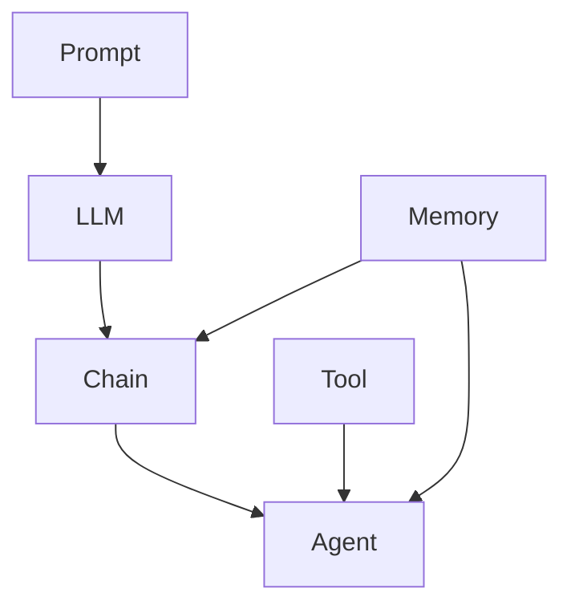

# 【LangChain编程：从入门到实践】使用LangServe提供服务

作者：禅与计算机程序设计艺术 / Zen and the Art of Computer Programming

## 1. 背景介绍
### 1.1 问题的由来
随着人工智能技术的飞速发展,特别是大语言模型(LLM)的出现,自然语言处理(NLP)领域迎来了一次重大突破。LLM强大的语言理解和生成能力,让人们看到了构建更加智能化对话系统的可能性。然而,如何有效地利用LLM来开发实际应用,仍然存在诸多挑战。传统的开发方式需要大量的人力和时间成本,且难以快速迭代和扩展。这时,LangChain应运而生,它为LLM应用开发提供了一套完整的框架和工具集,大大降低了开发门槛和复杂度。

### 1.2 研究现状
目前,LangChain已经成为LLM应用开发领域的主流框架之一。越来越多的开发者和研究人员开始关注和使用LangChain,在智能对话、知识问答、文本分析等方向取得了诸多进展。不过,LangChain的学习曲线相对较陡,对于初学者来说入门难度不小。同时,针对具体应用场景的开发实践和经验总结还比较缺乏。因此,有必要系统梳理LangChain的核心概念和开发流程,并提供详实的案例教程,帮助更多人掌握LangChain应用开发。

### 1.3 研究意义
本文旨在通过对LangChain编程模型的系统介绍和项目实践,帮助读者快速掌握使用LangChain进行LLM应用开发的方法和技巧。通过学习本文,读者可以:

1. 理解LangChain的核心概念和工作原理
2. 掌握LangChain的基本开发流程和常用接口
3. 运用LangChain进行实际项目开发,如构建服务型对话系统
4. 了解LangChain生态下的各种工具和资源
5. 思考LangChain未来的发展趋势和应用前景

本文的研究对于推动LangChain在学术界和工业界的应用具有重要意义,有助于加速LLM应用的落地和创新。

### 1.4 本文结构
本文将从以下几个方面展开:

- 介绍LangChain的核心概念和整体架构
- 剖析LangChain的关键组件和接口定义  
- 讲解LangChain的基本开发流程和常用技巧
- 以LangServe服务型对话系统为例,展示完整的项目实践过程
- 总结LangChain的特点优势和未来发展方向
- 推荐LangChain学习和应用的各种资源

## 2. 核心概念与联系

在正式开始LangChain编程之前,我们有必要对其核心概念有一个整体的认知。这将有助于我们后续的学习和应用。

LangChain的核心概念包括:

- **Prompt模板**: 定义LLM交互所需的Prompt,支持变量插值和格式化。
- **LLM接口**: 用于接入各种LLM模型的统一接口,屏蔽底层差异。
- **Chain组件**: 由多个LLM和Prompt组合而成的执行单元,支持顺序、条件、循环等执行逻辑。
- **Agent代理**: 由一个或多个Chain组成的智能代理,可根据用户输入自主决策执行过程。
- **Memory存储**: 用于在多轮对话中保存和访问状态的存储组件。
- **Tool工具**: 为LLM提供额外能力的工具集,如搜索、数据库访问、API调用等。

下图展示了LangChain的核心概念以及它们之间的关系:



可以看到,Prompt和LLM是LangChain的基础,Chain将它们组合成更高级的执行单元。Agent进一步封装了Chain,形成端到端的应用。Tool为Agent提供扩展能力,Memory为Chain和Agent提供状态存储。

理解这些核心概念之间的联系,将帮助我们更好地驾驭LangChain进行应用开发。在后续章节中,我们将结合具体的例子深入讲解这些概念的使用方法。

## 3. 核心算法原理 & 具体操作步骤
### 3.1 算法原理概述
LangChain的核心算法可以概括为基于大语言模型的任务导向型对话生成。具体来说,它利用Prompt模板定义任务目标和约束,通过LLM接口调用语言模型生成回复,再经过Chain组件的调度执行,最终由Agent代理输出结果。这个过程可以抽象为以下步骤:

1. 定义任务Prompt
2. 调用LLM生成回复
3. 组合Chain执行任务
4. Agent代理输出结果

其中每一步都涉及了特定的算法和技术,下面我们将展开详细讨论。

### 3.2 算法步骤详解

**步骤1:定义任务Prompt**

首先需要根据任务目标设计Prompt模板。一个好的Prompt需要包含以下关键要素:

- 任务目标的清晰描述
- 完成任务需要的上下文信息
- 对LLM输出的格式和长度约束
- 恰当的任务示例作为Few-shot learning的输入

以一个智能助手的问候Prompt为例:

```python
from langchain import PromptTemplate

template = """给定用户输入的问候语句如下:

{user_input}

请根据当前时间生成一个友好、简短的问候回复。回复需要满足:
1. 不超过20个字
2. 包含当前的时间信息,如早上、中午、晚上等
3. 以第一人称的口吻表达

回复:"""

prompt = PromptTemplate(
    input_variables=["user_input"],
    template=template
)
```

**步骤2:调用LLM生成回复**

定义好Prompt后,我们需要调用LLM接口来生成回复。LangChain提供了对OpenAI、Anthropic等主流LLM的封装,可以方便地接入这些模型:

```python
from langchain.llms import OpenAI

llm = OpenAI(model_name="text-davinci-003", temperature=0.9)
```

有了LLM实例后,我们传入Prompt即可生成回复:

```python
from datetime import datetime

user_input = "你好,AI助手!"
prompt_input = prompt.format(user_input=user_input)

reply = llm(prompt_input)
print(reply)

# 输出:早上好!现在是上午10点,新的一天开始了,我在这里随时为你服务。
```

**步骤3:组合Chain执行任务**

对于复杂的任务,我们往往需要多个LLM和Prompt协同工作。这时就要用到Chain组件。Chain定义了多个LLM执行的流程,可以实现顺序、条件、循环等逻辑。

例如,我们可以定义一个问候Chain,先生成问候语,再根据问候语生成回复:

```python
from langchain.chains import LLMChain

# 问候语生成Prompt
greeting_prompt = PromptTemplate(
    input_variables=[],
    template="请根据当前时间生成一个简短的问候语。"
)

# 问候语生成Chain
greeting_chain = LLMChain(
    llm=llm,
    prompt=greeting_prompt
)

# 回复生成Prompt
reply_prompt = PromptTemplate(
    input_variables=["greeting"],
    template="""给定问候语如下:

    {greeting}

    请生成一个友好的回复,不超过20字。

    回复:"""
)

# 回复生成Chain
reply_chain = LLMChain(
    llm=llm,
    prompt=reply_prompt
)

# 整合问候和回复Chain
from langchain.chains import SimpleSequentialChain

overall_chain = SimpleSequentialChain(
    chains=[greeting_chain, reply_chain],
    verbose=True
)

# 执行Chain
reply = overall_chain.run()
print(reply)

# 输出:
# > Entering new SimpleSequentialChain chain...
# 早上好!阳光明媚,让我们一起开启美好的一天吧。
# > Finished chain.
我也祝你今天心情愉悦,万事如意!
```

**步骤4:Agent代理输出结果**

有了Chain,我们就可以组合成更高层次的Agent代理。Agent封装了任务执行的完整流程,根据用户输入,自主决策使用哪些Chain和Tool,并输出最终结果。

以一个智能助手Agent为例:

```python
from langchain.agents import initialize_agent
from langchain.agents import AgentType

# 定义工具
tools = [
    Tool(
        name="Search",
        func=search_tool.run,
        description="useful for when you need to do a search on Wikipedia"
    ),
    Tool(
        name="Calculator",
        func=calculator.run,
        description="useful for when you need to do calculations or math"
    )
]

# 定义Agent
agent = initialize_agent(
    tools, 
    llm, 
    agent=AgentType.ZERO_SHOT_REACT_DESCRIPTION, 
    verbose=True
)

# 执行Agent
user_input = "Who is the president of the United States? What is their age raised to the 0.43 power?"
result = agent.run(user_input)

print(result)
```

这里我们定义了两个Tool:搜索和计算器,然后初始化了一个Agent。当我们执行agent.run()时,它会自动根据用户输入,调用相应的Tool完成任务。

以上就是LangChain的核心算法步骤。通过合理设计Prompt、Chain和Agent,我们可以实现各种智能对话应用。

### 3.3 算法优缺点

LangChain的优点在于:

1. 封装了LLM的调用细节,提供了一致的高层接口
2. 支持灵活组合多个LLM执行复杂任务
3. 提供了丰富的Prompt管理和优化工具
4. 可扩展性好,可以方便地接入自定义组件

但它的局限性也不容忽视:

1. 对LLM的表现依赖较大,容易受到LLM输出随机性的影响 
2. 需要精心设计Prompt和Chain的组合逻辑,对开发者的技能要求较高
3. 在few-shot场景下调优Prompt需要大量尝试,效率较低

### 3.4 算法应用领域

LangChain在以下领域有广泛的应用前景:

- 智能客服:通过语言交互为用户提供个性化服务
- 知识问答:根据海量知识库进行问题回答
- 数据分析:使用自然语言调用数据API进行分析
- 代码辅助:根据需求描述自动生成代码片段
- 文案创作:协助撰写文章、广告、剧本等创意内容

总的来说,LangChain为LLM应用开发提供了一套完整的范式,有利于加速相关领域的发展。

## 4. 数学模型和公式 & 详细讲解 & 举例说明
### 4.1 数学模型构建

LangChain本身更多是一个工程框架,其数学理论主要体现在底层的语言模型。当前主流的LLM如GPT-3、PaLM等,大都基于Transformer结构。Transformer的核心是自注意力机制(Self-Attention),可以建模文本序列中的长距离依赖。

形式化地,设输入文本序列为$\mathbf{X}=(\mathbf{x}_1,\mathbf{x}_2,\cdots,\mathbf{x}_n)$,其中$\mathbf{x}_i \in \mathbb{R}^d$为第$i$个token的$d$维嵌入向量。Self-Attention的计算过程如下:

$$
\begin{aligned}
\mathbf{Q} &= \mathbf{X} \mathbf{W}^Q \\
\mathbf{K} &= \mathbf{X} \mathbf{W}^K \\ 
\mathbf{V} &= \mathbf{X} \mathbf{W}^V \\
\mathbf{A} &= \text{softmax}(\frac{\mathbf{Q}\mathbf{K}^T}{\sqrt{d_k}}) \\
\text{Attention}(\mathbf{Q},\mathbf{K},\mathbf{V}) &= \mathbf{A} \mathbf{V}
\end{aligned}
$$

其中$\mathbf{W}^Q, \mathbf{W}^K, \mathbf{W}^V$分别是将输入$\mathbf{X}$映射为查询(Query)、键(Key)、值(Value)的三个矩阵。$\mathbf{A}$是注意力权重矩阵,通过Query和Key的点积计算得到,再经过softmax归一化。最终的注意力输出,就是权重矩阵$\mathbf{A}$与值