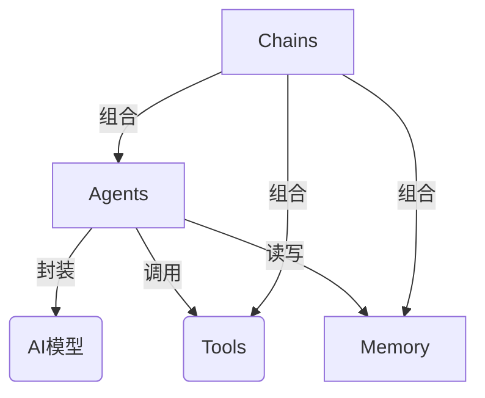
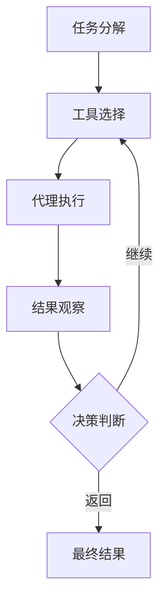

# 【LangChain编程：从入门到实践】方案说明

## 1. 背景介绍

### 1.1 问题的由来

在当今数据时代,我们面临着海量的非结构化数据,例如文本、图像、视频等。如何高效地处理和利用这些数据,成为了一个巨大的挑战。传统的软件开发方式往往需要大量的人工编码,不仅耗时耗力,而且难以适应不断变化的需求。因此,我们迫切需要一种新的编程范式,能够更加灵活、高效地处理各种形式的数据。

### 1.2 研究现状

近年来,人工智能(AI)和自然语言处理(NLP)技术取得了长足的进步,为解决上述问题提供了新的思路。基于大型语言模型(如GPT-3)的应用程序展现出了令人惊叹的能力,可以理解和生成人类可读的自然语言。然而,将这些技术应用于实际场景仍然面临着诸多挑战,例如如何将多个模型组合使用、如何管理数据流程、如何与传统软件系统集成等。

### 1.3 研究意义

LangChain是一个新兴的开源框架,旨在解决上述问题。它提供了一种新颖的编程范式,将人工智能模型视为"链条"中的一个环节,通过组合不同的模型和数据源,构建出复杂的应用程序。LangChain的出现为我们提供了一种全新的思维方式,有望彻底改变我们对软件开发的理解和实践。

### 1.4 本文结构

本文将全面介绍LangChain的核心概念、算法原理、数学模型、实际应用场景等内容。我们将从理论和实践两个层面进行深入探讨,帮助读者掌握LangChain编程的方方面面。文章结构如下:

## 2. 核心概念与联系

LangChain的核心思想是将人工智能模型视为"链条"中的一个环节,通过组合不同的模型和数据源,构建出复杂的应用程序。它主要包括以下几个核心概念:

1. **Agents**: 代理是LangChain中最核心的概念,它封装了一个或多个人工智能模型,并提供了与外部世界交互的接口。代理可以执行各种任务,例如问答、文本生成、数据分析等。

2. **Tools**: 工具是代理可以调用的外部资源,例如搜索引擎、数据库、API等。代理可以根据需要选择合适的工具来完成特定任务。

3. **Memory**: 内存用于存储代理在执行任务过程中的中间状态和结果,以供后续使用。这样可以实现更加复杂的任务流程。

4. **Chains**: 链是将多个代理、工具和内存组合在一起的逻辑单元。它定义了任务的执行流程,并协调各个组件之间的交互。

这些概念相互关联,共同构建了LangChain的核心架构。下面我们将通过一个具体的示例来说明它们是如何协同工作的。



在上图中,代理(Agents)封装了一个或多个AI模型,并可以调用外部工具(Tools)和读写内存(Memory)。链(Chains)则将这些组件组合在一起,定义了任务的执行流程。通过这种模块化的设计,LangChain实现了高度的灵活性和可扩展性。

## 3. 核心算法原理 & 具体操作步骤

### 3.1 算法原理概述

LangChain的核心算法是一种基于规则的决策过程,用于协调代理、工具和内存之间的交互。该算法的主要思想是:

1. 根据当前任务和上下文,选择合适的工具集。
2. 将这些工具提供给代理,由代理决定如何使用它们。
3. 代理执行任务,并将结果存储在内存中。
4. 根据任务的完成情况,决定是继续执行下一步,还是返回最终结果。

这个过程可以被视为一种"计划-执行-观察-重新计划"(PERA)的循环,代理在每一步都会根据当前状态做出最优决策。

### 3.2 算法步骤详解

我们可以将上述算法原理具体分解为以下几个步骤:

1. **任务分解**: 将复杂任务分解为一系列较小的子任务。
2. **工具选择**: 根据当前子任务,从可用工具集中选择合适的工具。
3. **代理执行**: 代理使用选定的工具执行当前子任务。
4. **结果观察**: 观察子任务的执行结果,并将其存储在内存中。
5. **决策判断**: 根据当前结果,决定是继续执行下一个子任务,还是返回最终结果。
6. **循环迭代**: 如果需要继续执行,则回到第2步,重新选择工具并执行下一个子任务。

这个过程通过不断的迭代,最终将完成整个复杂任务。下面我们用一个具体的示例来说明这个算法是如何工作的。



### 3.3 算法优缺点

LangChain算法的主要优点是:

1. **模块化设计**: 代理、工具和内存都是独立的模块,可以根据需求进行组合和扩展。
2. **高度灵活性**: 算法可以处理各种形式的任务,并根据实际情况动态调整执行策略。
3. **可解释性强**: 整个执行过程是可解释的,我们可以追踪代理的决策过程。

但是,该算法也存在一些缺点:

1. **规则依赖**: 算法的执行依赖于预定义的规则,这可能会限制其适用范围。
2. **决策瓶颈**: 在复杂场景下,代理可能难以做出最优决策。
3. **性能bottleneck**: 频繁的模型调用和数据传输可能会影响整体性能。

### 3.4 算法应用领域

LangChain算法可以应用于各种场景,例如:

1. **问答系统**: 通过组合不同的知识源和模型,构建智能问答系统。
2. **任务自动化**: 将多个子任务组合在一起,实现自动化的工作流程。
3. **数据分析**: 利用大语言模型对非结构化数据进行分析和处理。
4. **内容生成**: 根据给定的提示和约束,生成高质量的自然语言内容。

总的来说,LangChain算法为我们提供了一种全新的编程范式,可以极大地提高我们处理复杂任务的能力。

## 4. 数学模型和公式 & 详细讲解 & 举例说明

虽然LangChain主要是一个基于规则的系统,但它的某些组件也涉及到了数学模型和公式。在这一部分,我们将介绍一些常见的模型和公式,并通过具体案例进行详细讲解。

### 4.1 数学模型构建

在LangChain中,我们经常需要对文本数据进行embedding(嵌入)操作,将其转换为向量表示。这是因为大多数人工智能模型都是基于向量空间进行训练和推理的。

最常见的embedding模型是Word2Vec和BERT。Word2Vec是一种基于上下文的词嵌入模型,它可以将每个单词映射到一个固定长度的向量空间中,相似的词会被映射到相近的向量。BERT则是一种基于Transformer的预训练语言模型,它可以生成上下文敏感的单词和句子嵌入。

对于Word2Vec模型,我们可以使用Skip-gram或CBOW算法进行训练。Skip-gram算法的目标是根据中心词预测上下文词,而CBOW算法则是根据上下文词预测中心词。它们的目标函数可以表示为:

$$J = \frac{1}{T}\sum_{t=1}^{T}\sum_{-c \leq j \leq c, j \neq 0} \log p(w_{t+j}|w_t)$$

其中,$$T$$是语料库中的单词总数,$$c$$是上下文窗口大小,$$w_t$$是中心词,$$w_{t+j}$$是上下文词。$$p(w_{t+j}|w_t)$$是根据中心词$$w_t$$预测上下文词$$w_{t+j}$$的概率,它可以通过softmax函数计算:

$$p(w_O|w_I) = \frac{\exp(v_{w_O}^{\top}v_{w_I})}{\sum_{w=1}^{V}\exp(v_w^{\top}v_{w_I})}$$

其中,$$v_w$$和$$v_{w_I}$$分别是词$$w$$和$$w_I$$的向量表示,$$V$$是词表的大小。

通过优化上述目标函数,我们可以得到每个单词的向量表示,相似的单词会被映射到相近的向量空间中。

### 4.2 公式推导过程

在介绍Word2Vec模型的公式时,我们省略了一些细节。现在,让我们来详细推导一下Skip-gram模型的目标函数。

我们的目标是最大化语料库中所有中心词和上下文词之间的条件概率的乘积:

$$\prod_{t=1}^{T}\prod_{-c \leq j \leq c, j \neq 0} p(w_{t+j}|w_t)$$

为了便于优化,我们通常会最小化它的负对数似然:

$$-\log\prod_{t=1}^{T}\prod_{-c \leq j \leq c, j \neq 0} p(w_{t+j}|w_t) = -\sum_{t=1}^{T}\sum_{-c \leq j \leq c, j \neq 0} \log p(w_{t+j}|w_t)$$

将上式除以总单词数$$T$$,我们得到了Skip-gram模型的目标函数:

$$J = -\frac{1}{T}\sum_{t=1}^{T}\sum_{-c \leq j \leq c, j \neq 0} \log p(w_{t+j}|w_t)$$

在实际优化过程中,我们通常会使用负采样(Negative Sampling)或层序softmax(Hierarchical Softmax)等技术来加速计算。

### 4.3 案例分析与讲解

为了更好地理解上述模型和公式,让我们来看一个具体的案例。假设我们有一个语料库,包含以下句子:

"The quick brown fox jumps over the lazy dog."

我们将使用Skip-gram模型,窗口大小为2,对这个语料库进行训练。首先,我们需要构建词表:

```python
vocab = ["the", "quick", "brown", "fox", "jumps", "over", "lazy", "dog"]
```

然后,我们可以使用PyTorch或TensorFlow等深度学习框架实现Skip-gram模型。以PyTorch为例,我们可以定义如下模型:

```python
import torch
import torch.nn as nn

class SkipGram(nn.Module):
    def __init__(self, vocab_size, embedding_dim):
        super(SkipGram, self).__init__()
        self.embeddings = nn.Embedding(vocab_size, embedding_dim)
        self.output = nn.Linear(embedding_dim, vocab_size)

    def forward(self, input_words):
        embeds = self.embeddings(input_words)
        output = self.output(embeds)
        log_probs = nn.functional.log_softmax(output, dim=1)
        return log_probs
```

在训练过程中,我们将语料库按照窗口大小滑动,生成中心词和上下文词对。对于句子"The quick brown fox jumps over the lazy dog",我们将得到以下训练样本:

```
(中心词, 上下文词对)
("the", ("quick", "brown"))
("quick", ("the", "brown", "fox"))
("brown", ("quick", "fox", "jumps"))
("fox", ("brown", "jumps", "over"))
("jumps", ("fox", "over", "the"))
("over", ("jumps", "the", "lazy"))
("the", ("over", "lazy", "dog"))
("lazy", ("the", "dog"))
("dog", ("lazy"))
```

我们将这些样本输入到Skip-gram模型中,并根据目标函数计算损失,然后使用反向传播算法更新模型参数。经过多次迭代,我们最终可以得到每个单词的向量表示。

通过这个案例,我们可以更好地理解Word2Vec模型的工作原理,以及它是如何将单词映射到向量