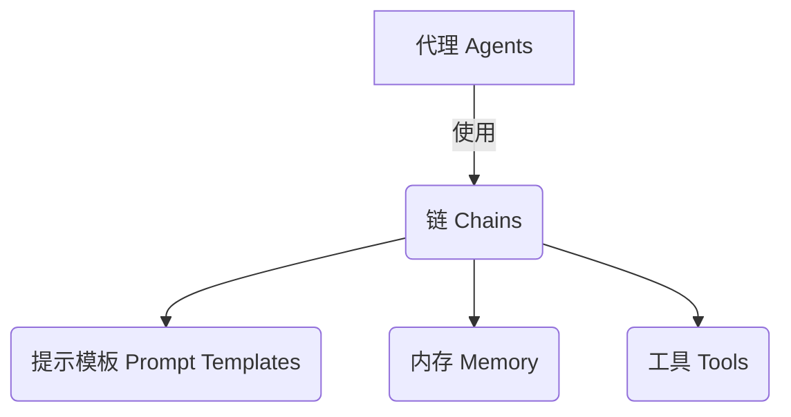
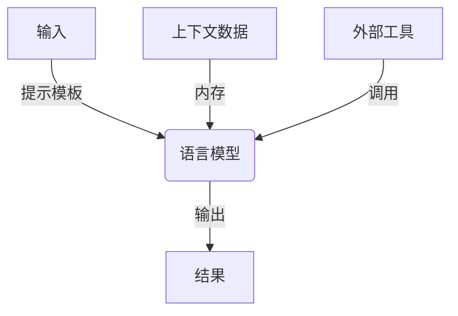

# 【LangChain编程：从入门到实践】社区贡献

## 1. 背景介绍

### 1.1 问题的由来

在当今快速发展的人工智能时代，构建智能应用程序变得越来越重要。然而,开发人工智能系统通常需要大量的数据、算力和专业知识,这对于个人开发者和小型团队来说是一个巨大的挑战。幸运的是,LangChain这个Python库应运而生,它为开发人工智能应用程序提供了一种简单、模块化和可扩展的方法。

### 1.2 研究现状

LangChain是一个新兴的开源Python库,旨在帮助开发者快速构建基于大型语言模型(LLM)的应用程序。它提供了一种统一的接口,使开发者能够轻松地集成和组合各种LLM、数据源和其他组件。LangChain的模块化设计使得开发过程变得高效和可维护。

尽管LangChain在短时间内获得了广泛的关注和采用,但它仍处于快速发展的阶段。开发者社区一直在不断地贡献新的功能、改进和用例,以满足不断增长的需求。

### 1.3 研究意义

LangChain的出现为开发人工智能应用程序带来了巨大的机遇。通过利用LangChain,开发者可以更轻松地构建智能系统,如聊天机器人、问答系统、自动化工作流等。这不仅有助于提高生产力,还可以推动人工智能技术在各个领域的应用和创新。

然而,要充分利用LangChain的潜力,开发者需要深入了解它的核心概念、算法原理和最佳实践。本文旨在为读者提供一个全面的LangChain指南,涵盖从基础知识到高级主题,帮助他们顺利地开始使用LangChain并充分发挥其强大功能。

### 1.4 本文结构

本文将按照以下结构进行阐述:

1. 背景介绍
2. 核心概念与联系
3. 核心算法原理与具体操作步骤
4. 数学模型和公式详细讲解与举例说明
5. 项目实践:代码实例和详细解释说明
6. 实际应用场景
7. 工具和资源推荐
8. 总结:未来发展趋势与挑战
9. 附录:常见问题与解答

## 2. 核心概念与联系

LangChain的核心概念包括代理(Agents)、链(Chains)、提示模板(Prompt Templates)、内存(Memory)和工具(Tools)。这些概念相互关联,共同构建了LangChain的基础架构。

1. **代理(Agents)**: 代理是LangChain中的核心组件,负责协调和控制整个应用程序的执行流程。代理可以根据给定的目标和约束条件,利用链、提示模板、内存和工具来完成任务。

2. **链(Chains)**: 链是一系列可组合的序列步骤,用于处理和转换数据。链可以包含多个LLM、数据源和其他组件,并且可以嵌套和组合使用,构建复杂的应用程序逻辑。

3. **提示模板(Prompt Templates)**: 提示模板用于生成向LLM发送的提示(Prompts)。它们可以包含静态文本、动态变量和格式化指令,以控制LLM的输出。

4. **内存(Memory)**: 内存用于存储和检索会话数据,例如先前的对话历史记录、中间结果等。这有助于保持上下文一致性,并支持更复杂的对话和任务。

5. **工具(Tools)**: 工具是一组可调用的函数或API,用于执行特定的任务,如查询数据库、调用Web API或执行计算。代理可以根据需要调用这些工具来完成目标。

通过将这些核心概念结合起来,LangChain为构建智能应用程序提供了一个灵活且可扩展的框架。开发者可以根据具体需求组合和定制不同的组件,从而创建各种复杂的应用程序。

## 3. 核心算法原理与具体操作步骤

### 3.1 算法原理概述

LangChain的核心算法原理基于**构成性语言模型(Constitutive Language Models, CLM)**的思想。CLM将语言模型视为一种可编程的实体,能够根据提供的指令和上下文生成所需的输出。

LangChain利用CLM的能力,通过精心设计的提示模板和链,指导语言模型执行各种任务。这种方法的关键在于,LangChain不仅将语言模型视为一个黑盒子,而是将其作为一个可编程的组件,可以与其他数据源和工具集成,构建更复杂的应用程序。

上图展示了LangChain的核心算法原理。输入数据通过提示模板转换为语言模型可以理解的提示,同时结合上下文数据(如内存中的历史记录)和外部工具的输出。语言模型根据提示和上下文生成所需的输出结果。

### 3.2 算法步骤详解

LangChain的核心算法可以概括为以下几个步骤:

1. **输入处理**: 接收原始输入数据,如文本、数据库记录或API响应。

2. **提示模板渲染**: 根据输入数据和上下文信息(如内存中的历史记录),渲染提示模板以生成语言模型可以理解的提示。

3. **语言模型调用**: 将渲染后的提示输入到语言模型中,获取模型的输出结果。

4. **输出后处理**: 对语言模型的输出结果进行解析和处理,以获得所需的最终输出。这可能包括调用外部工具、查询数据库或执行其他操作。

5. **内存更新**: 将当前的输入、输出和上下文信息存储到内存中,以供后续步骤使用。

6. **结果返回**: 将最终的输出结果返回给调用方。

这个过程可以通过链的方式进行组合和嵌套,构建更复杂的应用程序逻辑。例如,一个链可以包含多个步骤,每个步骤都可以是另一个子链或单独的语言模型调用。

### 3.3 算法优缺点

LangChain算法的优点包括:

- **模块化和可扩展性**: 通过将不同的组件(如语言模型、数据源和工具)解耦,LangChain提供了高度的模块化和可扩展性,使开发者能够轻松地集成和替换不同的组件。

- **简化开发过程**: LangChain抽象出了与语言模型交互的复杂性,使开发者能够专注于应用程序逻辑的构建,而不必深入了解语言模型的内部细节。

- **提高开发效率**: 由于LangChain提供了一种统一的接口和预构建的组件,开发者可以更快速地构建和迭代应用程序原型。

- **支持多种语言模型**: LangChain支持多种流行的语言模型,如GPT-3、BERT和T5,使开发者能够根据需求选择合适的模型。

然而,LangChain算法也存在一些潜在的缺点和限制:

- **依赖语言模型的质量**: LangChain的输出质量在很大程度上取决于所使用的语言模型的能力和训练数据。如果语言模型存在偏差或局限性,则可能会影响最终的应用程序性能。

- **提示工程的复杂性**:设计高质量的提示模板需要一定的技巧和经验,以确保语言模型能够正确理解和执行所需的任务。

- **上下文管理的挑战**: 在处理复杂的对话或任务时,有效地管理上下文信息(如内存中的历史记录)可能会变得具有挑战性。

- **可解释性和可控性**: 虽然LangChain提供了一定程度的可控性,但语言模型的内部决策过程通常是不透明的,这可能会影响应用程序的可解释性和可控性。

### 3.4 算法应用领域

LangChain算法可以应用于各种领域,包括但不限于:

- **自然语言处理(NLP)**: LangChain可用于构建聊天机器人、问答系统、文本摘要和情感分析等NLP应用程序。

- **任务自动化**: 通过将语言模型与外部工具和API集成,LangChain可用于自动化各种任务,如数据处理、报告生成和工作流程管理。

- **知识管理**: LangChain可用于构建知识库和智能知识检索系统,帮助组织有效地管理和利用其知识资产。

- **决策支持系统**: 通过结合语言模型的推理能力和外部数据源,LangChain可用于构建决策支持系统,为决策者提供建议和见解。

- **教育和学习**: LangChain可用于开发智能教育辅助系统,提供个性化的学习体验和反馈。

- **科研和发现**: LangChain可用于支持科学研究和发现过程,如文献检索、数据分析和假设生成。

总的来说,LangChain算法为构建各种智能应用程序提供了一个强大而灵活的框架,在多个领域都有广泛的应用前景。

## 4. 数学模型和公式详细讲解与举例说明

虽然LangChain主要关注于应用层面,但是理解其背后的数学原理和模型也是非常重要的。本节将介绍LangChain中使用的一些关键数学模型和公式。

### 4.1 数学模型构建

LangChain的核心数学模型基于**概率图模型(Probabilistic Graphical Models, PGM)**。PGM是一种用于表示和推理复杂概率分布的强大工具。在LangChain中,PGM被用于建模语言模型的输出概率分布。

具体来说,LangChain使用**因子图(Factor Graphs)**作为其核心PGM表示。因子图是一种双向图模型,由变量节点和因子节点组成。变量节点表示随机变量,而因子节点表示变量之间的概率关系。

对于LangChain,变量节点可以表示输入数据、提示模板、语言模型输出等。因子节点则表示这些变量之间的条件概率关系,例如语言模型输出的概率分布取决于输入提示和上下文信息。

通过构建适当的因子图,LangChain可以对语言模型的输出进行概率推理和优化,从而提高输出质量和一致性。

### 4.2 公式推导过程

为了更好地理解LangChain中使用的数学模型,让我们推导一个简单的因子图模型。假设我们有一个语言模型 $M$,它接受一个提示 $p$ 和上下文信息 $c$ 作为输入,并产生一个输出 $o$。我们的目标是找到最优的输出 $o^*$,使得 $P(o^* | p, c)$ 最大化。

根据贝叶斯公式,我们可以将 $P(o | p, c)$ 分解为:

$$P(o | p, c) = \frac{P(o, p, c)}{P(p, c)} = \frac{P(o | p, c) P(p, c)}{P(p, c)} = P(o | p, c)$$

因此,最大化 $P(o | p, c)$ 等价于最大化 $P(o, p, c)$。根据链式法则,我们可以将 $P(o, p, c)$ 进一步分解为:

$$P(o, p, c) = P(o | p, c) P(p, c) = P(o | p, c) P(p | c) P(c)$$

在LangChain中,我们通常假设提示 $p$ 和上下文 $c$ 是已知的,因此 $P(p | c)$ 和 $P(c)$ 可以视为常数。因此,最大化 $P(o, p, c)$ 等价于最大化 $P(o | p, c)$。

我们可以使用因子图来表示这个概率模型。让 $X_o$、$X_p$ 和 $X_c$ 分别表示输出 $o$、提示 $p$ 和上下文 $c$ 的变量节点。然后,我