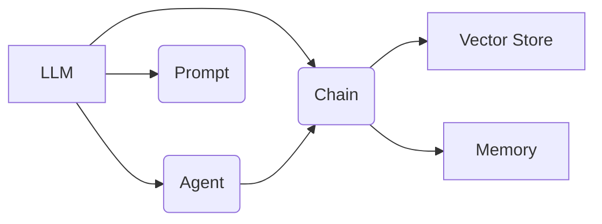

# 【LangChain编程：从入门到实践】语言模型

作者：禅与计算机程序设计艺术 / Zen and the Art of Computer Programming

## 1. 背景介绍

### 1.1 问题的由来

随着人工智能技术的飞速发展，自然语言处理(NLP)领域也取得了突破性进展。大语言模型(LLM)的出现，使得机器能够更好地理解和生成人类语言，为构建智能对话系统、知识问答系统等应用奠定了基础。然而，如何有效地使用LLM来解决实际问题，仍然是一个巨大的挑战。

### 1.2 研究现状

目前，已经出现了一些基于LLM的开发框架和工具，如OpenAI的GPT系列模型和API、Google的BERT等。这些工具极大地降低了NLP应用开发的门槛。但是，它们通常需要较高的机器学习和编程技能，对于非专业开发者来说仍有一定难度。

最近，一个名为LangChain的开源项目引起了广泛关注。LangChain是一个基于LLM的应用开发框架，旨在简化LLM在实际应用中的使用。它提供了一系列高层API和组件，使得开发者能够快速构建基于LLM的应用，而无需深入了解底层模型细节。

### 1.3 研究意义

LangChain的出现，为LLM的应用开发带来了新的思路和方向。通过LangChain，开发者可以更加专注于应用逻辑和业务场景，而将底层的模型训练、推理等任务交给框架来处理。这大大提高了开发效率，降低了开发难度。

同时，LangChain也为LLM的应用探索提供了一个很好的平台。通过LangChain构建的各种应用案例，可以帮助我们更好地理解LLM的能力和局限性，为后续的研究和应用提供有益的参考。

### 1.4 本文结构

本文将全面介绍LangChain框架，并通过实际案例演示如何使用LangChain进行LLM应用开发。全文分为以下几个部分：

- 第2部分介绍LangChain的核心概念和组件，帮助读者建立对框架的整体认识。 
- 第3部分详细讲解LangChain的工作原理和核心算法，深入剖析框架的内部机制。
- 第4部分从数学角度对LangChain的建模方法进行分析，并给出一些具体的公式和案例。
- 第5部分通过一个完整的项目实践，手把手教读者如何使用LangChain进行应用开发。
- 第6部分总结LangChain的典型应用场景，展望其未来的发展方向。
- 第7部分推荐一些学习LangChain的资源和工具。
- 第8部分对全文进行总结，并对LangChain的发展前景和面临的挑战进行展望。
- 第9部分列出一些常见问题，并给出解答，帮助读者解决实际问题。

## 2. 核心概念与联系

在正式介绍LangChain之前，我们首先需要了解其背后的一些核心概念。

- 大语言模型(LLM): LLM是一种基于海量文本数据训练的神经网络模型，能够生成与人类书写相似的连贯文本。GPT、BERT等都是典型的LLM。LLM是LangChain的核心组件之一。

- 提示工程(Prompt Engineering): 提示工程是指如何设计输入文本(即提示)，以引导LLM生成期望的输出。好的提示可以显著提高LLM的表现。LangChain中提供了多种提示模板和优化技术。

- 代理(Agent): 代理是一种可以使用LLM执行特定任务的程序。它接收用户输入，调用LLM生成回复，并可能会调用外部工具执行一些操作。LangChain提供了多种代理的实现。

- 链(Chain): 链是一种将多个组件(如LLM、代理、提示等)组合在一起形成复杂应用逻辑的方法。LangChain定义了一套统一的接口，使得链的构建和组合非常方便。

- 向量数据库(Vector Store): 向量数据库以语义向量的形式存储文本数据，可以快速进行相似度搜索和查询。LangChain集成了多种流行的向量数据库。

- 内存(Memory): 内存机制允许代理在多轮对话中保持状态，使其能够理解上下文。LangChain提供了多种内存实现，如对话记忆、实体记忆等。

下图展示了LangChain的核心组件及其之间的关系:



可以看到，LLM是整个框架的核心，代理、链、提示等组件都是基于LLM构建的。向量数据库和内存机制可以作为链的一部分，提供数据存储和状态管理的功能。

理解了这些核心概念，我们就可以更好地掌握LangChain的工作原理，并利用它构建强大的LLM应用了。

## 3. 核心算法原理 & 具体操作步骤

### 3.1 算法原理概述

LangChain的核心是基于LLM的应用构建。它利用LLM强大的语言理解和生成能力，通过提示工程引导模型执行特定任务。同时，通过代理和链的机制，将多个LLM调用和外部工具整合在一起，形成复杂的应用逻辑。

具体来说，LangChain的工作流程可以概括为以下几个步骤:

1. 接收用户输入，构造提示
2. 将提示输入LLM，生成回复
3. 解析LLM的输出，提取关键信息
4. 根据提取的信息，调用外部工具执行操作
5. 将操作结果整合到提示中，重复步骤2-4，直到任务完成
6. 将最终结果返回给用户

在这个过程中，提示工程扮演着至关重要的角色。一个好的提示需要包含清晰的指令、必要的上下文信息、恰当的任务分解等。LangChain提供了一系列提示优化技术，如少样本学习、提示模板等，帮助开发者设计高质量的提示。

### 3.2 算法步骤详解

下面我们以一个具体的例子来详细说明LangChain的工作流程。假设我们要构建一个简单的问答系统，它可以根据用户的问题，从一篇文档中找到相关的答案。

步骤1: 构造提示

首先，我们需要将用户的问题和文档内容整合到一个提示中。一个可能的提示模板如下:

```
请根据以下文档内容，回答用户的问题。如果文档中没有相关信息，请回答"文档中没有提到这一点"。

文档内容:
{document}

用户问题:
{question}
```

其中，`{document}`和`{question}`会被替换为实际的文档内容和用户问题。

步骤2: 生成回复

将构造好的提示输入到LLM中，得到生成的回复。LangChain提供了对OpenAI、Anthropic等主流LLM提供商的API封装，方便调用。

步骤3: 解析输出

对LLM生成的回复进行解析，提取其中的关键信息。在这个例子中，我们直接将回复作为最终的答案。但在更复杂的应用中，可能需要从回复中提取特定格式的数据，如JSON、XML等。

步骤4: 执行操作

在这个例子中，我们不需要执行额外的操作。但在其他应用中，可能需要根据LLM的输出，调用外部的API或工具，如数据库查询、网页搜索等。

步骤5: 整合结果

将操作的结果整合到一个新的提示中，重复步骤2-4。这一步主要用于需要多轮交互才能完成的任务。

步骤6: 返回结果

将最终的答案返回给用户。

### 3.3 算法优缺点

LangChain的优点在于:

- 简化了LLM应用开发流程，提供了高层的抽象和API
- 支持多种主流LLM和外部工具的集成
- 提供了丰富的提示优化技术和模板
- 支持构建复杂的多轮对话应用
- 良好的可扩展性，可以方便地添加新的组件

但同时，LangChain也有一些局限性:

- 对LLM的表现依赖较大，受限于当前LLM的能力
- 需要一定的提示工程技巧，对开发者有一定要求
- 某些复杂应用的调试和优化可能比较困难

### 3.4 算法应用领域

LangChain可以用于构建各种基于LLM的应用，包括但不限于:

- 智能对话系统,如客服机器人、个人助理等
- 知识问答系统,从结构化或非结构化数据中自动答题
- 文本生成应用,如创意写作助手、文案生成等
- 语言翻译、文本摘要、情感分析等NLP任务
- 代码生成、bug修复等编程辅助工具

总的来说，LangChain为LLM应用开发提供了一套灵活、易用的框架,使得开发者能够快速构建原型系统并不断迭代优化。未来,随着LLM技术的不断发展,LangChain有望成为NLP应用构建的重要工具之一。

## 4. 数学模型和公式 & 详细讲解 & 举例说明

### 4.1 数学模型构建

LangChain本身并不涉及复杂的数学模型,它主要是在LLM的基础上进行应用构建。但是,为了更好地理解LangChain的工作原理,我们有必要对LLM的数学原理有一个基本的认识。

LLM本质上是一个语言模型,它的目标是学习自然语言的概率分布。给定一个token序列$x=(x_1,\ldots,x_n)$,语言模型的任务是估计其概率:

$$P(x)=P(x_1,\ldots,x_n)$$

根据概率论的链式法则,这个概率可以分解为:

$$P(x)=\prod_{i=1}^nP(x_i|x_1,\ldots,x_{i-1})$$

也就是说,语言模型需要估计每个token在给定前面token的情况下出现的条件概率。

在实践中,语言模型通常使用神经网络来参数化这个条件概率分布。以GPT为例,它使用Transformer架构中的Decoder部分来建模条件概率:

$$P(x_i|x_1,\ldots,x_{i-1})=\mathrm{softmax}(W_e h_i+b_e)$$

其中,$h_i$是Transformer Decoder在位置$i$处的隐状态,$W_e$和$b_e$是输出层的参数。

### 4.2 公式推导过程

Transformer Decoder的计算过程可以用以下公式表示:

$$h_i=\mathrm{Decoder}(x_1,\ldots,x_{i-1})$$

Decoder由多个相同的层组成,每一层包括自注意力(Self-Attention)和前馈神经网络(Feed-Forward Network)两个子层。

自注意力子层的计算公式为:

$$\mathrm{Attention}(Q,K,V)=\mathrm{softmax}(\frac{QK^T}{\sqrt{d_k}})V$$

其中,$Q$,$K$,$V$分别是查询(Query)、键(Key)、值(Value)矩阵,$d_k$是键向量的维度。

前馈神经网络子层的计算公式为:

$$\mathrm{FFN}(x)=\max(0, xW_1 + b_1)W_2 + b_2$$

其中,$W_1$,$b_1$,$W_2$,$b_2$是前馈网络的参数。

Decoder的计算过程可以总结为:

1. 将输入token序列$x_1,\ldots,x_{i-1}$映射为初始隐状态$h_0$
2. 对每一层$l=1,\ldots,L$:
   - 计算自注意力:$h_l'=\mathrm{Attention}(h_{l-1},h_{l-1},h_{l-1})$
   - 计算前馈网络:$h_l=\mathrm{FFN}(h_l')$
3. 将最后一层的隐状态$h_L$输入到输出层,得到条件概率分布

### 4.3 案例分析与讲解

下面我们以一个简单的例子来说明语言模型的