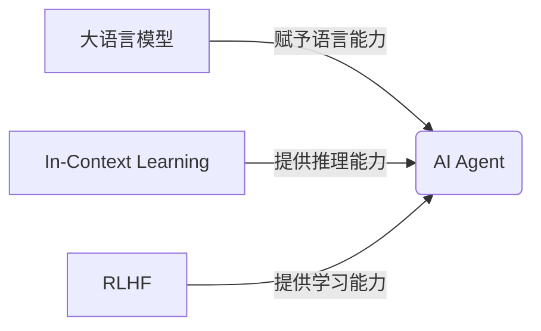

# 【大模型应用开发 动手做AI Agent】Agent对各行业的效能提升

关键词：大模型、AI Agent、行业应用、效能提升、GPT、RLHF、In-Context Learning、Few-Shot Learning

## 1. 背景介绍
### 1.1  问题的由来
近年来，随着人工智能技术的飞速发展，尤其是大语言模型的出现和成熟，AI Agent的研究和应用越来越受到学术界和工业界的广泛关注。传统的AI系统往往专注于单一任务，缺乏通用性和可扩展性。而基于大模型的AI Agent有望突破这一瓶颈，实现更加智能、灵活、高效的人机交互和任务处理。

### 1.2  研究现状
目前，GPT-3、PaLM、BLOOM等大语言模型已经展现出了惊人的自然语言理解和生成能力。许多研究者和企业开始探索如何将大模型应用于构建AI Agent，以提升各行各业的效率和生产力。微软的Copilot、Anthropic的Claude、OpenAI的ChatGPT等就是代表性的AI Agent产品。它们在编程、写作、分析、客服等领域取得了瞩目的成绩。

### 1.3  研究意义 
研究大模型驱动的AI Agent对于推动人工智能产业化落地、赋能传统行业数字化转型具有重要意义。一方面，AI Agent可以作为人类智能的延伸和补充，帮助我们更高效地完成任务，释放创造力。另一方面，AI Agent的应用将催生出许多新的商业模式和就业机会，为经济发展注入新的活力。因此，深入探讨大模型应用开发AI Agent的理论和实践，对学术研究和产业应用都有重要价值。

### 1.4  本文结构
本文将围绕"大模型应用开发AI Agent"这一主题，系统地介绍相关的核心概念、关键技术、开发实践和行业应用。第2节阐述大模型、AI Agent等核心概念；第3节讲解基于大模型构建Agent的算法原理和操作步骤；第4节给出AI Agent系统的数学建模和公式推导；第5节通过代码实例演示如何开发一个AI Agent应用；第6节展望AI Agent在各行各业的应用场景和商业价值；第7节推荐相关的学习资料和开发工具；第8节总结全文并展望未来研究方向；第9节列出常见问题解答。

## 2. 核心概念与联系
- 大语言模型：以Transformer为基础的海量预训练模型，能够从大规模文本语料中学习到丰富的语言知识和世界知识，代表模型有GPT-3、PaLM、BLOOM等。
- AI Agent：以大语言模型为基础，结合强化学习、提示工程、记忆机制等技术，构建的智能对话交互系统，能够执行问答、分析、写作等任务，并根据反馈不断优化和调整策略。
- In-Context Learning：让语言模型在推理时结合输入的上下文信息动态地调整知识，是大模型few-shot学习的关键。
- RLHF：Reinforcement Learning with Human Feedback，通过人类反馈指导语言模型的决策，以生成更加安全、可控、符合人类偏好的内容。

大语言模型为构建AI Agent奠定了基础，赋予其语言理解和生成的能力。但要让Agent真正具备执行任务的能力，还需要引入In-Context Learning、RLHF等技术，让其学会结合上下文推理，并根据反馈动态优化。AI Agent集成了认知、决策、执行等多种能力，代表了更高层次的智能系统。下图展示了这些概念之间的关系：



## 3. 核心算法原理 & 具体操作步骤
### 3.1  算法原理概述
基于大模型构建AI Agent的核心是prompt engineering，即如何设计输入文本，引导模型生成所需的输出。一般采用few-shot learning的范式，在prompt中提供任务相关的样例或指令，帮助模型理解任务要求。同时，为了让模型生成更加安全、可控的内容，需要在训练时引入人类反馈信号，指导模型学习正确的行为策略。因此，RLHF成为构建AI Agent的关键技术之一。

### 3.2  算法步骤详解
1. 准备大语言模型，如GPT-3、BLOOM等，作为Agent的基础。 
2. 针对具体任务，设计合适的prompt，包括任务描述、输入输出样例、规则约束等。
3. 将prompt作为模型的输入，生成初步的输出结果。
4. 对模型输出进行后处理和过滤，去除不恰当、有害的内容。
5. 收集人类对模型输出的评价反馈，形成reward signal。
6. 将模型输出和人类反馈一起作为训练数据，用RLHF方法微调模型。
7. 重复步骤3-6，不断迭代优化Agent的性能，直到满足要求。
8. 将训练好的模型部署上线，提供服务。

### 3.3  算法优缺点
优点：
- 基于大模型构建Agent，可以利用其海量知识，实现强大的语言理解和生成能力。
- 采用few-shot learning，无需大量任务特定数据，开发成本低。
- 引入人类反馈，可以显著提升Agent输出内容的安全性、可控性和人类友好性。

缺点：
- 大模型训练和推理成本高昂，对算力要求高。  
- 模型输出偶尔会出现幻觉，即看似合理但实际错误的结果。
- 人类反馈信号的采集成本高，对数据标注人员的要求也高。

### 3.4  算法应用领域
基于大模型的AI Agent可以应用于以下领域：
- 智能客服：提供24小时不间断的客户服务，解答问题，提供建议。
- 智能写作：辅助创作文案、文章、代码等，提升写作效率。
- 数据分析：帮助用户分析和解读海量数据，提取关键信息和见解。
- 教育助手：为学生提供个性化的学习指导和答疑服务。
- 医疗助理：协助医生分析病历、影像等数据，给出诊断建议。

## 4. 数学模型和公式 & 详细讲解 & 举例说明
### 4.1  数学模型构建
我们可以将构建AI Agent的过程抽象为一个优化问题。目标是最大化Agent生成内容的综合质量，考虑因素包括内容相关性、安全性、可读性、逻辑一致性等。同时还要最小化人类反馈的次数，以节约成本。
令$M$表示大语言模型，$P$表示输入的prompt，$R$表示人类反馈奖励，$\lambda$为平衡因子。那么，数学模型可以表示为：

$$
\max_{\theta} \mathbb{E}_{P}[R(M_{\theta}(P))] - \lambda \cdot \mathbb{E}_{P}[N(M_{\theta}(P))]
$$

其中，$\theta$为模型参数，$N$为人类反馈次数，$\mathbb{E}$为期望。直观地说，就是要找到一组最优的模型参数，使得在给定prompt的情况下，模型输出能够获得最高的人类综合评价，同时尽可能减少人工反馈次数。

### 4.2  公式推导过程
为了求解上述优化问题，我们采用RLHF框架，将其建模为一个强化学习过程。Agent的策略$\pi_{\theta}$对应语言模型$M_{\theta}$，环境为输入的prompt $P$，奖励为人类反馈 $R$。
根据策略梯度定理，我们可以得到优化目标的梯度：

$$
\nabla_{\theta} J(\theta) = \mathbb{E}_{P, \tau \sim \pi_{\theta}}[\sum_{t=1}^{T} \nabla_{\theta} \log \pi_{\theta}(a_t|s_t) \cdot \sum_{t'=t}^{T} R(s_{t'}, a_{t'})]
$$

其中，$\tau$为一条对话轨迹，$s_t$为第$t$步的状态，$a_t$为第$t$步的动作，即模型生成的内容。
有了梯度表达式，我们就可以用随机梯度上升的方法来更新模型参数$\theta$：

$$
\theta \leftarrow \theta + \alpha \cdot \nabla_{\theta} J(\theta)
$$

其中，$\alpha$为学习率。不断迭代优化，直到模型收敛或达到预设的性能指标。

### 4.3  案例分析与讲解
我们以一个简单的例子来说明如何应用上述方法构建AI Agent。假设要开发一个旅游助理Agent，能够根据用户的喜好推荐旅游景点和路线。
首先，我们准备好旅游领域的知识库，包括各地的景点、美食、交通等信息。然后，选择一个预训练的大语言模型，如GPT-3，作为Agent的基础。
接下来，我们设计prompt，引导模型生成旅游推荐。prompt可以包含以下元素：
- 任务描述：根据用户提供的出发地、目的地、出行天数、偏好等信息，推荐一条旅游路线。
- 输入样例：用户query："我想从北京出发，去云南玩5天，喜欢自然风光和小吃，预算5000元。"
- 输出样例：推荐路线："D1 北京 -> 昆明，游览石林；D2 昆明 -> 大理，游览洱海和古城；D3-4 大理 -> 丽江，游览玉龙雪山和泸沽湖；D5 丽江 -> 北京。美食推荐：过桥米线、汽锅鸡、大理乳扇、丽江古城特色小吃。"
- 规则约束："推荐路线要符合用户预算和时间限制，景点要匹配用户喜好，行程要合理紧凑。"

我们将设计好的prompt输入模型，让其生成初步的推荐方案。然后，邀请用户或专家对方案进行评分，并提供反馈意见。我们将反馈转化为数值化的奖励信号，连同模型输出一起构成RLHF训练数据。
经过多轮迭代优化，Agent的推荐质量不断提高，能够根据不同用户的需求灵活定制旅游方案。我们将训练好的模型封装为API服务，集成到旅游网站和APP中，为用户提供智能咨询服务。

### 4.4  常见问题解答
Q: 人类反馈的形式有哪些？
A: 常见的人类反馈形式包括：对话轮次满意度打分、对话内容安全性判断、对话任务完成度评估等。既可以由真人客服提供，也可以由众包平台的标注人员提供。

Q: 除了RLHF，还有哪些常用的AI Agent训练范式？  
A: 常见的还有：
- 监督微调：用大量标注数据微调预训练模型，让其适应特定任务。
- 提示工程：设计更加精细和高效的prompt，充分利用大模型的few-shot学习能力。
- 思维链推理：将复杂任务分解为多个步骤，引导模型进行逐步推理，得出最终结果。

Q: 如何评估一个AI Agent的性能表现？
A: 可以从以下几个维度评估：
- 任务完成质量：Agent能否按照要求完成指定任务，输出是否正确、全面、有逻辑。
- 交互体验：Agent的回复是否通顺、得体、人性化，能否理解用户意图并给出恰当回应。  
- 安全可控：Agent是否会生成有害、敏感、偏见的内容，是否容易被误导或攻击。
- 推理效率：Agent能否在可接受的时延内给出回复，占用的计算资源是否合理。

## 5. 项目实践：代码实例和详细解释说明
### 5.1  开发环境搭建
首先，我们需要搭建一个AI Agent的开发环境。推荐使用Python作为主要编程语言，PyTorch或TensorFlow作为深度学习框架。
以PyTorch为例，安装步骤如下：
```bash
# 创建虚拟环境
conda create -n aiagent python=3.8
conda activate aiagent
# 安装PyTorch
conda install pytorch torchvision torchaudio cudatoolkit=