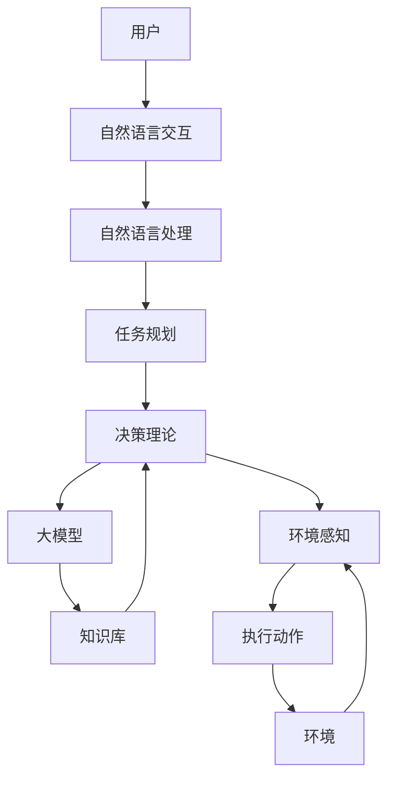

# 【大模型应用开发 动手做AI Agent】Agent带来新的商业模式和变革

## 1. 背景介绍

### 1.1 问题的由来

在过去几年中,人工智能(AI)技术取得了长足的进步,尤其是在自然语言处理(NLP)和计算机视觉(CV)等领域。这些进步很大程度上归功于大型神经网络模型(即大模型)的出现,例如GPT-3、DALL-E和PaLM等。这些大模型能够通过在大量数据上进行训练,学习丰富的知识和技能,从而在各种任务上表现出惊人的能力。

然而,这些大模型的强大功能往往被封装在云服务中,用户只能通过API接口来访问模型的输出,而无法直接控制和定制模型的行为。这种黑盒式的使用方式限制了用户对模型的控制能力,也阻碍了大模型在更广泛的应用场景中的落地。

### 1.2 研究现状

为了解决这一问题,近年来出现了一种新的范式:AI Agent。AI Agent是一种可编程的智能系统,它能够根据用户的指令执行各种任务,并与用户进行自然语言交互。与传统的云服务模式不同,AI Agent允许用户直接访问和控制底层的大模型,从而可以定制和扩展模型的功能,以满足特定的应用需求。

目前,已有一些AI Agent框架和平台问世,如Anthropic的Constitutional AI、OpenAI的InstructGPT和Adept AI的Adept等。这些框架提供了开发和部署AI Agent的基础设施,使得开发者能够更容易地构建自己的AI Agent应用。

### 1.3 研究意义

AI Agent的出现为人工智能的应用开辟了新的可能性。通过将大模型与可编程的智能系统相结合,AI Agent能够在各种领域发挥作用,如智能助手、自动化工作流、教育辅导、内容创作等。此外,AI Agent还可以作为一种新的人机交互方式,为用户提供更自然、更智能的交互体验。

从商业角度来看,AI Agent也带来了新的商业模式和机遇。企业可以基于AI Agent开发定制化的智能应用,为客户提供增值服务。同时,AI Agent也可以用于优化企业内部的流程和决策,提高效率和生产力。

### 1.4 本文结构

本文将全面探讨AI Agent的概念、原理和应用。我们将首先介绍AI Agent的核心概念和关键技术,包括大模型、自然语言处理和决策理论等。接下来,我们将详细阐述AI Agent的核心算法原理和具体实现步骤。然后,我们将讨论AI Agent的数学模型和公式,并通过案例分析加深理解。

在实践部分,我们将提供一个AI Agent的代码实例,并对其进行详细的解释和分析。同时,我们也将探讨AI Agent在各种实际应用场景中的作用和前景。

最后,我们将介绍AI Agent开发所需的工具和资源,并总结AI Agent的未来发展趋势和面临的挑战。

## 2. 核心概念与联系

AI Agent是一种集成了大模型、自然语言处理、决策理论和其他AI技术的智能系统。它能够理解和执行用户的自然语言指令,并根据指令完成各种任务。AI Agent的核心概念包括:

1. **大模型(Large Language Model,LLM)**:大模型是AI Agent的核心组件,它通过在海量数据上训练而获得丰富的知识和技能。常见的大模型包括GPT-3、PaLM、BLOOM等。

2. **自然语言处理(Natural Language Processing,NLP)**:NLP技术使AI Agent能够理解和生成自然语言,实现与用户的自然语言交互。

3. **决策理论(Decision Theory)**:决策理论为AI Agent提供了一种框架,使其能够根据指令和环境信息做出合理的决策和行为选择。

4. **人机交互(Human-Computer Interaction,HCI)**:人机交互技术确保AI Agent与用户之间的交互是自然、高效和用户友好的。

5. **知识库(Knowledge Base)**:知识库存储了AI Agent所需的结构化知识,如事实、规则和常识等,为其提供支持。

6. **任务规划(Task Planning)**:任务规划模块负责将用户的高级指令分解为一系列具体的操作步骤,并安排执行顺序。

7. **环境感知(Environment Perception)**:环境感知模块使AI Agent能够感知和理解当前的环境状态,为决策提供依据。

这些核心概念相互关联、相互作用,共同构建了一个智能化的AI Agent系统。下面是AI Agent的基本架构示意图:

在这个架构中,用户通过自然语言与AI Agent进行交互,输入指令。自然语言处理模块将指令转换为结构化的表示,并交给任务规划模块。任务规划模块根据指令生成一系列操作步骤,并将其传递给决策理论模块。

决策理论模块综合考虑大模型的输出、知识库的信息和环境感知模块的反馈,做出最终的决策。决策的结果将被执行,并影响到环境的状态。环境的变化又将被感知模块捕获,形成一个闭环的反馈过程。

通过这种模块化的设计,AI Agent能够灵活地集成各种AI技术,实现智能化的行为和决策。

## 3. 核心算法原理 & 具体操作步骤

### 3.1 算法原理概述

AI Agent的核心算法原理基于**马尔可夫决策过程(Markov Decision Process,MDP)**和**强化学习(Reinforcement Learning,RL)**。

**马尔可夫决策过程(MDP)**是一种用于建模决策过程的数学框架。在MDP中,系统被描述为一组状态(States)、可执行的动作(Actions)、状态转移概率(Transition Probabilities)和奖励函数(Reward Function)。

**强化学习(RL)**是一种机器学习范式,它通过与环境的交互来学习如何做出最优决策。RL代理(Agent)通过尝试不同的动作,观察环境的反馈(奖励或惩罚),并根据这些经验调整其决策策略,最终达到最大化累积奖励的目标。

在AI Agent中,我们将用户的指令视为RL环境中的状态,AI Agent的行为则是执行动作。通过与用户交互并观察反馈,AI Agent可以学习到一个最优的策略,即如何根据指令做出正确的行为。

具体来说,AI Agent的核心算法可以分为以下几个步骤:

1. **状态表示(State Representation)**:将用户的自然语言指令转换为结构化的状态表示,作为MDP的输入。

2. **动作空间(Action Space)**:定义AI Agent可以执行的一组动作,如生成文本、执行计算、访问知识库等。

3. **状态转移(State Transition)**:根据当前状态和执行的动作,计算下一个状态的概率分布。

4. **奖励函数(Reward Function)**:设计一个奖励函数,用于评估AI Agent的行为是否符合用户的期望。

5. **策略学习(Policy Learning)**:使用强化学习算法(如Q-Learning、Policy Gradient等)来学习一个最优的策略,即在给定状态下选择最佳动作的映射。

6. **动作执行(Action Execution)**:根据学习到的策略,选择并执行相应的动作,如生成响应文本、调用API等。

7. **环境更新(Environment Update)**:观察用户对AI Agent行为的反馈,并相应地更新环境状态。

8. **策略优化(Policy Optimization)**:根据新的状态和反馈,继续优化策略,使AI Agent的行为更加符合用户的期望。

这个过程是循环迭代的,AI Agent通过不断地与用户交互、学习和优化,逐步提高其执行指令的能力。

### 3.2 算法步骤详解

接下来,我们将详细解释AI Agent核心算法的每一个步骤。

#### 3.2.1 状态表示(State Representation)

将用户的自然语言指令转换为结构化的状态表示是AI Agent算法的第一步。这个过程通常涉及自然语言处理(NLP)技术,如tokenization、embedding和序列建模等。

常见的状态表示方法包括:

1. **One-hot编码**:将指令中的每个单词表示为一个one-hot向量,然后将所有向量拼接起来作为状态表示。

2. **词嵌入(Word Embeddings)**:使用预训练的词嵌入模型(如Word2Vec或GloVe)将每个单词映射到一个密集向量,然后对所有向量进行平均或拼接以获得状态表示。

3. **序列模型(Sequence Models)**:使用基于Transformer或RNN的语言模型对整个指令序列进行编码,获得一个固定长度的向量作为状态表示。

无论采用何种方法,状态表示的目标是捕获指令中的语义信息,为后续的决策过程提供有意义的输入。

#### 3.2.2 动作空间(Action Space)

AI Agent可以执行的动作空间取决于具体的应用场景和任务需求。常见的动作包括:

1. **生成文本(Text Generation)**:根据当前状态生成自然语言响应,如回答问题、提供解释等。

2. **执行计算(Computation)**:执行数学计算或逻辑推理等操作。

3. **知识库查询(Knowledge Base Querying)**:从知识库中检索相关信息。

4. **API调用(API Calling)**:调用外部API执行特定任务,如web搜索、数据处理等。

5. **环境交互(Environment Interaction)**:与物理环境进行交互,如控制机器人、操作GUI界面等。

动作空间的设计需要权衡可行性和表现力。一方面,动作空间不能过于庞大,以免导致搜索空间过大、计算效率低下;另一方面,动作空间也不能过于简单,以免限制了AI Agent的能力。

#### 3.2.3 状态转移(State Transition)

状态转移模块的目标是计算在执行某个动作后,系统将转移到下一个状态的概率分布。这个过程可以建模为:

$$P(s_{t+1}|s_t,a_t)$$

其中$s_t$和$s_{t+1}$分别表示当前状态和下一个状态,$a_t$表示在$s_t$状态下执行的动作。

在AI Agent中,状态转移概率通常是由大模型(如GPT-3)来估计的。具体来说,我们可以将当前状态$s_t$和动作$a_t$作为大模型的输入,让大模型生成下一个状态$s_{t+1}$的候选序列,然后根据这些候选序列的概率分布来近似状态转移概率$P(s_{t+1}|s_t,a_t)$。

除了利用大模型,我们还可以引入一些启发式规则或领域知识来约束状态转移,使其更加合理和可控。例如,如果当前状态是一个数学问题,那么执行"生成文本"动作后的下一个状态就应该是一个数字或公式,而不应该是一段无关的文字。

#### 3.2.4 奖励函数(Reward Function)

奖励函数用于评估AI Agent在特定状态下执行某个动作的好坏。它是强化学习算法的关键组成部分,直接影响了AI Agent的决策和行为。

在AI Agent中,奖励函数的设计需要考虑以下几个方面:

1. **任务完成度(Task Completion)**:奖励函数应该能够衡量AI Agent执行动作后,任务完成的程度。例如,如果任务是回答一个问题,那么生成一个准确、相关的答案应该获得较高的奖励。

2. **响应质量(Response Quality)**:除了任务完成度,奖励函数还应该评估AI Agent响应的质量,如是否通顺、简洁、有逻辑等。

3. **人机交互体验(Human-Computer Interaction Experience)**:奖励函数可以包含一些反映人机交互体验的指标,如响应时间、交互流畅度等。

4. **约束条件(Constraints)**:奖励函数还可以引入一些约束条件,如安全性、公平性、隐私保护等,以确保AI Agent的行为符合预期。

奖励函数的