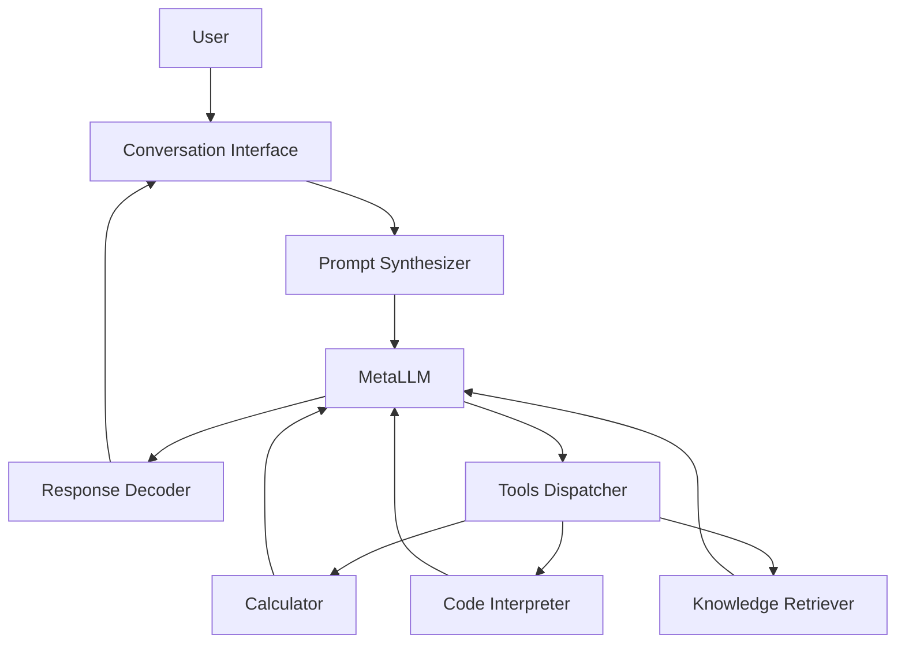

# 【大模型应用开发 动手做AI Agent】MetaGPT

## 1. 背景介绍
### 1.1 问题的由来
随着人工智能技术的飞速发展,大语言模型(LLM)在自然语言处理领域取得了突破性进展。以GPT系列模型为代表的大语言模型展现出了惊人的语言理解和生成能力,受到学术界和工业界的广泛关注。然而,如何将大语言模型应用于实际的AI系统开发中,构建具有强大语言交互能力的智能Agent,仍然是一个亟待探索的问题。

### 1.2 研究现状 
目前,业界已经出现了一些利用大语言模型构建AI Agent的尝试,比如Anthropic公司开发的Claude、OpenAI的ChatGPT等。这些系统在问答、对话、创作等任务上表现出色。但它们大多是封闭的商业API,难以让广大开发者参与其中。Meta最近开源了LLaMA系列模型,为大模型的开放研究提供了基础。在此基础上,复旦大学的MOSS开源项目进一步扩展了中文基座大模型。这为我们利用开源大模型构建AI Agent系统提供了新的机遇。

### 1.3 研究意义
本文旨在探索如何基于开源大语言模型MetaLLM,快速构建一个具备多轮对话能力的AI Agent系统MetaGPT。这不仅能够加深我们对大模型应用开发的理解,也为广大开发者提供了一个可以动手实践的案例。通过MetaGPT这样一个开源项目,我们可以共同推动大模型技术在实际应用中的发展,让更多人受益于人工智能的进步。

### 1.4 本文结构
本文将从以下几个方面展开论述:
- 介绍MetaGPT系统的核心概念与模块组成
- 详细阐述MetaGPT的核心算法原理与实现步骤
- 建立MetaGPT的数学模型,推导相关公式,并举例说明
- 给出MetaGPT的代码实现,并解释关键部分
- 分析MetaGPT的实际应用场景
- 推荐MetaGPT相关的学习资源与开发工具
- 总结MetaGPT项目的研究成果,展望未来发展方向与挑战
- 回答MetaGPT开发过程中的常见问题

## 2. 核心概念与联系
MetaGPT是一个基于大语言模型MetaLLM构建的AI Agent系统。它的核心概念包括:

- MetaLLM:Meta开源的大语言模型,是MetaGPT的基础。它经过海量语料预训练,具备强大的语言理解和生成能力。
- Prompt:输入给语言模型的提示/指令,引导模型进行特定任务。
- Conversation:MetaGPT与用户进行的多轮对话,由一系列的提问和回答组成。
- Memory:MetaGPT在对话过程中累积的上下文记忆,帮助其理解对话历史,生成连贯的回复。
- Tools:赋予MetaGPT的一些外部工具能力,如数学计算、代码执行、知识检索等,拓展其应用范围。

下图展示了MetaGPT系统的核心模块组成及其联系:



可以看出,MetaGPT的核心是大语言模型MetaLLM,其他模块都是为了辅助MetaLLM更好地完成任务。用户通过对话界面与MetaGPT交互,Prompt合成器负责将对话历史与当前输入整合为提示,输入给MetaLLM。MetaLLM根据提示生成回复,再由Response解码器将结果返回给用户。同时,Tools调度器赋予MetaGPT外部工具能力,与语言模型形成交互,扩展其应用范围。整个过程在不断累积对话历史记忆,使MetaGPT能够进行连贯的多轮对话。

## 3. 核心算法原理 & 具体操作步骤
### 3.1 算法原理概述
MetaGPT的核心算法可以概括为基于提示的大语言模型推理。具体来说,就是根据输入的提示(Prompt),利用预训练的大语言模型MetaLLM进行自回归生成,得到目标输出。在MetaGPT中,输入的提示不仅包括用户的当前询问,还包含了之前的对话历史,以及一些必要的任务指令。这使得MetaLLM能够根据上下文进行推理,生成连贯的对话回复。

### 3.2 算法步骤详解
MetaGPT的核心算法可以分为以下几个步骤:

1. 对话历史记忆:MetaGPT会记录下之前所有的对话内容,形成一个对话历史记忆。这个记忆可以帮助语言模型理解当前对话的上下文,使回复更加连贯。

2. 提示合成:当用户输入一个新的询问时,MetaGPT会将其与对话历史记忆进行拼接,再加入一些必要的任务指令(如要求语言模型扮演助手角色),共同构成一个完整的提示。提示的一般格式如下:

```
[对话历史]
Human: [用户当前询问]
Assistant: [要求语言模型根据Conversation生成回复]
```

3. 语言模型推理:MetaGPT将合成的提示输入给预训练的大语言模型MetaLLM,让其进行自回归生成。MetaLLM会根据提示中的上下文信息和指令,生成一段相应的文本作为回复。

4. 回复解码:MetaLLM生成的回复通常是一段连续的文本流。为了将其还原为对话的格式,MetaGPT需要进行回复解码。具体来说,就是找到回复文本中的"Assistant:"标记,将其后面的内容提取出来,作为本轮对话的回复。

5. 工具调用:如果MetaLLM生成的回复中包含了特殊的工具调用指令(如计算指令、代码执行指令、知识检索指令等),MetaGPT会将这些指令解析出来,调用相应的外部工具执行,再将执行结果返回给语言模型,帮助其完成回复生成。

6. 多轮对话:将上述步骤不断重复,MetaGPT就可以与用户进行多轮对话。每一轮对话结束后,当前的问答内容会被添加到对话历史记忆中,供下一轮对话使用。

### 3.3 算法优缺点
MetaGPT算法的主要优点包括:
- 利用大语言模型强大的语言理解和生成能力,使AI系统具备接近人类的对话交互能力。  
- 通过引入对话历史记忆,使多轮对话更加连贯自然。
- 通过接入外部工具,扩展了语言模型的应用范围,使其能执行更多样化的任务。

但MetaGPT算法也存在一些局限性:
- 语言模型的推理和生成过程难以控制和解释,存在安全和伦理风险。
- 对话历史记忆的管理与检索成本高,难以应用于大规模多用户场景。  
- 外部工具的接入增加了系统复杂度,需要额外的工程开发与维护成本。

### 3.4 算法应用领域
MetaGPT的核心算法可以应用于多个领域,包括:
- 智能客服:通过与用户进行多轮对话,解答问题,提供个性化服务。
- 虚拟助手:执行日程管理、信息查询、生活助理等个人助理类任务。
- 教育陪伴:对学习者的提问进行解答,引导学习讨论,提供学习反馈。
- 创意辅助:与人进行头脑风暴,激发创意灵感,辅助创作过程。

## 4. 数学模型和公式 & 详细讲解 & 举例说明
### 4.1 数学模型构建
我们可以用数学语言对MetaGPT的核心算法进行建模。假设 $H$ 表示对话历史, $Q$ 表示当前用户询问, $R$ 表示语言模型生成的回复, $\theta$ 表示语言模型的参数。我们希望找到一个语言模型 $P_{\theta}$,使得它能根据对话历史 $H$ 和当前询问 $Q$,生成一个合适的回复 $R$。用公式表示如下:

$$P_{\theta}(R|H,Q) = \prod_{i=1}^{n} P_{\theta}(r_i|H,Q,r_{1:i-1})$$

其中 $r_i$ 表示回复 $R$ 中的第 $i$ 个token, $n$ 为回复的总token数。可以看出,语言模型是通过自回归的方式,根据对话历史、当前询问和已生成的回复tokens,预测下一个回复token的概率。

### 4.2 公式推导过程
上述语言模型的概率公式可以通过最大似然估计(MLE)从训练数据中学习得到。假设我们有一个对话数据集 $D = \{(H_1,Q_1,R_1), (H_2,Q_2,R_2), ..., (H_m,Q_m,R_m)\}$,其中 $m$ 为总的对话数量。MLE的目标是最大化数据集 $D$ 中所有对话的概率乘积:

$$\theta^* = \mathop{\arg\max}_{\theta} \prod_{i=1}^{m} P_{\theta}(R_i|H_i,Q_i)$$

将公式展开,可以得到:

$$\theta^* = \mathop{\arg\max}_{\theta} \sum_{i=1}^{m} \sum_{j=1}^{n_i} \log P_{\theta}(r_j^i|H_i,Q_i,r_{1:j-1}^i)$$

其中 $n_i$ 为第 $i$ 个对话中回复的token数。上式即为语言模型训练的目标函数,通过梯度下降等优化算法最大化该目标函数,即可得到最优的模型参数 $\theta^*$。

### 4.3 案例分析与讲解
下面我们通过一个具体的案例来说明MetaGPT的数学模型是如何工作的。假设当前的对话历史为:

```
Human: 你好,请问你是谁?
Assistant: 我是一名人工智能助手,我叫MetaGPT。很高兴认识你!
Human: 你具体有哪些功能呢?
```

用户的当前询问是:"你能帮我写一个快速排序算法吗?"。我们希望MetaGPT能根据对话历史和当前询问,生成一个合适的回复。

首先,MetaGPT会将对话历史和当前询问拼接成一个完整的提示:

```
Human: 你好,请问你是谁?
Assistant: 我是一名人工智能助手,我叫MetaGPT。很高兴认识你!
Human: 你具体有哪些功能呢?  
Assistant: 作为一名AI助手,我具备多方面的能力:
1. 我可以就各种话题与你进行开放域对话,包括闲聊、知识问答、创意讨论等。
2. 我可以为你提供个性化的信息服务,如天气查询、日程管理、百科搜索等。  
3. 我还可以辅助你进行文本创作,例如写作、改错、润色、翻译等。
4. 在编程方面,我可以为你提供算法讲解、代码优化、bug分析等帮助。
5. 此外,我还能执行数学计算、绘图作图、数据分析等任务。
总之,我是你的得力助手,希望我的能力能为你提供价值!
Human: 你能帮我写一个快速排序算法吗?
Assistant:
```

然后MetaGPT将提示输入预训练的语言模型MetaLLM中,开始自回归生成回复。生成的过程可以表示为:

$$P_{\theta}(R|H,Q) = P_{\theta}(r_1|H,Q) \cdot P_{\theta}(r_2|H,Q,r_1) \cdot ... \cdot P_{\theta}(r_n|H,Q,r_{1:n-1})$$

其中 $H$ 为对话历史, $Q$ 为当前询问。语言模型根据提示中的上下文,不断预测下一个最可能的单词,直到生成完整的回复 $R$。

假设MetaLLM最终生成的回复如下: