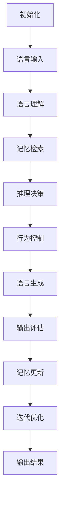

# 【大模型应用开发 动手做AI Agent】MetaGPT实战

## 1. 背景介绍

### 1.1 问题的由来

随着人工智能技术的不断发展,大型语言模型(Large Language Model, LLM)已经成为当前最为引人注目的人工智能技术之一。这些模型通过从海量文本数据中学习,掌握了丰富的自然语言知识,能够生成看似人类水平的自然语言输出。

然而,尽管大型语言模型展现出了令人惊叹的语言生成能力,但它们仍然存在一些明显的缺陷和局限性。例如,它们缺乏持久的记忆和推理能力,无法很好地理解和遵循人类的指令,也无法对自身的输出进行评估和修正。因此,如何充分发挥大型语言模型的潜力,并弥补其不足,成为当前人工智能领域的一个重要课题。

### 1.2 研究现状

为了解决大型语言模型的局限性,研究人员提出了多种不同的方法。其中,一种备受关注的方向是将大型语言模型与其他人工智能技术(如记忆模块、推理模块等)相结合,构建更加智能和通用的人工智能系统。这种系统被称为"元模型"(Meta Model)或"元架构"(Meta Architecture)。

MetaGPT就是这种元模型架构的一个典型代表。它将大型语言模型GPT与一系列辅助模块(如记忆模块、推理模块、控制模块等)相结合,旨在构建一个更加智能、可控且符合人类意图的人工智能代理(AI Agent)。

### 1.3 研究意义

MetaGPT的研究对于推动人工智能技术的发展具有重要意义:

1. **提高人工智能系统的智能水平**:通过融合多种人工智能技术,MetaGPT有望显著提高人工智能系统的智能水平,使其具备更强的理解、推理和决策能力。

2. **增强人工智能系统的可控性和可解释性**:MetaGPT的模块化设计使得系统的行为更加可控和可解释,有助于构建更加值得信赖的人工智能系统。

3. **探索通用人工智能的新路径**:MetaGPT代表了通往通用人工智能(Artificial General Intelligence, AGI)的一种新型架构,为实现人类水平的通用智能提供了新的思路和方向。

4. **推动人工智能技术在各领域的应用**:一个更加智能和可控的人工智能系统,将有助于人工智能技术在更多领域(如决策支持、智能助理、自动化系统等)的落地和应用。

### 1.4 本文结构

本文将全面介绍MetaGPT的核心概念、算法原理、数学模型、实践开发以及应用场景等内容。文章主要分为以下几个部分:

1. **核心概念与联系**:阐述MetaGPT的核心概念,并探讨它与其他相关技术的联系。

2. **核心算法原理与具体操作步骤**:详细解释MetaGPT的核心算法原理,并介绍其具体的操作步骤。

3. **数学模型和公式详细讲解与举例说明**:建立MetaGPT的数学模型,推导相关公式,并通过案例分析加深理解。

4. **项目实践:代码实例和详细解释说明**:提供MetaGPT的实际代码实现,并对关键部分进行详细解读和分析。

5. **实际应用场景**:探讨MetaGPT在不同领域的实际应用场景,并展望其未来的发展前景。

6. **工具和资源推荐**:推荐一些有助于学习和开发MetaGPT的工具、资源和相关论文。

7. **总结:未来发展趋势与挑战**:总结MetaGPT的研究成果,分析其未来的发展趋势和面临的挑战。

8. **附录:常见问题与解答**:针对MetaGPT的常见问题,提供解答和说明。

## 2. 核心概念与联系

MetaGPT是一种元模型架构,它将大型语言模型GPT与多个辅助模块相结合,旨在构建一个更加智能、可控且符合人类意图的人工智能代理系统。MetaGPT的核心概念包括:

### 2.1 大型语言模型(LLM)

大型语言模型(Large Language Model, LLM)是MetaGPT的核心组成部分。它是一种基于自然语言处理(Natural Language Processing, NLP)技术训练的深度神经网络模型,能够从海量文本数据中学习语言知识,并生成看似人类水平的自然语言输出。

常见的大型语言模型包括GPT(Generative Pre-trained Transformer)、BERT(Bidirectional Encoder Representations from Transformers)等。这些模型展现出了令人惊叹的语言生成和理解能力,但同时也存在一些明显的局限性,例如缺乏持久的记忆和推理能力、无法很好地理解和遵循人类的指令、无法对自身的输出进行评估和修正等。

### 2.2 辅助模块

为了弥补大型语言模型的不足,MetaGPT引入了多个辅助模块,包括:

1. **记忆模块(Memory Module)**:用于存储和管理与当前任务相关的信息和知识,提供持久的记忆能力。

2. **推理模块(Reasoning Module)**:执行复杂的逻辑推理和决策,增强系统的推理能力。

3. **控制模块(Control Module)**:根据人类的指令和反馈,调整和控制系统的行为,确保系统输出符合人类意图。

4. **评估模块(Evaluation Module)**:对系统的输出进行评估和反馈,提供自我修正和优化的能力。

这些辅助模块与大型语言模型紧密集成,共同构成了一个更加智能和可控的人工智能代理系统。

### 2.3 人工智能代理(AI Agent)

MetaGPT的最终目标是构建一个人工智能代理(AI Agent),即一个能够感知环境、作出决策并执行行动的智能系统。这种人工智能代理不仅具备强大的语言能力,还能够根据人类的指令和反馈,进行推理和决策,并采取相应的行动。

人工智能代理可以应用于各种领域,例如智能助理、决策支持系统、自动化系统等。它们能够与人类进行自然语言交互,理解人类的意图,并提供智能化的服务和支持。

### 2.4 与其他技术的联系

MetaGPT与多种人工智能技术密切相关,包括:

1. **自然语言处理(NLP)**:大型语言模型是基于NLP技术训练而来,MetaGPT继承了NLP在语言理解和生成方面的能力。

2. **记忆增强神经网络(Memory Augmented Neural Networks, MANN)**:记忆模块的设计借鉴了MANN的思想,旨在赋予神经网络持久的记忆能力。

3. **神经符号计算(Neural Symbolic Computation)**:推理模块的实现可能涉及神经符号计算技术,将神经网络与符号推理相结合。

4. **强化学习(Reinforcement Learning)**:控制模块和评估模块的设计可能借鉴了强化学习的思想,通过奖惩机制调整系统行为。

5. **多智能体系统(Multi-Agent Systems)**:MetaGPT的整体架构可视为一种多智能体系统,各个模块相互协作,共同完成复杂任务。

MetaGPT充分吸收了多种人工智能技术的精华,并将它们有机地融合在一起,构建出一种新型的人工智能架构。

## 3. 核心算法原理与具体操作步骤

### 3.1 算法原理概述

MetaGPT的核心算法原理可以概括为:利用大型语言模型的强大语言能力,并通过多个辅助模块的协同工作,构建一个更加智能、可控且符合人类意图的人工智能代理系统。

具体而言,MetaGPT的算法原理包括以下几个关键环节:

1. **语言理解与生成**:利用大型语言模型(如GPT)的语言理解和生成能力,与人类进行自然语言交互。

2. **记忆管理**:记忆模块负责存储和管理与当前任务相关的信息和知识,为系统提供持久的记忆能力。

3. **推理决策**:推理模块基于记忆中的信息和知识,执行复杂的逻辑推理和决策,为系统的行为提供指导。

4. **行为控制**:控制模块根据人类的指令和反馈,调整和控制系统的行为,确保系统输出符合人类意图。

5. **输出评估**:评估模块对系统的输出进行评估和反馈,为系统提供自我修正和优化的能力。

6. **迭代优化**:根据评估模块的反馈,系统可以不断调整和优化自身的行为,以更好地完成任务。

这些环节通过模块之间的紧密协作,共同构建出一个智能化的人工智能代理系统。

### 3.2 算法步骤详解

MetaGPT算法的具体操作步骤如下:

1. **初始化**:初始化大型语言模型、记忆模块、推理模块、控制模块和评估模块。

2. **语言输入**:接收人类通过自然语言提供的指令或查询。

3. **语言理解**:利用大型语言模型对输入的自然语言进行理解和表示。

4. **记忆检索**:在记忆模块中检索与当前任务相关的信息和知识。

5. **推理决策**:推理模块基于记忆中的信息和知识,执行逻辑推理和决策,得出初步的行为方案。

6. **行为控制**:控制模块根据人类的指令和反馈,调整和控制推理模块得出的行为方案,确保其符合人类意图。

7. **语言生成**:利用大型语言模型生成自然语言形式的输出,表达系统的行为方案或回应。

8. **输出评估**:评估模块对系统的输出进行评估,并提供反馈。

9. **记忆更新**:根据当前任务的信息和知识,更新记忆模块的内容。

10. **迭代优化**:根据评估模块的反馈,系统可以不断调整和优化自身的行为,重复执行上述步骤。

11. **输出结果**:如果评估模块认为系统的输出已经足够好,则将其作为最终结果输出。

该算法通过模块之间的紧密协作,实现了一个智能化的人工智能代理系统,能够根据人类的指令和反馈,进行推理决策并采取相应的行动。

### 3.3 算法优缺点

MetaGPT算法的优点包括:

1. **智能水平提升**:通过融合多种人工智能技术,MetaGPT能够显著提高系统的智能水平,使其具备更强的理解、推理和决策能力。

2. **可控性和可解释性**:MetaGPT的模块化设计使得系统的行为更加可控和可解释,有助于构建更加值得信赖的人工智能系统。

3. **符合人类意图**:通过控制模块和评估模块,MetaGPT能够根据人类的指令和反馈调整系统行为,确保输出符合人类意图。

4. **持久记忆和推理能力**:记忆模块和推理模块赋予了MetaGPT持久的记忆和推理能力,弥补了大型语言模型的不足。

5. **自我优化和修正**:评估模块和迭代优化机制使得MetaGPT能够不断学习和改进,提高系统的性能和质量。

然而,MetaGPT算法也存在一些缺点和挑战:

1. **模块集成复杂度高**:将多个不同的人工智能模块有机地集成在一起,是一项极具挑战的工作。

2. **计算资源需求大**:MetaGPT涉及多个复杂的人工智能模块,对计算资源的需求较高。

3. **数据需求量大