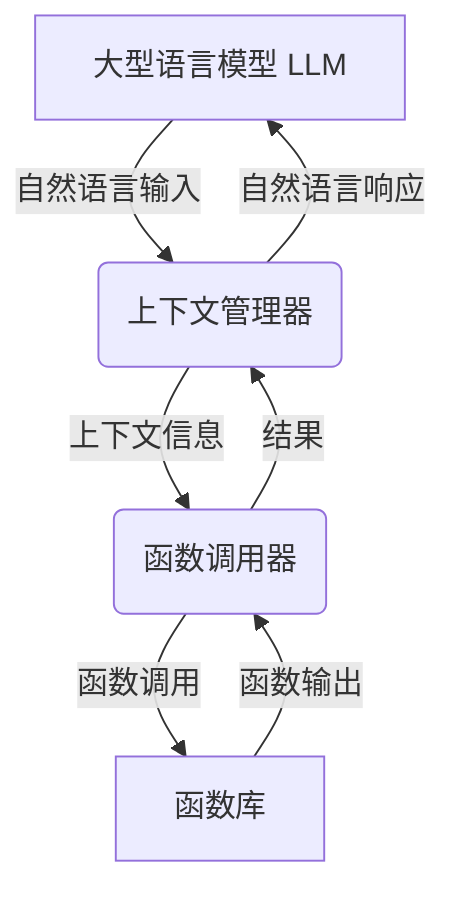

# 【大模型应用开发 动手做AI Agent】什么是Function Calling

## 1. 背景介绍

### 1.1 问题的由来

在当前的人工智能发展浪潮中,大型语言模型(Large Language Models, LLMs)凭借其强大的自然语言处理能力,在各个领域都展现出了令人惊叹的表现。然而,LLMs的能力往往受限于其训练数据和模型架构,难以直接应用于复杂的任务和场景。为了充分发挥LLMs的潜力,研究人员提出了一种新的范式:Function Calling。

### 1.2 研究现状 

Function Calling的核心思想是将LLMs与外部函数、API和服务相结合,从而扩展LLMs的能力边界。通过调用这些外部资源,LLMs可以访问更广泛的知识库、执行复杂的计算任务、与外部系统进行交互等。这种范式已经在多个领域展现出了巨大的潜力,例如问答系统、任务规划、代码生成等。

### 1.3 研究意义

Function Calling为LLMs带来了无限的可能性,它不仅能够增强LLMs的功能,还能够促进人工智能系统与现有系统的无缝集成。通过Function Calling,我们可以构建更加智能、更加通用的AI Agent,为各种复杂任务提供强大的支持。

### 1.4 本文结构

本文将全面探讨Function Calling的核心概念、原理和实践。我们将首先介绍Function Calling的基本思想和架构,然后深入探讨其核心算法和数学模型。接下来,我们将通过实际案例和代码示例,详细说明如何开发和部署基于Function Calling的AI Agent。最后,我们将讨论Function Calling在各个领域的应用前景,并分析其面临的挑战和未来发展趋势。

## 2. 核心概念与联系

Function Calling的核心概念是将大型语言模型(LLM)与外部函数、API和服务相结合,从而扩展LLM的能力边界。这种范式可以被视为一种"增强现实"(Augmented Reality)的人工智能方法,它允许LLM利用外部资源来补充其内部知识和能力。

在Function Calling架构中,有几个关键组件:

1. **大型语言模型(LLM)**: 作为核心组件,LLM负责理解自然语言输入,生成响应,并协调与外部函数的交互。

2. **函数库(Function Library)**: 一组可供LLM调用的外部函数、API和服务,用于执行特定的任务或访问外部知识库。

3. **函数调用器(Function Caller)**: 负责将LLM的指令转换为对应的函数调用,并将函数的输出结果传递回LLM。

4. **上下文管理器(Context Manager)**: 维护LLM与函数交互的上下文信息,确保交互的连贯性和一致性。

这些组件通过紧密协作,形成了一个强大的AI Agent,能够理解自然语言指令,利用外部资源执行复杂任务,并生成自然语言响应。Function Calling架构的灵活性允许开发人员根据需求定制和扩展函数库,从而为AI Agent赋予各种不同的能力。

## 3. 核心算法原理 & 具体操作步骤

### 3.1 算法原理概述

Function Calling的核心算法旨在实现LLM与外部函数之间的无缝交互。该算法包括以下几个关键步骤:

1. **自然语言理解(Natural Language Understanding, NLU)**: LLM首先需要理解用户的自然语言输入,识别出其中包含的指令和任务要求。

2. **函数匹配(Function Matching)**: 根据用户的指令,算法需要从函数库中选择合适的函数来执行相应的任务。

3. **函数调用(Function Calling)**: 将用户的输入数据传递给选定的函数,并执行函数调用。

4. **结果处理(Result Processing)**: 处理函数的输出结果,并将其整合到LLM的上下文中。

5. **自然语言生成(Natural Language Generation, NLG)**: 根据处理后的结果和上下文信息,LLM生成自然语言响应。

该算法的关键在于能够有效地匹配用户指令与适当的函数,并在LLM与函数之间建立连贯的上下文交互。

### 3.2 算法步骤详解

1. **自然语言理解(NLU)**

   在这一步骤中,LLM需要对用户的自然语言输入进行深入分析和理解。常用的NLU技术包括:

   - 词法分析(Lexical Analysis): 将输入文本分解为单词、标点符号等词法单元。
   - 语法分析(Syntactic Analysis): 根据语言规则,构建输入文本的语法树。
   - 语义分析(Semantic Analysis): 从语法树中提取语义信息,确定输入的意图和所需的任务。

   NLU的质量对于整个算法的性能至关重要,因为它决定了系统对用户指令的理解程度。

2. **函数匹配(Function Matching)**

   根据NLU步骤得到的语义信息,算法需要从函数库中选择合适的函数来执行相应的任务。这一步骤通常涉及以下操作:

   - 函数注册(Function Registration): 将函数及其功能描述注册到函数库中。
   - 语义匹配(Semantic Matching): 将用户指令的语义信息与函数描述进行匹配,找到最合适的函数。
   - 上下文考虑(Context Consideration): 根据当前的上下文信息,进一步优化函数的选择。

   函数匹配算法的设计对于系统的准确性和鲁棒性至关重要。一个好的算法应该能够处理同义词、近义词和语义歧义等情况。

3. **函数调用(Function Calling)**

   在选定合适的函数之后,算法需要将用户的输入数据传递给该函数,并执行函数调用。这一步骤可能涉及以下操作:

   - 数据预处理(Data Preprocessing): 根据函数的输入要求,对用户数据进行必要的格式转换和清洗。
   - 参数映射(Parameter Mapping): 将用户输入映射到函数的输入参数。
   - 函数执行(Function Execution): 调用函数并执行相应的操作。
   - 错误处理(Error Handling): 捕获并处理函数执行过程中可能出现的错误和异常。

4. **结果处理(Result Processing)**

   函数执行完毕后,算法需要对函数的输出结果进行处理,并将其整合到LLM的上下文中。这一步骤可能涉及以下操作:

   - 结果解析(Result Parsing): 解析函数的输出数据,提取有用的信息。
   - 上下文更新(Context Updating): 将解析后的结果信息更新到LLM的上下文中。
   - 一致性检查(Consistency Checking): 确保新的上下文信息与之前的上下文保持一致性。

5. **自然语言生成(NLG)**

   最后,根据更新后的上下文信息,LLM需要生成自然语言响应,并将其呈现给用户。NLG过程通常包括以下步骤:

   - 内容规划(Content Planning): 确定响应内容的结构和组织方式。
   - 句子生成(Sentence Generation): 根据内容规划,生成自然语言句子。
   - 语言模型(Language Model): 利用语言模型来提高生成句子的流畅性和自然度。

   NLG的质量对于系统的用户体验至关重要,因为它决定了响应的可读性和易懂程度。

通过上述步骤,Function Calling算法实现了LLM与外部函数之间的无缝交互,从而扩展了LLM的能力边界。

### 3.3 算法优缺点

**优点**:

1. **能力扩展**: Function Calling算法允许LLM利用外部函数和服务来扩展其能力,从而可以应对更加复杂的任务和场景。

2. **灵活性**: 通过定制和扩展函数库,开发人员可以根据需求赋予AI Agent各种不同的能力。

3. **模块化**: 算法将LLM与外部函数解耦,使得系统更加模块化和可维护。

4. **可解释性**: 通过函数调用的方式,AI Agent的决策过程变得更加透明和可解释。

**缺点**:

1. **函数依赖**: AI Agent的性能和能力在很大程度上依赖于函数库的质量和覆盖范围。

2. **上下文管理复杂性**: 在LLM与多个函数之间维护一致的上下文信息是一个挑战。

3. **安全性风险**: 调用不可信的外部函数可能会带来安全隐患。

4. **性能开销**: 函数调用和数据传输可能会增加系统的延迟和资源消耗。

### 3.4 算法应用领域

Function Calling算法可以应用于各种需要利用外部资源扩展LLM能力的场景,包括但不限于:

1. **问答系统**: 通过调用知识库API、搜索引擎等,提升问答系统的知识覆盖范围和准确性。

2. **任务规划和自动化**: 利用外部函数执行各种任务,实现智能任务规划和自动化流程。

3. **代码生成**: 调用代码库和开发工具,为LLM赋予代码生成和开发辅助的能力。

4. **多模态交互**: 通过调用图像处理、语音识别等函数,实现多模态的人机交互。

5. **决策支持系统**: 利用外部数据源和分析工具,为决策过程提供智能支持。

6. **个性化推荐**: 基于用户数据和偏好,调用推荐算法为用户提供个性化的内容推荐。

总的来说,Function Calling算法为LLM带来了无限的可能性,使其能够融入各种复杂的应用场景。

## 4. 数学模型和公式 & 详细讲解 & 举例说明

在Function Calling算法中,数学模型和公式主要应用于函数匹配和结果处理两个关键步骤。

### 4.1 数学模型构建

#### 4.1.1 语义相似度模型

语义相似度模型用于衡量用户指令与函数描述之间的语义相似程度,从而实现准确的函数匹配。常见的语义相似度模型包括:

1. **词向量模型(Word Embedding)**

   将文本映射到高维向量空间,相似的词或句子在向量空间中距离较近。常用的词向量模型有Word2Vec、GloVe等。

   设用户指令的词向量表示为$\vec{u}$,函数描述的词向量表示为$\vec{f}$,则语义相似度可以用两个向量的余弦相似度来衡量:

   $$\text{sim}(\vec{u}, \vec{f}) = \frac{\vec{u} \cdot \vec{f}}{||\vec{u}|| \cdot ||\vec{f}||}$$

2. **句向量模型(Sentence Embedding)**

   直接将整个句子或段落映射到向量空间,常用的模型有InferSent、USE等。

   设用户指令的句向量表示为$\vec{s_u}$,函数描述的句向量表示为$\vec{s_f}$,则语义相似度可以用两个向量的余弦相似度或欧几里得距离来衡量:

   $$\text{sim}(\vec{s_u}, \vec{s_f}) = \frac{\vec{s_u} \cdot \vec{s_f}}{||\vec{s_u}|| \cdot ||\vec{s_f}||}$$
   $$\text{dist}(\vec{s_u}, \vec{s_f}) = ||\vec{s_u} - \vec{s_f}||$$

#### 4.1.2 上下文相关性模型

上下文相关性模型用于评估函数与当前上下文之间的相关程度,从而优化函数匹配过程。常见的模型包括:

1. **主题模型(Topic Modeling)**

   通过主题模型(如LDA)将上下文信息映射到主题空间,然后计算函数描述与主题空间的相关性。

   设上下文信息的主题分布为$\vec{\theta}$,函数描述的主题分布为$\vec{\phi}$,则上下文相关性可以用两个分布的相似度来衡量,如KL散