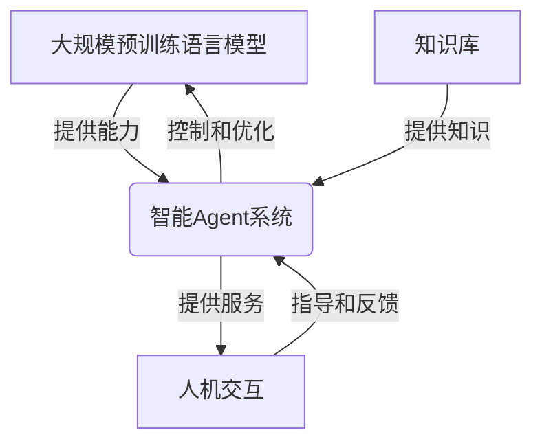

# 【大模型应用开发 动手做AI Agent】基于大模型的Agent技术框架

## 1. 背景介绍

### 1.1 问题的由来

在当今的人工智能时代,大规模预训练语言模型(Large Pre-trained Language Models, LLMs)凭借其在自然语言处理任务中展现出的卓越性能,成为了推动人工智能发展的重要驱动力。随着计算能力的不断提升和数据量的持续增长,训练出更大更强的语言模型成为可能。这些大模型不仅在理解和生成自然语言方面表现出色,而且还展现出了跨领域的泛化能力,可以应用于各种不同的任务和场景中。

然而,尽管大模型具有强大的语言理解和生成能力,但将其直接应用于实际场景中仍然面临诸多挑战。例如,大模型在一次性交互中难以保持上下文一致性,无法根据用户的反馈进行自我修正,缺乏长期记忆和持续学习的能力。此外,大模型的行为也存在不确定性和不可控性,可能会产生有害或不当的输出。

为了解决这些问题,将大模型与其他人工智能技术相结合,构建基于大模型的智能Agent系统就显得尤为重要。智能Agent可以作为人与大模型之间的中介,通过持续交互来指导和控制大模型的行为,使其更加稳定、可靠和符合预期。

### 1.2 研究现状

近年来,基于大模型的智能Agent系统受到了广泛关注,相关研究工作也在不断推进。一些主要的研究方向包括:

1. **对话管理**: 设计高效的对话管理策略,以确保Agent与用户之间的交互流程自然、连贯。
2. **知识库集成**: 将外部知识库与大模型相结合,增强Agent的知识储备和推理能力。
3. **反馈机制**: 开发有效的反馈机制,使Agent能够根据用户的反馈进行自我修正和持续学习。
4. **行为控制**: 探索各种方法来约束和规范大模型的输出,避免产生有害或不当的行为。
5. **多模态交互**: 赋予Agent多模态交互能力,如视觉、语音等,以提供更加自然和智能的交互体验。

虽然取得了一些进展,但构建高效、安全和可控的基于大模型的智能Agent系统仍然是一个巨大的挑战,需要持续的研究和探索。

### 1.3 研究意义

基于大模型的智能Agent系统具有广阔的应用前景,可以为各个领域带来革命性的变革。例如:

- 在客户服务领域,智能Agent可以提供7*24小时的智能对话服务,解答用户疑问,处理常见问题。
- 在教育领域,智能Agent可以作为个性化的虚拟教师,根据学生的水平和需求提供定制化的教学内容和辅导。
- 在医疗健康领域,智能Agent可以协助医生进行病情诊断、治疗方案制定等,提高医疗效率和质量。
- 在创意领域,智能Agent可以辅助作家、艺术家等进行创作,提供灵感和建议,推动创新发展。

总的来说,基于大模型的智能Agent系统有望成为通用人工智能(Artificial General Intelligence, AGI)的重要基础,推动人工智能技术在各个领域的深入应用和发展。

### 1.4 本文结构

本文将全面介绍基于大模型的智能Agent技术框架,内容安排如下:

1. 核心概念与联系
2. 核心算法原理与具体操作步骤
3. 数学模型和公式详细讲解与举例说明
4. 项目实践:代码实例和详细解释说明
5. 实际应用场景
6. 工具和资源推荐
7. 总结:未来发展趋势与挑战
8. 附录:常见问题与解答

## 2. 核心概念与联系

在深入探讨基于大模型的智能Agent技术框架之前,我们需要先了解一些核心概念及其之间的联系。

### 2.1 大规模预训练语言模型(LLMs)

大规模预训练语言模型(Large Pre-trained Language Models, LLMs)是近年来自然语言处理领域的一个重大突破。这些模型通过在海量的自然语言数据上进行预训练,学习到了丰富的语言知识和模式,从而在下游任务中表现出了卓越的性能。

一些典型的LLMs包括:

- **GPT系列**(Generative Pre-trained Transformer,生成式预训练转换器),如GPT-3、InstructGPT等,由OpenAI开发。
- **BERT系列**(Bidirectional Encoder Representations from Transformers,双向编码器表示从转换器),如BERT、RoBERTa等,由Google开发。
- **T5**(Text-to-Text Transfer Transformer,文本到文本转换器),由Google开发。
- **PALM**(Pathways Language Model,路径语言模型),由Google开发。

这些大模型在自然语言理解、生成、推理等任务中表现出色,但也存在一些缺陷,如缺乏持续学习能力、输出不确定性等,需要通过智能Agent系统进行优化和控制。

### 2.2 智能Agent

智能Agent是一种自主的软件实体,能够感知环境、作出决策并采取行动,以实现特定目标。在基于大模型的系统中,智能Agent的作用是与用户进行交互,并根据交互过程中获得的反馈和指令来控制和优化大模型的行为。

一个典型的基于大模型的智能Agent系统通常包括以下几个核心组件:

- **对话管理器**(Dialogue Manager):负责管理与用户的对话流程,确保交互的自然性和连贯性。
- **任务规划器**(Task Planner):根据用户的需求,制定合理的任务计划,并将任务分解为可执行的步骤。
- **知识库**(Knowledge Base):存储与任务相关的结构化知识,为大模型提供外部知识支持。
- **反馈处理器**(Feedback Processor):接收并处理用户的反馈,用于指导大模型的行为调整和持续学习。
- **行为控制器**(Behavior Controller):根据预定义的规则和约束,监控和调整大模型的输出,避免产生有害或不当的行为。

通过智能Agent的协调和控制,大模型的能力得以充分发挥,同时也解决了大模型存在的一些缺陷和局限性。

### 2.3 人机交互

人机交互(Human-Computer Interaction, HCI)是智能Agent系统中的一个关键环节。通过自然语言、图形界面或其他模态,用户可以与Agent进行交互,表达需求、提供反馈,并获取所需的服务或信息。

优秀的人机交互设计对于智能Agent系统的成功至关重要。它需要考虑以下几个方面:

1. **自然性**:交互方式应该尽可能自然,符合人类的认知习惯和交互模式。
2. **易用性**:界面设计应该简单直观,降低用户的学习和使用成本。
3. **个性化**:交互过程应该根据用户的偏好和习惯进行个性化调整。
4. **多模态**:支持多种交互模式(语音、视觉、手势等),提供更加丰富和自然的交互体验。
5. **反馈机制**:及时向用户提供有效的反馈,增强交互的透明度和可解释性。

通过优化人机交互设计,智能Agent系统可以更好地满足用户需求,提高用户体验,从而推动其在实际应用中的广泛采用。

### 2.4 核心概念关系

上述核心概念之间存在着紧密的联系,如下图所示:

具体来说:

- 大规模预训练语言模型为智能Agent系统提供了强大的自然语言理解和生成能力。
- 知识库为智能Agent系统提供了必要的结构化知识支持。
- 智能Agent系统通过对话管理、任务规划、反馈处理和行为控制等机制,对大模型的行为进行控制和优化。
- 人机交互模块允许用户与智能Agent系统进行自然的交互,提出需求并给出反馈。
- 智能Agent系统根据用户的需求和反馈,提供所需的服务或信息。

这四个核心概念相互依赖、相互促进,共同构建了一个完整的基于大模型的智能Agent技术框架。

## 3. 核心算法原理与具体操作步骤

### 3.1 算法原理概述

基于大模型的智能Agent系统的核心算法原理可以概括为一个闭环过程,包括以下几个主要步骤:

1. **用户交互**:用户通过自然语言或其他方式与智能Agent进行交互,表达需求或提供反馈。
2. **需求理解**:智能Agent利用大模型的自然语言理解能力,对用户的需求进行解析和理解。
3. **任务规划**:根据用户需求,智能Agent制定合理的任务计划,并将任务分解为可执行的步骤。
4. **知识检索**:从知识库中检索与任务相关的结构化知识,为大模型提供外部知识支持。
5. **模型生成**:利用大模型的生成能力,结合任务规划和知识库信息,生成针对性的输出(如自然语言回复、文本生成等)。
6. **行为控制**:通过预定义的规则和约束,监控和调整大模型的输出,避免产生有害或不当的行为。
7. **反馈处理**:接收并处理用户对输出结果的反馈,用于指导大模型的行为调整和持续学习。
8. **输出优化**:根据用户反馈,优化大模型的输出,提高其质量和准确性。

这个闭环过程持续迭代,直到满足用户需求或达到预定终止条件。通过不断的交互和反馈,智能Agent系统可以逐步优化大模型的行为,提供更加准确和有效的服务。

### 3.2 算法步骤详解

接下来,我们将详细解释上述算法的每一个步骤。

#### 3.2.1 用户交互

用户交互是整个算法流程的起点。用户可以通过多种方式与智能Agent进行交互,例如:

- 自然语言对话:用户以自然语言表达需求或提供反馈,如文本输入、语音输入等。
- 图形界面交互:用户通过图形界面(如网页、移动应用等)与智能Agent进行交互。
- 其他模态交互:用户可以采用手势、视觉等其他交互方式与智能Agent进行交互。

无论采用何种交互方式,智能Agent都需要具备相应的输入处理能力,将用户的输入转换为可理解的内部表示。

#### 3.2.2 需求理解

在获取用户输入后,智能Agent需要利用大模型的自然语言理解能力对用户需求进行解析和理解。这个过程通常包括以下几个步骤:

1. **tokenization(标记化)**: 将用户输入的自然语言文本转换为一系列的token(词元)序列。
2. **embedding(嵌入)**: 将token序列映射到一个连续的向量空间中,获得对应的嵌入向量表示。
3. **encoding(编码)**: 利用大模型的编码器模块(如Transformer的Self-Attention层),对嵌入向量进行编码,捕获序列中的上下文信息。
4. **解析**: 在编码的基础上,利用大模型的解码器模块或其他任务特定的模块,对用户需求进行解析和理解,获得对应的内部表示。

通过这一过程,智能Agent可以深入理解用户的真实需求,为后续的任务规划和执行奠定基础。

#### 3.2.3 任务规划

在充分理解用户需求后,智能Agent需要制定合理的任务计划,将复杂的需求分解为一系列可执行的子任务。任务规划过程通常包括以下步骤:

1. **目标分解**: 将用户的高层次需求分解为一系列具体的子目标。
2. **约束识别**: 识别完成任务所需遵守的各种约束条件,如时间限制、资源限制等。
3.