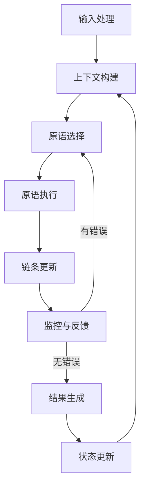

# 【大模型应用开发 动手做AI Agent】思维链

## 1. 背景介绍

### 1.1 问题的由来

在当今的人工智能时代,大型语言模型(Large Language Models, LLMs)的出现彻底改变了我们与计算机交互的方式。传统的命令式编程范式正在被一种全新的人工智能驱动的范式所取代,即通过自然语言与AI代理进行交互,完成各种复杂任务。

随着GPT-3、PaLM、ChatGPT等大模型的不断推出,人工智能系统展现出了令人惊叹的自然语言理解和生成能力。然而,要真正发挥这些模型的潜力,仍然面临着诸多挑战,例如如何将它们集成到实际应用程序中、如何管理对话状态、如何确保输出的一致性和安全性等。

### 1.2 研究现状

目前,已有一些框架和工具kit致力于简化大模型的应用开发过程,例如Anthropic的Constitutional AI、OpenAI的InstructGPT、Google的PaLM API等。但它们大多专注于特定领域或具有局限性,缺乏一个通用、灵活且可扩展的解决方案。

此外,现有方法往往将大模型视为一个黑盒,无法真正理解和控制其内部工作机制。这不仅增加了开发和调试的难度,也限制了我们对这些强大系统的掌控能力。

### 1.3 研究意义

本文旨在提出一种新颖的"思维链"范式,用于构建可解释、可控制且高度可扩展的大模型应用程序。通过将大模型的推理过程分解为一系列可组合的"思维原语",我们能够更好地理解、调整和扩展模型的行为。

这种方法不仅有助于提高模型的透明度和可解释性,而且为开发人员提供了一种统一的框架,使他们能够灵活地组合不同的功能模块,从而构建出复杂的AI代理。

### 1.4 本文结构

本文首先介绍"思维链"的核心概念,并探讨其与现有方法的关系。接下来,我们将详细阐述思维链的工作原理,包括其算法流程、数学模型以及具体的实现细节。

然后,我们将通过一个实际的案例研究,演示如何使用思维链构建一个多功能的AI助手。在此过程中,我们还将分享一些实用的开发工具和学习资源。

最后,本文将总结思维链方法的优势和局限性,并对其未来的发展方向和潜在挑战进行展望。

## 2. 核心概念与联系

思维链(Thought Chain)是一种用于构建可解释和可控制的大模型应用程序的新范式。它的核心思想是将大模型的推理过程分解为一系列可组合的"思维原语"(Thought Primitives),每个原语负责执行特定的任务或功能。

这些思维原语可以是简单的文本生成、数学计算、信息检索或者更复杂的推理和决策过程。通过以特定顺序链接这些原语,我们可以构建出复杂的"思维链",用于指导大模型完成各种任务。

思维链与现有的大模型开发方法(如Constitutional AI、InstructGPT等)的主要区别在于,它不将大模型视为一个不可解释的黑盒,而是将其内部推理过程明确地分解和模块化。这不仅提高了系统的透明度和可解释性,而且使开发人员能够更好地控制和扩展模型的行为。

例如,在一个对话式AI助手中,我们可以将"理解用户查询"、"检索相关信息"、"规划任务步骤"、"生成响应"等功能封装为独立的思维原语,然后根据对话上下文动态组装成一条思维链。这种模块化设计不仅使系统更加灵活和可扩展,而且有助于诊断和修复潜在的错误或偏差。

总的来说,思维链为大模型应用程序的开发提供了一种全新的范式,它有望推动人工智能系统向更透明、更可控的方向发展。

## 3. 核心算法原理 & 具体操作步骤

### 3.1 算法原理概述

思维链算法的核心原理是将大模型的推理过程分解为一系列可组合的思维原语,每个原语负责执行特定的任务或功能。这些原语按照特定的顺序链接,形成一条"思维链",用于指导大模型完成复杂任务。

在这个过程中,算法会根据当前的输入和上下文信息动态选择和组装合适的思维原语。每个原语的输出将作为下一个原语的输入,最终生成最终结果。

此外,算法还包括一个监控和反馈机制,用于跟踪思维链的执行过程,检测潜在的错误或偏差,并在必要时进行干预或调整。

### 3.2 算法步骤详解

1. **输入处理**:接收用户的自然语言查询或指令,并对其进行预处理(如分词、标记化等)。

2. **上下文构建**:根据当前的对话历史、任务状态和其他相关信息,构建一个上下文表示。

3. **原语选择**:根据当前的输入和上下文信息,从可用的思维原语集合中动态选择合适的原语。这可以通过基于规则的启发式方法或机器学习模型(如序列到序列模型)来实现。

4. **原语执行**:执行选定的思维原语,并获取其输出。原语的执行可能涉及文本生成、数学计算、信息检索或其他复杂的推理过程。

5. **链条更新**:将原语的输出附加到当前的思维链中。

6. **监控与反馈**:跟踪思维链的执行过程,检测潜在的错误或偏差。如果发现问题,可以通过插入新的原语或调整现有原语的参数来进行干预和修正。

7. **结果生成**:当思维链执行完毕后,将最终的输出结果呈现给用户。

8. **状态更新**:根据本次交互的结果,更新对话历史、任务状态和其他相关上下文信息,为下一次交互做准备。

该算法通过迭代执行上述步骤,实现了一个交互式的、可解释和可控制的大模型应用系统。

### 3.3 算法优缺点

**优点**:

1. **可解释性**:将大模型的推理过程分解为可解释的思维原语,提高了系统的透明度。
2. **可控制性**:开发人员可以精确地控制和调整思维链的执行过程。
3. **灵活性**:通过组合不同的思维原语,可以构建出多种功能复杂的AI应用。
4. **可扩展性**:新的思维原语可以被无缝集成,使系统能够不断扩展。
5. **鲁棒性**:监控和反馈机制有助于及时发现和纠正错误,提高系统的鲁棒性。

**缺点**:

1. **开发复杂度**:设计和实现高质量的思维原语需要专业知识和大量工作。
2. **性能开销**:将推理过程分解为多个步骤可能会增加一定的计算开销。
3. **上下文依赖**:算法对上下文信息的构建和维护有较高的要求。
4. **原语组合挑战**:寻找最优的思维原语组合方式是一个具有挑战性的问题。

### 3.4 算法应用领域

思维链算法可以应用于各种需要与大模型进行自然语言交互的场景,例如:

- **对话式AI助手**:构建多功能的虚拟助手,能够回答问题、执行任务、提供建议等。
- **智能写作辅助**:根据给定的主题和要求,自动生成文章、报告或其他写作内容。
- **智能教育系统**:个性化的教学辅助,根据学生的水平和需求提供解释、练习和反馈。
- **智能决策支持**:分析复杂问题的多个方面,并提供决策建议。
- **智能客户服务**:理解用户查询,并提供准确的响应和解决方案。

总的来说,思维链算法为大模型的应用开发提供了一种通用的框架,有助于构建更加透明、可控制和高度可扩展的人工智能系统。

## 4. 数学模型和公式 & 详细讲解 & 举例说明

### 4.1 数学模型构建

在思维链算法中,我们需要一个数学模型来量化和优化思维原语的选择和组合过程。这个模型应该能够根据当前的输入和上下文信息,预测出最佳的思维原语序列。

我们可以将这个问题形式化为一个序列到序列(Sequence-to-Sequence)的学习任务,其中输入序列是当前的查询和上下文信息,而目标输出序列是最优的思维原语序列。

具体来说,我们可以使用一个基于Transformer的序列到序列模型,例如T5或BART。该模型将被训练来最大化给定输入和上下文下,生成正确思维原语序列的条件概率。

设输入序列为$X = (x_1, x_2, \ldots, x_n)$,目标思维原语序列为$Y = (y_1, y_2, \ldots, y_m)$,我们希望学习一个条件概率模型$P(Y|X)$,使其能够生成最优的思维原语序列。

根据最大似然估计原理,我们可以将模型的目标函数定义为:

$$\mathcal{L}(\theta) = -\sum_{(X,Y)\in\mathcal{D}}\log P_\theta(Y|X)$$

其中$\mathcal{D}$是训练数据集,$\theta$是模型参数。

在训练过程中,我们将最小化上述目标函数,使模型能够更好地预测正确的思维原语序列。

### 4.2 公式推导过程

我们可以将序列到序列模型$P(Y|X)$进一步分解为:

$$P(Y|X) = \prod_{t=1}^m P(y_t|y_{<t}, X)$$

即目标序列$Y$中每个元素$y_t$的条件概率可以被分解为已生成序列$y_{<t}$和输入$X$的条件概率。

在Transformer模型中,我们使用自注意力(Self-Attention)机制来捕获输入序列$X$和部分生成序列$y_{<t}$之间的依赖关系。具体来说,对于序列$X$中的每个位置$i$,我们计算其与所有其他位置$j$的注意力权重$\alpha_{ij}$:

$$\alpha_{ij} = \frac{\exp(e_{ij})}{\sum_k \exp(e_{ik})}, \quad e_{ij} = \frac{(Wq_i)(Wk_j)^T}{\sqrt{d_k}}$$

其中$q_i$和$k_j$分别是位置$i$和$j$的查询(Query)和键(Key)向量,$W$是可学习的线性投影,$d_k$是缩放因子。

然后,我们可以计算加权后的值(Value)向量$v_i$:

$$v_i = \sum_j \alpha_{ij}(Wv_j)$$

其中$v_j$是位置$j$的值向量。

通过对输入序列$X$和部分生成序列$y_{<t}$进行多头自注意力运算,我们可以获得它们的上下文表示$h_X$和$h_{y_{<t}}$。最终,我们可以使用这些表示,结合一个前馈神经网络,来预测下一个思维原语$y_t$的概率分布:

$$P(y_t|y_{<t}, X) = \text{FFN}([h_X; h_{y_{<t}}])$$

在训练过程中,我们将最小化目标函数$\mathcal{L}(\theta)$,使模型能够更好地预测正确的思维原语序列。在推理阶段,我们可以使用贪心搜索或束搜索等解码策略,根据模型的预测结果生成最优的思维原语序列。

### 4.3 案例分析与讲解

为了更好地理解思维链算法的工作原理,我们来分析一个具体的案例。假设