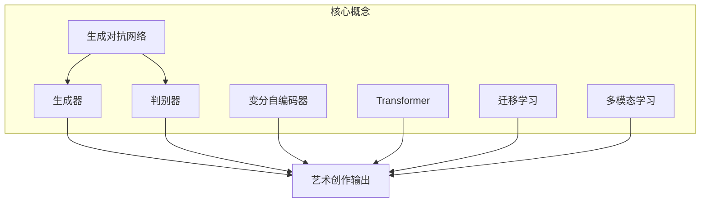

下面是以《一切皆是映射：AI在艺术创作上的新视角》为主题的技术博客文章正文内容：

# 一切皆是映射：AI在艺术创作上的新视角

## 1. 背景介绍

### 1.1 问题的由来

艺术创作一直被视为人类独有的高级认知活动,需要创造力、想象力和情感表达能力。然而,近年来人工智能(AI)技术的飞速发展,特别是深度学习和生成式AI模型的兴起,为艺术创作带来了新的可能性。AI不仅能够模仿人类艺术家的风格和技巧,还能够创造出前所未有的艺术作品。

传统的艺术创作过程往往依赖于艺术家的直觉和经验,而AI则能够从海量数据中学习,发现人类难以觉察的模式和规律。AI系统通过分析大量艺术作品,能够捕捉到艺术风格的本质特征,并将其应用于新的创作中。这种基于数据驱动的方式,为艺术创作带来了新的视角和思路。

### 1.2 研究现状  

AI在艺术创作领域的应用正在兴起,已经产生了一些令人瞩目的成果。例如,AI绘画系统能够根据文本描述生成逼真的图像,AI音乐生成系统能够创作出富有创意的音乐作品,AI文学系统能够书写富有想象力的小说和诗歌。

然而,AI艺术创作也面临着一些挑战和争议。一些人担心AI会取代人类艺术家,另一些人则质疑AI创作的作品是否真正具有艺术价值和创意。此外,AI艺术创作也涉及版权、伦理和隐私等法律和道德问题。

### 1.3 研究意义

探索AI在艺术创作中的应用,不仅能推动AI技术的发展,也能为人类艺术创作带来新的启发和思路。通过研究AI艺术创作的原理和方法,我们能够更好地理解人类创造力的本质,并将人工智能与人类智慧相结合,开辟艺术创作的新领域。

此外,AI艺术创作也有助于democratization艺术,使更多人能够参与和欣赏艺术。通过降低艺术创作的门槛,AI有望激发大众的创造热情,推动艺术在社会中的广泛传播。

### 1.4 本文结构

本文将从多个角度探讨AI在艺术创作中的应用。首先介绍AI艺术创作的核心概念和技术,包括生成对抗网络(GAN)、变分自编码器(VAE)和transformer等;然后分析AI艺术创作的核心算法原理和具体操作步骤;接着阐述AI艺术创作所涉及的数学模型和公式;再通过实际项目案例,展示AI艺术创作的代码实现和运行效果;最后探讨AI艺术创作在实际应用中的场景,以及未来的发展趋势和面临的挑战。

## 2. 核心概念与联系

AI艺术创作的核心思想是将艺术创作过程映射为一个数据驱动的生成任务。通过对大量艺术作品的学习,AI系统能够捕捉艺术风格的本质特征,并将其应用于新的创作中。这种映射过程涉及多种AI技术,包括:

1. **生成对抗网络(GAN)**:GAN由生成器和判别器两个神经网络组成。生成器从随机噪声中生成假的艺术作品,而判别器则判断生成的作品是真是假。两个网络相互对抗,最终使生成器能够生成逼真的艺术作品。

2. **变分自编码器(VAE)**: VAE是一种无监督学习模型,能够从数据中学习潜在的概率分布。在艺术创作中,VAE可以从艺术作品中学习风格的潜在表示,并根据这些表示生成新的作品。

3. **Transformer**:Transformer是一种基于注意力机制的序列到序列模型,在自然语言处理任务中表现出色。在AI艺术创作中,Transformer可用于生成文本描述,然后将其转换为图像、音乐或其他艺术形式。

4. **迁移学习**:由于艺术数据的稀缺性,AI艺术创作往往需要利用迁移学习技术,将在其他领域预训练的模型应用于艺术创作任务。

5. **多模态学习**:艺术作品通常包含多种模态,如图像、文本和音频。多模态学习技术能够捕捉不同模态之间的相关性,并将其应用于艺术创作。

这些核心概念相互关联,共同构建了AI艺术创作的技术基础。例如,GAN可以与VAE相结合,生成更加多样化和高质量的艺术作品;Transformer可以与多模态学习技术相结合,实现跨模态的艺术创作。

## 3. 核心算法原理 & 具体操作步骤

### 3.1 算法原理概述

AI艺术创作的核心算法主要基于生成式深度学习模型,如GAN、VAE和Transformer等。这些模型的基本思想是从训练数据中学习艺术风格的潜在表示,然后根据这些表示生成新的艺术作品。

以GAN为例,它由生成器和判别器两个网络组成。生成器的目标是从随机噪声中生成逼真的艺术作品,而判别器则判断生成的作品是真是假。两个网络相互对抗,生成器不断努力欺骗判别器,而判别器也在不断提高辨别能力。经过足够的训练,生成器最终能够生成与真实艺术作品无法区分的作品。

VAE的原理则是从训练数据中学习艺术风格的潜在分布,并从这个分布中采样生成新的作品。与GAN不同,VAE是一种无监督学习模型,不需要真实样本和生成样本的对比,但生成质量往往不如GAN。

Transformer则是一种基于注意力机制的序列到序列模型,常用于自然语言处理任务。在艺术创作中,Transformer可以将文本描述转换为图像、音乐或其他艺术形式。

### 3.2 算法步骤详解

以GAN为例,其训练过程可分为以下步骤:

1. **数据预处理**:收集并预处理大量的艺术作品数据,如图像、音频或文本等。

2. **构建生成器和判别器网络**:设计生成器和判别器的网络架构,通常采用卷积神经网络(CNN)或其变体。

3. **定义损失函数**:设计生成器和判别器的损失函数,以度量它们的性能。常用的损失函数包括最小二乘损失、交叉熵损失等。

4. **训练过程**:
    - 生成器从随机噪声中生成假的艺术作品
    - 判别器判断生成的作品是真是假
    - 根据判别器的判断,计算生成器和判别器的损失
    - 使用反向传播算法更新生成器和判别器的权重
    - 重复上述过程,直到模型收敛

5. **生成新作品**:训练完成后,生成器可用于生成新的艺术作品。

### 3.3 算法优缺点

**优点**:

- 能够生成逼真、富有创意的艺术作品
- 不需要人工设计特征,可自动从数据中学习艺术风格
- 可应用于多种艺术形式,如图像、音乐、文学等

**缺点**:

- 训练过程复杂,需要大量计算资源
- 生成质量受训练数据的限制,难以完全超越训练数据
- 存在模式崩溃和模式坍塌等训练不稳定问题
- 生成的作品可能缺乏深层次的意义和情感表达

### 3.4 算法应用领域

AI艺术创作算法可应用于多个领域,包括:

- **视觉艺术**:生成逼真的图像、绘画、插画等
- **音乐创作**:生成富有创意的音乐作品
- **文学创作**:创作小说、诗歌等文学作品
- **设计领域**:生成创新的产品设计、建筑设计等
- **娱乐业**:生成动画、电影特效等视觉效果
- **广告营销**:生成吸引眼球的广告创意

## 4. 数学模型和公式 & 详细讲解 & 举例说明

### 4.1 数学模型构建

AI艺术创作所涉及的数学模型主要基于深度生成模型,如GAN、VAE和Transformer等。这些模型的数学基础是概率论和信息论。

以GAN为例,其数学模型可表示为:

生成器 $G$ 试图学习数据 $x$ 的分布 $p_{data}(x)$,通过从先验噪声分布 $p_z(z)$ 中采样,并将其输入到生成器中,生成样本 $G(z)$。判别器 $D$ 则试图区分真实数据 $x$ 和生成数据 $G(z)$。

生成器和判别器的目标是找到一个纳什均衡,使得:

$$\min_G \max_D V(D,G) = \mathbb{E}_{x\sim p_{data}(x)}[\log D(x)] + \mathbb{E}_{z\sim p_z(z)}[\log(1-D(G(z)))]$$

其中 $V(D,G)$ 是判别器和生成器的值函数。在理想情况下,生成数据 $G(z)$ 的分布 $p_g$ 应该与真实数据分布 $p_{data}$ 完全一致。

### 4.2 公式推导过程

我们可以从最小化判别器和生成器的交叉熵损失出发,推导出GAN的目标函数:

对于判别器,其目标是最大化判别真实数据和生成数据的对数似然:

$$\max_D V(D) = \mathbb{E}_{x\sim p_{data}(x)}[\log D(x)] + \mathbb{E}_{z\sim p_z(z)}[\log(1-D(G(z)))]$$

对于生成器,其目标是最小化生成数据被判别为假的对数似然:

$$\min_G V(G) = \mathbb{E}_{z\sim p_z(z)}[\log(1-D(G(z)))]$$

将生成器的目标代入判别器的目标函数中,我们得到:

$$\min_G \max_D V(D,G) = \mathbb{E}_{x\sim p_{data}(x)}[\log D(x)] + \mathbb{E}_{z\sim p_z(z)}[\log(1-D(G(z)))]$$

这就是GAN的目标函数,也被称为最小-最大游戏。

### 4.3 案例分析与讲解

让我们通过一个实际案例来分析GAN在艺术创作中的应用。假设我们要生成一系列风格化的人物肖像画。

首先,我们需要收集大量的人物肖像画作为训练数据。然后,构建生成器和判别器网络,生成器的输入是随机噪声,输出是尺寸为 $256\times 256$ 的RGB图像;判别器的输入是真实或生成的图像,输出是一个标量,表示输入图像是真是假。

在训练过程中,生成器从随机噪声开始生成假的人物肖像画,判别器则判断生成的画作是真是假。根据判别器的判断,计算生成器和判别器的损失,并使用反向传播算法更新它们的权重。

经过足够的训练后,生成器能够生成逼真的人物肖像画,其风格与训练数据保持一致。我们可以通过改变输入的随机噪声,生成具有相似风格但不同细节的新画作。

下图展示了一个GAN生成的人物肖像画示例:

从图中可