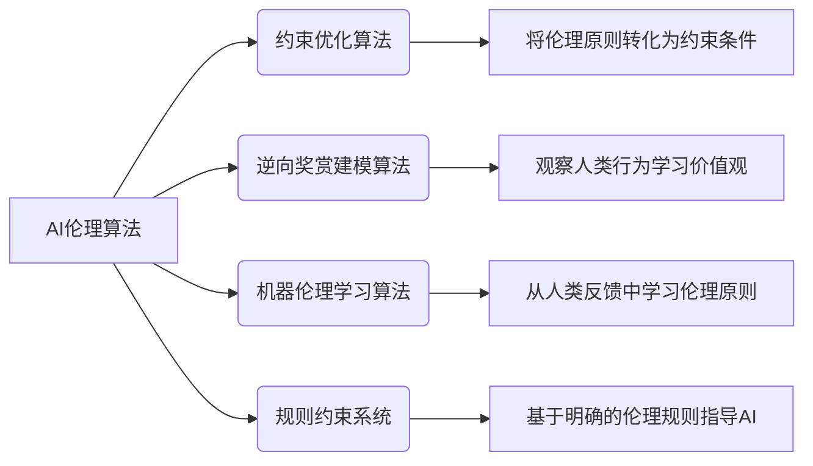

# 一切皆是映射：AI的伦理问题与未来挑战

## 1. 背景介绍

### 1.1 问题的由来

人工智能(AI)的发展已经渗透到我们生活的方方面面,从语音助手到自动驾驶汽车,从医疗诊断到金融交易,AI无处不在。然而,随着AI技术的不断进步,一些重大的伦理问题也随之而来,引发了广泛的关注和讨论。

AI系统的决策过程往往是一个"黑箱",缺乏透明度和可解释性,这可能会导致偏见、歧视和不公平的结果。此外,AI系统在处理敏感数据时可能会侵犯个人隐私,而AI在军事领域的应用也引发了人们对"终结者"式机器人的担忧。

### 1.2 研究现状

近年来,AI伦理问题已经成为学术界和业界广泛关注的热点话题。许多知名科技公司都成立了AI伦理委员会,制定了AI伦理准则,并投入大量资源进行相关研究。同时,政府机构和国际组织也在制定AI伦理法规和标准,以确保AI的发展符合伦理道德。

然而,由于AI技术的快速发展和复杂性,现有的AI伦理研究往往难以跟上,存在一定的滞后性。此外,不同国家和地区对AI伦理问题的看法也存在一定差异,导致缺乏统一的国际标准和规范。

### 1.3 研究意义

AI伦理问题关乎人类的基本权利和价值观,是一个不容忽视的重要课题。只有解决了AI伦理问题,AI技术才能真正为人类社会带来福祉,而不是威胁和危害。因此,深入研究AI伦理问题,制定合理的伦理规范和标准,对于确保AI的可持续发展、维护社会公平正义、保护人类利益至关重要。

### 1.4 本文结构

本文将从多个角度深入探讨AI伦理问题及其未来挑战。首先介绍AI伦理的核心概念和原则,阐述AI伦理与其他领域的联系。接下来,详细分析AI伦理的核心算法原理和数学模型,并通过实际案例进行说明。然后,探讨AI伦理在不同应用场景中的实践,介绍相关工具和资源。最后,总结AI伦理的未来发展趋势和面临的挑战,并对常见问题进行解答。

## 2. 核心概念与联系

AI伦理是一个跨学科的领域,涉及计算机科学、哲学、法律、社会学等多个领域。它的核心概念包括:

1. **透明度和可解释性**: AI系统应该具有透明度,其决策过程和结果应该是可解释和可理解的,以确保公平性和问责制。

2. **隐私和数据保护**: AI系统在处理个人数据时应该尊重隐私权,采取适当的保护措施,避免数据滥用和泄露。

3. **公平性和反偏见**: AI系统应该避免任何形式的歧视和偏见,确保其决策过程和结果是公平和包容的。

4. **安全性和可控性**: AI系统应该是安全和可控的,不会对人类构成威胁,并且应该遵循人类的指令和监管。

5. **人类价值观**: AI系统应该符合人类的价值观和伦理道德,不会违背人类的基本权利和尊严。

6. **责任归属**: AI系统的决策和行为应该有明确的责任主体,以确保问责制度的有效实施。

AI伦理与其他领域密切相关,例如:

- **计算机科学**: AI算法的设计和实现直接影响其伦理性,需要在算法层面嵌入伦理原则。

- **哲学**: AI伦理需要借鉴哲学中的伦理理论和价值观,如功利主义、德性伦理学等。

- **法律**: AI伦理需要与现有法律法规相协调,并为AI技术的发展提供法律保障。

- **社会学**: AI伦理需要考虑社会文化因素,了解不同群体对AI的期望和担忧。

- **心理学**: AI伦理需要研究人机交互的心理影响,确保AI系统不会对人类心理健康造成负面影响。

总的来说,AI伦理是一个复杂的跨学科领域,需要各个领域的专家通力合作,共同推进AI伦理的研究和实践。

## 3. 核心算法原理 & 具体操作步骤

### 3.1 算法原理概述

AI伦理算法的核心原理是通过机器学习和优化技术,将伦理原则和价值观嵌入到AI系统的决策过程中。这种方法被称为"价值对齐"(value alignment),旨在确保AI系统的行为符合人类的价值观和伦理标准。

常见的AI伦理算法包括:

1. **约束优化算法**: 将伦理原则转化为优化问题的约束条件,在满足这些约束的前提下,优化AI系统的决策。

2. **逆向奖赏建模算法**: 通过观察人类的行为和决策,学习人类的价值观和偏好,并将其应用到AI系统中。

3. **机器伦理学习算法**: 利用监督学习或强化学习等技术,直接从人类的反馈和评价中学习伦理原则和价值观。

4. **规则约束系统**: 基于明确的伦理规则和原则,构建决策树或知识库,指导AI系统的行为。

这些算法通常需要结合其他技术,如知识表示、自然语言处理、决策理论等,才能够有效地应用于实际的AI系统中。



### 3.2 算法步骤详解

以约束优化算法为例,其具体步骤如下:

1. **确定优化目标**: 首先需要明确AI系统的优化目标,例如最大化效用、最小化成本等。

2. **定义伦理约束**: 根据特定的伦理原则和标准,确定一系列约束条件,例如隐私保护、公平性、安全性等。

3. **构建优化模型**: 将优化目标和伦理约束转化为数学模型,例如线性规划、非线性规划等。

4. **求解优化问题**: 使用适当的优化算法(如梯度下降、遗传算法等)求解优化问题,得到满足伦理约束的最优解。

5. **实施决策**: 将优化结果应用到AI系统中,指导其行为和决策。

6. **监测和评估**: 持续监测AI系统的行为,评估其是否符合伦理标准,并根据需要调整优化模型和约束条件。

以上步骤可以通过以下伪代码进一步说明:

```python
# 定义优化目标和伦理约束
objective = ... # 例如最大化效用
ethical_constraints = [...] # 例如隐私保护、公平性等

# 构建优化模型
model = build_optimization_model(objective, ethical_constraints)

# 求解优化问题
solution = solve_optimization_model(model)

# 实施决策
implement_decision(solution)

# 监测和评估
while True:
    monitor_behavior()
    evaluate_ethics()
    update_model_if_needed()
```

### 3.3 算法优缺点

AI伦理算法具有以下优点:

- 能够将抽象的伦理原则转化为具体的数学模型和约束条件,使其可操作化。
- 通过优化和学习技术,可以自动发现满足伦理约束的最优解决方案。
- 具有一定的灵活性和可扩展性,可以根据需要调整优化目标和约束条件。

但同时也存在一些缺点和挑战:

- 伦理原则的形式化和量化存在一定困难,可能会导致信息丢失或扭曲。
- 算法的性能和准确性受限于训练数据和模型的质量,可能存在偏差和不确定性。
- 算法的透明度和可解释性有待提高,决策过程可能难以理解和解释。
- 算法的设计和实现需要多学科的专业知识,存在一定的复杂性和挑战。

### 3.4 算法应用领域

AI伦理算法可以应用于各种AI系统,包括但不限于:

- **自动决策系统**: 如贷款审批、招聘筛选、司法判决等,需要确保公平性和反偏见。
- **智能辅助系统**: 如医疗诊断、教育辅导等,需要保护隐私和尊重人类价值观。
- **机器人和自动化系统**: 如服务机器人、无人驾驶汽车等,需要确保安全性和可控性。
- **社交媒体和内容推荐**: 如新闻推送、广告投放等,需要避免虚假信息和有害内容。
- **监控和安防系统**: 如人脸识别、视频监控等,需要平衡隐私权和安全需求。

总的来说,只要是涉及AI系统对人类产生重大影响的领域,都需要应用AI伦理算法,以确保AI的发展符合人类的价值观和伦理标准。

## 4. 数学模型和公式 & 详细讲解 & 举例说明

### 4.1 数学模型构建

AI伦理算法通常需要将抽象的伦理原则转化为数学模型和公式,以便进行计算和优化。常见的数学模型包括:

1. **线性规划模型**: 将伦理约束表示为线性不等式,优化目标为线性函数。

$$
\begin{aligned}
\max \ & c^Tx \\
\text{s.t.} \ & Ax \leq b \\
& x \geq 0
\end{aligned}
$$

其中 $c$ 为目标函数系数向量, $A$ 为约束矩阵, $b$ 为约束右端项向量, $x$ 为决策变量向量。

2. **非线性规划模型**: 当伦理约束或优化目标为非线性函数时,需要使用非线性规划模型。

$$
\begin{aligned}
\min \ & f(x) \\
\text{s.t.} \ & g_i(x) \leq 0, \ i = 1, \ldots, m \\
& h_j(x) = 0, \ j = 1, \ldots, p
\end{aligned}
$$

其中 $f(x)$ 为目标函数, $g_i(x)$ 为不等式约束函数, $h_j(x)$ 为等式约束函数。

3. **多目标优化模型**: 当需要同时优化多个相互矛盾的目标时,可以使用多目标优化模型。

$$
\begin{aligned}
\min \ & F(x) = (f_1(x), f_2(x), \ldots, f_k(x)) \\
\text{s.t.} \ & g_i(x) \leq 0, \ i = 1, \ldots, m \\
& h_j(x) = 0, \ j = 1, \ldots, p
\end{aligned}
$$

其中 $F(x)$ 为多目标函数向量, $f_i(x)$ 为第 $i$ 个目标函数。

4. **机器学习模型**: 当伦理原则难以直接形式化时,可以使用机器学习模型从数据中学习隐含的伦理模式。

$$
y = f(x; \theta)
$$

其中 $x$ 为输入特征向量, $y$ 为预测输出, $f$ 为机器学习模型(如神经网络), $\theta$ 为模型参数。

这些数学模型为AI伦理算法提供了理论基础,同时也面临一些挑战,如模型复杂性、数据质量、计算效率等,需要进一步研究和改进。

### 4.2 公式推导过程

以线性规划模型为例,我们可以推导出一个简单的AI伦理优化问题的数学表达式。

假设我们需要设计一个贷款审批系统,优化目标是最大化贷款发放总额,同时需要满足以下伦理约束:

1. 确保不同种族群体获得贷款的机会是公平的。
2. 保护申请人的隐私,不能过度使用敏感个人信息。

我们定义决策变量 $x_i$ 为是否批准第