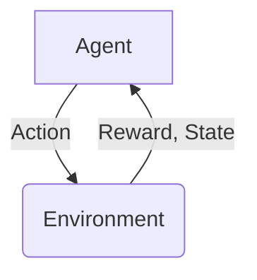

# 一切皆是映射：DQN在智能家居系统中的应用：挑战与机遇

## 1. 背景介绍

### 1.1 问题的由来

在当今快节奏的生活中，人们越来越渴望拥有一个智能、高效且舒适的家居环境。智能家居系统的出现正是为了满足这一需求。然而,传统的规则based系统在处理复杂、动态的家居环境时存在诸多局限性。因此,我们需要一种更加智能、灵活的方法来管理家居系统,使其能够自主学习并作出最佳决策。

### 1.2 研究现状  

近年来,强化学习(Reinforcement Learning)作为一种全新的机器学习范式,在智能决策领域取得了长足的进展。其中,深度Q网络(Deep Q-Network, DQN)作为强化学习的一种重要算法,展现出了卓越的性能。DQN能够直接从原始输入数据(如图像、传感器数据等)中学习出一个有效的价值函数,并据此作出最优决策。

### 1.3 研究意义

将DQN应用于智能家居系统,可以极大提高系统的智能化水平。DQN能够根据家居环境的实时变化,自主学习出最优的控制策略,从而实现对家居设备的精细化管理和个性化服务。此外,DQN的应用还可以降低家居系统的开发和维护成本,提高其可扩展性和鲁棒性。

### 1.4 本文结构

本文首先介绍DQN的核心概念和算法原理,然后分析DQN在智能家居系统中的应用场景及挑战,并给出具体的实现方案和代码示例。最后,探讨DQN在智能家居领域的发展趋势和未来展望。

## 2. 核心概念与联系

强化学习(Reinforcement Learning)是一种全新的机器学习范式,其核心思想是通过与环境的互动,学习出一种最优的决策策略。在强化学习中,智能体(Agent)与环境(Environment)之间存在着一个闭环的交互过程,如下图所示:

智能体根据当前的环境状态(State)作出一个行为(Action),环境则根据这个行为给出一个奖惩反馈(Reward),并转移到下一个状态。智能体的目标是通过不断尝试和学习,找到一个能够最大化预期累积奖励的最优策略(Optimal Policy)。

在传统的强化学习算法中,我们需要手动设计状态特征,并基于这些特征构建价值函数或策略函数。但是对于复杂的问题(如图像、视频等高维输入),手工设计特征就变得十分困难。深度Q网络(Deep Q-Network, DQN)的出现很好地解决了这一问题。

DQN将深度神经网络与Q-Learning相结合,能够直接从原始的高维输入数据中自动学习出一个有效的价值函数Q(s,a),即在当前状态s下执行动作a的预期累积奖励。通过不断与环境交互,DQN会逐步优化这个Q网络,使其输出的Q值逼近真实的Q值,最终收敛到一个近似最优的策略。

## 3. 核心算法原理 & 具体操作步骤  

### 3.1 算法原理概述

DQN算法的核心思想是使用一个深度神经网络来拟合Q函数,即 $Q(s, a; \theta) \approx Q^*(s, a)$, 其中$\theta$为网络参数。我们将当前状态s作为网络的输入,网络会输出该状态下所有可能动作a的Q值Q(s,a)。然后,我们选择Q值最大的那个动作作为此时的最优动作。

为了训练这个Q网络,我们采用的是Q-Learning算法,其核心是通过不断与环境交互,使用时序差分(Temporal Difference)方法来更新Q值。具体来说,每一步我们执行动作a,观测到环境转移到新状态s',获得即时奖励r,则可以计算出更新目标:

$$
y = r + \gamma \max_{a'} Q(s', a'; \theta^-)
$$

其中,$\gamma$是折扣因子,用于平衡即时奖励和长期回报;$\theta^-$是一个目标网络的参数,用于提高训练的稳定性。我们希望通过最小化损失函数:

$$
L(\theta) = \mathbb{E}_{(s, a, r, s')\sim p(\cdot)}\left[(y - Q(s, a; \theta))^2\right]
$$

来更新Q网络的参数$\theta$,使其输出的Q值逐渐逼近真实的Q值。

### 3.2 算法步骤详解

1. **初始化**
    - 初始化一个评估网络(Q网络)$Q(s, a; \theta)$和一个目标网络$Q(s, a; \theta^-)$,两个网络的参数初始相同
    - 初始化经验回放池(Experience Replay Buffer)D
    - 初始化环境env

2. **执行循环**
    - 从环境中获取初始状态s
    - 重复以下步骤直到终止:
        - 使用$\epsilon$-贪婪策略从Q网络中选择动作a: $a = \mathrm{argmax}_a Q(s, a; \theta)$
        - 执行动作a,观测到新状态s'和即时奖励r
        - 将$(s, a, r, s')$存入经验回放池D
        - 从D中随机采样一个批次的转移$(s_j, a_j, r_j, s'_j)$
        - 计算更新目标: $y_j = r_j + \gamma \max_{a'} Q(s'_j, a'; \theta^-)$
        - 计算损失: $L(\theta) = \sum_j (y_j - Q(s_j, a_j; \theta))^2$
        - 使用梯度下降优化Q网络参数$\theta$
        - 每隔一定步骤,将Q网络的参数复制给目标网络: $\theta^- \leftarrow \theta$
        - 更新状态: $s \leftarrow s'$

### 3.3 算法优缺点

**优点:**

1. 可直接从高维原始输入(如图像、传感器数据等)中学习,无需手工设计特征
2. 通过经验回放池和目标网络,提高了训练的稳定性和收敛性
3. 可以处理连续和离散的状态空间和动作空间
4. 算法通用性强,可应用于多种决策和控制问题

**缺点:**

1. 训练过程需要大量的经验数据,对样本复杂度要求较高
2. 收敛速度较慢,需要大量的训练迭代
3. 超参数(如学习率、折扣因子等)的选择对算法性能影响较大
4. 在连续动作空间下,需要一些改进算法(如Deep Deterministic Policy Gradient)

### 3.4 算法应用领域

DQN算法已被广泛应用于多个领域,包括但不限于:

- 游戏AI: Atari游戏、AlphaGo、星际争霸等
- 机器人控制: 机械臂控制、无人机导航等
- 资源管理: 数据中心资源调度、网络流量控制等
- 自动驾驶: 车辆决策、路径规划等
- 智能家居: 设备控制、能源管理等

## 4. 数学模型和公式 & 详细讲解 & 举例说明

### 4.1 数学模型构建

在强化学习中,我们将智能体与环境的交互过程建模为一个马尔可夫决策过程(Markov Decision Process, MDP)。一个MDP可以用一个五元组$(S, A, P, R, \gamma)$来表示:

- $S$是状态空间的集合
- $A$是动作空间的集合  
- $P(s'|s, a)$是状态转移概率,表示在状态s执行动作a后,转移到状态s'的概率
- $R(s, a)$是奖励函数,表示在状态s执行动作a后获得的即时奖励
- $\gamma \in [0, 1)$是折扣因子,用于平衡即时奖励和长期回报

在MDP中,我们的目标是找到一个策略$\pi: S \rightarrow A$,使得在该策略下的预期累积奖励最大化:

$$
\max_\pi \mathbb{E}_\pi \left[ \sum_{t=0}^\infty \gamma^t R(s_t, a_t) \right]
$$

其中,$s_t$和$a_t$分别表示第t个时刻的状态和动作。

为了解决这一最优控制问题,我们引入了Q函数(Action-Value Function)的概念,它定义为在状态s执行动作a后,按照策略$\pi$所能获得的预期累积奖励:

$$
Q^\pi(s, a) = \mathbb{E}_\pi \left[ \sum_{t=0}^\infty \gamma^t R(s_t, a_t) | s_0 = s, a_0 = a \right]
$$

我们的目标就是找到一个最优的Q函数$Q^*(s, a)$,使得对任意的$(s, a)$,我们都有:

$$
Q^*(s, a) = \max_\pi Q^\pi(s, a)
$$

一旦获得了最优的Q函数,我们就可以根据它来选择最优的动作:

$$
\pi^*(s) = \mathrm{argmax}_a Q^*(s, a)
$$

这就是DQN算法的核心思想:使用一个深度神经网络来拟合最优的Q函数$Q^*(s, a)$。

### 4.2 公式推导过程  

我们首先从Bellman方程出发,对Q函数进行推导:

$$
\begin{aligned}
Q^\pi(s, a) 
&= \mathbb{E}_\pi \left[ R(s, a) + \gamma \sum_{s'} P(s'|s, a) \sum_{a'} \pi(a'|s') Q^\pi(s', a') \right] \\
&= \mathbb{E}_\pi \left[ R(s, a) + \gamma \sum_{s'} P(s'|s, a) \max_{a'} Q^\pi(s', a') \right]
\end{aligned}
$$

其中,第二步是由于我们希望找到一个最优的Q函数,因此对后续动作a'取最大值。

接下来,我们定义Bellman最优方程:

$$
Q^*(s, a) = \mathbb{E} \left[ R(s, a) + \gamma \max_{a'} Q^*(s', a') \right]
$$

我们的目标就是找到一个Q函数,使其满足上式,即:

$$
Q(s, a; \theta) \approx Q^*(s, a)
$$

为此,我们定义损失函数:

$$
L(\theta) = \mathbb{E}_{(s, a, r, s')\sim p(\cdot)}\left[(y - Q(s, a; \theta))^2\right]
$$

其中,更新目标y定义为:

$$
y = r + \gamma \max_{a'} Q(s', a'; \theta^-)
$$

通过最小化这个损失函数,我们就可以使Q网络的输出Q值逐渐逼近真实的Q值。

### 4.3 案例分析与讲解

现在,我们来看一个具体的例子,说明DQN在智能家居系统中的应用。假设我们有一个简单的家居环境,包括一个客厅、一个卧室和一个厨房。每个房间都安装有一个温度传感器和一个空调设备。我们的目标是设计一个智能控制系统,根据每个房间的实时温度,自动调节空调的开关状态,从而实现节能且舒适的室内环境。

我们将这个问题建模为一个MDP:

- 状态s是一个三维向量,分别表示客厅、卧室和厨房的当前温度
- 动作a是一个三维向量,分别表示每个房间空调的开关状态(0或1)
- 状态转移概率P(s'|s,a)可以通过物理模型或历史数据估计得到
- 奖励函数R(s,a)可以设计为温度与理想温度之差的负值,加上空调运行的能耗惩罚

我们使用一个三层的全连接神经网络作为DQN的Q网络,其输入是当前状态s,输出是所有可能动作a的Q值Q(s,a)。在训练过程中,我们让智能体与环境进行大量的交互,并使用Q-Learning算法不断更新Q网络的参数,使其逐渐学习到一个近似最优的Q函数。

训练完成后,在实际运行时,我们只需将当前的温度状态输入到Q网络,选择Q值最大的那个动作,即可获得最优的空调控制策略。

通过这个例子,我们可以看