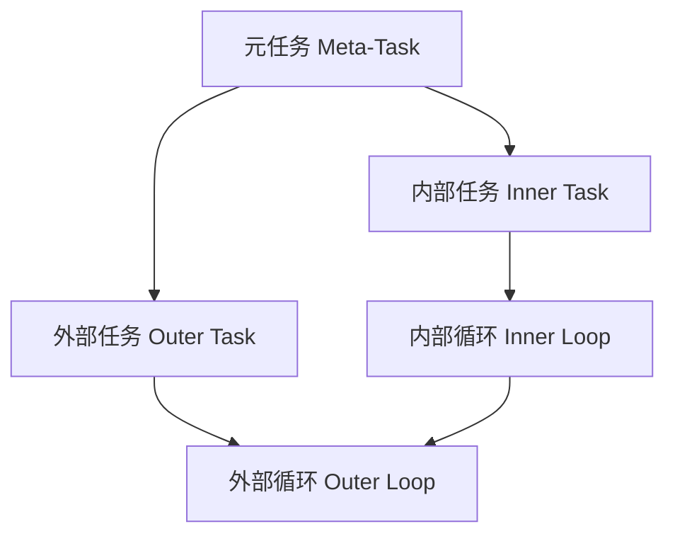
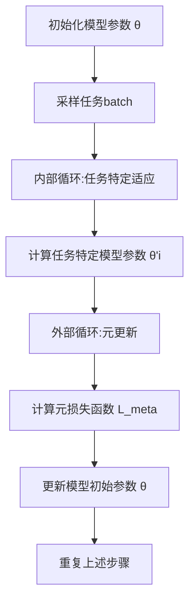

以下是《一切皆是映射：MAML算法原理与应用》这篇技术博客文章的正文内容：

# 一切皆是映射：MAML算法原理与应用

## 1. 背景介绍

### 1.1 问题的由来

在机器学习领域中，我们常常面临一个挑战：如何快速适应新的任务和环境,而不需要从头开始训练模型。传统的机器学习方法通常需要大量的数据和计算资源来训练一个新模型,这对于实际应用场景来说是低效和不实际的。因此,如何在有限的数据和计算资源下快速获取新知识并将其应用于新任务,成为了一个亟待解决的问题。

### 1.2 研究现状  

为了解决这一问题,元学习(Meta-Learning)作为一种新兴的机器学习范式应运而生。元学习的核心思想是:通过学习不同任务之间的共性知识,从而快速适应新的任务。具体来说,元学习算法首先在一系列不同但相关的任务上进行训练,以获取一些通用的知识表示。然后,当遇到一个新的任务时,算法只需要利用少量的新数据进行微调,即可快速适应新任务。

目前,已经提出了多种元学习算法,如MAML、Reptile、ANIL等。其中,MAML(Model-Agnostic Meta-Learning)算法是最具代表性和影响力的一种,它提出了一种基于梯度下降的元学习范式,可以有效地从多任务中提取出通用知识,并将其应用于新任务的快速适应。

### 1.3 研究意义

MAML算法的提出为解决快速适应新任务这一挑战提供了一种有效的解决方案。它不仅在理论上拓展了机器学习的研究范畴,也为实际应用场景带来了巨大的价值。例如,在医疗领域,MAML可以帮助快速构建针对新疾病的诊断模型;在自然语言处理领域,MAML可以用于快速适应新领域的语料;在计算机视觉领域,MAML可以用于快速构建新类别的目标检测模型。总的来说,MAML算法为实现人工智能系统的快速适应性和通用性提供了一种有力的工具。

### 1.4 本文结构

本文将全面介绍MAML算法的原理、实现细节以及在不同领域的应用。具体来说,第2部分将介绍MAML算法的核心概念和基本思路;第3部分将详细阐述MAML算法的原理和具体操作步骤;第4部分将推导MAML算法的数学模型,并通过案例分析加深理解;第5部分将提供MAML算法的代码实现示例并进行详细解释;第6部分将介绍MAML算法在不同领域的实际应用场景;第7部分将推荐一些有用的工具和学习资源;最后,第8部分将总结MAML算法的研究成果,展望其未来发展趋势和面临的挑战。

## 2. 核心概念与联系

在介绍MAML算法之前,我们先来了解一些核心概念和它们之间的联系。

**任务(Task)**:在元学习中,任务指的是一个特定的机器学习问题,例如图像分类、语音识别等。每个任务都有自己的数据集、模型和损失函数。

**元任务(Meta-Task)**:元任务是指一系列相关但不同的任务的集合。元学习算法的目标是从这些任务中学习一种通用的知识表示,以便快速适应新的任务。

**内部任务(Inner Task)**:在元学习的训练过程中,每一个batch都包含一些内部任务。这些内部任务用于模拟新任务的情况,以更新模型的参数,从而获取通用知识表示。

**外部任务(Outer Task)**:外部任务是指整个元学习过程。它的目标是优化模型参数,使得在遇到新的内部任务时,只需要少量的数据和计算资源,就可以快速适应该任务。

**内部循环(Inner Loop)**:内部循环是指在每个batch中,对于每个内部任务,使用其数据对模型进行一定步数的梯度更新,以模拟在新任务上进行少量数据微调的过程。

**外部循环(Outer Loop)**:外部循环是指在整个训练过程中,通过对内部循环的结果进行反向传播,来优化模型的初始参数,使其能够快速适应新的内部任务。

这些概念之间的关系如下所示:

简而言之,MAML算法的核心思想就是通过在一系列内部任务上进行少量数据微调(内部循环),并对这个过程进行优化(外部循环),从而获取一种通用的知识表示,使模型能够快速适应新的任务。

## 3. 核心算法原理 & 具体操作步骤

### 3.1 算法原理概述

MAML算法的核心思想是:通过在一系列相关但不同的任务上进行训练,获取一种通用的知识表示,使得在遇到新的任务时,只需要少量的数据和计算资源,就可以快速适应该任务。

具体来说,MAML算法的训练过程包括两个循环:内部循环和外部循环。

在内部循环中,对于每个batch中的每个任务,MAML算法使用该任务的支持集(Support Set)对模型进行少量步数的梯度更新,以模拟在新任务上进行少量数据微调的过程。这个过程可以看作是在"学习如何快速学习"。

在外部循环中,MAML算法通过计算在查询集(Query Set)上的损失,并对该损失进行反向传播,来优化模型的初始参数。这个过程可以看作是在"学习一种好的初始化",使得模型能够在内部循环中快速适应新任务。

通过不断地重复这两个循环,MAML算法可以逐步获取一种通用的知识表示,使得模型在遇到新的任务时,只需要少量的数据和计算资源,就可以快速适应该任务。

### 3.2 算法步骤详解

下面我们详细介绍MAML算法的具体操作步骤。

1. **初始化模型参数**

   首先,我们需要初始化一个模型$f_{\theta}$,其中$\theta$表示模型的参数。

2. **采样任务batch**

   从元任务的任务分布$p(\mathcal{T})$中采样一个batch的任务$\mathcal{T}_i$,其中$i=1,2,...,N$,N是batch中任务的数量。每个任务$\mathcal{T}_i$包含一个支持集$\mathcal{D}_i^{tr}$和一个查询集$\mathcal{D}_i^{val}$。

3. **内部循环:任务特定适应**

   对于每个任务$\mathcal{T}_i$,使用其支持集$\mathcal{D}_i^{tr}$对模型进行$K$步梯度更新,以获取任务特定的模型参数$\theta_i^{'}$。具体步骤如下:

   (a) 计算支持集$\mathcal{D}_i^{tr}$上的损失:
       $$\mathcal{L}_{\mathcal{T}_i}^{tr}(\theta) = \frac{1}{|\mathcal{D}_i^{tr}|} \sum_{(x,y) \in \mathcal{D}_i^{tr}} \ell(f_{\theta}(x),y)$$

   (b) 计算梯度:
       $$g_i = \nabla_{\theta} \mathcal{L}_{\mathcal{T}_i}^{tr}(\theta)$$

   (c) 更新模型参数:
       $$\theta_i^{'} = \theta - \alpha \cdot g_i$$

   (d) 重复步骤(a)-(c)共$K$次,得到最终的任务特定模型参数$\theta_i^{'}$。

4. **外部循环:元更新**

   使用所有任务的查询集$\mathcal{D}_i^{val}$计算元损失函数,并对模型的初始参数$\theta$进行梯度更新,以最小化该损失函数。具体步骤如下:

   (a) 计算查询集$\mathcal{D}_i^{val}$上的损失:
       $$\mathcal{L}_{\mathcal{T}_i}^{val}(\theta_i^{'}) = \frac{1}{|\mathcal{D}_i^{val}|} \sum_{(x,y) \in \mathcal{D}_i^{val}} \ell(f_{\theta_i^{'}}(x),y)$$

   (b) 计算元损失函数:
       $$\mathcal{L}_{\text{meta}}(\theta) = \sum_{i=1}^{N} \mathcal{L}_{\mathcal{T}_i}^{val}(\theta_i^{'})$$

   (c) 计算元梯度:
       $$g_{\text{meta}} = \nabla_{\theta} \mathcal{L}_{\text{meta}}(\theta)$$

   (d) 更新模型初始参数:
       $$\theta \leftarrow \theta - \beta \cdot g_{\text{meta}}$$

5. **重复步骤2-4**,直到模型收敛。

通过上述步骤,MAML算法可以获取一种通用的知识表示,使得模型在遇到新的任务时,只需要少量的数据和计算资源,就可以快速适应该任务。

算法流程图如下所示:

### 3.3 算法优缺点

**优点:**

1. **快速适应性**:MAML算法可以在少量数据和计算资源下快速适应新的任务,这对于实际应用场景非常有价值。

2. **通用性**:MAML算法可以从多个相关但不同的任务中学习通用的知识表示,使得模型具有很强的泛化能力。

3. **模型无关性**:MAML算法是一种元学习范式,可以应用于不同的模型架构和任务类型。

4. **简单高效**:MAML算法的原理简单,只需要在标准的梯度下降优化过程中引入一个内部循环,计算开销相对较小。

**缺点:**

1. **任务相关性**:MAML算法假设训练任务和测试任务之间存在一定的相关性,否则学习到的通用知识可能无法很好地迁移。

2. **支持集和查询集划分**:MAML算法需要为每个任务划分支持集和查询集,这可能会引入一些人为偏差。

3. **超参数选择**:MAML算法涉及多个超参数,如内部循环步数、学习率等,需要进行大量的实验调优。

4. **计算开销**:尽管MAML算法相对高效,但在大规模任务和大型模型的情况下,其计算开销仍然可能较高。

### 3.4 算法应用领域

由于MAML算法具有快速适应性和通用性,它可以应用于多个领域,包括但不限于:

- **计算机视觉**:快速构建新类别的目标检测、图像分类等模型。
- **自然语言处理**:快速适应新领域的语料,如生物医学、法律等。
- **强化学习**:快速学习新的环境和任务,提高策略的泛化能力。
- **机器人控制**:快速适应新的机器人硬件和环境,提高控制策略的鲁棒性。
- **医疗健康**:快速构建新疾病的诊断模型,提高医疗决策的准确性。
- **金融**:快速适应新的金融数据和任务,提高投资决策的效率。

总的来说,MAML算法为实现人工智能系统的快速适应性和通用性提供了一种有力的工具,它的应用前景十分广阔。

## 4. 数学模型和公式 & 详细讲解 & 举例说明

在上一部分,我们介绍了MAML算法的核心思想和操作步骤。现在,我们将推导MAML算法的数学模型,并通过案例分析加深对算法的理解。

### 4.1 数学模型构建