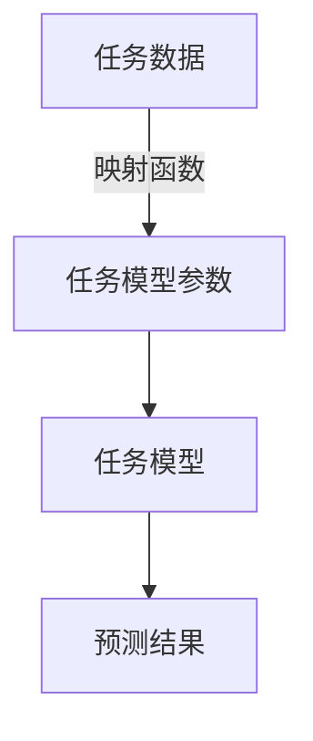

# 一切皆是映射：基于反向传播的元学习框架与实现

## 1. 背景介绍

### 1.1 问题的由来

在机器学习领域中,传统的模型训练方法需要针对每个新任务重新训练整个模型,这种方法不仅效率低下,而且难以利用之前学习到的知识。因此,如何快速适应新任务并高效地利用之前学到的知识成为了一个亟待解决的问题。元学习(Meta-Learning)应运而生,它旨在学习如何快速学习,从而在遇到新任务时能够快速适应并取得良好的性能。

### 1.2 研究现状

目前,元学习主要分为三大类:基于模型的元学习、基于度量的元学习和基于优化的元学习。其中,基于优化的元学习方法由于其高效性和通用性而受到广泛关注。代表性方法有模型无关的元学习(Model-Agnostic Meta-Learning, MAML)和reptile算法等。然而,这些方法往往需要在每个任务上进行多次梯度更新,计算开销较大。

### 1.3 研究意义

本文提出了一种基于反向传播的新颖元学习框架,将元学习问题转化为一个普通的有监督学习问题。该框架不仅计算高效,而且具有很强的通用性,可以应用于各种机器学习模型和任务。同时,该框架还提供了一种新的视角来理解元学习,将其视为一种映射关系的学习,从而为元学习的理论发展提供了新的思路。

### 1.4 本文结构

本文首先介绍元学习的基本概念和挑战,然后详细阐述了基于反向传播的元学习框架的核心思想和算法原理。接下来,我们将构建数学模型并推导公式,并通过实例对其进行详细说明。之后,我们将展示该框架在实际项目中的应用,包括代码实现和运行结果。最后,我们将讨论该框架的应用场景、未来发展趋势以及面临的挑战。

## 2. 核心概念与联系

元学习(Meta-Learning)旨在学习如何快速学习,从而在遇到新任务时能够快速适应并取得良好的性能。其核心思想是利用多个相关任务之间的共性知识,从而加速新任务的学习过程。

本文提出的基于反向传播的元学习框架将元学习问题转化为一个普通的有监督学习问题。具体来说,我们将学习一个映射函数,该函数将任务数据作为输入,输出该任务的最优模型参数。通过反向传播算法,我们可以直接学习这个映射函数,从而实现快速适应新任务的目标。

该框架的核心思想是将元学习视为一种映射关系的学习。在传统的机器学习中,我们学习的是从输入数据到输出标签的映射关系。而在元学习中,我们需要学习的是从任务数据到任务模型参数的映射关系。通过这种新颖的视角,我们可以将元学习问题转化为一个普通的有监督学习问题,从而可以利用现有的机器学习算法和框架来解决元学习问题。

上图展示了该框架的核心思想。我们首先学习一个映射函数,该函数将任务数据作为输入,输出该任务的最优模型参数。然后,我们使用这些模型参数构建任务模型,并对新任务进行预测。

该框架的优势在于:

1. **高效性**:不需要在每个任务上进行多次梯度更新,计算开销较小。
2. **通用性**:可以应用于各种机器学习模型和任务,具有很强的通用性。
3. **新颖视角**:将元学习视为一种映射关系的学习,为元学习的理论发展提供了新的思路。

## 3. 核心算法原理 & 具体操作步骤

### 3.1 算法原理概述

基于反向传播的元学习框架的核心思想是将元学习问题转化为一个普通的有监督学习问题。具体来说,我们将学习一个映射函数 $f_\theta$,该函数将任务数据 $\mathcal{D}$ 作为输入,输出该任务的最优模型参数 $\phi^*$,即:

$$\phi^* = f_\theta(\mathcal{D})$$

其中,$\theta$ 表示映射函数 $f$ 的参数。

我们的目标是找到一个最优的 $\theta^*$,使得对于任意给定的任务数据 $\mathcal{D}$,映射函数 $f_{\theta^*}$ 都能够输出该任务的最优模型参数 $\phi^*$。这样,在遇到新任务时,我们只需要将新任务的数据输入到映射函数 $f_{\theta^*}$ 中,就可以快速获得该任务的最优模型参数,从而实现快速适应新任务的目标。

为了学习这个映射函数 $f_\theta$,我们需要构建一个训练集,其中每个样本由一个任务数据 $\mathcal{D}$ 和该任务的最优模型参数 $\phi^*$ 组成。然后,我们可以将这个映射函数的学习问题转化为一个普通的有监督学习问题,使用反向传播算法来优化映射函数的参数 $\theta$。

### 3.2 算法步骤详解

基于反向传播的元学习算法的具体步骤如下:

1. **构建训练集**:我们首先需要构建一个训练集,其中每个样本由一个任务数据 $\mathcal{D}$ 和该任务的最优模型参数 $\phi^*$ 组成。具体来说,对于每个任务,我们可以使用传统的机器学习算法(如梯度下降)在该任务的训练数据上训练模型,得到该任务的最优模型参数 $\phi^*$。然后,将该任务的数据 $\mathcal{D}$ 和最优模型参数 $\phi^*$ 作为一个样本加入训练集。

2. **初始化映射函数**:我们需要初始化映射函数 $f_\theta$ 的参数 $\theta$。映射函数可以是任何可微分的函数,如神经网络或其他参数化模型。

3. **前向传播**:对于训练集中的每个样本 $(\mathcal{D}, \phi^*)$,我们将任务数据 $\mathcal{D}$ 输入到映射函数 $f_\theta$ 中,得到预测的模型参数 $\hat{\phi} = f_\theta(\mathcal{D})$。

4. **计算损失**:我们将预测的模型参数 $\hat{\phi}$ 与真实的最优模型参数 $\phi^*$ 进行比较,计算它们之间的损失 $\mathcal{L}(\hat{\phi}, \phi^*)$。损失函数可以是任何合适的函数,如均方误差或交叉熵损失。

5. **反向传播**:我们对映射函数 $f_\theta$ 的参数 $\theta$ 进行反向传播,计算参数梯度 $\nabla_\theta \mathcal{L}(\hat{\phi}, \phi^*)$。

6. **参数更新**:使用优化算法(如梯度下降)更新映射函数 $f_\theta$ 的参数 $\theta$,以最小化损失函数 $\mathcal{L}(\hat{\phi}, \phi^*)$。

7. **重复训练**:重复步骤3-6,直到映射函数 $f_\theta$ 收敛或达到预设的训练轮数。

通过上述步骤,我们可以学习到一个最优的映射函数 $f_{\theta^*}$,该函数能够将任务数据 $\mathcal{D}$ 映射到该任务的最优模型参数 $\phi^*$。在遇到新任务时,我们只需要将新任务的数据输入到这个映射函数中,就可以快速获得该任务的最优模型参数,从而实现快速适应新任务的目标。

### 3.3 算法优缺点

**优点**:

1. **高效性**:与传统的基于优化的元学习方法相比,该算法不需要在每个任务上进行多次梯度更新,计算开销较小。
2. **通用性**:该算法可以应用于各种机器学习模型和任务,具有很强的通用性。
3. **新颖视角**:将元学习视为一种映射关系的学习,为元学习的理论发展提供了新的思路。

**缺点**:

1. **训练集构建困难**:构建训练集需要为每个任务计算最优模型参数,这可能是一个计算密集型的过程。
2. **映射函数容量限制**:映射函数的容量可能会限制其对复杂任务的建模能力。
3. **任务相关性假设**:该算法假设不同任务之间存在一定的相关性,否则很难学习到一个通用的映射函数。

### 3.4 算法应用领域

基于反向传播的元学习框架具有广泛的应用前景,包括但不限于:

1. **少样本学习**:在数据稀缺的情况下,该框架可以利用相关任务的知识快速适应新任务,提高模型的泛化能力。
2. **持续学习**:该框架可以应用于持续学习场景,在遇到新任务时快速适应,而不需要重新训练整个模型。
3. **多任务学习**:该框架可以用于多任务学习,通过学习一个通用的映射函数来共享不同任务之间的知识。
4. **机器人控制**:在机器人控制领域,该框架可以用于快速适应新的环境和任务,提高机器人的适应能力。
5. **自然语言处理**:在自然语言处理领域,该框架可以应用于快速适应新的语言或领域,提高模型的泛化能力。

## 4. 数学模型和公式 & 详细讲解 & 举例说明

### 4.1 数学模型构建

为了更好地理解基于反向传播的元学习框架,我们将构建一个数学模型来描述该框架。

假设我们有一个任务集合 $\mathcal{T}$,其中每个任务 $\mathcal{T}_i$ 都由一个数据集 $\mathcal{D}_i$ 和一个模型 $f_{\phi_i}$ 组成,即 $\mathcal{T}_i = (\mathcal{D}_i, f_{\phi_i})$。我们的目标是学习一个映射函数 $f_\theta$,该函数将任务数据 $\mathcal{D}_i$ 映射到该任务的最优模型参数 $\phi_i^*$,即:

$$\phi_i^* = f_\theta(\mathcal{D}_i)$$

为了学习这个映射函数 $f_\theta$,我们需要构建一个训练集 $\mathcal{S}$,其中每个样本由一个任务数据 $\mathcal{D}_i$ 和该任务的最优模型参数 $\phi_i^*$ 组成,即:

$$\mathcal{S} = \{(\mathcal{D}_i, \phi_i^*) | \mathcal{T}_i \in \mathcal{T}\}$$

我们的目标是找到一个最优的参数 $\theta^*$,使得对于任意给定的任务数据 $\mathcal{D}_i$,映射函数 $f_{\theta^*}$ 都能够输出该任务的最优模型参数 $\phi_i^*$,即:

$$\theta^* = \arg\min_\theta \sum_{(\mathcal{D}_i, \phi_i^*) \in \mathcal{S}} \mathcal{L}(f_\theta(\mathcal{D}_i), \phi_i^*)$$

其中,$ \mathcal{L}$ 是一个损失函数,用于衡量预测的模型参数 $f_\theta(\mathcal{D}_i)$ 与真实的最优模型参数 $\phi_i^*$ 之间的差距。

通过上述数学模型,我们可以将元学习问题转化为一个普通的有监督学习问题,使用反向传播算法来优化映射函数 $f_\theta$ 的参数 $\theta$。

### 4.2 公式推导过程

在上一节中,我们构建了基于反向传播的元学习框架的数学模型,其目标是找到一个最优的参数 $\theta^*$,使得映射函数 $f_{\theta^*}$ 能够将任务数据 $\mathcal{D}_i$ 准确地映射到该任务的最优模型参数 $\phi_i^*$