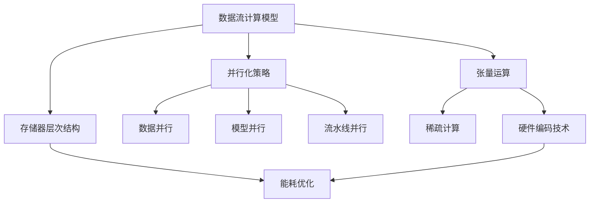

以下是根据您提供的要求和约束条件，撰写的技术博客文章正文内容：

# 一切皆是映射：实现神经网络的硬件加速技术

## 1. 背景介绍

### 1.1 问题的由来

在过去的几十年里，人工智能领域取得了长足的进步,尤其是深度学习技术的兴起,使得神经网络在计算机视觉、自然语言处理、语音识别等诸多领域展现出了强大的能力。然而,训练和推理这些庞大的神经网络模型需要大量的计算资源,导致了算力瓶颈的问题。

传统的中央处理器(CPU)由于其串行架构,很难满足神经网络对并行计算的巨大需求。图形处理器(GPU)凭借其并行计算能力,曾一度成为深度学习的主力硬件加速器。但GPU的设计初衷是为了图形渲染,在处理神经网络时仍存在一些不足,例如内存带宽限制、控制流不灵活等。

为了更好地支持深度学习的计算需求,专门的人工智能芯片应运而生。这些芯片通过定制化的硬件架构和指令集,能够以更高的能效比加速神经网络的训练和推理过程。本文将探讨实现神经网络硬件加速的核心技术,揭示其背后的原理和挑战。

### 1.2 研究现状

近年来,业界和学术界都在积极探索神经网络硬件加速的技术路径。一些主流的人工智能芯片包括:

- Google的TPU(Tensor Processing Unit)
- NVIDIA的Tensor Core
- 英特尔的神经棒(Nervana)
- 华为的达芬奇架构
- 寒武纪的Cambricon
- ......

这些芯片采用了多种创新的硬件架构和设计,如矩阵运算单元、稀疏计算引擎、内存集成等,以提高计算密度和能效。同时,针对不同的应用场景,也出现了一些专用的加速器,例如用于推理的终端芯片、用于训练的数据中心芯片等。

### 1.3 研究意义  

神经网络硬件加速技术的发展,不仅能够推动人工智能算法和应用的进一步创新,还将为整个计算机体系结构带来深远的影响。通过硬件和算法的协同优化,我们可以突破现有架构的瓶颈,实现更高效、更智能的计算范式。这对于构建高性能的人工智能系统、释放算力潜能、降低能耗至关重要。

此外,神经网络加速器的设计也为新兴的非传统计算模型(如类脑计算、量子计算等)提供了借鉴。通过研究映射算法到定制硬件的方法,我们可以更好地理解和利用新型计算架构的优势。

### 1.4 本文结构

本文将从以下几个方面深入探讨神经网络硬件加速技术:

1. 核心概念与联系
2. 核心算法原理和具体操作步骤
3. 数学模型和公式详细讲解
4. 项目实践:代码实例和详细解释
5. 实际应用场景
6. 工具和资源推荐
7. 总结:未来发展趋势与挑战
8. 附录:常见问题与解答

## 2. 核心概念与联系

实现神经网络硬件加速的核心思想是将神经网络的运算模式高效地映射到定制化的硬件架构上。这涉及到以下几个关键概念:

1. **数据流计算模型**:将神经网络表示为数据流图,节点代表运算,边代表数据依赖。这种模型天然地体现了神经网络内在的并行性和局部性。

2. **张量运算**:神经网络中的大多数运算(如卷积、矩阵乘法等)都可以用张量运算来表示和优化。硬件需要高效地支持这些密集的张量运算。

3. **存储器层次结构**:由于神经网络模型和中间数据的巨大规模,存储器层次结构的设计对性能至关重要。需要平衡计算单元和存储器之间的带宽和容量。

4. **并行化策略**:包括数据并行(跨多个处理元素划分数据)、模型并行(跨多个处理单元划分模型)、流水线并行(将运算划分为多个阶段流水线执行)等。

5. **稀疏计算**:神经网络中存在大量的稀疏数据和稀疏权重,需要特殊的硬件支持来跳过无效的计算,提高效率。

6. **硬件编码技术**:通过定点数表示、权重剪枝、量化等技术,在一定精度损失范围内降低计算和存储的开销。

7. **能耗优化**:通过时钟门控、数据流控制、动态电压频率调节等技术,在满足性能约束的同时最小化能耗。

这些概念相互关联、环环相扣,构成了神经网络硬件加速技术的核心基础。下面我们将进一步剖析其中的算法原理和实现细节。

## 3. 核心算法原理与具体操作步骤

### 3.1 算法原理概述

神经网络硬件加速的核心算法原理可以概括为三个主要步骤:

1. **模型表示**: 将神经网络模型表示为数据流图,节点代表各种运算(如卷积、矩阵乘法等),边代表数据依赖关系。

2. **图分析与优化**: 对数据流图进行全局分析,识别出并行化、稀疏化、量化等优化机会,并相应地转换和调度图的执行。

3. **映射到硬件**: 将优化后的数据流图高效地映射到定制化的硬件架构上,充分利用硬件的并行计算能力和存储层次结构。

这三个步骤相互依赖、循环迭代,形成了一个完整的算法流程。下面我们将详细解释每个步骤的具体操作。

### 3.2 算法步骤详解

#### 3.2.1 模型表示

神经网络模型通常由一系列层(如卷积层、全连接层等)组成,每一层执行特定的张量运算。我们可以将整个模型表示为一个数据流图(Data Flow Graph),其中:

- 节点(Node)代表各种张量运算,如卷积、矩阵乘法、激活函数等。
- 边(Edge)表示张量数据的依赖关系,即一个节点的输出作为另一个节点的输入。

这种表示方式能够自然地捕捉神经网络内在的并行性和局部性,为后续的优化和映射奠定基础。

#### 3.2.2 图分析与优化

在将数据流图映射到硬件之前,需要进行一系列的图分析和优化转换,以充分利用硬件的加速能力。常见的优化策略包括:

1. **并行化策略**:
   - 数据并行:将张量数据划分到多个处理元素上并行执行。
   - 模型并行:将神经网络模型划分到多个处理单元上并行执行。
   - 流水线并行:将单个运算划分为多个阶段,通过流水线方式并行执行。

2. **稀疏计算优化**:
   - 跳过乘零运算:神经网络中存在大量的稀疏权重和稀疏激活值,可以跳过与零相乘的无效计算。
   - 压缩存储:将稀疏数据压缩存储,节省存储空间和内存带宽。

3. **量化优化**:
   - 定点数表示:使用定点数代替浮点数表示权重和激活值,降低计算和存储开销。
   - 权重剪枝:将小于某个阈值的权重设置为零,进一步压缩模型大小。

4. **内存优化**:
   - 数据布局优化:合理安排张量数据在存储器中的布局,以最大化存储器带宽的利用率。
   - 数据复用:最大化数据的复用,减少不必要的内存访问。

5. **计算调度**:
   - 根据硬件资源的约束(如并行度、存储容量等),对运算的执行顺序进行调度,以实现高效的资源利用。

这些优化策略并非孤立存在,而是相互关联、相辅相成。算法需要综合考虑各种优化的权衡和约束,生成一个高度优化的数据流图表示。

#### 3.2.3 映射到硬件

经过优化后的数据流图需要映射到定制化的硬件架构上,以充分发挥硬件的并行计算能力。这个过程包括以下几个关键步骤:

1. **硬件资源分配**:
   - 将数据流图中的运算节点分配到硬件的计算单元(如矩阵乘法单元、卷积单元等)上执行。
   - 根据节点的工作负载和数据依赖关系,合理分配硬件资源,避免资源冲突和负载不均衡。

2. **数据映射**:
   - 将数据流图中的张量数据映射到硬件的存储层次结构(如寄存器文件、片上存储器、主存等)。
   - 优化数据布局和数据传输路径,最大化存储器带宽的利用率。

3. **指令生成**:
   - 根据映射结果,为硬件生成对应的指令流,控制计算单元和存储器的操作。
   - 指令可能需要支持特殊的硬件功能,如稀疏计算、定点运算等。

4. **调度执行**:
   - 将指令流调度到硬件上执行,并根据实际情况动态调整执行策略。
   - 需要处理好指令级并行、内存访问冲突等问题,以实现高效的硬件利用率。

映射算法的设计对于发挥硬件加速器的全部潜力至关重要。良好的映射策略能够最大限度地利用硬件资源,实现高吞吐量和高能效。

### 3.3 算法优缺点

神经网络硬件加速算法具有以下优点:

1. **高性能**:通过专门的硬件架构和并行化策略,能够大幅提高神经网络的计算性能。

2. **高能效**:定制化的硬件设计和算法优化可以显著降低计算的能耗。

3. **灵活性**:基于数据流模型的表示和优化,能够适应不同类型的神经网络模型和应用场景。

4. **可扩展性**:算法能够通过增加硬件资源(如增加计算单元数量)来线性扩展计算能力。

然而,这种算法方案也存在一些缺点和挑战:

1. **硬件设计复杂度高**:需要同时考虑算法、架构和芯片实现的约束,设计难度较大。

2. **内存带宽瓶颈**:虽然采用了多级存储层次结构,但神经网络对内存带宽的需求仍然巨大,可能成为性能瓶颈。

3. **编程模型差异**:与传统的CPU/GPU编程模型存在差异,需要重新设计编译器和编程框架。

4. **硬件资源利用率**:由于神经网络的动态特性,很难始终保持硬件资源的充分利用。

5. **精度损失**:量化和近似计算等优化手段会导致一定程度的精度损失,需要权衡精度和性能之间的平衡。

总的来说,神经网络硬件加速算法为解决算力瓶颈提供了有力的方案,但也面临着诸多挑战,需要在算法、架构和实现层面持续创新和优化。

### 3.4 算法应用领域

神经网络硬件加速算法可以广泛应用于以下领域:

1. **数据中心训练**:用于加速大规模神经网络模型(如GPT-3、PanGu-Alpha等)的训练过程,提高训练吞吐量和效率。

2. **边缘设备推理**:在移动设备、物联网设备等资源受限的边缘环境中,实现高效的神经网络推理和部署