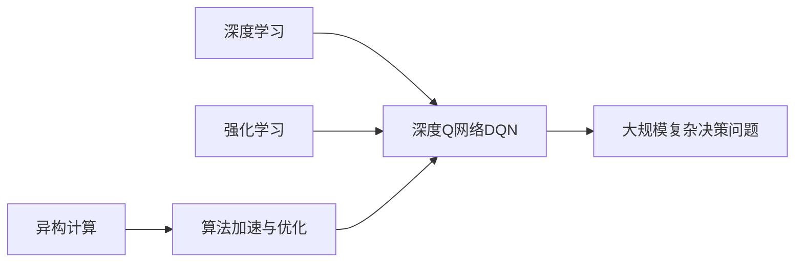

# 一切皆是映射：深度Q网络DQN的异构计算优化实践

关键词：深度Q网络, DQN, 异构计算, 强化学习, 计算优化

## 1. 背景介绍

### 1.1 问题的由来
强化学习(Reinforcement Learning, RL)作为一种通用的学习和决策范式,在近年来取得了巨大的成功。从AlphaGo战胜人类围棋冠军,到OpenAI Five击败Dota 2职业玩家,再到DeepMind的AlphaStar登顶星际争霸2,强化学习展现出了惊人的潜力。而这些成功的背后,离不开深度强化学习算法的支撑,其中最具代表性的就是深度Q网络(Deep Q-Network, DQN)。

然而,DQN算法本身对计算资源有着较高的需求,尤其是在处理大规模复杂问题时,往往需要耗费大量的计算时间和存储空间。这极大地限制了DQN算法的应用范围和实用性。因此,如何提升DQN算法的计算效率,成为了一个亟待解决的问题。

### 1.2 研究现状
针对DQN算法的计算瓶颈问题,学术界已经开展了一系列的研究工作。一方面,研究者们从算法层面入手,提出了各种改进和变体,如Double DQN、Dueling DQN、Prioritized Experience Replay等,在一定程度上缓解了原始DQN算法的缺陷。另一方面,也有学者开始关注DQN算法的硬件加速和并行化实现。

传统的DQN算法主要在CPU和GPU上实现,但它们各自存在一定局限性。CPU通用性强但计算效率较低,GPU则适合大规模并行计算但灵活性不足。近年来,一些研究者开始探索异构计算平台在DQN加速中的应用,如FPGA、ASIC等专用集成电路。这些尝试取得了一定成果,但仍面临诸多挑战,如异构平台的编程复杂性、算法映射与优化困难等。

### 1.3 研究意义
DQN作为深度强化学习的代表性算法之一,对其计算性能的优化具有重要意义:

1. 从理论角度看,深入分析DQN算法的计算瓶颈,有助于加深对强化学习机制的理解,为算法改进提供新思路。

2. 从实践角度看,提升DQN的计算效率,意味着可以用更少的时间和资源来训练和部署模型,扩大其应用范围,推动强化学习走向工业界。

3. 从技术角度看,探索DQN在异构平台上的加速实现,有望突破传统计算架构的局限,为未来的 AI 芯片和专用加速器提供参考。

4. 从产业角度看,高效的DQN算法可以应用于更广泛的领域,如自动驾驶、智能制造、网络安全等,带来巨大的经济效益和社会价值。

### 1.4 本文结构
本文将围绕DQN算法在异构计算平台上的优化展开,主要内容安排如下:

- 第2部分介绍DQN的核心概念和基本原理,厘清其与异构计算的关联。

- 第3部分详细阐述DQN算法的工作流程,分析其计算瓶颈,并总结现有的优化方法。

- 第4部分建立DQN算法的数学模型,推导相关公式,并结合实例加以说明。

- 第5部分给出DQN在异构平台(如FPGA)上的实现方案,并通过代码实例和性能测试进行验证。

- 第6部分讨论DQN异构计算优化的实际应用场景和未来发展方向。

- 第7部分推荐一些学习资源、开发工具和相关文献,供读者进一步研究参考。

- 第8部分总结全文,展望DQN优化技术的未来趋势和挑战。

- 第9部分列举一些常见问题,并给出解答,方便读者理解。

## 2. 核心概念与联系

在正式展开论述之前,我们有必要先明确几个核心概念:

- 强化学习:一种让智能体通过与环境的交互来学习最优策略的机器学习范式。

- Q学习:一种常见的强化学习算法,通过迭代更新状态-动作值函数(Q函数)来逼近最优策略。

- 深度Q网络:传统Q学习与深度神经网络的结合,用深度网络(如CNN)来拟合Q函数,可以处理高维观测数据。

- 异构计算:利用多种不同计算单元(如CPU、GPU、FPGA等)协同工作,发挥各自优势,从而提升整体性能的计算模式。

可以看出,DQN是深度学习和强化学习的交叉产物,而异构计算则为其提供了底层的加速手段。它们之间的关系如下图所示:

## 3. 核心算法原理 & 具体操作步骤

### 3.1 算法原理概述
DQN算法的核心思想是用深度神经网络来逼近最优的Q函数。传统Q学习中,Q函数定义为在状态s下采取动作a可以获得的期望累积奖励:

$Q(s,a)=\mathbb{E}[R_t|s_t=s,a_t=a]$

其中$R_t=\sum_{k=0}^{\infty}\gamma^kr_{t+k}$是未来累积折扣奖励,$\gamma$是折扣因子。

Q学习的目标是找到最优Q函数$Q^*(s,a)$,它满足如下贝尔曼最优方程:

$Q^*(s,a)=\mathbb{E}[r+\gamma\max_{a'}Q^*(s',a')|s,a]$

传统Q学习通过值迭代的方式来逼近$Q^*$,但这在状态和动作空间很大时难以收敛。DQN的创新之处在于,用深度网络 $Q(s,a;\theta)$ 来直接拟合 $Q^*$,其中 $\theta$ 为网络参数。通过最小化如下损失函数来更新 $\theta$:

$L(\theta)=\mathbb{E}_{(s,a,r,s')\sim D}[(r+\gamma\max_{a'}Q(s',a';\theta^-)-Q(s,a;\theta))^2]$

其中 $D$ 为经验回放池, $\theta^-$ 为目标网络参数,它每隔一段时间从 $\theta$ 复制而来。

### 3.2 算法步骤详解
DQN算法的主要步骤如下:

1. 初始化经验回放池 $D$,在线 Q 网络参数 $\theta$ 和目标 Q 网络参数 $\theta^-$

2. 对每个episode循环:
   
   a. 初始化环境状态 $s_0$
   
   b. 对每个时间步 $t$ 循环:
      
      i. 根据 $\epsilon$-贪婪策略选择动作 $a_t$,即以 $\epsilon$ 的概率随机选择,否则选择 $a_t=\arg\max_aQ(s_t,a;\theta)$
      
      ii. 执行动作 $a_t$,观测奖励 $r_t$ 和新状态 $s_{t+1}$
      
      iii. 将转移样本 $(s_t,a_t,r_t,s_{t+1})$ 存入 $D$ 
      
      iv. 从 $D$ 中随机采样一个批次的转移样本 $(s,a,r,s')$
      
      v. 计算目标值 $y=r+\gamma\max_{a'}Q(s',a';\theta^-)$
      
      vi. 通过最小化损失 $L(\theta)=(y-Q(s,a;\theta))^2$ 来更新 $\theta$
      
      vii. 每隔 $C$ 步,将 $\theta^-$ 更新为 $\theta$
   
   c. 如果满足终止条件(如达到步数上限),则停止episode

3. 评估策略,绘制学习曲线等

可以看出,DQN在原始Q学习的基础上引入了两个关键技术:经验回放和目标网络。前者打破了数据的相关性,稳定了训练;后者减缓了目标值的变化,避免了过度估计。

### 3.3 算法优缺点
DQN算法的主要优点有:

- 端到端的学习方式,只需给定奖励函数,无须人工设计特征。

- 可以处理高维观测数据,在图像、语音等领域有广泛应用。  

- 引入经验回放和目标网络,提升了训练稳定性和效率。

- 收敛后的策略可以实时推断,适合实际部署。

但DQN也存在一些局限性:

- 训练不够稳定,容易受到超参数、探索策略等的影响。 

- 难以处理连续动作空间,需要进行离散化,导致策略受限。

- 对计算资源要求高,模型训练和存储开销大。

- 样本利用率低,回放池中的数据只能重复利用有限次。

### 3.4 算法应用领域
尽管有诸多不足,DQN及其变体算法仍在许多领域取得了瞩目成果,例如:

- 游戏:DQN在Atari视频游戏上达到了超人表现,掀起了深度强化学习的浪潮。

- 机器人:DQN可以学习操纵和导航策略,使机器人具备更强的环境适应能力。 

- 自然语言处理:DQN可用于对话生成、阅读理解等任务,提升了交互质量。

- 推荐系统:DQN能根据用户反馈动态调整推荐策略,提高用户满意度。

- 网络优化:DQN可以学习调度和路由策略,改善网络传输性能。

## 4. 数学模型和公式 & 详细讲解 & 举例说明

### 4.1 数学模型构建
为了更好地理解DQN算法,我们先建立一个简化的数学模型。考虑一个有限马尔可夫决策过程(MDP),它由以下元素组成:

- 状态空间 $\mathcal{S}$,其中每个状态 $s\in\mathcal{S}$ 对应一个观测值 $x\in\mathcal{X}$。

- 动作空间 $\mathcal{A}$,即智能体在每个状态下可采取的动作集合。

- 转移概率 $\mathcal{P}$,其中 $\mathcal{P}(s'|s,a)$ 表示在状态 $s$ 下采取动作 $a$ 后转移到状态 $s'$ 的概率。

- 奖励函数 $\mathcal{R}$,其中 $\mathcal{R}(s,a)$ 表示在状态 $s$ 下采取动作 $a$ 后获得的即时奖励。

- 折扣因子 $\gamma\in[0,1]$,用于衡量未来奖励的重要程度。

在此基础上,我们定义策略 $\pi(a|s)$ 为在状态 $s$ 下选择动作 $a$ 的概率。那么,策略 $\pi$ 的期望累积奖励可表示为:

$V^\pi(s)=\mathbb{E}_{a_t\sim\pi}[\sum_{k=0}^\infty\gamma^k\mathcal{R}(s_{t+k},a_{t+k})|s_t=s]$

而状态-动作值函数 $Q^\pi(s,a)$ 则表示在状态 $s$ 下采取动作 $a$,并在之后都遵循策略 $\pi$ 可获得的期望累积奖励:

$Q^\pi(s,a)=\mathbb{E}_{a_t\sim\pi}[\sum_{k=0}^\infty\gamma^k\mathcal{R}(s_{t+k},a_{t+k})|s_t=s,a_t=a]$

可以证明,最优状态-动作值函数 $Q^*(s,a)$ 满足贝尔曼最优方程:

$Q^*(s,a)=\mathcal{R}(s,a)+\gamma\sum_{s'\in\mathcal{S}}\mathcal{P}(s'|s,a)\max_{a'\in\mathcal{A}}Q^*(s',a')$

因此,只要我们能够准确估计出 $Q^*$,就可以导出最优策略 $\pi^*$:

$\pi^*(a|s)=\arg\max_{a\in\mathcal{A}}Q^*(s,a)