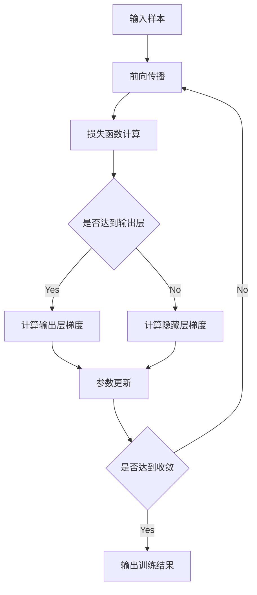
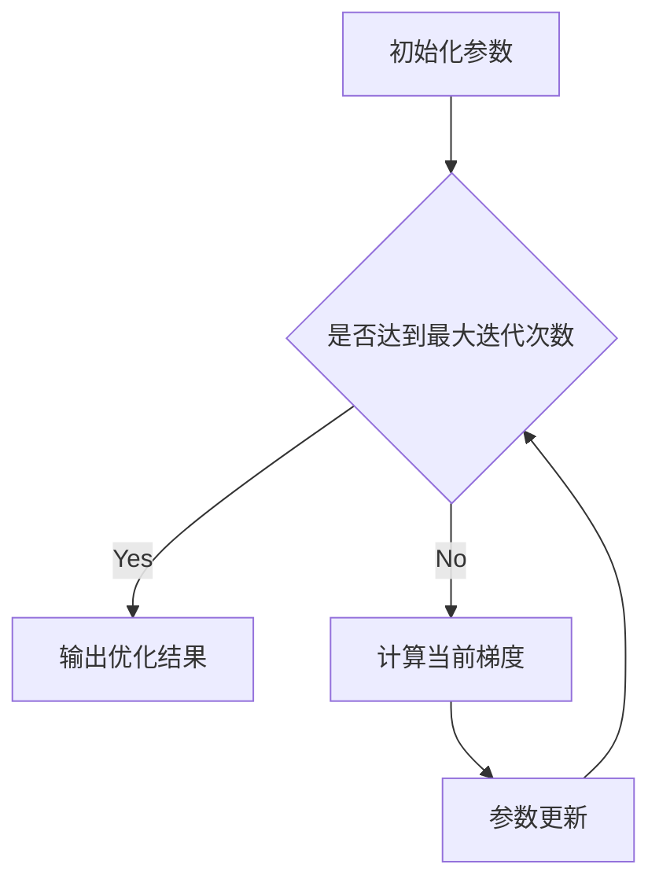

# 一切皆是映射：深度学习中的反向传播和梯度下降

关键词：深度学习, 反向传播, 梯度下降, 神经网络, 优化算法

## 1. 背景介绍
### 1.1 问题的由来
深度学习作为人工智能的核心技术之一,在计算机视觉、自然语言处理等领域取得了巨大的成功。而支撑深度学习的两大核心算法——反向传播(Backpropagation)和梯度下降(Gradient Descent),则是深度学习模型得以训练和优化的关键。

### 1.2 研究现状 
目前,深度学习已经成为学术界和工业界的研究热点。各大科技公司纷纷投入巨资,在深度学习算法和应用上展开了激烈的竞争。同时,学术界也在反向传播和梯度下降算法的理论基础、改进优化等方面取得了长足的进展。

### 1.3 研究意义
深入理解反向传播和梯度下降算法的原理和数学基础,对于深度学习的研究和应用具有重要的指导意义。这不仅有助于我们设计出更加高效、鲁棒的深度学习模型,也为探索深度学习的内在机制和提出更优的学习算法提供了理论支撑。

### 1.4 本文结构
本文将从以下几个方面对反向传播和梯度下降算法进行深入探讨：
- 核心概念与联系
- 核心算法原理与具体步骤
- 数学模型推导与案例分析
- 代码实践与详解
- 实际应用场景
- 工具和资源推荐
- 总结与展望

## 2. 核心概念与联系
反向传播和梯度下降是深度学习的两大核心算法,它们相辅相成,共同构成了深度神经网络训练的基础。

反向传播算法解决了神经网络的参数学习问题。它通过递归地计算损失函数相对于每一层神经元参数的梯度,实现了误差从输出层到输入层的反向传播,使得神经网络能够学习到最优的参数。

而梯度下降则是一种优化算法,它利用反向传播得到的梯度信息,通过迭代地调整神经元参数,不断将损失函数值降低,最终使模型在训练数据上达到最优。

下图展示了反向传播和梯度下降在神经网络训练中的关系：

## 3. 核心算法原理 & 具体操作步骤
### 3.1 算法原理概述
反向传播的核心思想是利用链式法则,递归地计算神经网络每一层的梯度,将损失函数的梯度反向传播到所有的神经元参数。

而梯度下降的基本原理是沿着损失函数梯度的反方向,不断调整神经元参数,使其收敛到损失函数的极小值点。

### 3.2 算法步骤详解
反向传播算法可以分为以下4个步骤:
1. 前向传播:根据当前参数计算神经网络每一层的输出。
2. 损失函数计算:根据输出层结果和真实标签,计算损失函数值。
3. 反向传播:计算损失函数相对于每一层神经元参数的梯度。
4. 参数更新:根据梯度下降算法更新参数。

以下是反向传播算法的详细流程图:

梯度下降算法可以分为以下3个步骤:
1. 初始化参数
2. 计算当前参数下的梯度
3. 沿梯度反方向更新参数

以下是梯度下降算法的详细流程图:

### 3.3 算法优缺点
反向传播和梯度下降的优点在于:
- 使深度神经网络的训练成为可能
- 相对简单,容易实现
- 对于一般的优化问题都适用

但它们也存在一些缺点:
- 对于复杂的网络,计算梯度的开销很大
- 容易陷入局部最优,难以寻找全局最优解
- 对参数的初始化和学习率较为敏感

### 3.4 算法应用领域
反向传播和梯度下降广泛应用于以下领域:
- 计算机视觉:图像分类,目标检测,语义分割等
- 自然语言处理:机器翻译,情感分析,文本生成等
- 语音识别:声学模型,语言模型的训练
- 推荐系统:用户画像,个性化推荐等

## 4. 数学模型和公式 & 详细讲解 & 举例说明
### 4.1 数学模型构建
我们以一个简单的三层全连接神经网络为例,构建反向传播和梯度下降的数学模型。

假设输入层有$n$个神经元,隐藏层有$m$个神经元,输出层有$p$个神经元。输入数据为$\boldsymbol{x} \in \mathbb{R}^n$,隐藏层到输出层的权重参数为$\boldsymbol{W}^{(2)} \in \mathbb{R}^{m \times p}$,输入层到隐藏层的权重参数为$\boldsymbol{W}^{(1)} \in \mathbb{R}^{n \times m}$。

定义隐藏层和输出层的加权输入为:

$$
\begin{aligned}
\boldsymbol{z}^{(1)} &= \boldsymbol{W}^{(1)}\boldsymbol{x} \\
\boldsymbol{z}^{(2)} &= \boldsymbol{W}^{(2)}\boldsymbol{a}^{(1)}
\end{aligned}
$$

其中$\boldsymbol{a}^{(1)}$为隐藏层的激活值。假设激活函数为$\sigma(\cdot)$,则:

$$
\boldsymbol{a}^{(1)} = \sigma(\boldsymbol{z}^{(1)})
$$

最后,输出层的预测值为:

$$
\boldsymbol{\hat{y}} = \boldsymbol{a}^{(2)} = \sigma(\boldsymbol{z}^{(2)})
$$

定义损失函数为均方误差:

$$
J = \frac{1}{2} \lVert \boldsymbol{\hat{y}} - \boldsymbol{y} \rVert^2
$$

其中$\boldsymbol{y}$为真实标签。

### 4.2 公式推导过程
根据反向传播算法,我们需要计算损失函数$J$分别相对于$\boldsymbol{W}^{(2)}$和$\boldsymbol{W}^{(1)}$的梯度。

对于$\boldsymbol{W}^{(2)}$,利用链式法则有:

$$
\frac{\partial J}{\partial \boldsymbol{W}^{(2)}} = \frac{\partial J}{\partial \boldsymbol{a}^{(2)}} \frac{\partial \boldsymbol{a}^{(2)}}{\partial \boldsymbol{z}^{(2)}} \frac{\partial \boldsymbol{z}^{(2)}}{\partial \boldsymbol{W}^{(2)}}
$$

其中:

$$
\begin{aligned}
\frac{\partial J}{\partial \boldsymbol{a}^{(2)}} &= \boldsymbol{\hat{y}} - \boldsymbol{y} \\
\frac{\partial \boldsymbol{a}^{(2)}}{\partial \boldsymbol{z}^{(2)}} &= \sigma'(\boldsymbol{z}^{(2)}) \\
\frac{\partial \boldsymbol{z}^{(2)}}{\partial \boldsymbol{W}^{(2)}} &= \boldsymbol{a}^{(1)}
\end{aligned}
$$

因此:

$$
\frac{\partial J}{\partial \boldsymbol{W}^{(2)}} = (\boldsymbol{\hat{y}} - \boldsymbol{y}) \odot \sigma'(\boldsymbol{z}^{(2)}) \boldsymbol{a}^{(1)T}
$$

其中$\odot$表示Hadamard积。

类似地,对于$\boldsymbol{W}^{(1)}$有:

$$
\frac{\partial J}{\partial \boldsymbol{W}^{(1)}} = \frac{\partial J}{\partial \boldsymbol{a}^{(2)}} \frac{\partial \boldsymbol{a}^{(2)}}{\partial \boldsymbol{z}^{(2)}} \frac{\partial \boldsymbol{z}^{(2)}}{\partial \boldsymbol{a}^{(1)}} \frac{\partial \boldsymbol{a}^{(1)}}{\partial \boldsymbol{z}^{(1)}} \frac{\partial \boldsymbol{z}^{(1)}}{\partial \boldsymbol{W}^{(1)}}
$$

化简可得:

$$
\frac{\partial J}{\partial \boldsymbol{W}^{(1)}} = \left((\boldsymbol{\hat{y}} - \boldsymbol{y}) \odot \sigma'(\boldsymbol{z}^{(2)})\right) \boldsymbol{W}^{(2)T} \odot \sigma'(\boldsymbol{z}^{(1)}) \boldsymbol{x}^T
$$

至此,我们得到了损失函数相对于每一层权重参数的梯度。根据梯度下降算法,参数的更新公式为:

$$
\begin{aligned}
\boldsymbol{W}^{(2)} &:= \boldsymbol{W}^{(2)} - \alpha \frac{\partial J}{\partial \boldsymbol{W}^{(2)}} \\
\boldsymbol{W}^{(1)} &:= \boldsymbol{W}^{(1)} - \alpha \frac{\partial J}{\partial \boldsymbol{W}^{(1)}}
\end{aligned}
$$

其中$\alpha$为学习率。

### 4.3 案例分析与讲解
下面我们以一个简单的二分类问题为例,演示反向传播和梯度下降的计算过程。

假设输入数据为$\boldsymbol{x} = [1, -2]^T$,对应的真实标签为$y=1$。初始化权重参数为:

$$
\boldsymbol{W}^{(1)} = \begin{bmatrix} 
1 & -1\\ 
2 & 1
\end{bmatrix}, \quad
\boldsymbol{W}^{(2)} = \begin{bmatrix}
2 \\ -1
\end{bmatrix}
$$

选择Sigmoid函数作为激活函数,学习率设为0.1。

首先进行前向传播:

$$
\begin{aligned}
\boldsymbol{z}^{(1)} &= \boldsymbol{W}^{(1)}\boldsymbol{x} = \begin{bmatrix}
1 & -1\\ 
2 & 1
\end{bmatrix} \begin{bmatrix}
1\\ 
-2
\end{bmatrix} = \begin{bmatrix}
3\\ 
0
\end{bmatrix} \\
\boldsymbol{a}^{(1)} &= \sigma(\boldsymbol{z}^{(1)}) = \begin{bmatrix}
0.95\\ 
0.50
\end{bmatrix} \\
\boldsymbol{z}^{(2)} &= \boldsymbol{W}^{(2)}\boldsymbol{a}^{(1)} = \begin{bmatrix}
2\\ 
-1
\end{bmatrix}^T \begin{bmatrix}
0.95\\ 
0.50
\end{bmatrix} = 1.40 \\
\hat{y} &= \sigma(\boldsymbol{z}^{(2)}) = 0.80
\end{aligned}
$$

计算损失函数值:

$$
J = \frac{1}{2} (0.80 - 1)^2 = 0.02
$$

接着进行反向传播,计算梯度:

$$
\begin{aligned}
\frac{\partial J}{\partial \boldsymbol{a}^{(2)}} &= 0.80 - 1 = -0.20 \\
\frac{\partial \boldsymbol{a}^{(2)}}{\partial \boldsymbol{z}^{(2)}} &= 0.80(1-0.80) = 0.16 \\
\frac{\partial J}{\partial \boldsymbol{W}^{(2)}} &= -0.20 \times 0.16 \times \begin{bmatrix}