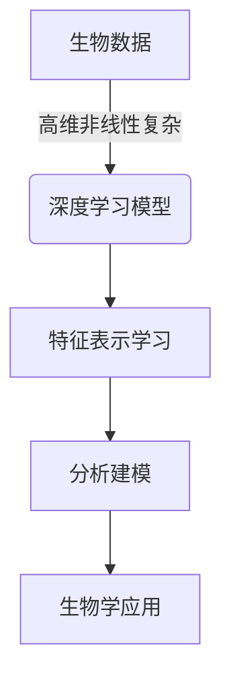

好的,我将严格按照您的要求,以《一切皆是映射:深度学习在生物信息学中的应用前景》为主题,撰写一篇专业的技术博客文章。

# 一切皆是映射:深度学习在生物信息学中的应用前景

## 1. 背景介绍

### 1.1 问题的由来

生物信息学是一门融合生物学与信息技术的新兴跨学科,旨在解决生命科学领域中的数据处理和分析问题。随着高通量测序技术的快速发展,生物数据呈现出海量、多样和复杂的特点,对传统的生物信息学分析方法带来了巨大挑战。因此,迫切需要开发新的计算工具和算法来满足生物数据分析的需求。

### 1.2 研究现状

近年来,深度学习作为一种强大的机器学习方法,在计算机视觉、自然语言处理等领域取得了巨大成功。深度学习能够自动从海量数据中学习特征表示,捕捉数据内在的复杂模式和规律,为解决生物信息学中的各种问题提供了新的思路和方法。目前,深度学习已经在基因组测序数据分析、蛋白质结构预测、药物设计等生物信息学领域得到广泛应用,展现出巨大的潜力。

### 1.3 研究意义  

深度学习在生物信息学中的应用,可以帮助科研人员更好地理解生命过程中的复杂机制,加速生物医学研究的进展。同时,也有望推动个性化医疗、精准医疗等前沿领域的发展,造福人类健康。此外,深度学习方法在生物信息学中的创新应用,也将促进人工智能技术自身的发展和完善。

### 1.4 本文结构

本文将全面介绍深度学习在生物信息学中的应用前景。首先阐述核心概念和深度学习与生物信息学的联系;然后详细解析常用的深度学习算法原理和数学模型;接着通过实际案例,讲解在基因组学、蛋白质组学等领域的应用实践;最后总结深度学习在生物信息学中的发展趋势和面临的挑战。

## 2. 核心概念与联系

生物信息学和深度学习看似是两个不同的领域,但实际上它们有着内在的联系。生物数据往往呈现出高维、非线性和复杂的特征,需要强大的机器学习算法来进行分析和建模。而深度学习作为一种表示学习方法,具有自动从数据中学习多层次特征表示的能力,非常适合处理这类复杂的生物数据。



深度学习模型中的多层神经网络结构,能够对输入数据进行层层抽象和表示转换,自动学习数据的内在分布和规律,这种端到端的学习方式很好地契合了生物数据的特点。通过构建合适的深度神经网络模型,可以高效地从海量生物数据中提取有价值的生物学知识。

此外,深度学习的强大泛化能力,使其不仅可以应用于已有的生物信息学问题,还可以拓展到新的挑战性领域,为解决更多复杂的生物学问题提供新的思路。

## 3. 核心算法原理及具体操作步骤

### 3.1 算法原理概述

深度学习算法的核心是基于人工神经网络的多层结构,通过反向传播算法对网络进行训练,自动从数据中学习特征表示。常见的深度学习模型包括卷积神经网络(CNN)、循环神经网络(RNN)、长短期记忆网络(LSTM)等。这些模型在生物信息学中的应用各有侧重,需要根据具体问题选择合适的模型。

### 3.2 算法步骤详解

以卷积神经网络为例,其主要步骤包括:

1. **数据预处理**:对生物序列数据(如DNA、RNA、蛋白质序列等)进行数字编码,构建输入特征向量。

2. **网络构建**:设计合适的卷积神经网络结构,包括卷积层、池化层和全连接层等。

3. **模型训练**:使用标记的训练数据,通过反向传播算法优化网络参数,最小化损失函数。

4. **模型评估**:在独立的测试数据集上评估模型的性能表现。

5. **模型预测**:使用训练好的模型对新的生物序列数据进行预测和分析。


### 3.3 算法优缺点

**优点**:

- 自动从数据中学习特征表示,减少了人工特征工程的工作量。
- 具有强大的建模和泛化能力,可以捕捉复杂的非线性模式。
- 端到端的学习方式,简化了传统机器学习的流程。

**缺点**:

- 需要大量的标记数据进行有监督训练,数据标注工作量大。
- 训练过程计算量大,对硬件要求较高。
- 模型可解释性较差,难以理解内部的特征表示。

### 3.4 算法应用领域

深度学习算法在生物信息学中的应用领域广泛,包括但不限于:

- 基因组测序数据分析:基因注释、变异检测、表达谱分析等。
- 蛋白质结构预测:利用序列信息预测蛋白质的二级和三级结构。
- 药物设计:虚拟筛选,预测分子与靶点的相互作用。
- 生物医学图像分析:细胞、组织和器官的分割、检测和分类等。
- 生物序列分析:功能预测、同源性分析、结构域识别等。

## 4. 数学模型和公式及详细讲解和举例说明

### 4.1 数学模型构建

深度学习模型通常由多层神经网络组成,每一层都对输入数据进行非线性转换,最终输出所需的目标值。以卷积神经网络为例,其数学模型可以表示为:

$$
y = f(W_L * (W_{L-1} * (...(W_2 * (W_1 * x + b_1) + b_2)...) + b_{L-1}) + b_L)
$$

其中:
- $x$为输入数据(如DNA序列)
- $W_i$为第$i$层的权重参数
- $b_i$为第$i$层的偏置参数
- $*$表示卷积操作
- $f$为激活函数,引入非线性

通过反向传播算法,可以学习模型中的所有参数$W_i$和$b_i$,使得输出$y$与真实标签值之间的损失函数最小化。

### 4.2 公式推导过程

以反向传播算法为例,我们来推导误差传播的数学公式。假设单个样本的损失函数为$E$,输出层的激活值为$a_L$,真实标签为$y$,则:

$$
E = \frac{1}{2}(a_L - y)^2
$$

对于任意一层$l$,其误差项$\delta^l$可以通过前一层的误差项$\delta^{l+1}$计算得到:

$$
\delta^l = ((W^{l+1})^T \delta^{l+1}) \odot f'(z^l)
$$

其中$\odot$表示按元素相乘,而$z^l$和$f'(z^l)$分别表示该层的加权输入和激活函数的导数。

利用$\delta^l$,可以计算每层权重$W^l$和偏置$b^l$的梯度:

$$
\begin{aligned}
\frac{\partial E}{\partial W^l} &= \frac{\partial E}{\partial z^l} (a^{l-1})^T\\
\frac{\partial E}{\partial b^l} &= \sum_k \frac{\partial E}{\partial z_k^l}
\end{aligned}
$$

根据梯度下降法则,可以不断迭代更新网络参数,使损失函数不断减小,从而获得理想的模型。

### 4.3 案例分析与讲解  

我们以DNA序列分类为例,说明深度学习在基因组学中的应用。假设有一个包含正负样本的DNA序列数据集,我们的目标是构建一个分类器,能够判断新的DNA序列是否属于正样本。

首先,我们需要对DNA序列进行一次热编码,将ATCG字母转换为一个4维的01向量,例如A编码为[1,0,0,0]。这样就可以将DNA序列表示为一个定长的向量输入到卷积神经网络中。

```python
def dna_encode(seq):
    encode = {'A':[1,0,0,0], 'T':[0,1,0,0], 
              'C':[0,0,1,0], 'G':[0,0,0,1]}
    return [encode[x] for x in seq]
```

接下来,我们构建一个包含卷积层和全连接层的网络结构:

```python
import torch.nn as nn

class DNAClassifier(nn.Module):
    def __init__(self):
        super().__init__()
        self.conv1 = nn.Conv1d(4, 16, kernel_size=3)
        self.pool = nn.MaxPool1d(2)
        self.conv2 = nn.Conv1d(16, 32, kernel_size=3)
        self.fc1 = nn.Linear(32*5, 64)
        self.fc2 = nn.Linear(64, 2)
        
    def forward(self, x):
        x = self.pool(F.relu(self.conv1(x)))
        x = self.pool(F.relu(self.conv2(x)))
        x = x.view(-1, 32*5)
        x = F.relu(self.fc1(x))
        x = self.fc2(x)
        return x
```

对于每个输入的DNA序列,卷积层可以自动学习其中的模式特征;全连接层则对这些特征进行高层次的组合,最终输出分类结果。通过有监督训练,模型可以不断优化参数,提高分类的准确性。

### 4.4 常见问题解答

**Q:** 为什么要使用深度学习,而不是传统的机器学习方法?

**A:** 深度学习具有自动从数据中学习特征表示的能力,无需人工设计特征,可以更好地捕捉生物数据中的复杂模式。此外,深度学习模型通常具有更强的建模和泛化能力,在处理高维非线性数据时表现优异。

**Q:** 如何选择合适的深度学习模型?

**A:** 模型的选择取决于具体的应用场景和数据特点。例如,对于序列数据可以考虑循环神经网络;对于结构化数据可以使用卷积神经网络;对于图结构数据可以使用图神经网络等。同时也需要考虑模型的复杂度和计算资源的限制。

**Q:** 深度学习模型是否可解释?

**A:** 深度学习模型通常被视为"黑盒",内部特征表示较难解释。但是,近年来出现了一些可解释的深度学习方法,如注意力机制、梯度加权类激活映射等,可以在一定程度上解释模型的决策过程。此外,也可以结合其他分析手段(如基因富集分析)来理解深度学习模型的生物学意义。

## 5. 项目实践:代码实例和详细解释说明

### 5.1 开发环境搭建

在实际应用深度学习算法之前,我们需要先搭建开发环境。以Python为例,常用的深度学习框架包括PyTorch、TensorFlow、Keras等。这些框架提供了丰富的模型构建模块和工具,极大地简化了深度学习模型的开发过程。

我们以PyTorch为例,介绍环境搭建的步骤:

1. 安装Python及相关包管理工具(如pip、conda)
2. 通过pip或conda安装PyTorch及其依赖包(如NumPy、SciPy等)
3. 安装用于生物信息学数据处理的Python包,如Biopython、bcbio-nextgen等
4. 准备GPU环境(可选),以加速深度学习模型的训练过程

### 5.2 源代码详细实现

以DNA序列二分类任务为例,我们使用PyTorch实现一个基于卷积神经网络的分类器模型。完整代码如下:

```python
import torch
import torch.nn as nn
import torch.opt