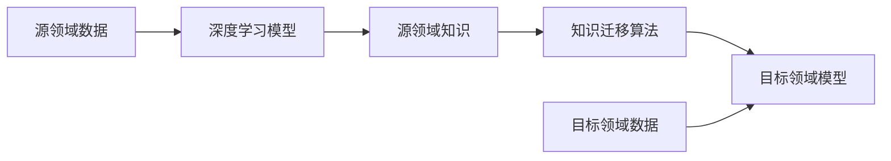

# 一切皆是映射：深度学习模型之间的知识迁移

关键词：深度学习、知识迁移、迁移学习、模型压缩、模型蒸馏、元学习、域自适应

## 1. 背景介绍
### 1.1  问题的由来
近年来，深度学习技术取得了突飞猛进的发展，在计算机视觉、自然语言处理、语音识别等领域取得了令人瞩目的成就。然而，训练一个高性能的深度学习模型通常需要大量的标注数据和计算资源，这对于很多实际应用场景而言是一个巨大的挑战。如何利用已有的知识和模型来加速新模型的训练，减少对数据和计算的依赖，是一个亟待解决的问题。

### 1.2  研究现状
为了应对上述挑战，研究者们提出了知识迁移（Knowledge Transfer）的思路，即利用在源领域学习到的知识来辅助目标领域的学习。知识迁移在深度学习领域有多种不同的实现方式，例如迁移学习、模型蒸馏、元学习、域自适应等。这些方法从不同角度出发，探索了深度学习模型之间知识迁移的可能性，取得了一定的研究进展。

### 1.3  研究意义 
深入研究深度学习模型之间的知识迁移，对于提升深度学习技术的应用价值和普适性具有重要意义：

1. 降低深度学习的数据依赖，在标注数据稀缺的情况下也能训练出高质量的模型；
2. 提高深度学习模型的训练效率，大幅减少计算资源的消耗；  
3. 增强深度学习模型的泛化能力和鲁棒性，使其能够更好地适应不同的任务场景；
4. 探索深度学习模型的内在联系，加深对深度学习本质的理解和认识。

### 1.4  本文结构
本文将围绕深度学习模型之间的知识迁移展开深入探讨。第2部分介绍知识迁移涉及的核心概念及其内在联系；第3部分重点阐述知识迁移的主要算法原理和实现步骤；第4部分从数学角度对知识迁移的理论基础进行分析；第5部分通过具体的代码实例演示知识迁移算法的实现细节；第6部分总结知识迁移技术的实际应用场景；第7部分推荐知识迁移领域的学习资源和工具；第8部分对全文进行总结，并对知识迁移技术的未来发展趋势和挑战进行展望。

## 2. 核心概念与联系
要理解深度学习模型之间的知识迁移，首先需要明确几个核心概念：

- 深度学习：一种基于深度神经网络的机器学习方法，能够从大规模数据中自动学习多层次的特征表示。
- 知识：深度学习模型从数据中学习到的信息和规律，通常以网络参数、特征表示等形式存在。  
- 迁移学习：利用已有的知识来辅助新任务的学习，从而减少新任务所需的数据量和训练时间。
- 领域：数据所属的特定任务或场景，例如图像分类、语音识别等。
- 源领域：已有知识的来源任务或场景。
- 目标领域：需要进行知识迁移的目标任务或场景。

这些概念之间存在着紧密的内在联系。深度学习模型可以从源领域的数据中学习到知识，然后利用迁移学习的思想，将这些知识迁移到目标领域，从而辅助目标领域的模型学习。知识迁移的过程实质上是在不同领域之间建立映射关系，使得源领域的知识能够在目标领域发挥作用。

## 3. 核心算法原理 & 具体操作步骤
### 3.1 算法原理概述
深度学习模型之间的知识迁移可以通过多种算法来实现，这里重点介绍几种主流算法的基本原理。

#### 3.1.1 微调（Fine-tuning）
微调是一种最直接的知识迁移方式，其基本思路是在源领域训练好的模型基础上，利用少量目标领域数据对模型进行进一步训练，使其适应目标领域的任务。具体而言，微调通常固定源模型的底层参数，只对顶层参数进行更新，从而在保留源领域知识的同时，对模型进行针对性的调整。

#### 3.1.2 特征提取（Feature Extraction）
特征提取是另一种常用的知识迁移方法。与微调不同，特征提取只利用源模型的部分层作为特征提取器，将目标领域数据在源模型上进行前向传播，得到某一中间层的输出作为特征表示，然后基于这些特征训练一个新的任务专属模型。这种方法可以更好地保留源模型学习到的通用特征，同时赋予目标模型更大的灵活性。

#### 3.1.3 模型蒸馏（Model Distillation）
模型蒸馏利用教师-学生网络的思想来实现知识的迁移。其核心思路是用一个大型复杂的教师模型来指导一个小型简单的学生模型。具体而言，学生模型不仅要尽可能拟合教师模型的输出，还要拟合教师模型输出的概率分布，从而从教师模型中学习到更加丰富的信息。模型蒸馏不仅可以在同领域进行，还可以实现跨领域的知识迁移。

#### 3.1.4 元学习（Meta-Learning）
元学习是一种旨在学习如何学习的方法，其目标是训练一个模型，使其能够在新任务上快速适应。MAML是元学习的代表算法之一，它通过构建一个"元模型"来实现快速适应。MAML在多个任务上进行训练，每个任务上进行两次梯度下降，第一次用于计算任务梯度，第二次用于更新元模型参数。这样训练得到的元模型具有很好的泛化能力，能够在新任务上通过少量微调实现快速适应。

### 3.2 算法步骤详解
以微调算法为例，详细介绍知识迁移的具体步骤。

输入：源领域模型 $M_S$，源领域数据 $D_S$，目标领域数据 $D_T$，学习率 $\alpha$，训练轮数 $N$。  
输出：目标领域模型 $M_T$。

1. 在源领域数据 $D_S$ 上训练模型 $M_S$；
2. 初始化目标模型 $M_T$ 的参数为 $\theta_T = \theta_S$；
3. 选择 $M_T$ 的部分层参数 $\theta_T^{(i)}$ 进行微调，其余层参数固定； 
4. for $i=1$ to $N$ do:
   1. 从 $D_T$ 中采样一个批次数据 $\{(x_j, y_j)\}_{j=1}^B$；
   2. 在 $M_T$ 上前向传播，计算损失函数 $L(\theta_T^{(i)}) = \frac{1}{B}\sum_{j=1}^B \ell(f(x_j; \theta_T^{(i)}), y_j)$；
   3. 计算梯度 $g_i = \nabla_{\theta_T^{(i)}} L(\theta_T^{(i)})$，并更新参数 $\theta_T^{(i)} \leftarrow \theta_T^{(i)} - \alpha g_i$。
5. return $M_T$。

其中，$\ell(\cdot)$ 为损失函数，例如交叉熵损失等。上述过程通过固定源模型 $M_S$ 的底层参数，只微调顶层参数 $\theta_T^{(i)}$，实现了从 $M_S$ 到 $M_T$ 的知识迁移。

### 3.3 算法优缺点
微调算法的优点是实现简单，可以充分利用源模型的知识，在目标领域数据较少的情况下也能取得不错的效果。但其缺点是灵活性较差，当源领域和目标领域差异较大时，微调的效果可能不够理想。

特征提取和模型蒸馏能够提供更大的灵活性，但实现复杂度也相应增加。此外，这两种方法在源领域和目标领域差异较大时的迁移效果有待进一步研究。

元学习能够学习如何在新任务上快速适应，但其训练难度较大，对数据和计算资源的要求也比较高。

### 3.4 算法应用领域
知识迁移算法在计算机视觉、自然语言处理等领域得到了广泛应用。例如：

- 在图像分类任务中，可以利用在ImageNet上预训练的模型作为特征提取器或初始化，显著提升小样本场景下的分类精度。
- 在语义分割任务中，常用深层卷积网络作为特征编码器，结合微调技术在新的数据集上进行训练，大幅减少标注数据的需求。
- 在机器翻译中，可以先在高资源语言对上训练模型，然后利用模型蒸馏技术迁移到低资源语言对，显著改善低资源语言的翻译质量。
- 在推荐系统中，可以利用元学习的思想，学习用户的偏好迁移规律，从而实现跨场景的冷启动推荐。

## 4. 数学模型和公式 & 详细讲解 & 举例说明
### 4.1 数学模型构建
知识迁移可以用统计学习的理论框架来进行描述。设源领域 $\mathcal{S} = \{X^S, P(X^S)\}$，其中 $X^S$ 为特征空间，$P(X^S)$ 为边缘分布；目标领域 $\mathcal{T} = \{X^T, P(X^T)\}$，其中 $X^T$ 为特征空间，$P(X^T)$ 为边缘分布。

假设源领域和目标领域的标签空间相同，即 $\mathcal{Y}^S = \mathcal{Y}^T = \mathcal{Y}$。知识迁移的目标是学习一个目标函数 $f: X^T \mapsto \mathcal{Y}$，使其在目标领域的预期风险最小化：

$$\min_{f \in \mathcal{H}} \mathbb{E}_{(x,y) \sim P(X^T, Y^T)} [\ell(f(x), y)]$$

其中 $\mathcal{H}$ 为假设空间，$\ell(\cdot)$ 为损失函数。由于目标领域标注数据稀缺，直接优化上述目标函数较为困难。知识迁移的思路是利用源领域的知识来辅助目标函数的学习，从而减少对目标领域标注数据的依赖。

### 4.2 公式推导过程
以特征提取方法为例，说明知识迁移的数学推导过程。设源领域的特征提取函数为 $\phi^S: X^S \mapsto \mathcal{Z}$，其中 $\mathcal{Z}$ 为公共特征空间。特征提取函数可以用深度神经网络来实现，例如：

$$\phi^S(x) = \sigma(W^S x + b^S)$$

其中 $W^S, b^S$ 为网络参数，$\sigma(\cdot)$ 为激活函数。类似地，目标领域的特征提取函数为 $\phi^T: X^T \mapsto \mathcal{Z}$。

在特征提取的基础上，可以构建目标领域的分类器 $h: \mathcal{Z} \mapsto \mathcal{Y}$，用于预测标签：

$$h(z) = \arg\max_{y \in \mathcal{Y}} P(y|z; \theta)$$

其中 $\theta$ 为分类器参数。结合特征提取和分类器，目标领域的预测函数可表示为：

$$f(x) = h(\phi^T(x))$$

为了利用源领域的知识，我们希望学习到的目标领域特征提取函数 $\phi^T$ 能够与源领域特征提取函数 $\phi^S$ 尽可能相似。一种常用的度量特征相似性的方法是最大均值差异（Maximum Mean Discrepancy，MMD）：

$$\text{MMD}(\phi^S, \phi^T) = \left\| \