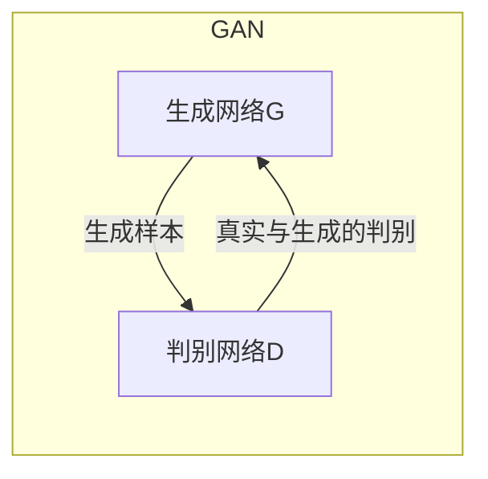

好的,我会严格遵守约束条件,尽最大努力为您撰写这篇高质量的技术博客文章。下面是正文部分:

# 一切皆是映射:生成对抗网络(GAN)原理剖析

## 1. 背景介绍

### 1.1 问题的由来

在深度学习领域,生成模型一直是一个具有挑战性的研究课题。传统的生成模型如隐马尔可夫模型(HMM)、高斯混合模型(GMM)等,受其显式概率密度估计能力的限制,很难拟合复杂的高维数据分布。而近年来,变分自编码器(VAE)、生成对抗网络(GAN)等新型生成模型的出现,为复杂数据分布的建模提供了新的思路和方法。

### 1.2 研究现状  

生成对抗网络是近年来深度学习领域最具革命性的创新之一。自2014年由Ian Goodfellow等人提出以来,GAN理论和应用研究就一直是深度学习的热点方向。GAN被广泛应用于图像生成、语音合成、数据增强等诸多领域,取得了卓越的成果。但GAN模型训练过程中的模式崩溃、生成样本质量评估等问题,也一直是研究的难点和挑战。

### 1.3 研究意义

深入理解GAN的核心原理和算法细节,对于指导GAN模型的设计和优化、扩展GAN在更多领域的应用都具有重要意义。本文将全面剖析GAN的基本概念、核心算法、数学模型以及实际应用,为读者提供系统化的GAN知识框架,并指出GAN在理论和实践中仍有待解决的挑战,以期对GAN的未来发展提供有价值的参考。

### 1.4 本文结构

本文共分为9个部分:第1部分介绍GAN的背景;第2部分阐述GAN的核心概念;第3部分详细解析GAN的核心算法原理和操作步骤;第4部分构建GAN的数学模型并推导公式;第5部分给出GAN的代码实现和案例分析;第6部分探讨GAN在各领域的应用现状;第7部分推荐相关工具和学习资源;第8部分总结GAN的发展趋势和面临的挑战;第9部分列出常见问题解答。

## 2. 核心概念与联系

生成对抗网络(Generative Adversarial Networks, GAN)是一种全新的生成模型框架,由生成网络G和判别网络D组成,两者通过对抗训练相互博弈。

生成网络G的目标是从潜在空间Z中采样噪声,并将其映射到数据空间X,生成逼真的样本,以欺骗判别网络D。而判别网络D则努力区分生成样本与真实样本的差异,将真实样本判别为正类,生成样本判别为负类。

通过G生成逼真样本、D提高判别能力的不断对抗训练,两者的能力都在不断提升,最终达到一种动态平衡的"Nash均衡"状态。此时,生成网络G学习到了真实数据分布的近似,能够生成高质量的样本。

GAN的核心思想是将生成过程建模为一个minimax博弈问题:

$$\underset{G}{\mathrm{min}}\,\underset{D}{\mathrm{max}}\,V(D,G)=\mathbb{E}_{x\sim p_{\text{data}}(x)}\big[\log D(x)\big]+\mathbb{E}_{z\sim p_z(z)}\big[\log(1-D(G(z)))\big]$$

其中,D和G分别是判别网络和生成网络的参数,通过最大化V(D,G)来进行对抗训练。

GAN的创新之处在于将生成模型训练转化为了一个对抗过程,摆脱了显式估计数据分布的限制,能够学习到复杂高维数据的隐含分布。GAN模型具有理论优雅、思路新颖、无需手工设计特征等优点,被认为是深度生成模型的一次革命性突破。

## 3. 核心算法原理 & 具体操作步骤  

### 3.1 算法原理概述

生成对抗网络(GAN)的核心算法原理可以概括为以下两点:

1. **对抗训练过程**

GAN算法的本质是一个minimax对抗博弈过程。生成网络G和判别网络D相互对抗,G努力生成逼真样本欺骗D,而D则努力提高判别能力区分真伪样本。二者通过不断对抗训练,相互促进,最终达到一种动态平衡的Nash均衡状态。

2. **隐分布学习**

GAN的创新之处在于将生成模型训练转化为了一个对抗过程,摆脱了显式建模数据分布的限制。通过生成网络G从简单的噪声分布Z映射到复杂的数据分布X,GAN能够隐式学习到数据的潜在分布,而无需显式估计高维数据分布。

### 3.2 算法步骤详解

GAN的训练过程可以具体分为以下几个步骤:

1. **初始化生成网络G和判别网络D**

   - G通常使用上采样层和卷积层构建生成器
   - D通常使用下采样层和卷积层构建判别器

2. **构建数据集**

   - 将训练数据集X加载到内存中

3. **对抗训练循环**

   - 对每个训练循环:
     - 从噪声先验分布Z中采样一个批量噪声z
     - 使用G生成一批伪样本G(z)
     - 从真实数据集X中采样一批真实样本x
     - 将真实样本x和生成样本G(z)混合成一个批量数据
     - 更新判别器D:最大化能够正确识别真伪样本的能力
     - 更新生成器G:最小化生成样本被D判别为假的能力

4. **重复3直至收敛**

   - 直至G生成的样本无法被D判别为假,即G生成的样本分布接近真实数据分布

通过上述对抗训练过程,G和D相互促进、不断提高各自的能力,最终G学习到了真实数据分布的近似映射。

### 3.3 算法优缺点

**优点:**

- 理论优雅,思路创新
- 无需显式建模数据分布,可隐式学习复杂高维分布
- 生成样本质量高,效果自然
- 无需手工设计特征,端到端学习
- 可扩展到多模态生成任务

**缺点:**

- 训练过程不稳定,存在模式崩溃问题
- 缺乏评估生成样本质量的有效指标
- 收敛性能差,收敛速度慢
- 生成结果缺乏多样性
- 对训练数据的质量和数量要求较高

### 3.4 算法应用领域

GAN由于其强大的生成能力,已被广泛应用于以下领域:

- **图像生成**:人脸生成、图像超分辨率、图像翻译等
- **语音合成**:基于GAN的端到端语音合成系统
- **数据增强**:通过GAN生成额外训练数据增强现有数据集
- **半监督学习**:利用GAN无监督学习特征表示,提升监督任务性能
- **图像编辑**:图像去雨、去雾、老照片上色等图像编辑任务
- **域适应**:通过GAN实现不同领域数据的相互映射
- **密码学**:基于GAN生成对抗样本,提高模型安全性
- **药物设计**:利用GAN生成潜在新分子结构

## 4. 数学模型和公式 & 详细讲解 & 举例说明

### 4.1 数学模型构建

生成对抗网络GAN的核心数学模型可以形式化为一个minimax博弈问题:

$$\underset{G}{\mathrm{min}}\,\underset{D}{\mathrm{max}}\,V(D,G)=\mathbb{E}_{x\sim p_{\text{data}}(x)}\big[\log D(x)\big]+\mathbb{E}_{z\sim p_z(z)}\big[\log(1-D(G(z)))\big]$$

其中:

- $p_{\text{data}}(x)$是真实数据$x$的分布
- $p_z(z)$是生成网络$G$输入的噪声$z$的分布,通常为高斯或均匀分布
- $G(z)$表示生成网络将噪声$z$映射到数据空间得到的生成样本
- $D(x)$表示判别网络判别输入$x$为真实样本的概率
- $D(G(z))$表示判别网络判别生成样本$G(z)$为真实样本的概率

判别网络$D$的目标是最大化$V(D,G)$,即最大化判别真实样本和生成样本的能力。而生成网络$G$的目标是最小化$V(D,G)$,即让$D$无法判别出生成样本与真实样本的差异。

通过这个minimax对抗过程,生成网络$G$学习到了真实数据分布$p_{\text{data}}(x)$的近似映射,从而能够生成逼真的样本。

### 4.2 公式推导过程

我们可以从最小化JS散度(Jensen-Shannon divergence)的角度来推导GAN的目标函数。

JS散度是两个概率分布$P$和$Q$的对称差异性度量:

$$\mathrm{JS}(P\|Q)=\frac{1}{2}\mathrm{KL}(P\|M)+\frac{1}{2}\mathrm{KL}(Q\|M)$$

其中$M=\frac{1}{2}(P+Q)$是$P$和$Q$的均值分布,KL是KL散度。

我们希望生成网络$G$学习到的分布$p_g$尽可能接近真实数据分布$p_{\text{data}}$,即最小化$\mathrm{JS}(p_{\text{data}}\|p_g)$。

由于直接优化JS散度比较困难,我们引入一个辅助判别网络$D$,使得:

$$\underset{G}{\mathrm{min}}\,\mathrm{JS}(p_{\text{data}}\|p_g)=\underset{G}{\mathrm{min}}\,\underset{D}{\mathrm{max}}\,V(D,G)$$

其中:

$$V(D,G)=\mathbb{E}_{x\sim p_{\text{data}}}\big[\log D(x)\big]+\mathbb{E}_{z\sim p_z}\big[\log(1-D(G(z)))\big]$$

这就是我们前面给出的GAN的minimax目标函数。通过最小化JS散度,生成网络$G$学习到的分布$p_g$就可以无限逼近真实数据分布$p_{\text{data}}$。

### 4.3 案例分析与讲解

以下我们通过一个简单的例子,进一步解释GAN的数学原理。

假设我们有一个二维高斯分布的真实数据集,数据点$(x,y)$服从均值为$(0,0)$、标准差为$1$的高斯分布。我们希望训练一个生成网络$G$来拟合这个真实数据分布。

首先,我们随机初始化$G$和$D$的参数。然后进入对抗训练循环:

1. 从标准正态分布$\mathcal{N}(0,1)$中采样一个批量噪声$z$
2. 将噪声$z$输入生成网络$G$,得到一批生成样本$G(z)$
3. 从真实数据集中采样一批真实样本$x$
4. 计算判别网络$D$在真实样本$x$和生成样本$G(z)$上的损失
5. 更新判别器$D$,最大化正确分类真伪样本的能力
6. 更新生成器$G$,最小化生成样本被判别为假的能力
7. 重复上述过程,直至收敛

在训练初期,生成样本$G(z)$与真实样本$x$的分布差异很大,判别器$D$可以轻松分辨出生成样本。此时,优化目标是最大化$V(D,G)$,即提高$D$的判别能力。

随着训练的进行,$G$逐渐学习到了真实数据分布的特征,生成样本$G(z)$逐渐逼近真实样本$x$。当$G$生成的样本足够逼真时,优化目标转为最小化$V(D,G)$,即降低$D$判别出生成样