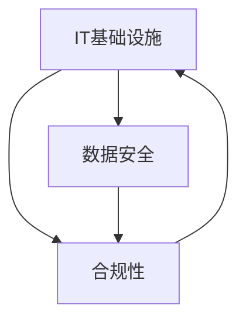

# 专业技术能力培养：深入了解IT基础设施、数据安全和合规要求

作者：禅与计算机程序设计艺术 / Zen and the Art of Computer Programming

## 1. 背景介绍

### 1.1 问题的由来

在当今数字化转型的时代，企业和组织对IT专业人才的需求日益增长。然而，许多IT从业者在专业技术能力方面仍存在不足，尤其是在IT基础设施、数据安全和合规性方面的知识和实践经验有待提升。这些领域对于确保IT系统的稳定运行、保护敏感数据以及满足法规要求至关重要。

### 1.2 研究现状

目前，业界已经意识到加强IT专业人才的技术能力培养的重要性。许多组织开始投入资源，通过培训、认证等方式来提升员工的专业技能。同时，学术界也在探索创新的教学方法和课程设计，以更好地满足行业对人才的需求。然而，现有的培养方案仍然存在一些不足，如内容不够全面、实践机会有限等问题。

### 1.3 研究意义

深入研究IT基础设施、数据安全和合规性领域的专业技术能力培养，对于提升IT人才的综合素质具有重要意义。通过系统性的学习和实践，IT从业者可以更好地掌握这些领域的核心概念、关键技术和最佳实践，从而更好地支持企业的数字化转型和业务发展。同时，这也有助于推动整个IT行业的健康发展，提高行业整体的专业水平和竞争力。

### 1.4 本文结构

本文将围绕IT基础设施、数据安全和合规性三个主题，深入探讨专业技术能力培养的相关内容。首先，我们将介绍这三个领域的核心概念和它们之间的联系。然后，我们将重点介绍每个领域的关键技术、最佳实践和实际应用场景。同时，我们还将提供一些实用的学习资源和工具推荐，帮助读者进一步提升自己的专业技能。最后，我们将总结未来的发展趋势和面临的挑战，并对未来的研究方向进行展望。

## 2. 核心概念与联系

在讨论IT基础设施、数据安全和合规性的专业技术能力培养之前，我们需要先了解这三个领域的核心概念以及它们之间的联系。

IT基础设施是指支持企业IT系统运行的硬件、软件、网络和服务的总和。它包括服务器、存储设备、网络设备、操作系统、中间件、数据库等各种组件。IT基础设施的建设和管理直接影响着企业的业务运营和发展。

数据安全是指保护数据的机密性、完整性和可用性，防止数据被未经授权的访问、篡改或破坏。在当今数据驱动的商业环境中，数据已经成为企业的核心资产之一。确保数据安全对于维护企业的竞争优势和声誉至关重要。

合规性是指遵守法律法规、行业标准和内部政策的要求。随着数据隐私保护法律的出台和监管力度的加强，合规性已经成为企业IT管理中不可或缺的一部分。违反合规要求不仅会导致法律风险，还可能对企业的声誉和业务造成严重影响。

这三个领域之间存在着紧密的联系。IT基础设施是数据安全和合规性的基础。只有建立起安全可靠的IT基础设施，才能为数据安全提供坚实的保障，也才能满足各种合规性要求。同时，数据安全和合规性的要求也对IT基础设施的建设和管理提出了更高的要求，推动了IT基础设施的不断发展和完善。

下面是一张Mermaid流程图，展示了IT基础设施、数据安全和合规性之间的关系：



从图中可以看出，IT基础设施、数据安全和合规性三者之间相互依存、相互促进，共同构成了企业IT管理的重要组成部分。

## 3. 核心算法原理 & 具体操作步骤

### 3.1 算法原理概述

在IT基础设施、数据安全和合规性领域，有许多重要的算法和技术被广泛应用。下面我们将重点介绍几个核心算法的原理。

1. 对称加密算法（如AES）：对称加密算法使用同一个密钥进行加密和解密。它的优点是加解密速度快，适合对大量数据进行加密。但是，密钥管理和分发是其面临的主要挑战。

2. 非对称加密算法（如RSA）：非对称加密算法使用一对密钥，即公钥和私钥。公钥用于加密，私钥用于解密。它解决了密钥分发的问题，但加解密速度较慢，适合对少量数据进行加密。

3. 哈希算法（如SHA-256）：哈希算法将任意长度的数据映射为固定长度的哈希值。它可以用于验证数据的完整性，以及存储密码的安全散列值。

4. 数字签名算法（如ECDSA）：数字签名算法使用私钥对数据进行签名，公钥用于验证签名。它可以确保数据的真实性和不可抵赖性。

5. 访问控制算法（如RBAC）：访问控制算法通过定义用户的角色和权限，控制用户对资源的访问。它可以有效地管理用户权限，提高系统安全性。

### 3.2 算法步骤详解

以AES算法为例，我们来详细介绍其加密和解密的步骤。

AES加密过程：
1. 密钥扩展：根据原始密钥生成轮密钥。
2. 初始轮：将明文与初始轮密钥进行异或运算。
3. 中间轮：对状态数组进行字节代换、行移位、列混淆和轮密钥加等操作，重复多轮。
4. 最终轮：对状态数组进行字节代换、行移位和轮密钥加操作，得到密文。

AES解密过程与加密过程相反，使用轮密钥的逆序，对密文进行逆向操作即可得到明文。

### 3.3 算法优缺点

以下是几种常见算法的优缺点比较：

| 算法 | 优点 | 缺点 |
|------|------|------|
| AES | 加解密速度快，安全性高 | 密钥管理困难 |
| RSA | 解决密钥分发问题 | 加解密速度慢 |
| SHA-256 | 生成固定长度哈希值，验证数据完整性 | 存在哈希碰撞的可能性 |
| ECDSA | 签名短，验证快 | 依赖椭圆曲线的安全性 |
| RBAC | 细粒度的权限控制 | 角色和权限管理复杂 |

### 3.4 算法应用领域

这些算法在IT基础设施、数据安全和合规性领域有广泛的应用，例如：

- AES和RSA用于数据加密和安全传输
- SHA-256用于存储密码和验证数据完整性
- ECDSA用于数字证书和SSL/TLS握手过程
- RBAC用于操作系统和应用程序的权限管理

## 4. 数学模型和公式 & 详细讲解 & 举例说明

### 4.1 数学模型构建

在密码学和安全领域，许多算法都基于复杂的数学模型。下面我们以RSA算法为例，介绍其背后的数学模型。

RSA算法基于以下数学事实：
- 寻找两个大质数$p$和$q$的乘积$n=pq$是容易的。
- 已知$n$，寻找$p$和$q$是困难的（大整数分解问题）。
- 欧拉函数$\phi(n)=(p-1)(q-1)$，表示小于$n$且与$n$互质的正整数个数。
- 选择整数$e$，使得$1<e<\phi(n)$，且$gcd(e,\phi(n))=1$。
- 计算$d$，使得$ed\equiv1\pmod{\phi(n)}$。
- 公钥为$(n,e)$，私钥为$(n,d)$。

加密过程：$c\equiv m^e\pmod n$
解密过程：$m\equiv c^d\pmod n$

### 4.2 公式推导过程

下面我们来推导RSA算法中的解密公式。

已知：
- 公钥$(n,e)$，私钥$(n,d)$
- 加密后的密文$c\equiv m^e\pmod n$

要证明：$m\equiv c^d\pmod n$

证明过程：
1. 由加密过程可知：$c\equiv m^e\pmod n$
2. 两边同时取$d$次幂：$c^d\equiv (m^e)^d\pmod n$
3. 由模运算性质可得：$c^d\equiv m^{ed}\pmod n$
4. 由$ed\equiv1\pmod{\phi(n)}$可知，存在整数$k$，使得$ed=k\phi(n)+1$
5. 将其代入上式：$c^d\equiv m^{k\phi(n)+1}\pmod n$
6. 由欧拉定理可知，若$gcd(m,n)=1$，则$m^{\phi(n)}\equiv1\pmod n$
7. 因此：$c^d\equiv m\cdot(m^{\phi(n)})^k\equiv m\cdot1^k\equiv m\pmod n$

故得证。

### 4.3 案例分析与讲解

下面我们来举一个RSA加密和解密的具体例子。

假设我们选择两个质数$p=3$和$q=11$，则：
- $n=pq=33$
- $\phi(n)=(p-1)(q-1)=20$
- 选择$e=3$，满足$1<e<\phi(n)$且$gcd(e,\phi(n))=1$
- 计算$d=7$，满足$ed\equiv1\pmod{\phi(n)}$，即$3\times7\equiv1\pmod{20}$

所以，公钥为$(33,3)$，私钥为$(33,7)$。

假设我们要加密明文$m=5$，则：
- 加密：$c\equiv m^e\pmod n\equiv5^3\pmod{33}\equiv14$
- 解密：$m\equiv c^d\pmod n\equiv14^7\pmod{33}\equiv5$

可见，解密后得到的结果与原始明文一致，验证了RSA算法的正确性。

### 4.4 常见问题解答

Q: RSA的安全性基于什么假设？
A: RSA的安全性基于大整数分解问题的困难性。目前还没有发现在多项式时间内解决大整数分解问题的算法。

Q: RSA加密和解密的计算量如何？
A: RSA加密和解密需要进行大整数的模幂运算，计算量较大。一般使用中，RSA常用于加密少量数据（如密钥），而不直接用于加密大量数据。

Q: 如何选择RSA的公钥和私钥？
A: 需要选择两个足够大的质数$p$和$q$，一般要求它们的乘积$n$至少有1024位。公钥$e$可以选择一个较小的值（如65537），私钥$d$则需要通过扩展欧几里得算法计算得到。

## 5. 项目实践：代码实例和详细解释说明

### 5.1 开发环境搭建

在进行项目实践之前，我们需要搭建好开发环境。以下是一些常用的工具和库：

- 编程语言：Python、Java、C++等
- 密码学库：OpenSSL、Crypto++、PyCryptodome等
- 开发工具：Visual Studio Code、PyCharm、Eclipse等

下面以Python和PyCryptodome库为例，介绍如何安装和配置开发环境。

1. 安装Python：从官网下载并安装适合自己操作系统的Python版本。
2. 安装PyCryptodome库：在命令行中执行以下命令：
   ```
   pip install pycryptodome
   ```
3. 配置IDE：选择一个适合的Python IDE（如PyCharm），并创建一个新的Python项目。

### 5.2 源代码详细实现

下面我们来实现一个简单的RSA加密和解密的示例代码。

```python
from Crypto.PublicKey import RSA
from Crypto.Cipher import PKCS1_OAEP

# 生成RSA密钥对
key = RSA.generate(2048)
private_key = key.export_key()
public_key = key.publickey().export_key()

# 加