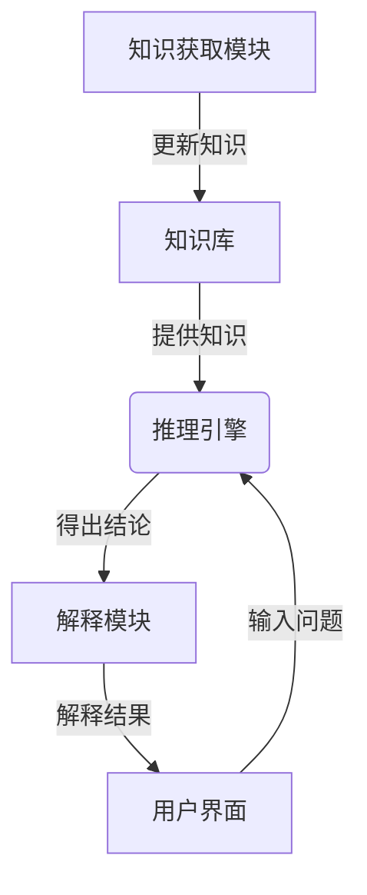

# 专家系统 原理与代码实例讲解

## 1. 背景介绍

### 1.1 问题的由来

在现代社会中,随着知识的快速积累和日益复杂的问题出现,人类专家在某些特定领域的知识和经验已经变得难以完全掌握。传统的基于规则的系统往往缺乏灵活性,难以适应不断变化的环境和新出现的情况。因此,开发一种能够模拟人类专家推理过程,并提供智能决策支持的系统变得越来越重要。

专家系统(Expert System)应运而生,旨在捕获并保存人类专家在特定领域的知识和经验,通过推理机制为用户提供智能化的决策支持和问题解决方案。它们被广泛应用于医疗诊断、金融分析、故障诊断、规划和设计等各个领域。

### 1.2 研究现状

早期的专家系统主要基于规则推理(Rule-Based Reasoning)技术,通过构建一系列 IF-THEN 规则来表示知识,并使用推理引擎对规则进行匹配和执行。虽然这种方法在某些领域取得了成功,但它也存在一些局限性,例如知识获取困难、维护成本高、推理效率低等问题。

随着人工智能技术的不断发展,新的推理方法和知识表示形式被引入专家系统中。例如,基于案例推理(Case-Based Reasoning)的专家系统利用过去解决问题的经验来处理新的情况;基于模型推理(Model-Based Reasoning)的专家系统则使用定性或定量模型来描述问题域中的对象和过程。

近年来,机器学习和深度学习技术的兴起也为专家系统带来了新的发展机遇。一些研究人员尝试将神经网络等机器学习模型集成到专家系统中,以提高其学习和推理能力。此外,语义网技术和本体论(Ontology)也被应用于知识表示和推理,以提高专家系统的可解释性和可扩展性。

### 1.3 研究意义

专家系统在各个领域都发挥着重要作用,它们可以:

1. 保存和传播人类专家的宝贵知识和经验,避免知识流失。
2. 提供一致且高质量的决策支持,减少人为错误。
3. 提高工作效率,加快决策过程。
4. 降低培训和咨询成本。
5. 支持复杂问题的解决,扩展人类专家的能力。

因此,研究和开发更加智能、高效和可靠的专家系统对于提高生产力、优化资源配置和支持决策至关重要。

### 1.4 本文结构

本文将全面介绍专家系统的原理和实现方法。首先,我们将探讨专家系统的核心概念和架构,包括知识库、推理引擎和用户界面等组件。然后,我们将重点讨论基于规则的推理算法,并详细解释其工作原理和实现步骤。

接下来,我们将介绍专家系统中常用的数学模型和公式,包括贝叶斯网络、决策树和模糊逻辑等,并通过案例分析加深理解。

在实践部分,我们将提供一个基于 Python 的专家系统示例项目,包括开发环境搭建、代码实现和运行结果展示。

最后,我们将探讨专家系统在不同领域的实际应用场景,介绍相关工具和学习资源,并总结未来发展趋势和面临的挑战。

## 2. 核心概念与联系

专家系统是一种基于知识的智能系统,它模拟人类专家的推理过程,为用户提供智能决策支持。一个典型的专家系统由以下几个核心组件组成:

1. **知识库(Knowledge Base)**: 存储领域知识的核心数据库,包括事实(Facts)、规则(Rules)和案例(Cases)等。知识库是专家系统的核心,它决定了系统的智能水平和决策质量。

2. **推理引擎(Inference Engine)**: 根据知识库中的知识和规则,执行推理过程,得出结论或建议。推理引擎是专家系统的大脑,它决定了系统的推理能力和效率。常见的推理机制包括基于规则的推理、基于案例的推理、基于模型的推理等。

3. **知识获取模块(Knowledge Acquisition Module)**: 从人类专家或其他来源获取领域知识,并将其转换为可以存储在知识库中的形式。知识获取是构建专家系统的关键步骤,它决定了知识库的质量和完整性。

4. **解释模块(Explanation Module)**: 向用户解释推理过程和结果,提高系统的透明度和可解释性。良好的解释能力有助于用户理解和接受系统的建议。

5. **用户界面(User Interface)**: 提供友好的交互界面,方便用户输入问题、查看结果和获取解释。良好的用户界面可以提高系统的可用性和用户体验。

这些组件紧密协作,共同构成了一个完整的专家系统。知识库为推理引擎提供了所需的知识;推理引擎根据知识库中的规则和事实进行推理,得出结论或建议;知识获取模块持续更新和扩展知识库;解释模块向用户解释推理过程和结果;用户界面则提供了与用户交互的通道。

专家系统的核心在于捕获和表示人类专家的知识,并通过推理机制对该知识进行有效利用,从而为用户提供智能决策支持。因此,知识的获取、表示和推理是专家系统研究的重点领域。

## 3. 核心算法原理 & 具体操作步骤

### 3.1 算法原理概述

基于规则的推理(Rule-Based Reasoning)是专家系统中最常见的推理机制之一。它通过构建一系列 IF-THEN 规则来表示知识,并使用推理引擎对这些规则进行匹配和执行,从而得出结论或建议。

基于规则的推理算法的核心思想是:

1. 将人类专家的知识和经验转化为一组规则,存储在知识库中。
2. 当用户提出问题时,推理引擎会根据当前的事实和规则进行推理。
3. 推理过程包括两个主要步骤:匹配(Match)和执行(Execute)。
   - 匹配阶段:推理引擎会检查每条规则的前提(Premise)部分是否与当前事实相匹配。
   - 执行阶段:对于匹配成功的规则,推理引擎会执行其结论(Conclusion)部分,得出新的事实或建议。
4. 推理过程会不断重复,直到无法再推导出新的事实或达到目标状态。

根据推理策略的不同,基于规则的推理可以分为两种主要类型:

1. **前向链推理(Forward Chaining)**: 从已知事实出发,不断应用规则推导出新的事实,直到达到目标状态或无法继续推理。这种方式常用于监控和控制类应用。

2. **后向链推理(Backward Chaining)**: 从一个假设的目标出发,不断寻找支持该目标的规则和事实,直到所有前提都被证实或无法继续推理。这种方式常用于诊断和解释类应用。

基于规则的推理算法具有以下优点:

- 易于理解和实现,符合人类的推理习惯。
- 知识和推理过程具有很好的可解释性和透明度。
- 可以处理不确定性和模糊性知识。
- 易于维护和扩展知识库。

但它也存在一些局限性:

- 知识获取困难,需要大量的人工工作。
- 推理效率较低,尤其是在规则数量庞大时。
- 难以处理复杂的数学模型和量化知识。
- 规则之间可能存在冲突或循环依赖。

### 3.2 算法步骤详解

以下是基于规则的前向链推理算法的具体步骤:

1. **初始化**
   - 从知识库中加载所有规则和初始事实。
   - 创建一个空的议程列表(Agenda)用于存储待执行的规则。
   - 创建一个事实列表(Facts)用于存储已推导出的事实。

2. **匹配循环**
   - 对于每条规则:
     - 检查规则的前提部分是否与当前事实列表中的事实相匹配。
     - 如果匹配成功,将该规则添加到议程列表中。
   - 如果议程列表为空,则推理过程结束。

3. **执行循环**
   - 从议程列表中选择一条规则执行。
   - 将该规则的结论部分添加到事实列表中。
   - 从议程列表中移除已执行的规则。
   - 返回步骤2,继续匹配循环。

4. **结果输出**
   - 当推理过程结束时,事实列表中的内容就是推理得到的最终结论。

以下是基于规则的后向链推理算法的具体步骤:

1. **初始化**
   - 从知识库中加载所有规则。
   - 设置一个目标事实(Goal)。
   - 创建一个议程列表(Agenda)用于存储待证明的子目标。
   - 将目标事实添加到议程列表中。

2. **匹配循环**
   - 从议程列表中选择一个子目标。
   - 查找所有可以推导出该子目标的规则。
   - 对于每条规则:
     - 如果规则的结论部分匹配当前子目标,则将规则的前提部分添加到议程列表中作为新的子目标。
   - 如果议程列表为空,则推理过程结束。

3. **执行循环**
   - 对于议程列表中的每个子目标:
     - 如果该子目标已经是一个已知事实,则将其从议程列表中移除。
     - 否则,继续匹配循环,尝试证明该子目标。
   - 如果所有子目标都被证实,则原始目标也被证实。

4. **结果输出**
   - 如果原始目标被证实,则输出成功结果。
   - 否则,输出失败结果。

这些算法步骤展示了基于规则的推理在专家系统中的工作原理。实际实现时,还需要考虑规则冲突解决、不确定性处理、优化策略等问题,以提高推理的效率和质量。

### 3.3 算法优缺点

基于规则的推理算法具有以下优点:

1. **符合人类推理习惯**: 基于规则的推理算法模拟了人类专家的推理过程,使用 IF-THEN 规则来表示知识,易于理解和解释。

2. **知识表示灵活**: 规则可以表示各种形式的知识,包括定性和定量知识、确定性和不确定性知识等。

3. **可解释性强**: 推理过程是透明的,可以追溯到具体的规则和事实,从而提高系统的可解释性和用户信任度。

4. **知识库可维护**: 规则的模块化结构使得知识库易于维护和扩展,可以根据需求添加、修改或删除规则。

5. **处理不确定性**: 通过引入置信度(Confidence)或概率(Probability)等措施,基于规则的推理算法可以处理不确定性知识。

然而,基于规则的推理算法也存在一些缺点:

1. **知识获取困难**: 从人类专家那里获取并正式化知识是一个耗时且容易出错的过程,需要大量的人工工作。

2. **推理效率较低**: 当规则数量庞大时,匹配和执行规则的过程可能会变得非常缓慢,影响推理效率。

3. **规则冲突和循环依赖**: 在复杂的知识库中,可能会出现规则之间的冲突或循环依赖,需要特殊的策略来解决这些问题。

4. **知识表示局限性**: 规则形式难以表示某些复杂的数学模型和量化知识,需要与其他表示形式(如语义网络、框架等)结合使用。

5. **可扩展性有限**: 随着问题域的扩大,规则数量会快速增加,导致知识库变得庞大且难以维护。

因此,在实际应用