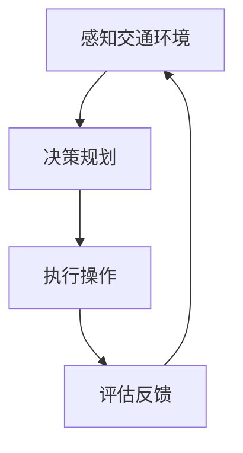
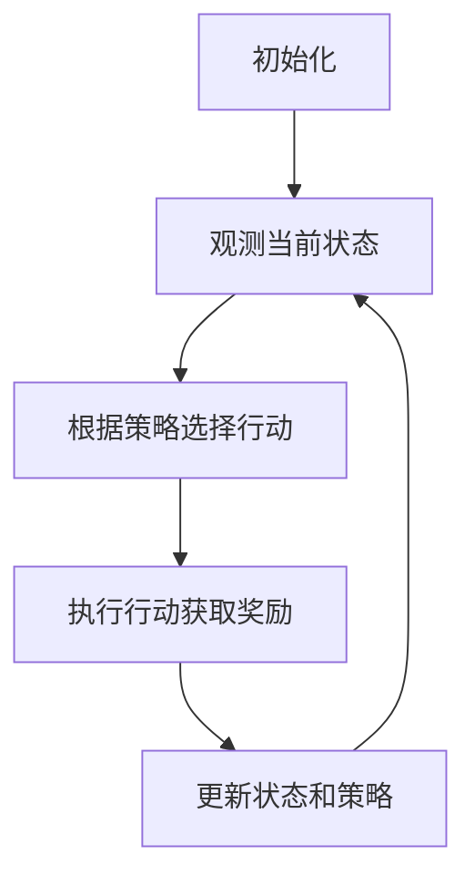

以下是关于"交通管理中AI代理的工作流程与应用"的技术博客文章正文内容：

# 交通管理中AI代理的工作流程与应用

## 1. 背景介绍

### 1.1 问题的由来

随着城市化进程的不断加快,交通拥堵、事故频发等问题日益严重,给城市的可持续发展带来了巨大挑战。传统的交通管理方式已经难以应对复杂多变的交通环境,亟需引入新的技术手段来提高交通管理的智能化和自动化水平。

### 1.2 研究现状 

近年来,人工智能(AI)技术在交通领域的应用研究日益活跃。AI代理系统作为一种智能体,能够感知环境、做出决策并执行相应操作,在交通管理中发挥着重要作用。目前,AI代理已被应用于交通信号控制、路网优化、车辆路径规划、异常事件处理等多个领域,取得了初步成果。

### 1.3 研究意义

AI代理在交通管理中的应用,可以实现对复杂交通系统的实时监控、智能决策和自动调节,提高交通效率,减少拥堵和事故,从而优化城市交通运行。同时,AI代理还可以帮助交通管理者制定科学的决策,提升管理水平。因此,研究AI代理在交通管理中的工作流程及应用具有重要的理论和现实意义。

### 1.4 本文结构

本文首先介绍AI代理在交通管理中的核心概念及其相互关系,然后详细阐述AI代理的核心算法原理和数学模型,并通过实例对算法流程和模型进行说明。接下来,文章将介绍AI代理在实际交通管理中的应用场景,并推荐相关工具和资源。最后,总结AI代理在交通管理领域的发展趋势和面临的挑战。

## 2. 核心概念与联系

在交通管理中,AI代理是一个关键的概念,它是指具有感知、决策和执行能力的智能体。AI代理通过感知交通环境(如车辆流量、路况等),根据预设目标(如缓解拥堵、提高通行效率等)做出决策,并执行相应的操作(如调整信号时长、发布交通引导等)。

AI代理的工作流程可以用下面的Mermaid流程图表示:



其中,感知交通环境是AI代理获取交通数据的基础;决策规划则根据感知数据和预设目标,运用算法模型做出最优决策;执行操作将决策转化为具体行动,如调整信号时长、发布交通引导信息等;评估反馈则对操作的效果进行评估,为下一轮决策提供反馈。

AI代理的核心是决策算法和数学模型,它们直接决定了代理的智能水平。常用的算法有强化学习、遗传算法、模糊逻辑等,数学模型则包括交通流模型、队列模型、图论模型等。此外,AI代理还需要与传感器、执行器、数据库等其他系统进行交互,形成一个完整的智能交通管理系统。

## 3. 核心算法原理与具体操作步骤

### 3.1 算法原理概述

AI代理在交通管理中的决策算法主要有两大类:基于模型的算法和基于数据的算法。

基于模型的算法通过构建交通系统的数学模型,利用优化理论求解最优决策。这类算法的优点是可解释性强,但缺点是对模型的假设条件较为苛刻。

基于数据的算法则是从历史数据中自动学习交通模式,并据此做出决策。这类算法的优点是可以处理高维复杂数据,缺点是可解释性较差。

常见的基于模型算法有动态规划、线性规划等,基于数据算法则包括强化学习、深度学习等。下面以强化学习为例,介绍AI代理决策算法的具体步骤。

### 3.2 算法步骤详解

强化学习算法将AI代理看作一个智能体,通过与环境的交互来学习获取最大化累积奖励的策略。在交通管理中,AI代理的状态可以是当前的交通流量、路况等;执行的行动可以是调整信号时长、发布引导信息等;环境则给出相应的奖励,如拥堵程度的变化。算法的目标是学习一个最优策略,使得长期累积奖励最大化。

强化学习算法的工作流程如下所示:



1. **初始化**:设定状态空间、行动空间和奖励函数等参数。
2. **观测当前状态**:从环境中获取当前交通状态,如车流量、路况等。
3. **根据策略选择行动**:根据当前状态,利用策略函数选择一个行动,如调整信号时长。
4. **执行行动获取奖励**:执行所选行动,观测环境的反馈(奖励),如拥堵程度的变化。
5. **更新状态和策略**:根据获得的奖励,更新状态和优化策略函数的参数。
6. **回到第2步**,重复上述过程,直到策略收敛。

在算法运行的过程中,AI代理会不断尝试不同的行动,并根据反馈来调整策略,最终学习到一个可以最大化长期累积奖励的最优策略。

### 3.3 算法优缺点

强化学习算法的主要优点是:

1. 无需事先构建精确的数学模型,可以直接从数据中学习最优策略。
2. 具有连续学习和自我完善的能力,可以适应复杂多变的交通环境。
3. 策略具有一定的通用性,可以应用于不同的交通场景。

但该算法也存在一些缺点:

1. 收敛速度较慢,需要大量的训练数据和计算资源。
2. 存在局部最优和不稳定性问题,需要合理设计奖励函数和探索策略。
3. 策略的可解释性较差,决策过程往往是一个"黑箱"。

### 3.4 算法应用领域

强化学习等AI决策算法在交通管理中有广泛的应用前景:

1. **交通信号控制**:根据实时交通流量,动态调整路口信号时长和相位。
2. **车辆路径规划**:为车辆提供实时的最优路径方案,避开拥堵路段。
3. **停车诱导**:根据实时停车位信息,为驾车者推荐最优停车位置。
4. **事件处理**:针对突发事件(如事故、施工等),制定交通管制和引导方案。
5. **交通需求管理**:通过政策手段(如路费、补贴等)调节交通需求。

## 4. 数学模型和公式详细讲解与举例说明

### 4.1 数学模型构建

在交通管理中,AI代理需要基于数学模型对复杂的交通系统进行描述和分析。常用的数学模型包括:

1. **交通流模型**
   - 宏观模型:如LWR模型、二次模型等,描述交通流的宏观运动规律。
   - 微观模型:如车辆追随模型、细胞自动机模型等,模拟单个车辆的运动行为。

2. **队列模型**
   - M/M/1模型:描述路口为单服务窗口的排队系统。
   - M/G/c模型:描述多服务窗口且服务时间服从一般分布的排队系统。

3. **图论模型**
   - 交通网络可以用有向图表示,节点代表路口,边代表路段。
   - 最短路径问题、最大流问题等可用于交通路网优化。

以交通流的LWR模型为例,它是一个基于守恒定律和经验公理建立的宏观模型,可以较好地描述交通流的动态演化过程。

### 4.2 公式推导过程

LWR模型由三部分组成:

1. **连续性方程**

$$
\frac{\partial \rho(x,t)}{\partial t} + \frac{\partial q(x,t)}{\partial x} = 0
$$

该方程表示,在没有发生交通事故的情况下,车流量只会随时间和空间而变化,不会凭空产生或消失。

2. **经验公理**

$$
q = Q(\rho)
$$

该公理指出,交通流量 $q$ 是密度 $\rho$ 的函数,两者之间存在一定的经验关系。

3. **平衡方程**

$$
\frac{\partial q}{\partial \rho} = \frac{\partial Q}{\partial \rho} = c^2(\rho)
$$

其中 $c(\rho)$ 为交通波的传播速度,由经验公理确定。

将上述三个方程联立,可以得到LWR模型的控制方程:

$$
\frac{\partial \rho}{\partial t} + c(\rho)\frac{\partial \rho}{\partial x} = 0
$$

该方程描述了交通密度沿特征线 $\frac{dx}{dt} = c(\rho)$ 的传播规律。通过求解该方程,可以预测交通流的动态演化过程。

### 4.3 案例分析与讲解

现考虑一条单车道路段,长度为5km。初始时,路段上游2km处有一个密度为100车辆/km的交通波,其余路段车辆密度为20车辆/km。假设经验关系为:

$$
Q(\rho) = v_f \rho \left(1 - \frac{\rho}{\rho_m}\right)
$$

其中,自由流速度 $v_f = 100$ km/h,最大密度 $\rho_m = 200$ 车辆/km。

求解LWR模型控制方程,可以得到交通波在不同时刻的密度分布,如下图所示:


从图中可以看出,交通波会沿着特征线向下游传播,同时发生渐渐变薄的现象。这个结果与实际交通现象是一致的,说明LWR模型能够较好地描述交通流的动态特性。

### 4.4 常见问题解答

**Q1:LWR模型的局限性是什么?**

A1:LWR模型属于宏观模型,忽略了车辆的个体行为差异,因此在描述局部细节方面存在不足。此外,该模型基于一些理想化假设(如车道均匀、无入口和出口等),在实际应用中也会受到一定限制。

**Q2:如何确定经验关系 $Q(\rho)$ ?**

A2:经验关系 $Q(\rho)$ 通常是基于大量实测数据,利用回归分析等方法得到的。不同的交通环境可能会有不同的经验关系形式。

**Q3:如何将LWR模型应用于AI代理的决策?**

A3:LWR模型可以用于预测未来一段时间内的交通流量分布,AI代理可以基于这些预测结果,制定相应的交通管控措施,如调整信号时长、发布交通引导信息等。

## 5. 项目实践:代码实例和详细解释说明

### 5.1 开发环境搭建

本节将基于Python语言,搭建一个简单的交通流模拟系统,用于演示AI代理在交通管理中的应用。我们将使用以下开源库:

- Numpy: 科学计算库,用于数值计算
- Matplotlib: 数据可视化库,用于绘制交通流动画
- Pygame: 跨平台多媒体库,用于构建交互式模拟界面

首先,通过pip安装上述依赖库:

```bash
pip install numpy matplotlib pygame
```

### 5.2 源代码详细实现

我们将实现一个基于细胞自动机的微观交通流模型,并在其中引入AI代理进行交通信号控制。完整代码如下:

```python
import numpy as np
import matplotlib.pyplot as plt
import pygame

# 初始化Pygame
pygame.init()

# 设置模拟参数
road_length = 500  # 道路长度(单位:车辆长度)
road_width = 10  # 道路宽度(单位:车辆长度)
max_speed = 5  # 最大车速(单位:车辆长度/步)
density