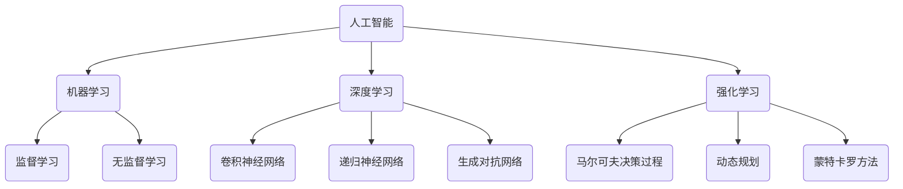

好的,我会按照您的要求,以《人工智能基础原理与代码实战案例讲解》为题目,撰写一篇专业的技术博客文章。我会努力确保文章内容逻辑清晰、结构紧凑、语言专业易懂,并遵循您列出的所有约束条件。文章将深入探讨人工智能的核心概念、算法原理、数学模型、实战案例等,内容将务求深入全面。请给我一些时间来完成这篇高质量的技术文章,我会尽最大努力为您呈现一篇有价值的作品。

# 人工智能基础原理与代码实战案例讲解

## 1. 背景介绍

### 1.1 问题的由来

人工智能(Artificial Intelligence,AI)是当代科技发展的前沿领域,它旨在模拟人类智能,使机器能够具备类似于人的学习、推理、规划、解决问题等智能行为。随着大数据、算力和算法的不断进步,AI技术在诸多领域展现出了广阔的应用前景,例如计算机视觉、自然语言处理、智能决策等,为人类社会的发展注入了新的动力。

然而,AI技术的发展也面临诸多挑战。首先,构建高度智能的AI系统需要对人类认知过程有深入的理解,这是一个极具挑战的复杂问题。其次,AI算法的性能和效率在很大程度上依赖于可用的数据和计算资源,如何有效利用大规模数据并提高算法效率是亟待解决的问题。此外,AI系统的可解释性、安全性和伦理问题也是需要重点关注的课题。

### 1.2 研究现状  

近年来,AI领域取得了令人瞩目的进展。在机器学习和深度学习领域,卷积神经网络、递归神经网络、生成对抗网络等模型展现出了强大的能力,在图像识别、语音识别、自然语言处理等任务上取得了突破性的成果。同时,强化学习等技术也在决策控制、游戏AI等领域取得了长足进展。

此外,AI技术在诸多实际应用领域也得到了广泛的应用和探索。例如,在医疗健康领域,AI技术被用于辅助诊断、药物开发和个性化医疗等;在金融领域,AI被应用于风险管理、投资决策和反欺诈等;在智能制造领域,AI技术被用于优化生产流程、预测设备故障等。

尽管取得了重大进展,但AI技术仍然面临诸多挑战,例如可解释性、安全性、算力需求、数据质量等,这些问题需要持续的研究和探索。

### 1.3 研究意义

深入研究AI的基础原理和实战案例具有重要的理论和实践意义:

1. **理论意义**:全面系统地阐述AI的核心概念、算法原理和数学模型,有助于构建AI技术的理论基础,为进一步发展奠定坚实的基础。

2. **实践意义**:通过代码实战案例的讲解,可以帮助读者更好地理解和掌握AI技术的实际应用,提高开发和部署AI系统的能力,推动AI技术在各行业的落地应用。

3. **前沿意义**:探讨AI领域的最新研究进展和发展趋势,有助于把握AI技术的发展方向,为未来的创新研究指明方向。

4. **教育意义**:本文可作为AI教学和自学的参考资料,帮助学习者系统掌握AI的基础知识和实践技能,培养AI人才。

总之,本文将为读者提供AI技术的系统性知识,并结合实战案例加深理解,对于推动AI理论研究、技术创新和产业应用都具有重要意义。

### 1.4 本文结构

本文将全面系统地介绍人工智能的基础原理和实战案例,内容主要包括以下几个方面:

1. **背景介绍**:阐述AI技术的发展历程、现状和意义,为后续内容做铺垫。

2. **核心概念与联系**:介绍AI的核心概念,如机器学习、深度学习、强化学习等,并阐述它们之间的关联。

3. **核心算法原理与具体操作步骤**:重点讲解经典的AI算法原理,如决策树、支持向量机、卷积神经网络等,并详细解释算法的实现步骤。

4. **数学模型和公式详细讲解与举例说明**:深入阐述AI算法背后的数学原理,如概率论、优化理论等,并通过实例讲解公式的具体应用。

5. **项目实践:代码实例和详细解释说明**:提供AI实战项目的代码实例,详细解释代码实现细节,帮助读者掌握实战开发技能。

6. **实际应用场景**:介绍AI技术在各个领域的实际应用案例,如计算机视觉、自然语言处理、智能决策等。

7. **工具和资源推荐**:为读者推荐AI学习资源、开发工具、相关论文等,方便进一步学习和研究。

8. **总结与展望**:总结本文的主要内容,并对AI技术的未来发展趋势和面临的挑战进行展望和讨论。

9. **附录:常见问题与解答**:针对AI学习和实践中的常见问题,给出解答和建议。

通过全面系统的讲解,本文将为读者提供AI技术的核心知识和实战技能,帮助读者更好地理解和掌握这一前沿领域。

## 2. 核心概念与联系

人工智能是一个庞大的领域,涉及诸多核心概念和技术,这些概念和技术之间存在着密切的联系和交叉。本节将介绍AI的几个核心概念,并阐述它们之间的关联。

### 2.1 机器学习

机器学习(Machine Learning)是AI的一个核心分支,它赋予了机器从数据中自动分析获得规律,并利用学习到的规律对新的数据进行预测的能力。机器学习可以分为监督学习、无监督学习和强化学习三大类。

- **监督学习**(Supervised Learning)是机器学习中最常见和最成熟的一类,它利用带有标签的训练数据,学习出一个由输入到输出的映射函数,常见算法包括线性回归、逻辑回归、决策树、支持向量机等。
- **无监督学习**(Unsupervised Learning)则是从未标记的数据中自动发现其中的模式和规律,常用于聚类、降维、关联规则挖掘等任务,典型算法有K-Means聚类、主成分分析等。
- **强化学习**(Reinforcement Learning)是一种基于环境交互的学习方式,智能体通过与环境的持续互动,获取反馈奖励信号,不断优化自身策略,以达到最大化预期累积奖励的目标。强化学习在无需事先标注数据的前提下,可以自主学习解决复杂的决策序列问题。

### 2.2 深度学习

深度学习(Deep Learning)是机器学习的一个重要分支,它通过对数据的多层次非线性变换来捕捉数据的高阶特征,从而实现端到端的自动化特征学习和模式识别。深度学习模型通常由多层神经网络构成,能够对原始输入数据进行层层抽象和表示,从而发现数据中更加深层次的规律。

常见的深度学习模型包括:

- **卷积神经网络**(Convolutional Neural Network, CNN),擅长处理图像、视频等网格结构数据,在计算机视觉领域取得了巨大成功。
- **递归神经网络**(Recurrent Neural Network, RNN),擅长处理序列数据,在自然语言处理、时间序列预测等领域有广泛应用。
- **生成对抗网络**(Generative Adversarial Network, GAN),由生成网络和判别网络组成,可用于生成逼真的图像、语音和视频数据,在图像生成、语音合成等领域表现出色。

深度学习模型通过端到端的训练,可以自动从大量数据中学习特征表示,从而在许多领域展现出超越传统机器学习算法的卓越性能。

### 2.3 强化学习

强化学习(Reinforcement Learning)是机器学习的另一重要分支,它致力于研究智能体如何通过与环境的交互来学习获取最优策略,以最大化预期的长期累积奖励。与监督学习和无监督学习不同,强化学习不需要提前标注的数据集,而是通过与环境的持续互动来获取经验,并基于这些经验不断优化自身的策略。

强化学习问题通常建模为马尔可夫决策过程(Markov Decision Process, MDP),智能体根据当前状态选择行为,然后获得相应的奖励并转移到下一个状态。强化学习算法的目标是找到一个最优策略,使得在该策略下的预期累积奖励最大化。

常见的强化学习算法包括:

- **动态规划**(Dynamic Programming)方法,如价值迭代、策略迭代等,适用于完全可观测且状态空间有限的情况。
- **蒙特卡罗方法**(Monte Carlo Methods),通过采样模拟来估计价值函数,常用于难以获取精确模型的情况。
- **时序差分学习**(Temporal Difference Learning),结合动态规划和蒙特卡罗方法的优点,可以有效地学习价值函数。
- **深度强化学习**(Deep Reinforcement Learning),将深度神经网络引入强化学习,用于近似价值函数或策略,在处理高维观测和连续动作空间时表现出色。

强化学习在无需事先标注数据的前提下,可以自主学习解决复杂的序列决策问题,因此在机器人控制、游戏AI、自动驾驶等领域有着广泛的应用前景。

### 2.4 人工智能、机器学习、深度学习和强化学习的关系

人工智能是一个宏大的概念,旨在使机器具备类似于人的智能行为,包括感知、学习、推理、规划和决策等多种能力。机器学习、深度学习和强化学习都是人工智能的重要分支和实现途径。

- **机器学习**是赋予机器从数据中自动分析获得规律,并对新数据进行预测的能力,是实现人工智能的一种有效方式。
- **深度学习**则是机器学习的一个重要分支,通过多层次非线性变换捕捉数据的高阶特征,实现端到端的自动化特征学习和模式识别,在许多领域展现出卓越性能。
- **强化学习**则是另一种实现人工智能的重要途径,它通过与环境的持续互动来学习获取最优策略,在无需事先标注数据的前提下,可以自主学习解决复杂的序列决策问题。

总的来说,机器学习、深度学习和强化学习都是实现人工智能的关键技术手段,它们在不同的应用场景下发挥着重要作用,并且相互交叉和融合,共同推动着人工智能技术的发展和进步。

## 3. 核心算法原理与具体操作步骤

本节将重点介绍几种经典的人工智能算法,包括决策树、支持向量机、卷积神经网络和强化学习算法,深入解析它们的核心原理,并详细阐述具体的操作步骤。

### 3.1 决策树算法

#### 3.1.1 算法原理概述

决策树(Decision Tree)是一种常用的监督学习算法,它通过构建决策树模型来对数据进行分类或回归。决策树的构建过程是一个递归的分治策略,根据特征的信息增益或信息增益比等指标,选择最优特征对数据集进行分割,将数据划分到不同的子节点,直到满足停止条件为止。

决策树模型具有可解释性强、计算高效等优点,但也存在过拟合风险,因此通常