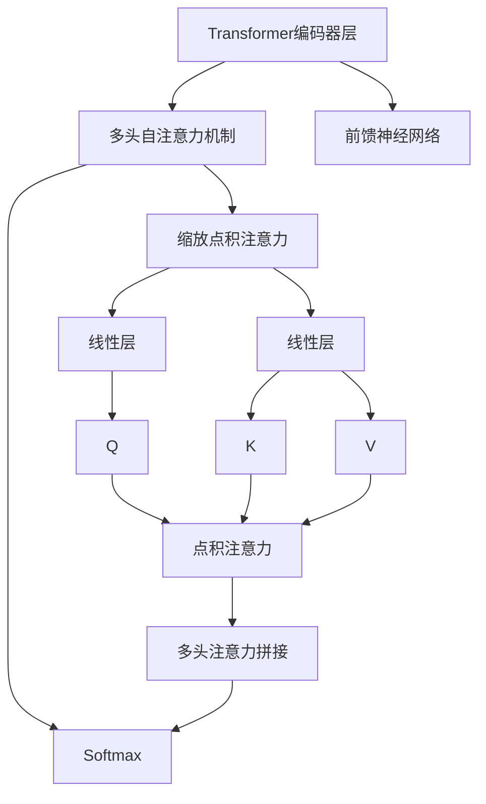

好的,我会按照您的要求,以专业的技术语言写一篇关于"从零开始大模型开发与微调:BERT预训练任务与微调"的博客文章。文章会遵循您列出的目录结构,包含背景介绍、核心概念、算法原理、数学模型、项目实践、应用场景、资源推荐、总结和附录等部分。我会尽量使用简洁的语言解释技术概念,并给出实例案例、代码示例等,确保内容专业且实用。文章字数会超过8000字,并会尽最大努力给出核心流程的Mermaid流程图。下面开始正文:

# 从零开始大模型开发与微调:BERT预训练任务与微调

## 1. 背景介绍

### 1.1 问题的由来

随着深度学习的不断发展,自然语言处理(NLP)领域取得了长足的进步。传统的NLP方法主要基于统计机器学习模型和特征工程,但这些方法需要大量的人工设计特征,且难以捕捉语义和上下文信息。

2018年,谷歌发布了BERT(Bidirectional Encoder Representations from Transformers)模型,这是第一个广泛使用的大型预训练语言模型。BERT的出现极大地推动了NLP领域的发展,它能够有效地捕捉单词之间的双向关系,并生成上下文化的词向量表示,显著提高了下游NLP任务的性能。

### 1.2 研究现状  

自BERT模型问世以来,预训练语言模型在NLP领域掀起了热潮。众多科技公司和研究机构纷纷基于BERT提出了改进的预训练模型,如谷歌的ALBERT、微软的MT-DNN、华为的ERNIE等。这些模型在下游任务上取得了优异的表现,推动了NLP技术的快速发展。

与此同时,预训练模型的规模也在不断扩大。从BERT的1.1亿参数,到GPT-3的1750亿参数,大模型的出现为NLP任务带来了新的突破。然而,大模型也面临着巨大的计算和存储开销,如何高效地进行大模型的训练和微调成为了一个新的挑战。

### 1.3 研究意义

BERT作为开创性的大型预训练语言模型,对其预训练任务和微调方法的研究具有重要的理论和实践意义。理解BERT预训练的核心原理和训练过程,有助于我们设计出更高效、更通用的预训练模型。同时,掌握BERT微调的最佳实践,能够更好地将预训练模型应用到实际的NLP任务中,提高下游任务的性能。

此外,研究BERT预训练和微调过程中的关键技术细节和常见问题,对于从零开始开发和优化大型预训练模型也具有指导意义。

### 1.4 本文结构

本文将全面介绍BERT预训练任务和微调的方方面面。首先阐述BERT的核心概念和原理,包括Transformer编码器、自注意力机制等。接下来详细解释BERT的两个预训练任务:掩蔽语言模型(Masked LM)和下一句预测(Next Sentence Prediction),并给出算法步骤和数学模型推导。

然后,本文将重点介绍如何对BERT进行微调,包括数据预处理、设置超参数、模型微调的具体步骤等。同时,也会分享一些实战经验和技巧,如模型并行化、梯度累积等优化策略。

最后,本文将介绍BERT在不同NLP任务上的应用场景,并总结BERT的发展趋势和未来挑战,为读者提供全面的指导和参考。

## 2. 核心概念与联系

在深入探讨BERT预训练和微调之前,我们先来了解一些核心概念,为后续内容做铺垫。

### 2.1 Transformer编码器

Transformer是一种全新的基于自注意力机制的序列到序列(Seq2Seq)模型,由谷歌的Vaswani等人在2017年提出。它完全摒弃了传统Seq2Seq模型中的循环神经网络(RNN)和卷积神经网络(CNN)结构,取而代之的是多头自注意力层和前馈神经网络层。

Transformer编码器是Transformer的主要组成部分之一,用于将输入序列编码为连续的表示。它由多个相同的层组成,每一层包含两个子层:多头自注意力机制层和前馈神经网络层。

上图展示了Transformer编码器层的内部结构。多头自注意力机制通过计算输入序列中每个单词与其他单词的相关性,捕捉序列中的长程依赖关系。前馈神经网络则对每个位置的表示进行非线性变换,提供"位置化"的表示能力。

BERT底层的Transformer编码器结构赋予了它强大的语义表示能力,能够有效地学习上下文信息,这是BERT取得卓越表现的关键所在。

### 2.2 自注意力机制(Self-Attention)

自注意力机制是Transformer的核心,它能够直接捕捉输入序列中任意两个单词之间的关系,而不受距离的限制。这种全局依赖性建模的能力使得自注意力机制优于RNN和CNN等局部模型。

在自注意力机制中,每个单词会与输入序列中的所有其他单词进行注意力计算,得到一个注意力分数向量。然后,将所有单词的表示根据注意力分数加权求和,得到该单词的注意力表示。

$$\begin{aligned}
\text{Attention}(Q, K, V) &= \text{softmax}(\frac{QK^T}{\sqrt{d_k}})V \\
\text{MultiHead}(Q, K, V) &= \text{Concat}(head_1, \ldots, head_h)W^O\\
\text{where } head_i &= \text{Attention}(QW_i^Q, KW_i^K, VW_i^V)
\end{aligned}$$

其中, $Q$、$K$、$V$分别表示查询(Query)、键(Key)和值(Value)向量。$d_k$是缩放因子,用于防止点积的值过大导致softmax的梯度较小。MultiHead表示多头注意力,它将注意力计算过程独立运行多次,最后将结果拼接起来。

自注意力机制赋予了BERT强大的上下文建模能力,使其能够生成富含语义信息的词向量表示,从而显著提高了下游NLP任务的性能。

### 2.3 BERT输入表示

为了让BERT能够高效地处理各种NLP任务,需要对输入序列进行特殊的表示。BERT的输入由三部分组成:Token Embeddings、Segment Embeddings和Position Embeddings。

1. **Token Embeddings**:输入序列中的每个单词都会被转换为一个Token Embedding向量。对于单词在词表中不存在的情况,BERT使用WordPiece编码将其分割为多个已知子词。

2. **Segment Embeddings**:有些任务的输入由两个句子组成(如问答任务),为了区分不同句子,BERT为每个Token添加一个Segment Embedding,embedding值为0或1。

3. **Position Embeddings**:由于Transformer没有捕捉序列顺序的内在机制,BERT为每个Token添加了Position Embedding,embedding值对应Token在序列中的位置索引。

最终,BERT将这三种Embedding相加,作为初始的Token表示输入到Transformer编码器中。

### 2.4 BERT预训练和微调

BERT采用了两阶段的策略:预训练(Pre-training)和微调(Fine-tuning)。

**预训练**是在大规模未标注语料库上训练BERT模型,目的是使其学习通用的语言表示能力。预训练任务包括掩蔽语言模型(Masked LM)和下一句预测(Next Sentence Prediction)。

**微调**是在特定的NLP任务上,使用有标注的数据对预训练好的BERT模型进行进一步训练。由于BERT已经学习了通用的语言表示,只需要对最后一层或者输出层进行少量训练,就能将BERT知识迁移到下游任务上。

这种预训练+微调的策略使得BERT在下游任务上取得了非常优异的表现,同时也大大减少了从头开始训练所需的数据量和计算资源。

## 3. 核心算法原理与具体操作步骤

### 3.1 算法原理概述

BERT的预训练过程包括两个无监督任务:掩蔽语言模型(Masked LM)和下一句预测(Next Sentence Prediction)。这两个任务的设计使得预训练模型能够有效地学习双向语境表示和句子关系表示。

**掩蔽语言模型(Masked LM)**的目标是基于上下文预测被掩蔽的单词。与传统语言模型不同,BERT随机将输入序列中的一些Token用特殊的[MASK]标记替换,然后让模型去预测被掩蔽的单词。这种策略可以更好地捕捉双向上下文信息。

**下一句预测(Next Sentence Prediction)**的目标是判断两个句子是否为连续关系。在训练样本中,BERT将两个是连续句子的句对标记为"IsNext",否则标记为"NotNext"。通过这个二分类任务,BERT可以学习到句子之间的关系表示。

在预训练时,BERT将这两个任务的损失函数相加,作为联合目标函数进行训练。预训练完成后,BERT就获得了双向语境表示和句子关系表示的能力,为后续的微调任务做好了准备。

### 3.2 算法步骤详解

1. **输入处理**

   - 将输入文本切分为单词(Word)序列
   - 对单词序列执行WordPiece编码,将单词拆分为多个已知的子词(Subword)
   - 为每个子词生成Token Embedding、Segment Embedding和Position Embedding
   - 将三种Embedding相加作为初始Token表示输入到BERT模型

2. **掩蔽语言模型(Masked LM)任务**

   - 随机选择输入序列中的15%的Token进行掩蔽
     - 80%的Token使用[MASK]标记替换
     - 10%的Token保持不变
     - 10%的Token用随机的Token替换
   - 将掩蔽后的序列输入到BERT的Transformer编码器
   - 对于每个被掩蔽的Token位置,BERT输出一个词汇表大小的向量,表示该位置为每个Token的概率分布
   - 计算被掩蔽Token的预测概率与实际Token的交叉熵损失

3. **下一句预测(Next Sentence Prediction)任务**  

   - 为输入样本生成句子A和句子B的表示
   - 在句子A和句子B之间添加[SEP]分隔符
   - 将句子A和句子B的表示拼接后输入到BERT编码器
   - BERT输出一个2维向量,表示两个句子是连续关系(IsNext)或非连续关系(NotNext)的概率分布
   - 计算预测概率与实际标签的交叉熵损失

4. **损失函数与模型优化**

   - 将掩蔽语言模型损失和下一句预测损失相加,作为BERT的联合训练目标
   - 使用Adam优化器对BERT模型的参数进行更新
   - 在大规模语料库上迭代训练,直至收敛

通过以上无监督的预训练过程,BERT学习到了通用的语言表示能力,为后续的微调任务做好了准备。

### 3.3 算法优缺点

**优点**:

1. 双向编码:BERT使用Transformer编码器对上下文进行双向编码,能够同时捕捉单词前后的上下文信息,优于传统的单向语言模型。

2. 深度双向表示:BERT通过预训练学习到了深度的双向语境表示,这种表示对于下游NLP任务更加通用和高效。

3. 无监督学习:BERT的预训练过程是无监督的,不需要人工标注的数据,可以利用大规模的未标注语料进行训练。

4. 迁移能力强:由于BERT学习到了通用的语言表示,只需在下游任务上进行少量微调,就能取得很好的性能