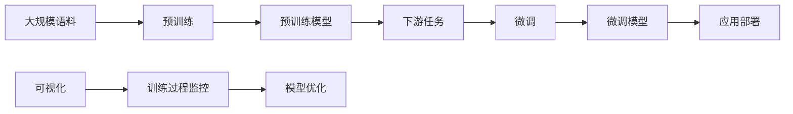

# 从零开始大模型开发与微调：tensorboardX对模型训练过程的展示

关键词：大模型、模型开发、模型微调、tensorboardX、模型训练过程可视化

## 1. 背景介绍
### 1.1  问题的由来
随着人工智能技术的快速发展,大规模预训练语言模型(Pre-trained Language Models,PLMs)已经成为自然语言处理(Natural Language Processing,NLP)领域的研究热点。这些大模型在下游任务上表现出色,然而从零开始训练一个大模型需要海量的数据和计算资源,对于许多研究人员和开发者来说是一个巨大的挑战。
### 1.2  研究现状
目前,大模型的训练和开发主要集中在科技巨头和顶尖高校实验室,如OpenAI的GPT系列模型,Google的BERT和T5模型,Facebook的RoBERTa模型等。这些大模型在各种NLP任务上取得了state-of-the-art的结果,展现了大模型的强大能力。然而,这些模型的训练成本极高,普通研究者很难从零开始训练。
### 1.3  研究意义 
本文旨在探索如何利用开源工具和平台,从零开始开发和微调一个大模型,并使用tensorboardX对模型训练过程进行可视化展示。这对于广大NLP研究者和开发者具有重要意义:
1. 降低大模型研究门槛,让更多人参与其中
2. 提供一套完整的大模型开发流程和经验总结
3. 利用可视化工具更好地理解模型训练过程,优化模型性能
### 1.4  本文结构
本文将从以下几个方面展开:
1. 介绍大模型开发与微调的核心概念
2. 讲解模型训练的核心算法原理和具体步骤
3. 给出模型训练的数学模型和公式推导
4. 提供项目实践的代码实例和详细解释
5. 分析大模型的实际应用场景
6. 推荐相关工具和学习资源
7. 总结大模型未来发展趋势与面临的挑战

## 2. 核心概念与联系
要开发一个大模型,需要理解以下几个核心概念:

1. 预训练(Pre-training):在大规模无标注语料上进行自监督学习,让模型学习到语言的基本特征和规律。常见的预训练任务有语言模型、掩码语言模型等。

2. 微调(Fine-tuning):在预训练的基础上,使用少量标注数据对模型进行监督学习,使其适应特定的下游任务。常见的微调任务有文本分类、命名实体识别、问答等。

3. 迁移学习(Transfer Learning):将预训练模型学到的知识迁移到新的任务中,大幅提升模型的性能,这是大模型的核心优势。

4. 可视化(Visualization):使用可视化工具如tensorboard、wandb等,实时监控模型训练过程,并对训练数据、模型结构、超参数等进行分析和优化。

这些概念之间的联系如下:


## 3. 核心算法原理 & 具体操作步骤
### 3.1  算法原理概述
大模型的预训练和微调主要基于Transformer架构和自注意力机制。以BERT为例,其预训练目标是随机掩码语言模型(Masked Language Model,MLM)和句子连贯性判断(Next Sentence Prediction,NSP):

- MLM:随机mask输入序列的某些token,让模型根据上下文预测mask位置的单词
- NSP:判断两个句子在原文中是否相邻,让模型学习句间关系

在微调阶段,将预训练好的BERT模型接入任务特定的输出层,端到端进行有监督微调训练。
### 3.2  算法步骤详解
以下是使用BERT进行文本分类任务的微调步骤:

1. 加载预训练的BERT模型和tokenizer
2. 构建任务专属的数据集类,对输入文本进行编码
3. 定义分类器,通常是一个全连接层+softmax
4. 将分类器接在BERT模型之后,形成完整的微调模型
5. 定义优化器和学习率调度器
6. 循环进行前向传播、损失计算、反向传播、参数更新,直到收敛
7. 在验证集和测试集上评估微调后的模型性能

### 3.3  算法优缺点
BERT等大模型的优点在于:

- 在大规模语料上预训练,学习了丰富的语言知识
- 利用注意力机制和双向编码,可以捕捉长距离依赖
- 通过微调,可以快速适应下游任务,大幅提升性能

其缺点包括:

- 模型参数量巨大,训练和推理成本高
- 对计算资源和训练数据有很高要求
- 模型可解释性差,容易产生偏见和错误

### 3.4  算法应用领域
大模型已经在多个NLP任务上取得突破性进展,主要应用领域包括:

- 文本分类:情感分析、新闻分类、意图识别等
- 序列标注:命名实体识别、词性标注、语义角色标注等
- 文本生成:摘要生成、对话生成、机器翻译等
- 语义匹配:自然语言推理、问答、文本蕴含等

## 4. 数学模型和公式 & 详细讲解 & 举例说明
### 4.1  数学模型构建
BERT的数学模型可以表示为:

$$
\begin{aligned}
H_0 &= E(X) + P \\
H_l &= \text{Trm}(H_{l-1}), l=1...L \\
p(y|X) &= \text{softmax}(W_oH_L + b_o)
\end{aligned}
$$

其中:
- $X$表示输入token序列
- $E$表示embedding层
- $P$表示位置编码
- $\text{Trm}$表示Transformer的自注意力层
- $L$表示Transformer的层数
- $W_o,b_o$表示分类器的权重和偏置

### 4.2  公式推导过程
以MLM为例,对于给定的输入序列$X=(x_1,\dots,x_T)$,随机选择15%的token进行掩码,用特殊符号[MASK]替换。模型的目标是最大化被掩码位置的真实token的对数似然概率:

$$
\mathcal{L}_{\text{MLM}}(\theta) = -\sum_{t=1}^{T}m_t \log p(x_t|\hat{X}_{\setminus t};\theta)
$$

其中$m_t\in\{0,1\}$表示$x_t$是否被掩码,$\hat{X}_{\setminus t}$表示将$x_t$替换为[MASK]后的输入序列。

NSP任务的目标是最小化二元交叉熵损失:

$$
\mathcal{L}_{\text{NSP}}(\theta) = -y\log p(y=1|X;\theta) - (1-y)\log p(y=0|X;\theta)
$$

其中$y\in\{0,1\}$表示两个句子是否相邻。

最终的预训练损失为两个任务损失的加权和:

$$
\mathcal{L}(\theta) = \mathcal{L}_{\text{MLM}}(\theta) + \lambda \mathcal{L}_{\text{NSP}}(\theta)
$$

其中$\lambda$为平衡因子,通常取0.5。

### 4.3  案例分析与讲解
以下是一个MLM的具体例子:

- 原始输入:The quick brown fox jumps over the lazy dog
- 掩码输入:The quick [MASK] fox [MASK] over the lazy [MASK]
- 目标输出:The quick brown fox jumps over the lazy dog

模型需要根据上下文预测[MASK]位置最可能的单词。通过这种自监督学习,模型可以学习到单词的语义信息和句法结构。

### 4.4  常见问题解答
Q: MLM中被掩码的单词会被替换成什么?
A: 在实际实现中,有80%的概率替换为[MASK],10%的概率替换为随机单词,10%的概率保持不变。这种方式可以缓解预训练和微调阶段的不匹配问题。

Q: 为什么需要位置编码?
A: 由于Transformer不包含循环和卷积结构,需要通过位置编码将单词的位置信息引入模型,帮助模型理解序列的顺序关系。

## 5. 项目实践：代码实例和详细解释说明
### 5.1  开发环境搭建
本项目使用PyTorch框架和Hugging Face的Transformers库进行开发,需要安装以下依赖:

```
torch>=1.5.0
transformers>=4.0.0
tensorboardX>=2.0
```

### 5.2  源代码详细实现
以下是使用BERT进行文本分类的PyTorch实现:

```python
import torch
import torch.nn as nn
from transformers import BertModel, BertTokenizer
from tensorboardX import SummaryWriter

class BertClassifier(nn.Module):
    def __init__(self, num_labels):
        super().__init__()
        self.bert = BertModel.from_pretrained('bert-base-uncased')
        self.dropout = nn.Dropout(0.1)
        self.classifier = nn.Linear(768, num_labels)

    def forward(self, input_ids, attention_mask):
        outputs = self.bert(input_ids, attention_mask=attention_mask)
        pooled_output = outputs[1]
        pooled_output = self.dropout(pooled_output)
        logits = self.classifier(pooled_output)
        return logits

def train(model, dataloader, optimizer, criterion, device):
    model.train()
    total_loss = 0
    for batch in dataloader:
        input_ids = batch['input_ids'].to(device)
        attention_mask = batch['attention_mask'].to(device)
        labels = batch['labels'].to(device)
        optimizer.zero_grad()
        logits = model(input_ids, attention_mask)
        loss = criterion(logits, labels)
        total_loss += loss.item()
        loss.backward()
        optimizer.step()
    return total_loss / len(dataloader)

def evaluate(model, dataloader, criterion, device):
    model.eval()
    total_loss = 0
    total_correct = 0
    with torch.no_grad():
        for batch in dataloader:
            input_ids = batch['input_ids'].to(device)
            attention_mask = batch['attention_mask'].to(device)
            labels = batch['labels'].to(device)
            logits = model(input_ids, attention_mask)
            loss = criterion(logits, labels)
            total_loss += loss.item()
            preds = torch.argmax(logits, dim=1)
            total_correct += (preds == labels).sum().item()
    return total_loss / len(dataloader), total_correct / len(dataloader.dataset)

def main():
    device = torch.device('cuda' if torch.cuda.is_available() else 'cpu')
    tokenizer = BertTokenizer.from_pretrained('bert-base-uncased')
    train_dataset = ...  # 加载训练集
    valid_dataset = ...  # 加载验证集
    train_dataloader = torch.utils.data.DataLoader(train_dataset, batch_size=32, shuffle=True)
    valid_dataloader = torch.utils.data.DataLoader(valid_dataset, batch_size=64)
    model = BertClassifier(num_labels=2)
    model.to(device)
    criterion = nn.CrossEntropyLoss()
    optimizer = torch.optim.AdamW(model.parameters(), lr=2e-5)
    writer = SummaryWriter('runs/bert_classifier')

    num_epochs = 5
    for epoch in range(num_epochs):
        train_loss = train(model, train_dataloader, optimizer, criterion, device)
        valid_loss, valid_acc = evaluate(model, valid_dataloader, criterion, device)
        print(f'Epoch {epoch+1}: Train Loss = {train_loss:.4f}, Valid Loss = {valid_loss:.4f}, Valid Acc = {valid_acc:.4f}')
        writer.add_scalar('Loss/train', train_loss, epoch)
        writer.add_scalar('Loss/valid', valid_loss, epoch)
        writer.add_scalar('Accuracy/valid', valid_acc, epoch)

    writer.close()

if __name__ == '__main__':
    main()
```

### 5.3  代码解读与分析
以上代码主要分为以下几个部分:

1. 定义BertClassifier模型类,继承nn.Module,内部包含BERT模型、dropout层和分类器。forward方法定义了前向传播过程。

2. 定义train和evaluate函数,分别用于模型训练和评估。train函数对每个batch进行前向传播、损失计算、反向传播和参数更新。evaluate函数在验证集上计算模型的损失和准确率。

3. 在main函数中,加载BERT tokenizer和数据集,定义模型、损失函数、优化器和tensorboardX的SummaryWriter。

4. 进行num_epochs轮的训练,每个epoch