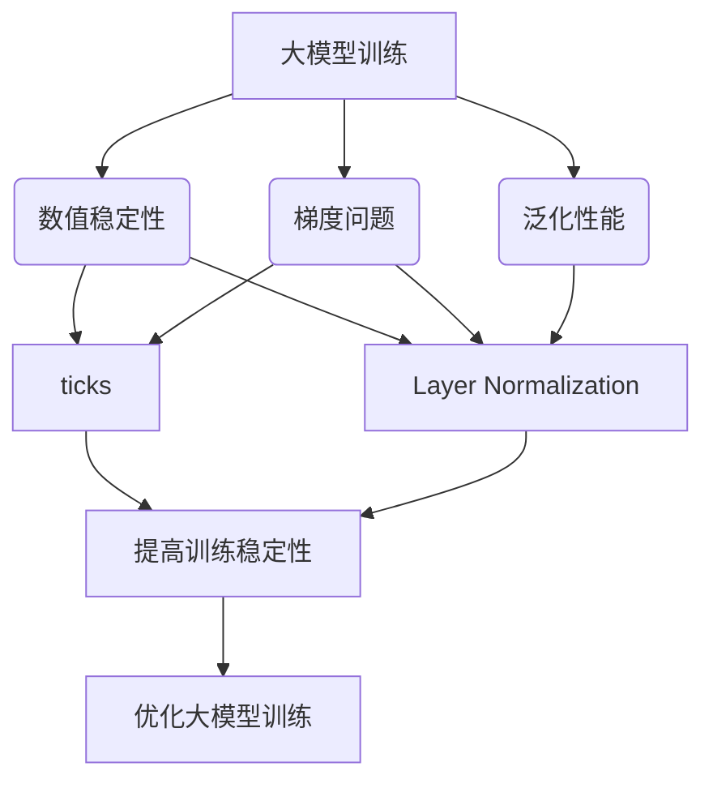

以下是标题为《从零开始大模型开发与微调：ticks和Layer Normalization》的技术博客文章正文内容：

# 从零开始大模型开发与微调：ticks和Layer Normalization

## 1. 背景介绍

### 1.1 问题的由来

随着深度学习模型越来越大，训练和推理这些大型模型变得越来越具有挑战性。大规模的参数空间和复杂的网络架构使得模型更容易遇到数值不稳定性和梯度消失/爆炸等问题。为了有效地训练和部署这些大模型,需要采用一些特殊的技术和trick来确保模型的收敛性、泛化性能和推理效率。

### 1.2 研究现状  

目前,一些常见的技术如残差连接、Batch Normalization、梯度裁剪等已经被广泛应用于大模型的训练中。然而,这些技术在处理更深更宽的网络时可能会遇到一些局限性。研究人员一直在探索新的归一化和正则化方法,以进一步提高大模型的训练稳定性和泛化能力。

### 1.3 研究意义

本文重点介绍了两种新兴的技术:ticks和Layer Normalization,它们在大模型的开发和微调中发挥着重要作用。通过深入探讨这些技术的原理、实现细节和应用场景,我们可以更好地理解和掌握大模型训练的最新进展,为未来的模型设计和优化提供有价值的参考。

### 1.4 本文结构

本文首先介绍ticks和Layer Normalization的核心概念,并阐明它们在大模型训练中的重要性。接下来,详细解释了这两种技术的算法原理、数学模型和实现细节。然后,我们将通过实际案例分析它们在不同场景下的应用。最后,探讨了未来的发展趋势和面临的挑战。

## 2. 核心概念与联系

ticks和Layer Normalization是两种旨在提高大模型训练稳定性和泛化能力的关键技术。

- **ticks**主要解决了大模型训练中常见的数值不稳定和梯度爆炸/消失问题,确保模型在深度网络结构下保持数值稳定性。
- **Layer Normalization**则通过对每一层的输入进行归一化,减轻了内部协变量偏移的影响,从而提高了模型的泛化能力。

这两种技术相辅相成,共同为大模型训练提供了更好的数值稳定性和泛化性能,是大模型开发和微调中不可或缺的重要组成部分。

## 3. 核心算法原理 & 具体操作步骤  

### 3.1 算法原理概述

#### 3.1.1 ticks算法原理

ticks算法的核心思想是在每一个时间步(time step)对模型的激活值(activations)进行重新缩放,以确保它们保持在一个合理的数值范围内。具体来说,ticks通过以下两个步骤实现:

1. **计算激活值的统计量**:在每个时间步,计算当前层的所有激活值的均值和标准差。
2. **重新缩放激活值**:使用计算出的均值和标准差对激活值进行重新缩放,使它们的分布更加集中并限制在一个预定的范围内。

通过这种方式,ticks可以防止激活值在深层网络中无限放大或缩小,从而避免数值不稳定性和梯度问题。

#### 3.1.2 Layer Normalization算法原理

Layer Normalization的思想类似于Batch Normalization,但是作用于单个样本的单层输入,而不是整个批次的数据。它的工作原理如下:

1. **计算均值和方差**:对当前层的输入进行展平,计算所有元素的均值和方差。
2. **归一化**:使用计算出的均值和方差对输入进行归一化,将其转换为均值为0、方差为1的分布。
3. **缩放和平移**:引入可训练的缩放和平移参数,对归一化后的输入进行缩放和平移操作,以保留表示能力。

通过对每一层的输入进行归一化,Layer Normalization可以减少内部协变量偏移的影响,提高模型的泛化能力,特别是在小批量或序列数据的情况下表现出色。

### 3.2 算法步骤详解

#### 3.2.1 ticks算法步骤

1. **初始化**:设置目标均值μ和标准差σ,以及上下界参数α和β。
2. **前向传播**:在每个时间步,对当前层的激活值进行如下操作:
    - 计算均值μ'和标准差σ'
    - 缩放激活值:(x - μ') / max(σ', ε)
    - 裁剪缩放后的激活值到[α, β]范围内
    - 重新缩放激活值:α + (β - α) * sigmoid(x)
3. **反向传播**:在反向传播时,计算相应的梯度并更新模型参数。

其中,ε是一个小常数,用于避免除以0;sigmoid函数用于将激活值映射到[0, 1]范围内。α和β的设置需要根据具体的任务和模型架构进行调整。

#### 3.2.2 Layer Normalization算法步骤

1. **计算均值和方差**:对当前层的输入x进行展平,计算所有元素的均值μ和方差σ^2。
2. **归一化**:$$\hat{x} = \frac{x - \mu}{\sqrt{\sigma^2 + \epsilon}}$$
   其中ε是一个小常数,用于避免除以0。
3. **缩放和平移**:$$y = \gamma \hat{x} + \beta$$
   γ和β是可训练的缩放和平移参数。
4. **前向和反向传播**:将归一化后的y作为当前层的输出,进行前向和反向传播。在反向传播时,计算相应的梯度并更新γ、β以及模型其他参数。

需要注意的是,Layer Normalization是在单个样本的单层输入上进行归一化,而不是像Batch Normalization那样在整个批次上操作。这使得它在处理序列数据或小批量数据时更加高效和稳定。

### 3.3 算法优缺点

#### 3.3.1 ticks

**优点**:
- 有效防止数值不稳定性和梯度爆炸/消失问题
- 适用于各种深度学习模型架构
- 无需额外的可训练参数

**缺点**:
- 需要手动设置合适的参数(如α、β),对不同任务可能需要调整
- 对激活值的分布做了一定约束,可能影响模型的表示能力

#### 3.3.2 Layer Normalization

**优点**:
- 提高了模型的泛化能力,特别是在小批量或序列数据情况下
- 计算高效,无需维护大量统计量
- 可以与其他归一化技术(如Batch Normalization)结合使用

**缺点**:
- 引入了额外的可训练参数(γ、β),增加了模型复杂度
- 对于非常深的网络,可能需要调整初始化方式以确保收敛

### 3.4 算法应用领域

ticks和Layer Normalization主要应用于以下领域:

- **自然语言处理**:在transformer等序列模型中,Layer Normalization可以显著提高模型性能。
- **计算机视觉**:ticks已被成功应用于各种视觉任务,如图像分类、目标检测等。
- **语音识别**:Layer Normalization在处理语音序列数据时表现出色。
- **推荐系统**:一些基于深度学习的推荐模型采用了ticks来稳定训练过程。
- **生成对抗网络(GAN)**:ticks有助于GAN模型的训练收敛。

总的来说,这两种技术为各种深度学习模型的训练和推理提供了有力支持,在不同领域都有广泛的应用前景。

## 4. 数学模型和公式 & 详细讲解 & 举例说明

### 4.1 数学模型构建

#### 4.1.1 ticks数学模型

设当前层的激活值为$\boldsymbol{x} = (x_1, x_2, \ldots, x_n)$,我们希望将其重新缩放到一个合理的范围内。ticks算法的数学模型可以表示为:

$$\boldsymbol{y} = \alpha + (\beta - \alpha) \cdot \sigma\left(\frac{\boldsymbol{x} - \mu}{\max(\sigma, \epsilon)}\right)$$

其中:
- $\mu$和$\sigma$分别为$\boldsymbol{x}$的均值和标准差
- $\alpha$和$\beta$是预设的上下界参数
- $\epsilon$是一个小常数,用于避免除以0
- $\sigma(\cdot)$是sigmoid函数,将输入映射到(0, 1)范围

通过这种重新缩放,激活值$\boldsymbol{y}$被限制在$[\alpha, \beta]$范围内,从而避免了数值不稳定性和梯度问题。

#### 4.1.2 Layer Normalization数学模型

对于输入$\boldsymbol{x} = (x_1, x_2, \ldots, x_n)$,Layer Normalization的数学模型为:

$$\boldsymbol{y} = \gamma \cdot \frac{\boldsymbol{x} - \mu}{\sqrt{\sigma^2 + \epsilon}} + \beta$$

其中:
- $\mu = \frac{1}{n}\sum_{i=1}^{n}x_i$是输入$\boldsymbol{x}$的均值
- $\sigma^2 = \frac{1}{n}\sum_{i=1}^{n}(x_i - \mu)^2$是输入$\boldsymbol{x}$的方差
- $\epsilon$是一个小常数,用于避免除以0
- $\gamma$和$\beta$是可训练的缩放和平移参数

通过这种归一化操作,输入$\boldsymbol{x}$被转换为均值为0、方差为1的分布,从而减少了内部协变量偏移的影响,提高了模型的泛化能力。

### 4.2 公式推导过程

#### 4.2.1 ticks公式推导

ticks算法的公式由以下步骤推导得出:

1. 计算激活值$\boldsymbol{x}$的均值$\mu$和标准差$\sigma$:
   $$\mu = \frac{1}{n}\sum_{i=1}^{n}x_i, \quad \sigma = \sqrt{\frac{1}{n}\sum_{i=1}^{n}(x_i - \mu)^2}$$

2. 对激活值进行标准化:
   $$\boldsymbol{z} = \frac{\boldsymbol{x} - \mu}{\max(\sigma, \epsilon)}$$
   其中$\epsilon$是一个小常数,用于避免除以0。

3. 将标准化后的激活值$\boldsymbol{z}$映射到(0, 1)范围内:
   $$\boldsymbol{z}' = \sigma(\boldsymbol{z})$$
   其中$\sigma(\cdot)$是sigmoid函数。

4. 根据预设的上下界$\alpha$和$\beta$,对映射后的激活值进行缩放:
   $$\boldsymbol{y} = \alpha + (\beta - \alpha) \cdot \boldsymbol{z}'$$

通过这种方式,激活值$\boldsymbol{y}$被限制在$[\alpha, \beta]$范围内,从而避免了数值不稳定性和梯度问题。

#### 4.2.2 Layer Normalization公式推导

Layer Normalization的公式推导过程如下:

1. 计算输入$\boldsymbol{x}$的均值$\mu$和方差$\sigma^2$:
   $$\mu = \frac{1}{n}\sum_{i=1}^{n}x_i, \quad \sigma^2 = \frac{1}{n}\sum_{i=1}^{n}(x_i - \mu)^2$$

2. 对输入$\boldsymbol{x}$进行归一化:
   $$\hat{\boldsymbol{x}} = \frac{\boldsymbol{x} - \mu}{\sqrt{\sigma^2 + \epsilon}}$$
   其中$\epsilon$是一个小常数,用于避免除以0。

3. 引入可训练的缩放和平移参数$\gamma$和$\beta$,对归一化后的输入进行缩放和平移:
   $$\boldsymbol{y} = \gamma \cdot \hat{\boldsymbol{x}} + \beta$$

通过这种方式,