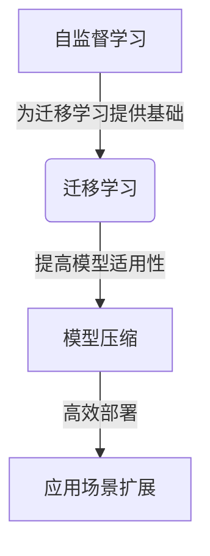

好的,我会尽力遵循您提供的约束条件,以"从零开始大模型开发与微调:人工智能的历史与未来"为主题,撰写一篇专业的技术博客文章。请注意,由于字数较长,我会分批次回复以确保质量。现在让我们开始吧!

# 从零开始大模型开发与微调:人工智能的历史与未来

## 1. 背景介绍

### 1.1 问题的由来

随着数据的爆炸式增长和计算能力的不断提升,大型神经网络模型在自然语言处理、计算机视觉等领域展现出了令人惊叹的能力。然而,训练这些大规模模型需要耗费大量的计算资源,并且存在数据隐私、模型公平性等重大挑战。因此,如何高效地开发和微调大型模型,成为当前人工智能领域亟待解决的核心问题。

### 1.2 研究现状  

目前,一些科技巨头如谷歌、OpenAI等已经投入大量资源研究大模型。他们采用了自监督学习、迁移学习等前沿技术,取得了一定的进展。但由于算力和数据的限制,普通开发者很难真正掌握大模型开发的全过程。此外,现有的大模型也存在一些缺陷,如对特定领域的泛化能力不足、对小数据集的适应性较差等。

### 1.3 研究意义

大模型的发展将极大推动人工智能技术的实用化和产业化进程。通过对大模型开发流程的深入探索,我们可以更好地理解和掌握这一前沿技术,为解决实际问题提供有力支撑。同时,研究大模型微调技术,有助于提高模型的泛化能力和适应性,使其能够更好地服务于特定领域。

### 1.4 本文结构

本文将从以下几个方面全面介绍大模型开发与微调的关键技术:

- 核心概念与联系
- 核心算法原理与具体操作步骤  
- 数学模型和公式详细推导
- 项目实践:代码实例和详细解释
- 实际应用场景分析
- 工具和学习资源推荐
- 未来发展趋势与挑战探讨

## 2. 核心概念与联系

在深入探讨大模型开发与微调之前,我们有必要先了解一些核心概念,它们贯穿于整个过程,相互紧密联系。

### 2.1 自监督学习(Self-Supervised Learning)

自监督学习是一种无需人工标注的机器学习范式。它利用原始数据本身的统计规律和结构信息,自动构建监督信号,从而在大量未标注数据上进行有效训练。这种方法可以充分利用海量数据,避免了人工标注的巨大成本。

自监督学习在大模型预训练中发挥着关键作用。通过设计合理的预训练任务,模型可以从大规模语料或图像数据中学习到通用的表示能力,为后续的微调和迁移学习奠定基础。

### 2.2 迁移学习(Transfer Learning)

迁移学习指将在源领域学习到的知识迁移到目标领域的过程。大模型开发中的迁移学习,是指利用在大规模数据上预训练的模型,通过在目标任务数据上进行微调,使模型获得相应的专业能力。

迁移学习的优势在于,可以充分利用大模型在通用数据上学习到的先验知识,减少在特定领域的训练数据需求,提高模型的泛化能力。合理的迁移学习策略,对于提升大模型在特定任务上的性能至关重要。  

### 2.3 模型压缩(Model Compression)

由于大模型通常包含数十亿甚至上万亿参数,在实际应用中存在计算资源和存储空间的瓶颈。模型压缩技术旨在缩减模型的参数量和计算复杂度,使其能够在边缘设备等资源受限环境中高效运行。

常见的模型压缩方法包括剪枝(pruning)、量化(quantization)、知识蒸馏(knowledge distillation)等。通过合理的压缩策略,可以在保持模型性能的前提下,大幅降低其计算和存储开销。

### 2.4 概念关联

以上三个核心概念相互关联、环环相扣:

- 自监督学习为大模型提供了通用的表示能力,为后续迁移学习奠定基础
- 迁移学习将大模型中蕴含的知识转移到特定任务,提高了模型的适用性
- 模型压缩则使大模型能够高效部署,扩大了其应用场景

只有将这三者有机结合,才能真正释放大模型的巨大潜力。

## 3. 核心算法原理与具体操作步骤

### 3.1 算法原理概述

大模型开发与微调过程中,涉及多种核心算法,包括:

1. **Transformer**: 自注意力机制为基础的序列到序列模型,广泛应用于自然语言处理和计算机视觉等领域。
2. **BERT**: 基于Transformer的自监督语言模型,通过掩码语言模型和下一句预测任务实现有效预训练。
3. **GPT**: 另一种基于Transformer的自回归语言模型,在文本生成任务上表现出色。
4. **ViT**: 将Transformer应用于计算机视觉,直接对图像分块作为序列输入,实现高效的视觉表示学习。
5. **知识蒸馏**: 通过知识转移的方式,将大模型中的知识迁移至小模型,实现高效模型压缩。

这些算法均源于深度学习和自然语言处理的最新研究成果,代表了大模型开发的前沿水平。我们将在后续章节中详细介绍它们的原理和实现细节。

### 3.2 算法步骤详解

以BERT为例,介绍大模型开发的典型流程:

1. **数据预处理**
   - 文本分词、词典构建
   - 数据清洗、过滤、去重等预处理操作

2. **模型构建**
   - 定义Transformer编码器结构
   - 设计掩码语言模型和下一句预测任务

3. **自监督预训练**
   - 基于海量语料,执行自监督预训练
   - 使用Adam等优化算法,最小化预训练损失

4. **微调(迁移学习)**
   - 在目标任务数据上进行模型微调
   - 根据任务类型,设计合适的微调策略
   - 通过反向传播,更新BERT模型参数

5. **模型评估**
   - 在测试集上评估模型性能指标
   - 进行模型选择,输出最优模型

6. **模型压缩(可选)**
   - 通过剪枝、量化、知识蒸馏等技术
   - 压缩模型大小,降低计算复杂度

7. **模型部署**
   - 将优化后的模型部署到生产环境
   - 提供模型服务接口,供上层应用调用

### 3.3 算法优缺点

上述算法在大模型开发中发挥着关键作用,但也存在一些优缺点:

**优点**:
- 自注意力机制,有效捕获长距离依赖关系
- 自监督学习,利用大规模未标注数据
- 迁移学习,提高模型泛化能力
- 模型压缩,降低计算和存储开销

**缺点**:
- 训练数据量需求巨大,存在隐私风险
- 模型参数量庞大,训练计算开销高昂
- 存在公平性和安全性隐患
- 对长序列和跨模态任务的支持有限

总的来说,这些算法为大模型开发提供了有力工具,但仍有待进一步改进和完善。

### 3.4 算法应用领域

大模型技术在以下领域展现出了广阔的应用前景:

- **自然语言处理**: 语言理解、机器翻译、文本生成等
- **计算机视觉**: 图像分类、目标检测、视觉问答等
- **多模态学习**: 视觉语言导航、视频描述等
- **推理任务**: 阅读理解、常识推理、关系抽取等
- **生成任务**: 文本创作、图像生成、音乐作曲等

随着技术的不断发展,大模型的应用场景正在不断扩展,为人工智能的产业化贡献重要力量。

## 4. 数学模型和公式详细讲解与举例说明

### 4.1 数学模型构建

在介绍公式推导之前,我们先来构建大模型的数学基础模型。以Transformer为例:

Transformer是一种基于自注意力机制的序列到序列模型,可表示为:

$$\mathrm{Transformer}(X) = \mathrm{Decoder}(\mathrm{Encoder}(X))$$

其中,Encoder对输入序列$X$进行编码,Decoder则生成目标序列$Y$。

Encoder和Decoder均由多个相同的层组成,每层包含以下子层:

- **多头自注意力(Multi-Head Attention)**
- **前馈全连接网络(Feed-Forward Network)**

通过层与层之间的残差连接(Residual Connection)和层归一化(Layer Normalization),确保梯度在深层网络中的有效传播。

### 4.2 公式推导过程

我们以**缩放点积注意力(Scaled Dotted-Product Attention)**为例,推导自注意力机制的数学原理:

给定查询向量$Q$、键向量$K$和值向量$V$,注意力值$\mathrm{Attention}(Q, K, V)$计算如下:

$$\begin{aligned}
\mathrm{Attention}(Q, K, V) &= \mathrm{softmax}\left(\frac{QK^T}{\sqrt{d_k}}\right)V \\
&= \sum_{i=1}^n \alpha_i V_i
\end{aligned}$$

其中,$\alpha_i$为注意力权重,表示查询向量$Q$对键向量$K_i$的注意力分数:

$$\alpha_i = \frac{\exp\left(\frac{QK_i^T}{\sqrt{d_k}}\right)}{\sum_{j=1}^n\exp\left(\frac{QK_j^T}{\sqrt{d_k}}\right)}$$

$d_k$为缩放因子,用于防止点积值过大导致的梯度饱和问题。

通过这种机制,模型可以自适应地为每个位置分配注意力权重,捕获输入序列中的长距离依赖关系。

### 4.3 案例分析与讲解

我们以机器翻译任务为例,分析自注意力机制在实际应用中的作用:

考虑将英文句子"The animal didn't cross the street because it was too tired."翻译成中文。

对于"it"这个词,基于上下文,模型需要将其与"animal"正确对应。通过自注意力机制,模型可以学会在计算"it"的表示时,分配更多注意力权重给"animal"这个词。

具体来说,当计算"it"的查询向量$Q$与"animal"的键向量$K_\text{animal}$的注意力权重时,由于两者语义相关性高,会得到较大的$\alpha_\text{animal}$值。

这样,通过加权求和$\sum_i \alpha_i V_i$,就能够更好地融合上下文信息,生成"it"的准确表示,从而正确翻译整个句子。

### 4.4 常见问题解答

**Q1: 为什么需要多头注意力?**

A1: 单一的注意力机制,只能从一个表示子空间来捕获输入序列的相关性。而多头注意力则可以从不同的表示子空间获取不同的相关信息,并将它们融合起来,提高了模型的表达能力。

**Q2: 层归一化和残差连接的作用是什么?**

A2: 层归一化通过对输入数据进行归一化处理,加快了模型收敛速度,提高了训练稳定性。残差连接则允许梯度在深层网络中直接传播,有效缓解了梯度消失问题。

**Q3: 自注意力机制如何应用于计算机视觉任务?**

A3: 在视觉Transformer(ViT)中,通过将图像分块,将二维图像数据转化为一维序列输入,即可直接应用自注意力机制学习图像的表示