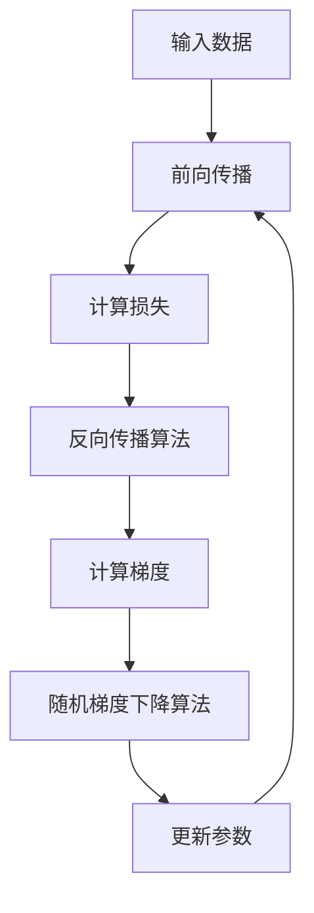

# 从零开始大模型开发与微调：反向传播神经网络两个基础算法详解

## 1. 背景介绍

### 1.1 问题的由来

在过去的几十年里，人工神经网络在各个领域取得了巨大的成功，从计算机视觉、自然语言处理到推荐系统等等。这些成就很大程度上归功于反向传播算法的发明和广泛应用。反向传播算法为有效训练深层神经网络提供了可能，使得神经网络能够从大量数据中学习复杂的模式和规律。

然而，随着深度学习模型规模的不断扩大，训练这些庞大的神经网络变得越来越具有挑战性。传统的反向传播算法在处理大规模数据和深层网络时往往会遇到计算效率低下、梯度消失/爆炸等问题。因此，优化反向传播算法、提高其性能和稳定性成为了深度学习研究的重点课题之一。

### 1.2 研究现状

目前，已经提出了多种改进反向传播算法的方法,例如:

- **梯度裁剪(Gradient Clipping)**: 通过限制梯度的范围来防止梯度爆炸。
- **梯度正则化(Gradient Normalization)**: 通过对梯度进行归一化来稳定训练过程。
- **自适应学习率优化器(Adaptive Learning Rate Optimizers)**: 例如 Adam、RMSProp 等,通过自适应调整每个参数的学习率来加速收敛。

此外,一些新型的反向传播变体算法也被提出并取得了不错的效果,例如:

- **反向传播通过时间(Backpropagation Through Time, BPTT)**: 用于训练循环神经网络。
- **反向传播形式(Backpropagation Formulations)**: 如直接反向传播、反向传播等价形式等。
- **替代反向传播算法**: 如反向传播的近似版本、基于生物启发的算法等。

尽管取得了一些进展,但这些方法往往只能解决反向传播算法的某些特定问题,而且通常需要针对特定的网络结构或任务进行调整。因此,发展通用的、高效的反向传播算法仍然是一个亟待解决的重要课题。

### 1.3 研究意义

优化反向传播算法对于深度学习的发展至关重要,主要有以下几个方面的意义:

1. **提高训练效率**:高效的反向传播算法可以显著加快大型神经网络的训练速度,从而节省计算资源和时间成本。

2. **增强模型性能**:通过改进反向传播算法,可以更好地优化神经网络参数,提高模型在各种任务上的泛化性能。

3. **支持大规模模型训练**:优化后的反向传播算法能够更好地应对大规模深度学习模型的训练,推动人工智能技术的发展。

4. **促进理论研究**:深入研究反向传播算法的本质和优化方法,有助于加深对神经网络训练机制的理解。

5. **推动应用落地**:高效可靠的反向传播算法为深度学习模型在实际应用中的落地提供了坚实基础。

综上所述,对反向传播算法的研究不仅具有重要的理论意义,也将为人工智能的实际应用带来广泛的影响。

### 1.4 本文结构

本文将重点介绍反向传播神经网络训练中的两个核心算法:反向传播算法和随机梯度下降算法。

首先,我们将介绍这两个算法的核心概念和相互关系。接下来,将分别详细阐述两个算法的原理、具体操作步骤、数学模型和公式推导。然后,我们将通过实际的项目实践,展示如何使用代码实现这两个算法。

此外,本文还将探讨这两个算法在实际应用中的场景,并推荐相关的工具和学习资源。最后,我们将总结算法的发展趋势和面临的挑战,并对未来的研究方向进行展望。

## 2. 核心概念与联系

反向传播算法和随机梯度下降算法是训练神经网络的两个关键算法,它们密切相关且相互依赖。

**反向传播算法(Backpropagation Algorithm)** 是一种计算神经网络中每个参数相对于损失函数的梯度的高效算法。它通过链式法则,从输出层开始,逐层向后计算每个权重对最终损失函数的影响程度,从而得到梯度信息。

**随机梯度下降算法(Stochastic Gradient Descent, SGD)** 则是一种基于梯度信息来更新神经网络参数的优化算法。它通过沿着梯度的反方向移动参数,来最小化损失函数,从而不断优化神经网络的性能。

这两个算法的关系如下:

1. **反向传播算法为随机梯度下降提供梯度信息**。反向传播算法计算出每个参数的梯度,而随机梯度下降算法则使用这些梯度来更新参数。
2. **随机梯度下降算法驱动反向传播算法的迭代**。每次迭代,随机梯度下降算法根据当前参数值和梯度信息更新参数,然后反向传播算法在新的参数值下重新计算梯度,如此循环往复。

可以用一个流程图来直观地展示它们的关系:

简而言之,**反向传播算法负责计算梯度,而随机梯度下降算法根据梯度信息优化网络参数,两者相互配合完成神经网络的训练过程**。掌握这两个核心算法,是深入理解和实现神经网络训练的关键所在。

## 3. 核心算法原理与具体操作步骤

### 3.1 算法原理概述

#### 3.1.1 反向传播算法原理

反向传播算法的核心思想是利用**链式法则**,从输出层开始,逐层向后计算每个权重对最终损失函数的影响程度,即梯度。具体来说,算法分为两个阶段:

1. **前向传播阶段**:输入数据沿着神经网络从输入层向输出层传播,每个神经元根据权重和激活函数计算输出。
2. **反向传播阶段**:从输出层开始,根据输出层的误差,逐层向后计算每个权重对误差的影响程度(梯度),并更新权重。

通过不断迭代这两个阶段,神经网络可以不断减小损失函数的值,使得输出结果逐渐接近期望值。

#### 3.1.2 随机梯度下降算法原理

随机梯度下降算法是一种基于梯度信息来优化神经网络参数的方法。它的核心思想是:

1. **计算梯度**:利用反向传播算法计算每个参数相对于损失函数的梯度。
2. **更新参数**:沿着梯度的反方向,按照一定的学习率更新参数值,使得损失函数值下降。

通过不断迭代这个过程,算法可以找到一组使损失函数最小化的参数值,从而训练出一个高质量的神经网络模型。

### 3.2 算法步骤详解

#### 3.2.1 反向传播算法步骤

反向传播算法的具体步骤如下:

1. **前向传播**:
    - 输入数据 $X$ 通过输入层传播到隐藏层。
    - 每个隐藏层神经元根据上一层输出、权重和激活函数计算输出。
    - 输出层根据最后一个隐藏层的输出和权重计算输出 $\hat{Y}$。

2. **计算损失**:将输出 $\hat{Y}$ 与期望输出 $Y$ 进行比较,计算损失函数 $L(\hat{Y}, Y)$。

3. **反向传播**:
    - 计算输出层的误差项 $\delta^L = \frac{\partial L}{\partial \hat{Y}} \odot \sigma'(z^L)$。
    - 自后向前,计算每个隐藏层的误差项 $\delta^l = ((W^{l+1})^T \delta^{l+1}) \odot \sigma'(z^l)$。
    - 计算每个权重的梯度 $\frac{\partial L}{\partial W^l} = \delta^{l+1} (a^l)^T$。

4. **更新权重**:根据梯度信息,使用优化算法(如随机梯度下降)更新每个权重。

5. **迭代**:重复上述步骤,直到达到停止条件(如最大迭代次数或损失函数值小于阈值)。

其中,符号说明如下:
- $L$: 损失函数
- $\hat{Y}$: 神经网络的输出
- $Y$: 期望输出
- $\delta^l$: 第 $l$ 层的误差项
- $W^l$: 第 $l$ 层的权重矩阵
- $z^l$: 第 $l$ 层的加权输入
- $a^l$: 第 $l$ 层的激活输出
- $\sigma'$: 激活函数的导数
- $\odot$: 元素级别的乘积运算

#### 3.2.2 随机梯度下降算法步骤

随机梯度下降算法的步骤如下:

1. **初始化参数**:随机初始化神经网络的所有权重参数。

2. **前向传播**:利用当前参数值,通过前向传播计算神经网络的输出。

3. **计算损失**:将输出与期望输出进行比较,计算损失函数值。

4. **反向传播**:利用反向传播算法,计算每个参数相对于损失函数的梯度。

5. **更新参数**:根据梯度信息,使用学习率 $\eta$ 更新每个参数:

   $$W^l = W^l - \eta \frac{\partial L}{\partial W^l}$$

6. **迭代**:重复上述步骤,直到达到停止条件(如最大迭代次数或损失函数值小于阈值)。

在实际应用中,常常使用小批量随机梯度下降(Mini-batch SGD),每次更新参数时使用一个小批量的数据计算梯度,而不是使用整个数据集。这种方式可以提高计算效率,同时引入一定的噪声,有助于避免陷入局部最优解。

### 3.3 算法优缺点

#### 3.3.1 反向传播算法

**优点**:

- 高效计算梯度,使得深层神经网络的训练成为可能。
- 算法原理简单,易于理解和实现。
- 可以与其他优化算法(如随机梯度下降)结合使用。

**缺点**:

- 存在梯度消失/爆炸问题,对深层网络训练带来一定困难。
- 对于一些特殊结构的网络(如循环神经网络),需要进行一定的改进和扩展。
- 计算过程中需要存储所有中间结果,对内存有一定要求。

#### 3.3.2 随机梯度下降算法

**优点**:

- 简单高效,易于实现和并行化。
- 引入噪声,有助于避免陷入局部最优解。
- 可以通过调整学习率、动量等超参数来提高性能。

**缺点**:

- 收敛速度较慢,需要大量迭代才能收敛。
- 对于高维、非凸等复杂问题,可能无法找到全局最优解。
- 需要合理设置学习率等超参数,否则可能导致发散或无法收敛。

### 3.4 算法应用领域

反向传播算法和随机梯度下降算法广泛应用于各种深度学习任务,包括但不限于:

- **计算机视觉**:图像分类、目标检测、语义分割等。
- **自然语言处理**:机器翻译、文本生成、情感分析等。
- **语音识别**:自动语音识别、语音合成等。
- **推荐系统**:个性化推荐、广告投放等。
- **强化学习**:机器人控制、游戏AI等。
- **生成对抗网络**:图像生成、风格迁移等。

此外,这两个算法也被应用于其他一些领域,如生物信息学、金融、天文学等,为解决各种复杂的预测和优化问题提