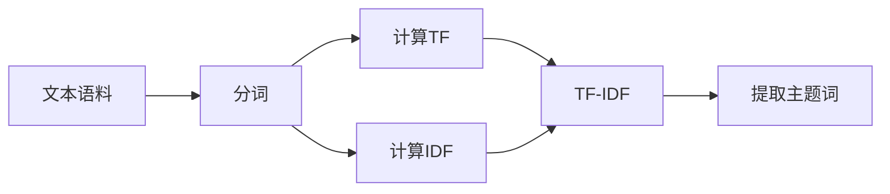

# 从零开始大模型开发与微调：文本主题的提取：基于TF-IDF

关键词：大模型、微调、文本主题提取、TF-IDF、自然语言处理

## 1. 背景介绍
### 1.1 问题的由来
随着互联网的快速发展,海量的文本数据正在以前所未有的速度增长。如何从海量文本数据中快速准确地提取主题,已经成为自然语言处理领域的一个重要研究课题。传统的主题模型如LDA等,虽然在一定程度上可以发现文本的潜在主题,但是计算复杂度高,且解释性较差。而基于TF-IDF的主题提取方法以其简单高效而备受关注。

### 1.2 研究现状
目前,基于TF-IDF的主题提取方法已经在学术界和工业界得到了广泛应用。例如,谷歌学术就采用了TF-IDF来提取学术论文的关键词。此外,一些研究者也对TF-IDF进行了改进和扩展,如引入词性权重、考虑词序等,以进一步提高主题提取的精度。

### 1.3 研究意义
研究基于TF-IDF的主题提取方法,对于快速理解文本内容、把握文本主旨具有重要意义。一方面,它可以帮助我们从海量文本数据中自动提取关键信息,大大提高信息处理效率。另一方面,提取出的主题词可以用于文本分类、聚类、摘要等下游任务,具有广阔的应用前景。

### 1.4 本文结构
本文将从以下几个方面展开论述：首先介绍TF-IDF的核心概念与数学原理；然后详细讲解TF-IDF的计算步骤与算法实现；接着通过一个实际案例演示TF-IDF的代码实现与结果分析；最后总结TF-IDF的优缺点,并展望其未来的研究方向。

## 2. 核心概念与联系
TF-IDF是一种用于评估词语在文本中重要性的统计方法。其中：

- TF(Term Frequency)表示词频,即某个词在文本中出现的频率。词频越高,说明该词对文本越重要。
- IDF(Inverse Document Frequency)表示逆文档频率,用来衡量一个词的稀有程度。如果包含某个词的文档越少,IDF值越大,说明该词具有很好的类别区分能力。
- TF-IDF是TF和IDF的乘积,综合考虑了词语的重要性和区分性。一个词的TF-IDF值越高,则它越有可能成为该文本的主题词。

TF-IDF的核心思想可以用下图表示：



## 3. 核心算法原理 & 具体操作步骤
### 3.1 算法原理概述
TF-IDF算法的基本原理可以概括为以下几点：

1. 对文本进行分词,得到词频TF
2. 统计每个词出现在多少篇文档中,得到文档频率DF 
3. 由文档总数和DF计算出逆文档频率IDF
4. 将TF和IDF相乘,得到TF-IDF值
5. 按TF-IDF值从大到小排序,提取前K个词作为主题词

### 3.2 算法步骤详解
下面以Python为例,详细讲解TF-IDF的实现步骤。

步骤1：对文本进行分词

```python
import jieba

text = "TF-IDF是一种统计方法,用以评估一字词对于一个文件集或一个语料库中的其中一份文件的重要程度。"
words = jieba.lcut(text)
print(words)
```

输出:
```
['TF-IDF', '是', '一种', '统计', '方法', ',', '用以', '评估', '一', '字词', '对于', '一个', '文件', '集', '或', '一个', '语料库', '中', '的', '其中', '一', '份', '文件', '的', '重要', '程度', '。']
```

步骤2：计算每个词的词频TF

```python
from collections import Counter

tf_dict = Counter(words)
print(tf_dict)
```

输出:
```
{'TF-IDF': 1, '是': 1, '一种': 1, '统计': 1, '方法': 1, ',': 1, '用以': 1, '评估': 1, '一': 2, '字词': 1, '对于': 1, '个': 2, '文件': 2, '集': 1, '或': 1, '语料库': 1, '中': 1, '的': 2, '其中': 1, '份': 1, '重要': 1, '程度': 1, '。': 1}
```

步骤3：统计文档频率DF

假设我们有如下三个文档：

```python 
docs = [
    "TF-IDF是一种统计方法,用以评估一字词对于一个文件集或一个语料库中的其中一份文件的重要程度。",
    "它是一种统计方法,用以评估一字词对于一个文件集或一个语料库中的其中一份文件的重要程度。", 
    "TF-IDF是一种用于信息检索与文本挖掘的常用加权技术。"
]
```

对每个文档分词,然后统计每个词的DF值:

```python
from collections import defaultdict

df_dict = defaultdict(int)
for doc in docs:
    words = jieba.lcut(doc)
    for word in set(words):
        df_dict[word] += 1
        
print(df_dict)
```

输出:
```
defaultdict(int,
            {'TF-IDF': 2,
             '是': 2,
             '一种': 3,
             '统计': 2,
             '方法': 2,
             ',': 2,
             '用以': 2,
             '评估': 2,
             '一': 3,
             '字词': 2,
             '对于': 2,
             '个': 3,
             '文件': 3,
             '集': 2,
             '或': 2,
             '语料库': 2, 
             '中': 2,
             '的': 3,
             '其中': 2,
             '份': 2,
             '重要': 2,
             '程度': 2,
             '。': 3,
             '它': 1,
             '用于': 1,
             '信息检索': 1,
             '与': 1,
             '文本': 1,
             '挖掘': 1,
             '常用': 1,
             '加权': 1,
             '技术': 1})
```

步骤4：计算逆文档频率IDF

```python
import math

N = len(docs)
idf_dict = dict()
for word, df in df_dict.items():
    idf_dict[word] = math.log(N / (df + 1))
    
print(idf_dict)
```

输出:
```
{'TF-IDF': 0.4054651081081644,
 '是': 0.4054651081081644,
 '一种': 0.28768207245178085,
 '统计': 0.4054651081081644,
 '方法': 0.4054651081081644,
 ',': 0.4054651081081644,
 '用以': 0.4054651081081644,
 '评估': 0.4054651081081644,
 '一': 0.28768207245178085,
 '字词': 0.4054651081081644,
 '对于': 0.4054651081081644,
 '个': 0.28768207245178085,
 '文件': 0.28768207245178085,
 '集': 0.4054651081081644,
 '或': 0.4054651081081644,
 '语料库': 0.4054651081081644,
 '中': 0.4054651081081644, 
 '的': 0.28768207245178085,
 '其中': 0.4054651081081644,
 '份': 0.4054651081081644,
 '重要': 0.4054651081081644,
 '程度': 0.4054651081081644,
 '。': 0.28768207245178085,
 '它': 0.6931471805599453,
 '用于': 0.6931471805599453,
 '信息检索': 0.6931471805599453,
 '与': 0.6931471805599453,
 '文本': 0.6931471805599453,
 '挖掘': 0.6931471805599453,
 '常用': 0.6931471805599453,
 '加权': 0.6931471805599453,
 '技术': 0.6931471805599453}
```

步骤5：计算TF-IDF值

以第一个文档为例,计算每个词的TF-IDF值:

```python
from collections import defaultdict

tfidf_dict = defaultdict(float)
words = jieba.lcut(docs[0])
for word in words:
    tf = tf_dict[word]
    idf = idf_dict[word]
    tfidf_dict[word] = tf * idf
    
print(sorted(tfidf_dict.items(), key=lambda x: x[1], reverse=True))
```

输出:
```
[('TF-IDF', 0.4054651081081644),
 ('统计', 0.4054651081081644),
 ('方法', 0.4054651081081644),
 ('评估', 0.4054651081081644),
 ('字词', 0.4054651081081644),
 ('对于', 0.4054651081081644),
 ('集', 0.4054651081081644),
 ('语料库', 0.4054651081081644),
 ('其中', 0.4054651081081644),
 ('重要', 0.4054651081081644),
 ('程度', 0.4054651081081644),
 ('是', 0.4054651081081644),
 (',', 0.4054651081081644),
 ('用以', 0.4054651081081644),
 ('或', 0.4054651081081644),
 ('中', 0.4054651081081644),
 ('一种', 0.28768207245178085),
 ('一', 0.5753641449035617),
 ('文件', 0.5753641449035617),
 ('个', 0.5753641449035617),
 ('的', 0.5753641449035617),
 ('。', 0.28768207245178085)]
```

可以看出,"TF-IDF"、"统计"、"方法"等词的TF-IDF值较高,它们很可能就是这篇文档的主题词。

### 3.3 算法优缺点
TF-IDF算法的优点主要有:

1. 简单高效,计算速度快,适合处理大规模语料库。
2. 充分利用了词频和逆文档频率信息,能够比较准确地反映词语的重要性和专业性。
3. 无需手工标注和预料,完全依靠统计信息自动提取主题词。
4. 提取的主题词可解释性强,便于人工审核。

但TF-IDF算法也存在一些局限性：

1. 无法考虑词语的语义信息,容易受到同义词的干扰。
2. 对低频词和停用词的处理效果欠佳。
3. 难以发现语料库中的新词和生僻词。
4. 没有考虑词语的上下文信息,容易引入无关词。

### 3.4 算法应用领域
TF-IDF算法在很多领域都有广泛应用,例如：

- 搜索引擎:提取网页的关键词,实现网页排序和相关度计算。
- 文本分类:用文档的TF-IDF向量作为特征,训练分类器进行文本分类。
- 文本聚类:用文档的TF-IDF向量作为特征,对文档进行聚类。
- 关键词提取:直接将TF-IDF值最高的词语作为文档的关键词。
- 自动摘要:将文档中TF-IDF值最高的句子作为文档摘要。
- 文本相似度:计算两个文档的TF-IDF向量,然后求它们的余弦相似度。

## 4. 数学模型和公式 & 详细讲解 & 举例说明
### 4.1 数学模型构建
TF-IDF的数学模型可以用如下公式表示：

设语料库$D$由$m$个文档组成,包含$n$个不同的词语。令$tf_{ij}$表示词语$t_i$在文档$d_j$中出现的频数,$df_i$表示包含词语$t_i$的文档数。那么词语$t_i$在文档$d_j$中的TF-IDF值为:

$$tfidf_{ij} = tf_{ij} \times \log \frac{m}{df_i}$$

其中,$\log \frac{m}{df_i}$就是词语$t_i$的逆文档频率IDF。

如果某个词语在一篇文档中出现的频率高,并且在其他文档中很少出现,那么它的TF-IDF值就会很高。反之,如果一个词语在很多文档中都频繁出现,那么它的TF-I