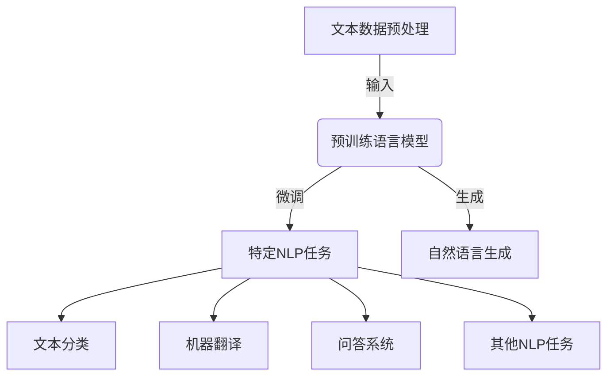
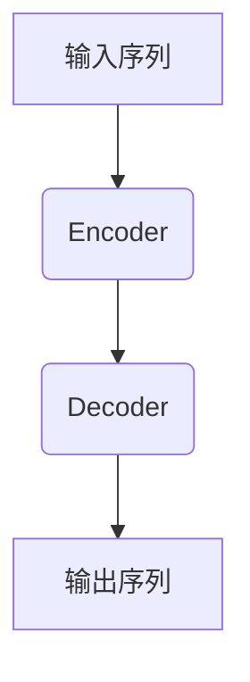

# 从零开始大模型开发与微调：文本数据处理

## 1. 背景介绍

### 1.1 问题的由来

在当今的数据时代，文本数据无处不在。无论是社交媒体上的用户评论、新闻文章、电子邮件还是医疗记录,文本数据都扮演着越来越重要的角色。然而,处理和理解这些海量的非结构化文本数据对于传统的机器学习算法来说是一个巨大的挑战。

传统的机器学习方法通常依赖于手工设计的特征工程,需要人工提取文本数据中的关键特征,这种方法不仅效率低下,而且难以捕捉文本数据中丰富的语义和上下文信息。因此,我们迫切需要一种新的方法来处理文本数据,以满足现代应用的需求。

### 1.2 研究现状

近年来,随着深度学习技术的飞速发展,自然语言处理(NLP)领域取得了令人瞩目的进展。大型预训练语言模型(Pre-trained Language Models,PLMs)的出现彻底改变了文本数据处理的范式。这些模型通过在海量文本语料上进行预训练,学习到了丰富的语义和上下文知识,从而能够更好地理解和生成自然语言。

典型的大型预训练语言模型包括 BERT、GPT、T5 等,它们在各种 NLP 任务上取得了超越人类的性能表现。然而,这些模型也存在一些挑战,例如需要大量计算资源进行训练,对于特定领域的任务可能需要进行进一步的微调(Fine-tuning)等。

### 1.3 研究意义

本文旨在探讨如何从零开始开发和微调大型预训练语言模型,以处理文本数据。我们将深入探讨以下几个方面:

1. **文本数据预处理**: 如何对原始文本数据进行清洗、标记化、分词等预处理操作,为模型训练做好准备。
2. **模型架构设计**: 介绍常见的大型预训练语言模型架构,如 Transformer、BERT 等,并探讨它们的工作原理和优缺点。
3. **模型训练策略**: 讨论如何有效地训练大型预训练语言模型,包括数据增强、优化器选择、学习率调度等策略。
4. **模型微调技术**: 介绍如何将通用的大型预训练语言模型微调到特定的 NLP 任务上,以提高模型性能。
5. **实践案例分析**: 提供具体的代码实现和案例分析,帮助读者更好地理解和掌握相关技术。

通过本文的探讨,我们希望能够为读者提供一个全面的指南,帮助他们从零开始开发和微调大型预训练语言模型,以更好地处理文本数据,并在实践中取得卓越的成果。

### 1.4 本文结构

本文的结构安排如下:

1. 背景介绍
2. 核心概念与联系
3. 核心算法原理与具体操作步骤
4. 数学模型和公式详细讲解与举例说明
5. 项目实践:代码实例和详细解释说明
6. 实际应用场景
7. 工具和资源推荐
8. 总结:未来发展趋势与挑战
9. 附录:常见问题与解答

## 2. 核心概念与联系

在开始探讨大型预训练语言模型的开发和微调之前,我们需要先了解一些核心概念和它们之间的联系。

1. **文本数据预处理**: 包括文本清洗、标记化、分词等步骤,将原始文本数据转换为模型可以理解的格式。这是训练大型预训练语言模型的基础。

2. **预训练语言模型**: 指在大量未标记文本语料上进行预训练的语言模型,如 BERT、GPT、T5 等。这些模型学习到了丰富的语义和上下文知识,可以用于下游的 NLP 任务。

3. **微调(Fine-tuning)**: 将预训练语言模型在特定的 NLP 任务上进行进一步的训练,以提高模型在该任务上的性能表现。常见的 NLP 任务包括文本分类、机器翻译、问答系统等。

4. **自然语言生成**: 预训练语言模型还可以用于生成自然语言文本,例如文本续写、对话生成、创作写作等。

这些概念相互关联,构成了大型预训练语言模型开发和应用的完整流程。我们将在后续章节中详细探讨每个环节的原理和实现方法。

## 3. 核心算法原理与具体操作步骤

### 3.1 算法原理概述

大型预训练语言模型的核心算法是 Transformer 架构及其变体。Transformer 是一种基于自注意力机制(Self-Attention)的序列到序列(Seq2Seq)模型,它能够有效地捕捉输入序列中的长距离依赖关系,从而更好地理解和生成自然语言。

Transformer 架构主要由编码器(Encoder)和解码器(Decoder)两个部分组成。编码器将输入序列映射到一个连续的表示空间,而解码器则根据编码器的输出生成目标序列。在预训练语言模型中,通常只使用编码器或者使用编码器-解码器的组合。

自注意力机制是 Transformer 架构的核心部分,它允许模型在计算每个位置的表示时,关注整个输入序列的信息。这种机制有效地解决了传统序列模型中的长距离依赖问题,大大提高了模型的表现能力。

除了基本的 Transformer 架构,还有许多改进的变体被广泛应用于预训练语言模型中,例如 BERT 使用了双向 Transformer 编码器,GPT 采用了单向 Transformer 解码器,T5 则结合了编码器和解码器的优点。这些变体在不同的任务上表现出不同的优势。

### 3.2 算法步骤详解

大型预训练语言模型的训练过程通常分为两个阶段:预训练(Pre-training)和微调(Fine-tuning)。

#### 3.2.1 预训练阶段

预训练阶段的目标是在大量未标记的文本语料上训练模型,使其学习到丰富的语义和上下文知识。常见的预训练任务包括:

1. **蒙版语言模型(Masked Language Modeling, MLM)**: 在输入序列中随机掩蔽一些词,要求模型预测被掩蔽的词。这种任务可以让模型学习到双向的语境信息。

2. **下一句预测(Next Sentence Prediction, NSP)**: 给定两个句子,要求模型预测它们是否连续出现。这种任务可以让模型捕捉更长距离的语义关系。

3. **因果语言模型(Causal Language Modeling, CLM)**: 给定一个序列的前缀,要求模型预测下一个词。这种任务可以让模型学习到单向的语言生成能力。

预训练阶段通常需要大量的计算资源和时间,但是一旦训练完成,预训练模型就可以在各种下游任务上进行微调和迁移学习。

#### 3.2.2 微调阶段

微调阶段的目标是将通用的预训练语言模型调整到特定的 NLP 任务上,以提高模型在该任务上的性能表现。微调过程通常包括以下步骤:

1. **任务格式化**: 将特定的 NLP 任务转换为预训练模型可以理解的格式,例如将文本分类任务转换为序列到序列的形式。

2. **数据准备**: 收集和准备用于微调的标注数据集。

3. **模型初始化**: 使用预训练模型的权重初始化微调模型。

4. **模型训练**: 在标注数据集上对模型进行训练,通常采用监督学习的方式。可以根据任务的不同,设计不同的损失函数和优化策略。

5. **模型评估**: 在验证集或测试集上评估微调后模型的性能表现。

6. **模型部署**: 将微调后的模型部署到实际的应用系统中。

通过微调,预训练语言模型可以专门化到特定的 NLP 任务上,提高模型的性能和泛化能力。同时,由于利用了预训练模型的知识,微调过程通常比从头训练模型更加高效和有效。

### 3.3 算法优缺点

大型预训练语言模型具有以下优点:

1. **强大的语言理解能力**: 通过在大量文本语料上预训练,模型学习到了丰富的语义和上下文知识,能够更好地理解自然语言。

2. **泛化能力强**: 预训练模型可以在多种下游任务上进行微调和迁移学习,具有良好的泛化能力。

3. **高效的微调过程**: 利用了预训练模型的知识,微调过程比从头训练模型更加高效和有效。

4. **持续改进的性能**: 随着模型规模和训练数据的不断增加,预训练语言模型的性能也在不断提高。

然而,大型预训练语言模型也存在一些缺点和挑战:

1. **计算资源需求高**: 训练大型预训练语言模型需要大量的计算资源,包括GPU、TPU等加速硬件,以及大量的内存和存储空间。

2. **数据饥渴问题**: 预训练阶段需要海量的文本语料,而高质量的语料资源往往难以获取。

3. **缺乏可解释性**: 大型预训练语言模型通常是黑盒模型,缺乏可解释性,难以解释模型的决策过程。

4. **偏见和安全性问题**: 由于预训练语料的偏差,模型可能会学习到一些不当的偏见和有害的知识。

5. **领域迁移困难**: 虽然预训练模型具有良好的泛化能力,但在一些特殊领域的任务上,可能需要进行大量的微调和调整。

因此,在开发和应用大型预训练语言模型时,需要权衡计算资源、数据质量、可解释性、偏见和安全性等因素,并采取适当的策略来缓解这些挑战。

### 3.4 算法应用领域

大型预训练语言模型在自然语言处理领域有着广泛的应用,包括但不限于以下任务:

1. **文本分类**: 将文本数据分类到预定义的类别中,如情感分析、新闻分类、垃圾邮件检测等。

2. **机器翻译**: 将一种自然语言翻译成另一种自然语言,实现跨语言的信息交流。

3. **问答系统**: 根据给定的问题和上下文信息,生成相应的答案。

4. **文本摘要**: 自动生成文本的摘要,捕捉文本的核心内容。

5. **对话系统**: 与人类进行自然语言对话,实现智能客服、虚拟助手等应用。

6. **文本生成**: 根据给定的提示或上下文,生成连贯、流畅的自然语言文本,如新闻稿、小说、诗歌等。

7. **关系抽取**: 从文本中识别出实体之间的关系,构建知识图谱。

8. **命名实体识别**: 识别出文本中的人名、地名、组织机构名等命名实体。

9. **语义相似度计算**: 计算两段文本之间的语义相似度,用于文本聚类、重复检测等任务。

10. **文本蕴涵**: 判断一个文本蕴含另一个文本的语义内容。

除了上述任务,大型预训练语言模型还可以应用于其他领域,如生物医学、法律、金融等,帮助解决各种文本数据处理的挑战。随着模型和算法的不断发展,其应用领域也在不断扩展。

## 4. 数学模型和公式详细讲解与举例说明

### 4.1 数学模型构建

大型预训练语言模型的核心是 Transformer 架构,它基于自注