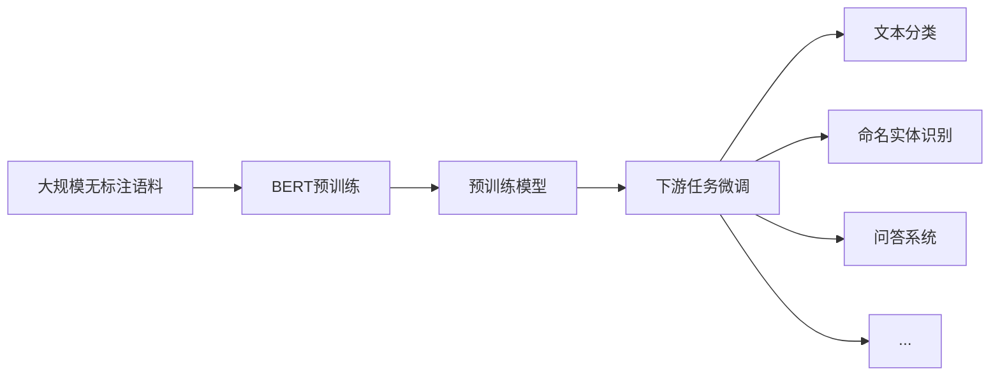

# 从零开始大模型开发与微调：站在巨人肩膀上的预训练模型BERT

关键词：大模型、预训练模型、BERT、自然语言处理、迁移学习、微调

## 1. 背景介绍
### 1.1 问题的由来
随着人工智能技术的飞速发展,自然语言处理(NLP)领域也取得了长足的进步。从早期的基于规则和统计的方法,到后来的深度学习模型,NLP技术不断突破,为人机交互、信息检索、机器翻译等应用提供了强大的支撑。然而,传统的NLP模型存在着一些局限性,如对大规模语料的依赖、特定任务的适应性不足等。为了克服这些挑战,预训练语言模型应运而生。

### 1.2 研究现状 
近年来,以BERT(Bidirectional Encoder Representations from Transformers)为代表的预训练语言模型取得了瞩目的成就。BERT通过在大规模无标注语料上进行预训练,学习到了丰富的语言知识和上下文表征能力。在此基础上,通过微调(Fine-tuning)技术,BERT可以快速适应下游NLP任务,并取得了优异的性能表现。BERT的成功激发了学术界和工业界对预训练模型的广泛关注,催生了一系列后续的改进模型,如RoBERTa、XLNet、ALBERT等。

### 1.3 研究意义
BERT的出现为NLP领域带来了新的范式。通过在通用语料上学习语言知识,BERT可以作为一个强大的基础模型,为各种NLP任务提供良好的初始化参数。这种"预训练-微调"的范式大大降低了任务特定模型的开发成本,提高了模型的泛化能力和鲁棒性。同时,BERT的成功也为其他领域的预训练模型研究提供了借鉴,如计算机视觉中的ViT(Vision Transformer)等。深入研究BERT的原理和应用,对于推动NLP乃至人工智能的发展具有重要意义。

### 1.4 本文结构
本文将全面探讨BERT模型的原理、实现和应用。第2部分介绍BERT的核心概念和关键技术。第3部分详细阐述BERT的算法原理和具体操作步骤。第4部分给出BERT的数学模型和公式推导过程。第5部分通过代码实例展示BERT的实现细节。第6部分讨论BERT在实际场景中的应用。第7部分推荐BERT相关的工具和学习资源。第8部分总结全文,并展望BERT的未来发展趋势和挑战。第9部分附录常见问题解答。

## 2. 核心概念与联系
BERT的核心是基于Transformer架构的双向语言模型。与传统的单向语言模型(如GPT)不同,BERT在训练时考虑了上下文的双向信息,从而能够更好地捕捉词语的语义。BERT的预训练过程包括两个任务:Masked Language Model(MLM)和Next Sentence Prediction(NSP)。MLM随机遮挡部分输入词语,让模型根据上下文预测被遮挡的词。NSP则让模型判断两个句子在原文中是否相邻。通过这两个任务,BERT学习到了丰富的语言知识和上下文表征能力。

在使用BERT进行下游任务时,我们通常采用微调的方式。将预训练好的BERT模型作为初始化参数,在目标任务的标注数据上进行训练,fine-tune模型参数。得益于BERT强大的语言理解能力,微调后的模型在各种NLP任务上都取得了显著的性能提升,如文本分类、命名实体识别、问答系统等。

下图展示了BERT的整体架构和工作流程:

## 3. 核心算法原理 & 具体操作步骤
### 3.1 算法原理概述
BERT的核心是基于Transformer的Encoder结构。Transformer由多层的Self-Attention和前馈神经网络组成,通过Self-Attention机制捕捉词语之间的依赖关系,从而建模上下文信息。与传统的RNN模型相比,Transformer能够并行计算,大大提高了训练和推理效率。

BERT在Transformer的基础上引入了MLM和NSP两个预训练任务。MLM通过随机遮挡部分输入词语,让模型根据上下文预测被遮挡的词。这种自监督学习方式使得BERT能够学习到丰富的语言知识。NSP则让模型判断两个句子在原文中是否相邻,旨在让BERT学习到句子级别的表征能力。

### 3.2 算法步骤详解
BERT的训练过程可以分为以下步骤:

1. 输入表示:将输入文本转换为WordPiece分词,并添加特殊标记[CLS]和[SEP]。对每个词语的嵌入表示进行位置编码和片段编码。
2. Transformer Encoder:将输入表示通过多层Transformer Encoder,每一层包括Self-Attention和前馈神经网络。Self-Attention捕捉词语之间的依赖关系,前馈神经网络对特征进行非线性变换。
3. MLM任务:随机遮挡部分输入词语(如15%),用[MASK]标记替换。让模型根据上下文预测被遮挡的词语。
4. NSP任务:给定两个句子A和B,让模型判断B是否是A的下一个句子。通过特殊标记[CLS]对应的输出向量进行二分类。
5. 损失函数:MLM任务采用交叉熵损失函数,NSP任务采用二元交叉熵损失函数。将两个任务的损失相加作为总的训练目标。
6. 优化算法:采用Adam优化器,调整学习率和梯度裁剪等超参数,进行模型训练。

在微调阶段,我们将预训练好的BERT模型应用于下游任务。具体步骤如下:

1. 任务特定输入:根据下游任务的特点,构建任务特定的输入表示。如对于文本分类任务,将[CLS]标记对应的输出向量接入分类器。
2. 微调训练:在下游任务的标注数据上,固定BERT的大部分参数,只微调顶层的任务特定参数。采用较小的学习率和batch size进行训练。
3. 模型评估:在下游任务的验证集和测试集上评估微调后的模型性能,进行超参数调优和模型选择。

### 3.3 算法优缺点
BERT算法的优点包括:

1. 强大的语言理解能力:通过在大规模语料上的预训练,BERT学习到了丰富的语言知识和上下文表征能力,可以处理复杂的自然语言理解任务。
2. 通用性和可迁移性:BERT可以作为一个通用的基础模型,通过微调适应各种下游NLP任务,大大降低了任务特定模型的开发成本。
3. 并行计算效率高:得益于Transformer的Self-Attention机制,BERT可以高效地并行计算,加速了训练和推理过程。

BERT算法的缺点包括:

1. 计算资源要求高:BERT是一个大规模的深度神经网络,训练和推理都需要大量的计算资源和时间。这对于资源有限的场景可能是一个挑战。
2. 模型体积庞大:BERT的参数量非常大(如BERT-Base有1.1亿参数),存储和部署都需要较大的内存和存储空间。
3. 解释性有限:与传统的基于规则和统计的方法相比,BERT作为一个黑盒模型,其内部工作机制和决策过程难以解释,这在某些应用场景下可能是一个问题。

### 3.4 算法应用领域
BERT算法在NLP领域有广泛的应用,主要包括:

1. 文本分类:将文本划分为预定义的类别,如情感分析、新闻分类等。
2. 命名实体识别:从文本中识别出人名、地名、机构名等命名实体。
3. 问答系统:根据给定的问题和上下文,从文本中抽取出答案。
4. 语义相似度:判断两个文本在语义上的相似程度,如文本匹配、文本蕴含等。
5. 机器翻译:将一种语言的文本翻译成另一种语言,如中英文翻译。
6. 文本摘要:从长文本中提炼出关键信息,生成简洁的摘要。
7. 关系抽取:从文本中抽取出实体之间的关系,如人物关系、事件关系等。

除了上述任务外,BERT还可以应用于其他各种NLP场景,如情感分析、语义解析、对话系统等。BERT强大的语言理解能力使其成为NLP领域的重要工具和基础设施。

## 4. 数学模型和公式 & 详细讲解 & 举例说明
### 4.1 数学模型构建
BERT的数学模型建立在Transformer的基础上。Transformer的核心是Self-Attention机制,通过计算Query、Key、Value三个矩阵的注意力权重,捕捉词语之间的依赖关系。设输入序列为 $X = (x_1, x_2, ..., x_n)$,其中 $x_i \in \mathbb{R}^d$ 表示第 $i$ 个词语的嵌入表示,维度为 $d$。Self-Attention的计算过程如下:

$$
\begin{aligned}
Q &= XW^Q \\
K &= XW^K \\
V &= XW^V \\
\text{Attention}(Q, K, V) &= \text{softmax}(\frac{QK^T}{\sqrt{d_k}})V
\end{aligned}
$$

其中 $W^Q, W^K, W^V \in \mathbb{R}^{d \times d_k}$ 是可学习的参数矩阵,将输入 $X$ 映射到 Query、Key、Value 空间。$d_k$ 是 Query 和 Key 的维度。softmax函数用于归一化注意力权重。

在实际应用中,Transformer通常采用多头注意力(Multi-Head Attention)机制,将 Query、Key、Value 分别划分为 $h$ 个子空间,并行计算 $h$ 个注意力头,然后将结果拼接起来:

$$
\begin{aligned}
\text{MultiHead}(Q, K, V) &= \text{Concat}(\text{head}_1, ..., \text{head}_h)W^O \\
\text{head}_i &= \text{Attention}(QW_i^Q, KW_i^K, VW_i^V)
\end{aligned}
$$

其中 $W_i^Q, W_i^K, W_i^V \in \mathbb{R}^{d \times d_k}, W^O \in \mathbb{R}^{hd_k \times d}$ 是可学习的参数矩阵。

除了Self-Attention外,Transformer的每一层还包括前馈神经网络(Feed-Forward Network,FFN),对特征进行非线性变换:

$$
\text{FFN}(x) = \max(0, xW_1 + b_1)W_2 + b_2
$$

其中 $W_1 \in \mathbb{R}^{d \times d_{ff}}, b_1 \in \mathbb{R}^{d_{ff}}, W_2 \in \mathbb{R}^{d_{ff} \times d}, b_2 \in \mathbb{R}^d$ 是可学习的参数,$d_{ff}$ 是FFN的隐藏层维度。

BERT在Transformer的基础上引入了MLM和NSP两个预训练任务。对于MLM任务,设被遮挡的词语位置为 $\mathcal{M}$,词表大小为 $|V|$,则MLM的损失函数为:

$$
\mathcal{L}_{\text{MLM}} = -\sum_{i \in \mathcal{M}} \log P(x_i | X_{\backslash \mathcal{M}})
$$

其中 $X_{\backslash \mathcal{M}}$ 表示去掉被遮挡词语的输入序列,$P(x_i | X_{\backslash \mathcal{M}})$ 是根据上下文预测被遮挡词语 $x_i$ 的概率,通过softmax层计算:

$$
P(x_i | X_{\backslash \mathcal{M}}) = \text{softmax}(h_i W_e + b_e)
$$

其中 $h_i$ 是第 $i$ 个位置的隐藏状态,$W_e \in \mathbb{R}^{d \times |V|}, b_e \