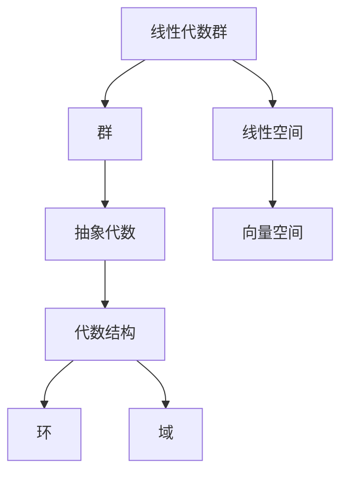

# 代数群引论：第一篇 线性代数群

## 1. 背景介绍

### 1.1 问题的由来

在数学和物理学等多个学科领域中,线性代数是一个基础且重要的分支。它为研究矩阵、向量空间、线性变换等概念奠定了理论基础。然而,传统的线性代数理论主要关注向量空间及其上的线性变换,而忽视了代数结构本身的重要性。事实上,线性代数的许多概念和性质都可以从代数的角度得到更深入的理解和推广。

### 1.2 研究现状  

近年来,代数群理论作为一种新兴的数学分支,将线性代数与抽象代数理论相结合,为线性代数注入了新的活力。代数群理论将线性代数中的向量空间、线性变换等概念推广到更一般的代数结构,从而揭示了它们之间内在的代数联系。这种新的视角不仅丰富了线性代数的理论内涵,也为解决实际问题提供了新的思路和方法。

### 1.3 研究意义

代数群理论的发展对于深化线性代数的理解、拓展其应用领域具有重要意义。它将线性代数的研究对象从单纯的向量空间扩展到更一般的代数结构,使得线性代数的理论和方法可以应用于更广泛的领域,如密码学、量子计算、控制理论等。同时,代数群理论也为解决一些复杂的数学问题提供了新的思路和工具。

### 1.4 本文结构

本文将系统地介绍线性代数群的基本理论和应用。我们将从代数群的基本概念出发,阐述其与传统线性代数之间的联系,探讨线性代数群的核心算法原理及其数学模型,并通过实际案例对相关理论和方法进行详细说明。最后,我们将讨论线性代数群在实际应用中的场景,介绍相关的工具和资源,并对未来的发展趋势和挑战进行展望。

## 2. 核心概念与联系

线性代数群理论是将线性代数与抽象代数理论相结合的产物。它将线性代数中的向量空间、线性变换等概念推广到更一般的代数结构,从而揭示了它们之间内在的代数联系。下面我们将介绍线性代数群的核心概念,并阐述它们与传统线性代数之间的联系。

1. **群(Group)**: 群是代数群理论的基础概念,它是一个代数结构,由一个非空集合及其上的二元运算构成。群满足结合律、存在单位元和逆元等性质。线性代数群就是一个特殊的群,它的元素是线性变换,运算是线性变换的复合。

2. **线性空间(Linear Space)**: 线性空间是线性代数中的核心概念,它是一个向量空间,由一个非空集合及其上的两种运算(向量加法和数量乘法)构成。线性空间满足加法交换律、加法结合律、数量乘法的分配律等性质。线性代数群中的线性变换就是作用在线性空间上的映射。

3. **线性变换(Linear Transformation)**: 线性变换是线性代数中的重要概念,它是一种特殊的函数,将一个线性空间映射到另一个线性空间,并且保持线性结构不变。线性变换在线性代数群中扮演着核心角色,它们构成了线性代数群的元素集合。

4. **表示论(Representation Theory)**: 表示论是研究群及其在线性空间上的作用的一个重要分支。在线性代数群理论中,表示论提供了一种研究线性变换群的有效工具。通过将群的元素表示为线性变换的矩阵,我们可以利用线性代数的方法来研究群的性质和结构。

线性代数群理论将线性代数中的概念推广到了更一般的代数结构,从而揭示了它们之间内在的代数联系。这种新的视角不仅丰富了线性代数的理论内涵,也为解决实际问题提供了新的思路和方法。

## 3. 核心算法原理与具体操作步骤

### 3.1 算法原理概述

线性代数群理论中的核心算法主要包括两个方面:群的表示和不可约表示的分解。

1. **群的表示(Group Representation)**:
   
   群的表示是将群的元素映射到线性空间上的线性变换的过程。具体来说,给定一个群 $G$ 和一个线性空间 $V$,群的表示就是一个同态映射 $\rho: G \rightarrow GL(V)$,其中 $GL(V)$ 表示线性空间 $V$ 上的可逆线性变换组成的群。这种映射必须满足以下条件:
   
   $$
   \rho(gh) = \rho(g)\rho(h), \quad \forall g, h \in G
   $$
   
   其中 $\rho(g)$ 表示群元素 $g$ 在线性空间 $V$ 上的线性变换表示。

2. **不可约表示的分解(Irreducible Representation Decomposition)**:
   
   不可约表示是指在给定的线性空间上,不存在非平凡的不变子空间的表示。任何一个群的表示都可以分解为不可约表示的直和,这个过程被称为不可约表示的分解。具体来说,对于一个群 $G$ 的表示 $\rho: G \rightarrow GL(V)$,我们可以将线性空间 $V$ 分解为不可约不变子空间的直和:
   
   $$
   V = V_1 \oplus V_2 \oplus \cdots \oplus V_k
   $$
   
   其中,每个 $V_i$ 是 $\rho(G)$ 的不可约不变子空间,并且 $\rho|_{V_i}$ 是 $G$ 在 $V_i$ 上的不可约表示。

不可约表示的分解是线性代数群理论中的一个核心问题,因为它为研究群的结构和性质提供了有力的工具。通过分解,我们可以将一个复杂的表示分解为更简单的不可约表示,从而更容易研究和理解群的性质。

### 3.2 算法步骤详解

下面我们将详细介绍群的表示和不可约表示分解的具体算法步骤。

#### 3.2.1 群的表示算法

输入: 一个群 $G$ 和一个线性空间 $V$。

输出: 群 $G$ 在线性空间 $V$ 上的表示 $\rho: G \rightarrow GL(V)$。

步骤:

1. 选择一个基底 $\{v_1, v_2, \ldots, v_n\}$ 为线性空间 $V$ 的基。

2. 对于每个群元素 $g \in G$,构造一个 $n \times n$ 的矩阵 $\rho(g)$,其中第 $i$ 行第 $j$ 列的元素为 $\rho(g)(v_j)$ 在基底 $\{v_1, v_2, \ldots, v_n\}$ 下的坐标表示。

3. 验证 $\rho$ 是否满足群的表示条件:
   
   $$
   \rho(gh) = \rho(g)\rho(h), \quad \forall g, h \in G
   $$
   
   如果满足,则 $\rho$ 就是群 $G$ 在线性空间 $V$ 上的一个表示。

#### 3.2.2 不可约表示分解算法

输入: 一个群 $G$ 的表示 $\rho: G \rightarrow GL(V)$。

输出: 线性空间 $V$ 的不可约不变子空间的直和分解 $V = V_1 \oplus V_2 \oplus \cdots \oplus V_k$。

步骤:

1. 构造 $V$ 上的不变子空间链:
   
   $$
   \{0\} = V_0 \subset V_1 \subset V_2 \subset \cdots \subset V_m = V
   $$
   
   其中,每个 $V_i$ 都是 $\rho(G)$ 的不变子空间。

2. 对于每个不变子空间 $V_i$,检查它是否不可约,即在 $V_i$ 上不存在非平凡的 $\rho(G)$ 不变子空间。如果 $V_i$ 不可约,则将其加入分解的列表中。

3. 重复步骤 2,直到所有不变子空间都被检查完毕。

4. 将所有不可约不变子空间的直和作为最终的分解结果输出:
   
   $$
   V = V_1 \oplus V_2 \oplus \cdots \oplus V_k
   $$

需要注意的是,不可约表示的分解并不是唯一的,因为不可约表示可能有重复的情况。在这种情况下,我们需要确定每个不可约表示的重复次数,从而得到完整的分解结果。

### 3.3 算法优缺点

#### 优点:

1. **理论基础扎实**: 线性代数群理论的算法建立在群论和线性代数的坚实理论基础之上,具有严谨的数学背景。

2. **广泛应用**: 群的表示和不可约表示分解在多个数学和物理学领域都有广泛的应用,如量子力学、粒子物理学、密码学等。

3. **计算效率较高**: 对于有限群,我们可以利用有限域上的线性代数计算,从而提高算法的计算效率。

4. **结构性分析**: 不可约表示分解为研究群的结构和性质提供了有力的工具,有助于深入理解群的本质特征。

#### 缺点:

1. **计算复杂度高**: 对于大型群或无限群,计算群的表示和不可约表示分解可能会变得非常复杂和耗时。

2. **存在歧义**: 不可约表示的分解可能不唯一,需要进一步确定每个不可约表示的重复次数,增加了计算的难度。

3. **基底选择影响**: 群的表示依赖于线性空间的基底选择,不同的基底可能导致不同的表示矩阵,需要谨慎处理。

4. **理论与实践脱节**: 虽然理论基础扎实,但将线性代数群理论应用于实际问题时,往往需要进行一定的简化和近似,可能会影响结果的精确性。

### 3.4 算法应用领域

线性代数群理论及其相关算法在多个学科领域都有广泛的应用,包括但不限于:

1. **量子力学**: 在量子力学中,不可约表示被用于研究粒子的内禀自旋和其他内禀量子数。

2. **粒子物理学**: 粒子物理学中的许多基本理论,如量子色动力学和电弱理论,都依赖于线性代数群的概念和方法。

3. **密码学**: 在现代密码学中,有限域上的线性代数群被广泛应用于设计和分析加密算法,如椭圆曲线密码学。

4. **信号处理**: 线性代数群理论可用于研究信号的对称性和不变性,在图像处理、语音识别等领域有重要应用。

5. **控制理论**: 线性代数群在研究控制系统的稳定性和可控性方面发挥着重要作用。

6. **代数几何**: 线性代数群为研究代数曲线和代数曲面的不变量提供了有力的工具。

7. **表示论**: 线性代数群理论是研究群表示的重要分支,在数学和物理学中有广泛的应用。

8. **计算机科学**: 线性代数群在计算机图形学、机器学习、信息编码等领域都有应用。

总的来说,线性代数群理论不仅丰富了线性代数的理论内涵,也为解决实际问题提供了新的思路和方法,在多个学科领域发挥着重要作用。

## 4. 数学模型和公式详细讲解与举例说明

### 4.1 数学模型构建

在线性代数群理论中,我们需要构建一个数学模型来描述群的表示和不可约表示分解的过程。这个数学模型建立在线性代数和抽象代数的基础之上,包括以下几个核心要素:

1. **群 (Group)**:
   
   群是一个代数结构,由一个非空集