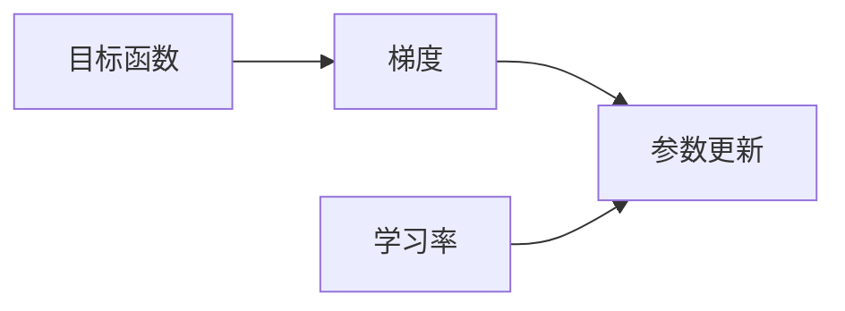

# 优化算法：梯度下降 (Gradient Descent) 原理与代码实例讲解

## 1. 背景介绍

### 1.1 问题的由来

在机器学习和数据科学领域中,我们经常会遇到需要优化目标函数的问题。目标函数可能是一个代价函数(cost function)或者误差函数(error function),我们希望能够找到一组参数值,使得目标函数的值最小化。这种优化问题在诸多领域都有应用,例如线性回归、逻辑回归、神经网络等。

梯度下降(Gradient Descent)是一种常用的优化算法,它可以有效地解决这类优化问题。该算法的基本思想是沿着目标函数的负梯度方向迭代更新参数值,不断逼近目标函数的最小值。

### 1.2 研究现状

梯度下降算法由于其简单高效的特点,在机器学习和深度学习领域中得到了广泛应用。目前,梯度下降算法已经成为优化算法的基础和主干,并且衍生出了许多改进版本,例如随机梯度下降(Stochastic Gradient Descent)、动量梯度下降(Momentum Gradient Descent)、AdaGrad、RMSProp、Adam等。这些改进版本在不同的场景下都展现出了优异的性能。

### 1.3 研究意义

梯度下降算法是机器学习和深度学习领域中最基础和最重要的优化算法之一。掌握梯度下降算法的原理和实现方式,对于理解和应用更高级的优化算法至关重要。此外,梯度下降算法在实际应用中也有着广泛的用途,例如参数估计、模型训练等。因此,深入学习和掌握梯度下降算法具有重要的理论和实践意义。

### 1.4 本文结构

本文将从以下几个方面全面介绍梯度下降算法:

1. 核心概念与联系
2. 核心算法原理及具体操作步骤
3. 数学模型和公式详细讲解及举例说明
4. 项目实践:代码实例和详细解释说明
5. 实际应用场景
6. 工具和资源推荐
7. 总结:未来发展趋势与挑战
8. 附录:常见问题与解答

## 2. 核心概念与联系

在介绍梯度下降算法之前,我们需要先了解一些核心概念:

1. **目标函数(Objective Function)**: 也被称为代价函数(Cost Function)或误差函数(Error Function),它是我们希望优化的函数。在机器学习中,目标函数通常用于衡量模型的预测值与真实值之间的差异。我们的目标是找到一组参数值,使得目标函数的值最小化。

2. **梯度(Gradient)**: 梯度是一个向量,它表示目标函数在当前点处的变化率。梯度的方向指向目标函数增长最快的方向,而梯度的大小表示目标函数在该方向上的变化率。在优化问题中,我们希望沿着梯度的反方向移动,以减小目标函数的值。

3. **学习率(Learning Rate)**: 学习率是一个超参数,它控制了每一次迭代中参数更新的步长。较大的学习率可以加快收敛速度,但也可能导致无法收敛或发散。较小的学习率可以提高收敛的稳定性,但也会减慢收敛速度。

这些概念之间的关系如下所示:



梯度下降算法的核心思想就是利用目标函数的梯度信息,并结合学习率,不断更新参数值,使目标函数的值不断减小,最终达到最小值。

## 3. 核心算法原理 & 具体操作步骤

### 3.1 算法原理概述

梯度下降算法的基本原理是:从一个初始点出发,沿着目标函数的负梯度方向不断迭代更新参数值,直到达到收敛条件为止。具体来说,算法的步骤如下:

1. 初始化参数值
2. 计算目标函数在当前参数值处的梯度
3. 根据梯度和学习率,更新参数值
4. 重复步骤2和3,直到达到收敛条件

这个过程可以用下面的公式表示:

$$
\theta_{t+1} = \theta_t - \alpha \nabla J(\theta_t)
$$

其中:
- $\theta_t$是当前的参数值
- $\alpha$是学习率
- $\nabla J(\theta_t)$是目标函数在当前参数值处的梯度

通过不断迭代更新参数值,我们可以逐步逼近目标函数的最小值。

### 3.2 算法步骤详解

下面我们将详细解释梯度下降算法的具体步骤:

1. **初始化参数值**

   首先,我们需要为参数赋予一个初始值。通常情况下,我们会随机初始化参数值,或者使用一些启发式方法进行初始化。初始值的选择会影响算法的收敛速度,但不会影响最终的收敛结果。

2. **计算目标函数的梯度**

   接下来,我们需要计算目标函数在当前参数值处的梯度。梯度是一个向量,它表示目标函数在各个参数方向上的变化率。计算梯度的方法取决于目标函数的具体形式,通常可以使用数值方法或者符号方法。

3. **更新参数值**

   根据计算得到的梯度和预设的学习率,我们可以更新参数值。更新公式如下:

   $$
   \theta_{t+1} = \theta_t - \alpha \nabla J(\theta_t)
   $$

   这个公式表示,新的参数值等于当前参数值减去学习率乘以梯度。由于梯度指向目标函数增长最快的方向,因此沿着梯度的反方向移动可以使目标函数的值减小。

4. **重复迭代**

   我们需要重复步骤2和步骤3,不断更新参数值,直到达到收敛条件为止。收敛条件可以是:
   - 目标函数的值小于某个阈值
   - 参数值的变化小于某个阈值
   - 迭代次数达到预设的最大值

   当达到收敛条件时,算法终止,此时的参数值就是我们所求的最优解。

下面是梯度下降算法的伪代码:

```
初始化参数值 θ
重复 {
    计算目标函数 J(θ) 在当前参数值处的梯度 ∇J(θ)
    更新参数值: θ = θ - α * ∇J(θ)
} 直到收敛
返回 θ
```

### 3.3 算法优缺点

梯度下降算法具有以下优点:

1. **简单高效**: 算法原理简单,易于理解和实现,计算效率较高。
2. **通用性强**: 可以应用于各种形式的目标函数,适用范围广泛。
3. **收敛性好**: 在合理的条件下,算法能够收敛到目标函数的局部最小值或全局最小值。

但是,梯度下降算法也存在一些缺点:

1. **可能陷入局部最小值**: 算法可能收敛到目标函数的局部最小值,而无法找到全局最小值。
2. **收敛速度较慢**: 在目标函数的梯度较小的区域,算法的收敛速度会变得很慢。
3. **需要选择合适的学习率**: 学习率的选择对算法的收敛性和收敛速度有很大影响,需要进行调参。
4. **对异常值敏感**: 如果数据中存在异常值或噪声,算法的性能可能会受到影响。

### 3.4 算法应用领域

梯度下降算法在机器学习和数据科学领域有着广泛的应用,包括但不限于:

1. **线性回归**: 用于估计线性回归模型的参数。
2. **逻辑回归**: 用于估计逻辑回归模型的参数,常用于分类问题。
3. **神经网络**: 用于训练神经网络模型的权重参数。
4. **支持向量机(SVM)**: 用于训练支持向量机模型的参数。
5. **主成分分析(PCA)**: 用于寻找数据的主成分方向。
6. **聚类算法**: 用于优化聚类算法的目标函数,如K-Means算法。

除了机器学习领域,梯度下降算法在其他领域也有应用,例如:

1. **图像处理**: 用于图像去噪、图像分割等任务。
2. **信号处理**: 用于信号滤波、信号恢复等任务。
3. **控制理论**: 用于优化控制系统的性能指标。
4. **物理学**: 用于求解一些物理问题的最优解。

总的来说,梯度下降算法是一种通用的优化算法,在许多需要优化目标函数的领域都有应用。

## 4. 数学模型和公式 & 详细讲解 & 举例说明

### 4.1 数学模型构建

在介绍梯度下降算法的数学模型之前,我们先定义一些符号:

- $J(\theta)$: 目标函数,也称为代价函数或误差函数。
- $\theta = (\theta_1, \theta_2, \ldots, \theta_n)$: 参数向量,包含需要优化的$n$个参数。
- $\nabla J(\theta)$: 目标函数在参数$\theta$处的梯度向量,即$\nabla J(\theta) = \left( \frac{\partial J}{\partial \theta_1}, \frac{\partial J}{\partial \theta_2}, \ldots, \frac{\partial J}{\partial \theta_n} \right)$。
- $\alpha$: 学习率,控制每次迭代时参数更新的步长。

梯度下降算法的目标是找到一组参数值$\theta^*$,使得目标函数$J(\theta)$达到最小值,即:

$$
\theta^* = \arg\min_\theta J(\theta)
$$

为了达到这个目标,梯度下降算法从一个初始点$\theta_0$出发,沿着目标函数的负梯度方向不断迭代更新参数值,直到收敛。具体的更新公式如下:

$$
\theta_{t+1} = \theta_t - \alpha \nabla J(\theta_t)
$$

其中,下标$t$表示当前的迭代次数。这个公式表示,新的参数值等于当前参数值减去学习率乘以梯度。由于梯度指向目标函数增长最快的方向,因此沿着梯度的反方向移动可以使目标函数的值减小。

### 4.2 公式推导过程

下面我们来推导一下梯度下降算法的更新公式。

假设我们有一个单变量函数$f(x)$,我们希望找到$x$的值使得$f(x)$达到最小值。根据泰勒级数展开式,在$x$点附近,有:

$$
f(x+\Delta x) \approx f(x) + f'(x)\Delta x + \frac{1}{2}f''(x)(\Delta x)^2 + \ldots
$$

如果我们希望$f(x+\Delta x)$比$f(x)$小,那么$\Delta x$的值应该满足:

$$
f'(x)\Delta x < 0
$$

也就是说,$\Delta x$应该与$f'(x)$方向相反。为了使$f(x+\Delta x)$尽可能小,我们可以选择$\Delta x$为:

$$
\Delta x = -\alpha f'(x)
$$

其中,$\alpha$是一个正的常数,称为学习率。将$\Delta x$代入泰勒级数展开式,我们可以得到:

$$
f(x-\alpha f'(x)) \approx f(x) - \alpha f'(x)^2 + \frac{1}{2}\alpha^2f''(x)f'(x)^2 + \ldots
$$

当$\alpha$足够小时,高阶项可以忽略不计。此时,我们有:

$$
f(x-\alpha f'(x)) \approx f(x) - \alpha f'(x)^2 < f(x)
$$

这表明,通过选择合适的学习率$\alpha$,我们可以使$f(x)$不断减小,从而逼近$f(x)$的最小值。

对于多元函数$J(\theta)$,我们可以将上述推导过程推广到向量形式:

$$
\theta_{t+1} = \theta_t - \alpha \nabla J(\theta_t)
$$

这就是梯度下降算法的更新公式。

### 4.3 案例分析与讲