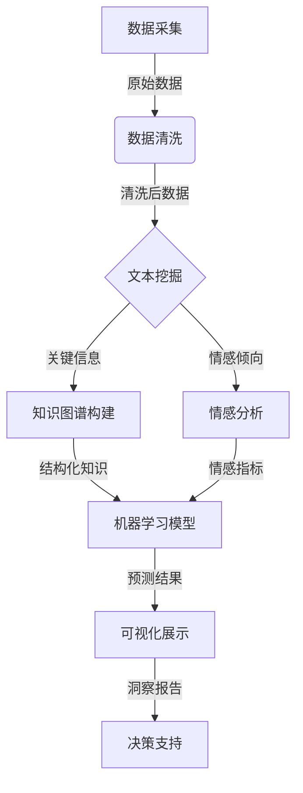

# 使用AI代理进行市场分析：工作流程与数据解读

## 1. 背景介绍

### 1.1 问题的由来

在当今瞬息万变的商业环境中，及时获取准确的市场信息并对其进行深入分析是企业保持竞争优势的关键。传统的市场调研方法往往耗时耗力且成本高昂，难以满足企业对实时市场洞察的需求。随着人工智能(AI)和大数据技术的不断发展,AI代理应运而生,为企业提供了一种高效、可扩展的市场分析解决方案。

### 1.2 研究现状  

目前,AI代理在市场分析领域的应用正受到广泛关注。一些领先的科技公司已经开发出基于自然语言处理(NLP)、机器学习等技术的AI代理系统,用于自动化收集和处理海量的市场数据。然而,现有的AI代理系统大多专注于特定的任务或行业,缺乏一种通用的、端到端的解决方案。

### 1.3 研究意义

本文旨在探讨如何构建一个综合的AI代理系统,用于全面支持企业的市场分析工作流程。该系统将集成多种AI技术,包括网络爬虫、自然语言处理、知识图谱、机器学习等,实现从数据采集到可视化展示的全流程自动化。通过AI代理的辅助,企业可以高效地获取市场洞察,制定更明智的商业决策。

### 1.4 本文结构

本文将首先介绍AI代理在市场分析中的核心概念和技术,包括数据采集、数据清洗、文本挖掘、情感分析等。接下来,我们将详细阐述系统的核心算法原理和数学模型。然后,通过一个实际项目案例,演示如何使用AI代理进行市场分析。最后,我们将探讨该领域的发展趋势和挑战,并提供相关的工具和资源推荐。

## 2. 核心概念与联系

AI代理在市场分析中扮演着关键角色,它集成了多种AI技术,形成了一个端到端的解决方案。以下是该系统的核心概念及其相互关系:

1. **数据采集**: 使用网络爬虫技术从各种在线渠道(如新闻网站、社交媒体、论坛等)自动收集相关的原始数据,包括文本、图像、视频等多种形式。

2. **数据清洗**: 对原始数据进行预处理,去除无关信息和噪声,提取出有价值的数据子集。

3. **文本挖掘**: 应用自然语言处理(NLP)技术对文本数据进行深入挖掘,提取关键信息(如产品特征、竞争对手、用户评论等)和情感倾向。

4. **知识图谱构建**: 将从文本中提取的结构化知识组织成知识图谱,用于存储和管理市场相关的实体、概念及其关系。

5. **情感分析**: 对用户评论、社交媒体数据等进行情感分析,生成情感指标,了解用户对产品或服务的态度和体验。

6. **机器学习模型**: 基于知识图谱和情感指标训练机器学习模型,对市场趋势、用户需求等进行预测和分析。

7. **可视化展示**: 将分析结果以直观的图表、报告等形式展现,方便决策者快速获取洞察。

8. **决策支持**: 根据市场分析结果,为企业的产品策略、营销策略等提供决策支持。

通过上述核心概念的紧密结合,AI代理系统可以高效地从海量原始数据中提取有价值的市场洞察,为企业的决策提供强有力的支持。

## 3. 核心算法原理 & 具体操作步骤

### 3.1 算法原理概述

AI代理系统的核心算法原理主要包括以下几个方面:

1. **网络爬虫算法**: 用于自动化地从互联网上采集相关数据。常见的算法包括广度优先搜索(BFS)、深度优先搜索(DFS)等。

2. **自然语言处理算法**: 用于从非结构化文本数据中提取有价值的信息。常见的算法包括命名实体识别(NER)、关系提取、主题建模等。

3. **知识图谱构建算法**: 用于将提取的结构化知识组织成知识图谱。常见的算法包括实体链接、关系抽取、知识融合等。

4. **情感分析算法**: 用于从文本数据中识别情感倾向。常见的算法包括基于词典的方法、基于机器学习的方法等。

5. **机器学习算法**: 用于基于知识图谱和情感指标构建预测模型。常见的算法包括决策树、支持向量机(SVM)、深度学习等。

### 3.2 算法步骤详解

以下是AI代理系统的核心算法步骤:

1. **数据采集**:
   - 使用广度优先搜索(BFS)或深度优先搜索(DFS)算法从互联网上采集相关数据。
   - 设置种子URL作为起始点,根据链接关系递归地访问网页。
   - 对访问过的网页进行去重和内容提取,获取原始数据。

2. **数据清洗**:
   - 使用正则表达式、停用词过滤等方法去除无关信息和噪声。
   - 进行文本归一化,如大小写转换、词形还原等。
   - 提取出有价值的数据子集,作为后续处理的输入。

3. **文本挖掘**:
   - 使用命名实体识别(NER)算法从文本中提取实体,如产品名称、公司名称等。
   - 使用关系提取算法识别实体之间的关系,如"产品A是公司B生产的"。
   - 使用主题建模算法(如潜在狄利克雷分配,LDA)发现文本的主题结构。
   - 使用基于词典或机器学习的方法进行情感分析,获取情感倾向。

4. **知识图谱构建**:
   - 使用实体链接算法将提取的实体与知识库中的实体进行匹配。
   - 使用开放关系抽取算法从文本中发现新的关系。
   - 使用知识融合算法将来自多个数据源的知识整合到统一的知识图谱中。

5. **机器学习模型训练**:
   - 基于知识图谱和情感指标构建特征向量。
   - 使用监督学习算法(如决策树、SVM、深度学习等)训练预测模型。
   - 对模型进行评估和优化,提高预测精度。

6. **可视化展示和决策支持**:
   - 将预测结果以直观的图表、报告等形式展现。
   - 结合领域专家的经验,为企业的产品策略、营销策略等提供决策建议。

### 3.3 算法优缺点

AI代理系统的核心算法具有以下优点:

- 自动化程度高,可以大幅减少人工劳动。
- 能够处理海量的非结构化数据,发现隐藏的模式和洞察。
- 融合了多种AI技术,提供了端到端的解决方案。
- 可扩展性强,能够适应不同领域和规模的需求。

同时,这些算法也存在一些局限性:

- 算法的性能和准确性受到训练数据质量的影响。
- 某些算法(如深度学习)存在黑盒问题,缺乏可解释性。
- 需要大量的计算资源,对硬件要求较高。
- 存在一定的偏差和噪声,需要人工校验和调整。

### 3.4 算法应用领域

AI代理系统的核心算法可以广泛应用于以下领域的市场分析:

- 电子商务:分析用户评论、购买行为,了解产品需求和用户体验。
- 社交媒体营销:监测社交媒体上的用户讨论,把握营销机会。
- 竞争情报:跟踪竞争对手的动向,制定应对策略。
- 金融服务:挖掘新闻和社交媒体数据,预测市场趋势。
- 政策分析:分析公众对政策的反应,为决策提供参考。

## 4. 数学模型和公式 & 详细讲解 & 举例说明

### 4.1 数学模型构建

在AI代理系统中,数学模型主要用于文本挖掘、情感分析和机器学习等核心环节。以下是一些常见的数学模型:

1. **主题模型**:
   - 潜在狄利克雷分配(LDA)模型是一种常用的主题模型,用于发现文本集合中的潜在主题结构。
   - LDA模型假设每个文档是由一组主题组成,每个主题又由一组词语组成。
   - 模型的目标是估计文档-主题分布$\theta$和主题-词语分布$\phi$的参数。

2. **情感分析模型**:
   - 一种常见的情感分析模型是基于词典的方法,将每个词语赋予一个情感极性值(正面、负面或中性)。
   - 对于一段文本,计算所有词语的情感极性值的加权平均,作为整体情感极性的估计。

3. **机器学习模型**:
   - 常用的机器学习模型包括决策树、支持向量机(SVM)、逻辑回归等。
   - 这些模型通过学习训练数据,建立输入特征与目标变量之间的映射关系。
   - 对于市场分析任务,输入特征可以包括知识图谱中的实体、关系、情感指标等。

### 4.2 公式推导过程

以LDA主题模型为例,我们将推导出模型的核心公式。

LDA模型假设每个文档$d$是由一组主题$z$组成,每个主题又由一组词语$w$组成。我们引入以下随机变量:

- $\theta_d$: 文档$d$的主题分布
- $\phi_k$: 主题$k$的词语分布
- $z_{d,n}$: 文档$d$中第$n$个词语的主题
- $w_{d,n}$: 文档$d$中第$n$个词语

根据LDA模型的生成过程,我们可以写出联合分布:

$$
p(\theta, z, w|\alpha, \beta) = \prod_{d=1}^{M}p(\theta_d|\alpha)\prod_{n=1}^{N_d}p(z_{d,n}|\theta_d)p(w_{d,n}|z_{d,n}, \beta)
$$

其中:

- $\alpha$和$\beta$分别是主题分布和词语分布的先验参数
- $M$是文档总数
- $N_d$是文档$d$中的词语数

我们的目标是估计$\theta$和$\phi$的参数值,使得观测到的词语$w$的似然函数$p(w|\alpha, \beta)$最大化。由于直接优化似然函数比较困难,通常采用变分推断的方法进行近似求解。

### 4.3 案例分析与讲解

现在,我们来看一个实际案例,分析如何使用LDA主题模型挖掘用户对某款智能手机的评论数据。

假设我们已经从电子商务网站上爬取了10,000条用户评论,构成了一个文本语料库$D$。我们的目标是发现评论中的主题结构,了解用户关注的主要方面。

1. 首先,我们对文本进行预处理,包括分词、去停用词、词形还原等步骤。
2. 然后,我们使用`gensim`库中的LDA模型,设置主题数为10,对预处理后的语料库$D$进行训练。
3. 训练完成后,我们可以查看每个主题的top keywords,初步判断主题的语义。
4. 同时,我们也可以查看每个文档(用户评论)在不同主题上的分布$\theta_d$,找出代表性的评论样本。
5. 通过分析主题结构和样本评论,我们可以发现用户较为关注的问题,如电池续航、拍照