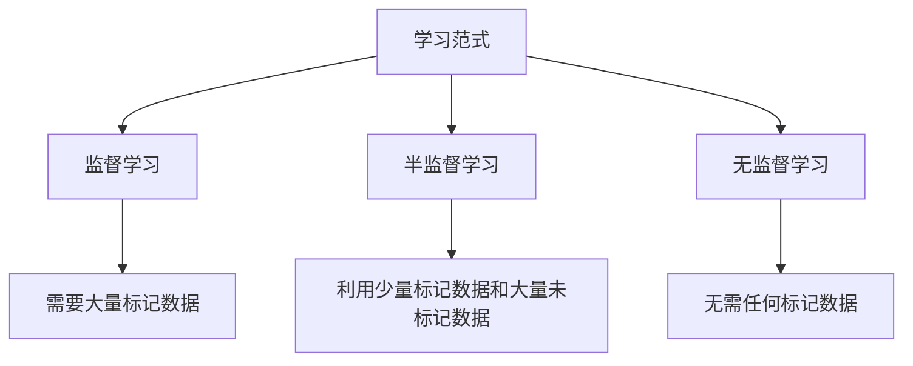

好的,我会按照您的要求,以专业的技术语言撰写这篇关于半监督学习的博客文章。

# 半监督学习 (Semi-Supervised Learning) 原理与代码实例讲解

## 1. 背景介绍

### 1.1 问题的由来

在现实世界中,获取大量高质量的标记数据通常是一个巨大的挑战。由于人工标注数据的过程是昂贵且耗时的,因此大多数可用的数据集都是未标记的。然而,监督学习算法需要大量的标记数据来训练模型,这就造成了数据的稀缺性。为了解决这个问题,半监督学习(Semi-Supervised Learning)应运而生。

### 1.2 研究现状 

半监督学习旨在利用少量的标记数据和大量的未标记数据,通过有效地结合两者的优势来提高模型的性能。近年来,随着深度学习的兴起,半监督学习在计算机视觉、自然语言处理等领域取得了显著的进展。但与此同时,半监督学习也面临着一些挑战,例如如何有效地利用未标记数据、如何避免模型偏差等。

### 1.3 研究意义

半监督学习的研究意义主要体现在以下几个方面:

1. **降低数据标注成本**: 由于只需要标记少量数据,可以大大降低人工标注的成本和工作量。
2. **提高模型性能**: 通过有效利用未标记数据,可以提高模型的泛化能力,从而提高模型性能。
3. **应用前景广阔**: 半监督学习可以应用于各种领域,如计算机视觉、自然语言处理、推荐系统等。

### 1.4 本文结构

本文将首先介绍半监督学习的核心概念和与其他学习范式的联系。接下来,将详细阐述半监督学习的核心算法原理和具体操作步骤,并对相关的数学模型和公式进行讲解和案例分析。然后,我们将通过一个实际项目,展示半监督学习的代码实现和运行结果。最后,本文将探讨半监督学习在实际应用中的场景,推荐相关的工具和资源,并总结未来的发展趋势和面临的挑战。

## 2. 核心概念与联系

半监督学习是介于监督学习和无监督学习之间的一种学习范式。它利用了少量的标记数据和大量的未标记数据,结合了两者的优势。

在监督学习中,模型是基于大量的标记数据进行训练的。这种方法虽然可以获得较好的性能,但是需要大量的人工标注工作,成本较高。

而无监督学习则不需要任何标记数据,它通过发现数据内在的模式和结构来学习。但是,无监督学习通常难以获得与监督学习相媲美的性能。

半监督学习则试图在这两种极端情况之间寻求一种平衡。它利用少量的标记数据来指导模型学习,同时也利用大量的未标记数据来提高模型的泛化能力。

半监督学习的核心思想是:通过对未标记数据进行合理的假设和利用,来提高模型在标记数据上的性能。常见的假设包括:

1. **平滑性假设(Smoothness Assumption)**: 如果两个实例在输入空间中距离很近,那么它们在输出空间中也应该很接近。
2. **团集假设(Cluster Assumption)**: 数据倾向于形成离散的团集,每个团集内的实例应该具有相同的输出标签。
3. **流形假设(Manifold Assumption)**: 高维数据实际上躺在一个低维流形上,学习算法应该关注这个低维流形的结构。

基于这些假设,半监督学习算法通常包括以下几个关键步骤:

1. 利用标记数据训练一个初始模型。
2. 利用初始模型对未标记数据进行预测,获得伪标签。
3. 结合标记数据和伪标签数据,重新训练模型。
4. 迭代上述过程,直到模型收敛或达到停止条件。

下面是半监督学习与监督学习和无监督学习的关系示意图:



## 3. 核心算法原理 & 具体操作步骤

半监督学习涉及多种算法,包括生成模型、半监督支持向量机、图正则化等。这里我们重点介绍一种广泛使用的半监督学习算法:基于伪标签的半监督学习算法。

### 3.1 算法原理概述

基于伪标签的半监督学习算法的核心思想是:利用已有的少量标记数据训练一个初始模型,然后使用该模型对未标记数据进行预测,获得伪标签。接下来,将伪标签数据与原始的标记数据合并,作为扩展的训练集,重新训练模型。重复这个过程,直到模型收敛或达到停止条件。

该算法的关键步骤如下:

1. 使用少量的标记数据训练一个初始模型。
2. 使用初始模型对未标记数据进行预测,获得伪标签。
3. 将伪标签数据与原始标记数据合并,形成扩展的训练集。
4. 使用扩展的训练集重新训练模型。
5. 重复步骤2-4,直到模型收敛或达到停止条件。

算法的伪代码如下:

```
输入: 
    X_l: 标记数据
    X_u: 未标记数据
    y_l: 标记数据的标签
    
初始化:
    训练初始模型 f 使用 (X_l, y_l)
    
重复:
    # 伪标签生成
    y_u = f(X_u) 
    
    # 训练集扩展
    X_train = X_l ∪ X_u
    y_train = y_l ∪ y_u
    
    # 模型重新训练
    f = 训练模型(X_train, y_train)
    
直到模型收敛或达到停止条件

输出: 训练好的模型 f
```

### 3.2 算法步骤详解

1. **训练初始模型**

    使用少量的标记数据 $(X_l, y_l)$ 训练一个初始模型 $f$。这个初始模型可以是任何监督学习算法,如逻辑回归、决策树、神经网络等。

2. **生成伪标签**

    使用初始模型 $f$ 对未标记数据 $X_u$ 进行预测,获得伪标签 $y_u$。伪标签是模型对未标记数据的预测输出,它们虽然不是真实的标签,但可以作为有价值的监督信号。

    $$y_u = f(X_u)$$

3. **训练集扩展**

    将伪标签数据 $(X_u, y_u)$ 与原始的标记数据 $(X_l, y_l)$ 合并,形成扩展的训练集 $(X_{train}, y_{train})$。

    $$X_{train} = X_l \cup X_u$$
    $$y_{train} = y_l \cup y_u$$

4. **模型重新训练**

    使用扩展的训练集 $(X_{train}, y_{train})$ 重新训练模型 $f$。这里可以使用与初始模型相同的算法,也可以使用其他算法。

    $$f = \text{训练模型}(X_{train}, y_{train})$$

5. **迭代训练**

    重复步骤2-4,不断生成新的伪标签,扩展训练集,并重新训练模型。这个过程一直持续,直到模型收敛(即模型在连续几次迭代中的变化很小)或达到其他停止条件(如迭代次数上限)。

通过这种迭代的方式,模型可以逐步利用未标记数据中蕴含的信息,提高自身的性能。

### 3.3 算法优缺点

**优点:**

1. **利用未标记数据**: 算法可以有效利用大量的未标记数据,提高模型的泛化能力。
2. **成本较低**: 只需要少量的标记数据,可以大大降低人工标注的成本。
3. **通用性强**: 该算法可以与多种监督学习算法相结合,如逻辑回归、决策树、神经网络等。

**缺点:**

1. **伪标签质量**: 算法的性能很大程度上依赖于伪标签的质量。如果初始模型产生了大量错误的伪标签,会导致模型性能下降。
2. **确认偏差**: 在迭代过程中,模型可能会过度自信于自己的预测,从而导致确认偏差(Confirmation Bias)。
3. **超参数选择**: 算法涉及多个超参数,如伪标签置信度阈值、训练集扩展比例等,需要进行调优。

### 3.4 算法应用领域

基于伪标签的半监督学习算法广泛应用于多个领域,包括但不限于:

1. **计算机视觉**: 如图像分类、目标检测、语义分割等任务。
2. **自然语言处理**: 如文本分类、机器翻译、情感分析等任务。
3. **推荐系统**: 利用少量的用户反馈数据和大量的未标记数据,提高推荐系统的性能。
4. **异常检测**: 利用未标记数据学习数据的正常模式,检测异常情况。
5. **医疗健康**: 利用少量的标记病例数据和大量的未标记数据,提高疾病诊断模型的性能。

## 4. 数学模型和公式 & 详细讲解 & 举例说明

在半监督学习中,常见的数学模型包括生成模型(如高斯混合模型)和判别模型(如半监督支持向量机)。这里我们重点介绍一种常用的半监督学习模型:基于熵正则化的半监督模型。

### 4.1 数学模型构建

基于熵正则化的半监督模型的目标是在标记数据和未标记数据上同时最小化损失函数。其数学表达式如下:

$$\min_f \sum_{i=1}^{n_l} L(f(x_i^l), y_i^l) + \lambda_u \sum_{i=1}^{n_u} H(f(x_i^u)) + \lambda_r \Omega(f)$$

其中:

- $f$ 表示模型,可以是逻辑回归、神经网络等。
- $L(\cdot)$ 是监督损失函数,如交叉熵损失。
- $H(\cdot)$ 是熵正则化项,用于鼓励模型在未标记数据上的预测具有较低的熵(即较高的置信度)。
- $\Omega(f)$ 是正则化项,用于控制模型的复杂度,避免过拟合。
- $\lambda_u$ 和 $\lambda_r$ 是超参数,用于平衡三个项的重要性。

第一项是标记数据上的监督损失,第二项是未标记数据上的熵正则化项,第三项是模型的正则化项。

对于熵正则化项 $H(f(x_i^u))$,它可以采用不同的形式,常见的有:

1. **熵最小化**:

   $$H(f(x_i^u)) = -\sum_{k=1}^K f_k(x_i^u) \log f_k(x_i^u)$$

   其中 $f_k(x_i^u)$ 表示模型对未标记数据 $x_i^u$ 预测为第 $k$ 类的概率。这个熵项鼓励模型在未标记数据上的预测具有较高的置信度(即某一类的概率接近1)。

2. **置信度惩罚**:

   $$H(f(x_i^u)) = 1 - \max_k f_k(x_i^u)$$

   这个熵项直接惩罚模型在未标记数据上的最大预测概率不够高。

通过最小化上述目标函数,模型可以在标记数据和未标记数据上达到一个平衡,提高整体的性能。

### 4.2 公式推导过程

接下来,我们将推导基于熵正则化的半监督模型的优化算法。为了简化推导过程,我们假设模型 $f$ 是一个逻辑回归模型,监督损失函数 $L(\cdot)$ 是交叉熵损失,熵正则化项 $H(\cdot