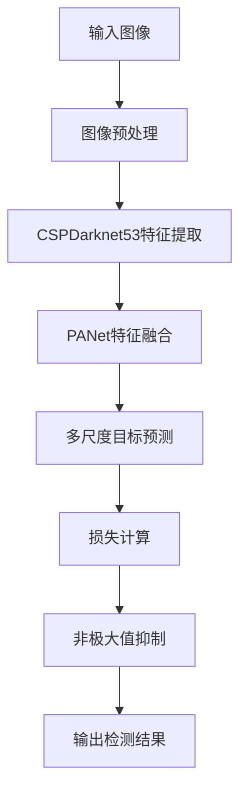

# 基于YOLOV5的交通标志识别

作者：禅与计算机程序设计艺术 / Zen and the Art of Computer Programming

关键词：YOLOV5, 交通标志识别, 深度学习, 目标检测, 智能交通

## 1. 背景介绍
### 1.1  问题的由来
随着城市化进程的加快和机动车保有量的不断增长,交通事故频发,给人民群众的生命财产安全带来了极大的威胁。交通标志作为道路交通安全的重要保障,其识别和检测对于辅助驾驶、自动驾驶等智能交通系统具有重要意义。传统的交通标志识别方法存在识别精度低、鲁棒性差等问题,难以满足实际应用需求。因此,亟需研究一种高精度、高效率、鲁棒性强的交通标志识别方法。

### 1.2  研究现状
近年来,以卷积神经网络为代表的深度学习技术在计算机视觉领域取得了突破性进展,极大地推动了目标检测技术的发展。其中,YOLO(You Only Look Once)系列算法以其精度高、速度快的优势受到广泛关注。特别是YOLOV5算法,在保持高精度的同时,进一步提升了检测速度,为实时交通标志识别提供了新的思路。目前,国内外学者已经开展了一些基于YOLOV5的交通标志识别研究,取得了良好效果,但在小目标检测、复杂场景适应性等方面仍有待进一步提升。

### 1.3  研究意义 
交通标志识别是智能交通系统的关键技术之一,对于提升道路交通安全、改善交通管理效率具有重要意义。基于YOLOV5的交通标志识别方法,有望在识别精度、检测速度、鲁棒性等方面取得突破,为智能交通系统的应用提供有力支撑。同时,该研究也将推动计算机视觉、深度学习等领域的理论创新和技术进步。

### 1.4  本文结构
本文将围绕基于YOLOV5的交通标志识别展开深入探讨。第2部分介绍相关核心概念;第3部分详细阐述YOLOV5算法原理;第4部分建立数学模型并推导相关公式;第5部分给出代码实现示例;第6部分分析实际应用场景;第7部分推荐相关工具和资源;第8部分总结全文并展望未来;第9部分列举常见问题解答。

## 2. 核心概念与联系
交通标志识别涉及计算机视觉、深度学习、智能交通等多个领域的核心概念。其中,最为关键的是:

- 计算机视觉:通过对图像和视频进行分析和理解,使计算机具备类似人眼的视觉能力。是交通标志识别的理论基础。
- 深度学习:通过构建多层神经网络,模拟人脑学习和认知的过程,自动提取和学习数据中的高层特征。是实现交通标志高精度识别的关键技术。  
- 卷积神经网络:一种专门用于处理网格拓扑结构数据(如图像)的深度神经网络。通过局部连接和权值共享,能够高效地提取图像特征。是深度学习在计算机视觉领域的主流模型。
- 目标检测:在给定图像中定位和识别出感兴趣目标(如交通标志)的任务。通常需要给出目标的类别和位置信息。是交通标志识别的核心问题。
- YOLO算法:一种端到端的实时目标检测算法。将目标检测问题转化为回归问题,通过单次网络前向传播直接预测目标位置和类别,极大提升了检测速度。
- 智能交通系统:利用计算机、通信、控制等现代信息技术,对交通运输系统进行实时监控、调度和管理,以提高交通效率和安全性。交通标志识别是其中的重要组成部分。

这些概念之间紧密关联,共同构成了交通标志识别的理论和技术基础。计算机视觉为识别任务提供原理支撑,深度学习尤其是卷积神经网络是实现高精度识别的关键,目标检测是问题的核心,YOLO算法以其卓越性能脱颖而出,智能交通系统是技术应用的主要场景。

## 3. 核心算法原理 & 具体操作步骤
### 3.1  算法原理概述
YOLOV5是一种基于深度卷积神经网络的端到端目标检测算法。它继承了YOLO系列算法的核心思想,即将目标检测问题转化为回归问题,通过单次网络前向传播直接预测目标的位置和类别,无需候选区域提取和后处理等复杂步骤。与此同时,YOLOV5在网络结构设计、训练策略优化等方面进行了一系列改进,进一步提升了检测精度和速度。

### 3.2  算法步骤详解
YOLOV5算法的主要步骤如下:

1. 图像预处理:将输入图像缩放到固定尺寸(如640x640),并进行归一化、通道排序等预处理操作。

2. 特征提取:使用CSPDarknet53网络提取图像特征。该网络由多个CSP(Cross Stage Partial)结构和Darknet53残差单元组成,可以在保证精度的同时降低计算量。

3. 特征融合:通过PANet(Path Aggregation Network)进行特征融合。它利用FPN(Feature Pyramid Network)和PAN(Pyramid Attention Network)思想,自底向上和自顶向下地聚合多尺度特征,增强了特征表示能力。

4. 目标预测:在三个不同尺度的特征图上进行目标预测。每个预测单元由一系列先验框(anchor box)组成,通过回归和分类分支预测先验框的位置偏移量和目标类别概率。

5. 损失计算:使用BCE(二元交叉熵)损失和GIOU(Generalized Intersection over Union)损失分别计算分类误差和定位误差,并加权求和得到最终损失函数。

6. 非极大值抑制:对预测结果进行非极大值抑制(NMS),去除冗余和重叠的检测框,得到最终的检测结果。

算法流程如下图所示:

### 3.3  算法优缺点
YOLOV5算法具有以下优点:

- 精度高:通过CSPDarknet53骨干网络和PANet特征融合,提取了丰富的多尺度语义特征,极大提升了检测精度。
- 速度快:采用单次检测策略,无需区域提议和后处理,网络结构也进行了优化,使得检测速度非常快,可达实时性要求。
- 易用性好:算法结构简洁,超参数少,对数据预处理要求低,适合工程部署。

同时,YOLOV5算法也存在一些不足:

- 小目标检测效果有待提升:对于像素较少的小目标,检测精度还有待进一步提高。
- 对遮挡和密集场景适应性不足:对于存在严重遮挡、目标密集分布的复杂场景,检测效果会有所下降。

### 3.4  算法应用领域
得益于其优异的性能,YOLOV5算法在诸多领域得到了广泛应用,如:

- 自动驾驶:用于车道线、交通标志、行人等关键目标的实时检测和识别。
- 智慧交通:对道路监控视频进行分析,获取车流量、拥堵状况等交通信息。
- 安防监控:对监控画面中的可疑人员、违禁物品等进行识别和告警。
- 工业质检:对生产线上的产品缺陷进行自动检测和定位。

此外,医疗影像分析、遥感图像解译、无人机目标跟踪等领域也有广阔的应用前景。

## 4. 数学模型和公式 & 详细讲解 & 举例说明
### 4.1  数学模型构建
YOLOV5目标检测可以表示为一个数学模型:

给定一张输入图像$I \in R^{H \times W \times 3}$,目标是预测出图像中所有目标的位置和类别。将图像划分为$S \times S$个网格,每个网格负责预测落在其中的目标。对于每个网格,预测$B$个先验框(anchor box)的位置偏移量和目标类别概率。

具体地,对于第$i$个网格的第$j$个先验框,定义以下变量:

- $b_x,b_y,b_w,b_h$:先验框的中心坐标和宽高。
- $t_x,t_y,t_w,t_h$:先验框的位置偏移量。
- $p_c$:该先验框包含目标的置信度。
- $p_1,p_2,...,p_C$:该先验框所包含目标属于各类别的概率。

其中,$C$为目标类别数。

### 4.2  公式推导过程
根据上述定义,YOLOV5的预测输出张量$\hat{y}$可以表示为:

$$
\hat{y} = [[\hat{t}_x,\hat{t}_y,\hat{t}_w,\hat{t}_h,\hat{p}_c,\hat{p}_1,\hat{p}_2,...,\hat{p}_C]_1,[\hat{t}_x,\hat{t}_y,\hat{t}_w,\hat{t}_h,\hat{p}_c,\hat{p}_1,\hat{p}_2,...,\hat{p}_C]_2,...,[\hat{t}_x,\hat{t}_y,\hat{t}_w,\hat{t}_h,\hat{p}_c,\hat{p}_1,\hat{p}_2,...,\hat{p}_C]_B]_1,\\
[[\hat{t}_x,\hat{t}_y,\hat{t}_w,\hat{t}_h,\hat{p}_c,\hat{p}_1,\hat{p}_2,...,\hat{p}_C]_1,[\hat{t}_x,\hat{t}_y,\hat{t}_w,\hat{t}_h,\hat{p}_c,\hat{p}_1,\hat{p}_2,...,\hat{p}_C]_2,...,[\hat{t}_x,\hat{t}_y,\hat{t}_w,\hat{t}_h,\hat{p}_c,\hat{p}_1,\hat{p}_2,...,\hat{p}_C]_B]_2,\\
...\\
[[\hat{t}_x,\hat{t}_y,\hat{t}_w,\hat{t}_h,\hat{p}_c,\hat{p}_1,\hat{p}_2,...,\hat{p}_C]_1,[\hat{t}_x,\hat{t}_y,\hat{t}_w,\hat{t}_h,\hat{p}_c,\hat{p}_1,\hat{p}_2,...,\hat{p}_C]_2,...,[\hat{t}_x,\hat{t}_y,\hat{t}_w,\hat{t}_h,\hat{p}_c,\hat{p}_1,\hat{p}_2,...,\hat{p}_C]_B]_S\\
$$

其中,$\hat{t}_x,\hat{t}_y,\hat{t}_w,\hat{t}_h$为网络预测的先验框位置偏移量,$\hat{p}_c$为预测的置信度,$\hat{p}_1,\hat{p}_2,...,\hat{p}_C$为预测的类别概率。

对于第$i$个网格的第$j$个先验框,其预测位置$\hat{b}_x,\hat{b}_y,\hat{b}_w,\hat{b}_h$可由先验框位置和偏移量计算得到:

$$
\begin{aligned}
\hat{b}_x &= \sigma(\hat{t}_x)+c_x\\
\hat{b}_y &= \sigma(\hat{t}_y)+c_y\\
\hat{b}_w &= b_w \cdot e^{\hat{t}_w}\\
\hat{b}_h &= b_h \cdot e^{\hat{t}_h}
\end{aligned}
$$

其中,$c_x,c_y$为网格的左上角坐标,$\sigma$为sigmoid函数,用于将偏移量映射到[0,1]范围内。

最终的目标置信度$\hat{s}$和类别概率$\hat{p}$可通过以下公式计算:

$$
\begin{aligned}
\hat{s} &= \sigma(\hat{p}_c)\\
\hat{p} &= \text{softmax}(\hat{p}_1,\hat{p}_2,...,\hat{p}_C)
\end{aligned}
$$

损失