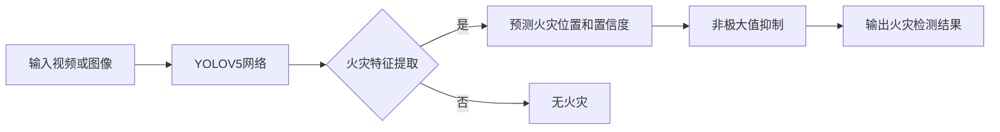
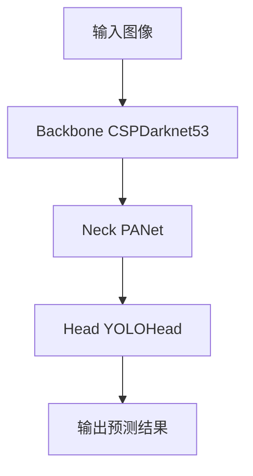

# 基于YOLOV5的火灾检测

关键词：火灾检测、YOLOV5、深度学习、目标检测、计算机视觉

## 1. 背景介绍
### 1.1  问题的由来
火灾是一种严重威胁人类生命财产安全的灾害。据统计,全球每年因火灾造成的经济损失高达数百亿美元,因火灾死亡和受伤的人数也不计其数。传统的火灾检测方法主要依靠烟雾传感器和温度传感器等,但这些方法存在响应时间长、误报率高等问题,难以满足实时、准确检测火灾的需求。

### 1.2  研究现状
近年来,随着人工智能尤其是深度学习技术的快速发展,计算机视觉在火灾检测领域得到了广泛应用。目前主流的火灾检测方法是基于深度学习的目标检测算法,通过对视频或图像中的火焰、烟雾等特征进行学习和识别,实现火灾的实时检测和预警。其中,YOLO(You Only Look Once)系列算法以其检测速度快、精度高的优势脱颖而出,成为火灾检测领域的研究热点。

### 1.3  研究意义
基于YOLOV5的火灾检测研究具有重要的理论意义和实际应用价值:

1. 有助于提高火灾检测的实时性和准确性,为火灾预防和扑救赢得宝贵时间,最大限度减少火灾造成的损失。  
2. 推动计算机视觉、深度学习等前沿技术在安防领域的应用,为智慧城市、平安城市建设提供新的解决方案。
3. 为相关领域的研究人员提供新的思路和参考,促进火灾检测技术的创新发展。

### 1.4  本文结构
本文将围绕基于YOLOV5的火灾检测展开深入探讨,内容涵盖:

- 第2部分介绍火灾检测和YOLOV5的核心概念及二者的联系
- 第3部分详细阐述YOLOV5算法的原理和操作步骤
- 第4部分建立火灾检测的数学模型,推导相关公式,并给出案例分析
- 第5部分提供基于YOLOV5的火灾检测代码实例,并进行详细解读
- 第6部分讨论该技术的实际应用场景和未来应用前景
- 第7部分推荐火灾检测领域的学习资源、开发工具等
- 第8部分总结全文,展望该领域的未来发展趋势和面临的挑战
- 第9部分列出常见问题解答,为读者释疑解惑

## 2. 核心概念与联系
火灾检测是利用各种传感器和算法及时发现火情,并报警或启动自动灭火装置,防止火灾蔓延的一种安防技术。传统的火灾检测主要依靠烟雾传感器、温度传感器等,存在误报率高、响应慢等缺陷。随着人工智能的发展,利用计算机视觉技术进行火灾检测成为了新的研究方向。

YOLOV5是一种先进的实时目标检测算法,由Alexey Bochkovskiy等人于2020年提出。它是YOLO系列算法的最新版本,在原有版本的基础上进行了优化和改进,进一步提升了检测速度和精度。YOLOV5将图像分割成网格,对每个网格预测目标的类别、位置和置信度,通过非极大值抑制去除冗余框,得到最终的检测结果。

将YOLOV5应用于火灾检测,就是利用该算法对视频或图像中的火焰、烟雾等火灾特征进行实时检测和定位。与传统方法相比,基于YOLOV5的火灾检测具有如下优势:

- 检测速度快:YOLOV5能够实现实时检测,帧率可达60FPS以上
- 检测精度高:在各大数据集上,YOLOV5的mAP(平均精度)超过90% 
- 易于部署:YOLOV5可以部署在各种硬件平台上,包括CPU、GPU、嵌入式设备等
- 适应性强:YOLOV5对光照、视角等变化有很好的鲁棒性

下图展示了YOLOV5火灾检测的整体流程:



## 3. 核心算法原理 & 具体操作步骤
### 3.1  算法原理概述
YOLOV5的核心是一个卷积神经网络,主要由Backbone、Neck和Head三部分组成:

- Backbone:用于提取图像特征,一般采用CSPDarknet53结构
- Neck:用于融合不同尺度的特征,常用PANet、FPN等结构  
- Head:用于预测目标的类别、位置和置信度,采用YOLOHead结构

网络结构如下图所示:



### 3.2  算法步骤详解
YOLOV5的检测流程可分为以下步骤:

1. 图像预处理:将输入图像缩放到固定尺寸(如640x640),并归一化到[0,1]
2. Backbone提取特征:图像依次通过CSPDarknet53的多个卷积层,提取出不同尺度的特征图
3. Neck特征融合:使用PANet等结构,自顶向下和自底向上地融合Backbone提取的特征  
4. Head预测结果:将融合后的特征送入YOLOHead,预测每个网格的目标类别、位置和置信度
5. 后处理:对预测框进行非极大值抑制,去除冗余和低置信度的框,得到最终检测结果
6. 可视化:将检测结果绘制在原图上,标注出火灾目标的位置和类别

### 3.3  算法优缺点
YOLOV5相比其他目标检测算法的优点有:

- 速度快:充分利用GPU并行计算能力,帧率可达实时
- 精度高:使用了先进的Backbone和Neck结构,在各大数据集上精度领先
- 易用性好:提供了配置文件和训练脚本,可以方便地进行训练和部署

但YOLOV5也存在一些局限性:

- 小目标检测效果欠佳:对于像素较少的小目标,检测精度有待提高
- 对遮挡目标敏感:当目标被遮挡时,检测效果会下降
- 需要大量标注数据:训练YOLOV5需要大量的标注图像,对数据要求较高

### 3.4  算法应用领域  
除了火灾检测,YOLOV5还可以应用于以下领域:

- 安防监控:用于行人、车辆等目标的检测和跟踪
- 工业视觉:用于工件缺陷检测、装配线目标定位等
- 无人驾驶:用于障碍物检测、车道线识别等
- 医学影像:用于病变区域检测、器官分割等

## 4. 数学模型和公式 & 详细讲解 & 举例说明
### 4.1  数学模型构建
为了实现火灾检测,我们需要建立一个数学模型,将问题抽象为一个目标检测任务。假设输入的图像为$I$,火灾目标的类别为$c$,位置为$b=(x,y,w,h)$,置信度为$p$,那么火灾检测的目标就是学习一个函数$f$:

$$f(I) \rightarrow \{(c_i,b_i,p_i)\}_{i=1}^N$$

其中$N$为检测到的火灾目标数量。函数$f$可以用YOLOV5网络来拟合,网络参数通过训练数据来学习。

### 4.2  公式推导过程
YOLOV5的损失函数由三部分组成:位置损失$L_{loc}$、置信度损失$L_{conf}$和类别损失$L_{cls}$。

位置损失采用CIOU Loss,公式为:

$$L_{loc} = 1 - CIOU$$

$$CIOU = IOU - \frac{\rho^2(b,\hat{b})}{c^2} - \alpha v$$

其中$b$和$\hat{b}$分别为真实框和预测框,$\rho$为欧氏距离,$c$为两框的对角线距离,$\alpha$为权重系数,$v$为长宽比一致性。

置信度损失采用二元交叉熵,公式为:  

$$L_{conf} = -\sum_{i=0}^{S^2}1_{ij}^{obj}(p_i\log(\hat{p}_i)+(1-p_i)\log(1-\hat{p}_i))$$

其中$S$为网格尺寸,$1_{ij}^{obj}$表示网格$(i,j)$中是否存在目标,$p_i$和$\hat{p}_i$分别为真实置信度和预测置信度。

类别损失也采用二元交叉熵,公式为:

$$L_{cls} = -\sum_{i=0}^{S^2}1_{ij}^{obj}\sum_{c\in classes}p_i(c)\log(\hat{p}_i(c))$$

其中$p_i(c)$和$\hat{p}_i(c)$分别为真实类别概率和预测类别概率。

最终的损失为三者的加权和:

$$L = \lambda_1 L_{loc} + \lambda_2 L_{conf} + \lambda_3 L_{cls}$$

其中$\lambda_1,\lambda_2,\lambda_3$为权重系数。

### 4.3  案例分析与讲解
下面我们以一个具体的火灾检测案例来说明YOLOV5的工作过程。假设输入一张尺寸为640x640的图像,其中包含一个火焰目标,位置为(120,200,100,150),YOLOV5检测过程如下:

1. 图像经过Backbone提取出三个尺度的特征图,分别为80x80,40x40,20x20
2. 特征图在Neck中进行上采样和拼接,得到融合后的特征图
3. 融合特征图送入YOLOHead,预测每个网格的目标概率、位置和类别
4. 假设在(30,50)的网格中,预测的火焰概率为0.8,位置为(0.4,0.6,0.3,0.4),转换到原图坐标为(116,196,96,144)
5. 对所有网格的预测框进行NMS,设置阈值为0.5,最终得到火焰目标的检测结果为(120,200,100,150,0.8)
6. 将检测框绘制在原图上,并标注火焰标签和置信度分数

通过以上步骤,YOLOV5成功检测出图像中的火灾目标,实现了火灾检测的功能。

### 4.4  常见问题解答
问:YOLOV5的输入图像尺寸是固定的吗?
答:不是,YOLOV5支持任意尺寸的图像输入,但是在训练时需要将图像缩放到固定尺寸,如640x640。

问:YOLOV5可以检测出多个火灾目标吗?
答:可以,YOLOV5通过在每个网格中预测多个框来实现多目标检测,并使用NMS算法去除重叠框。

问:YOLOV5的置信度阈值如何设置?
答:置信度阈值可以根据需求进行调整,默认为0.5,高于该阈值的预测框被视为有效检测。提高阈值可以降低误报率,但也可能漏检一些目标。

问:YOLOV5需要大量的训练数据吗?
答:是的,YOLOV5是一种数据驱动的方法,需要大量的标注图像进行训练。如果数据不足,可以使用迁移学习,在预训练模型的基础上进行微调。

## 5. 项目实践：代码实例和详细解释说明
### 5.1  开发环境搭建
首先需要搭建YOLOV5的开发环境,主要依赖以下库:

- Python 3.7+
- PyTorch 1.7+
- CUDA 10.1+ (如果使用GPU)
- cuDNN 7.0+ (如果使用GPU)
- OpenCV 4.0+

可以使用pip命令安装所需库:

```bash
pip install torch==1.8.0 torchvision==0.9