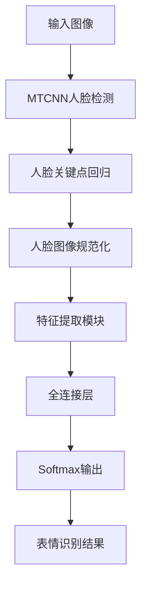

# 基于OpenCV的人脸表情识别系统详细设计与具体代码实现

## 1. 背景介绍

### 1.1 问题的由来

人脸表情识别是计算机视觉和模式识别领域的一个重要研究方向。人类的面部表情不仅是人与人之间交流情感的重要载体,也是人机交互中理解用户情绪状态的关键途径。随着人工智能技术的快速发展,人脸表情识别在安防监控、智能家居、虚拟现实等领域有着广泛的应用前景。

### 1.2 研究现状

传统的人脸表情识别方法主要基于几何特征和外观特征两种途径。几何特征方法通过检测面部关键点的位置和变化来判断表情,但对于头部姿态和遮挡等变化较为敏感。外观特征方法则直接从像素值提取特征,对于姿态变化和遮挡有较好的鲁棒性,但需要大量的训练数据。近年来,基于深度学习的方法在人脸表情识别任务上取得了卓越的成绩,尤其是卷积神经网络(CNN)在特征提取方面展现出强大的能力。

### 1.3 研究意义

人脸表情识别技术的发展不仅可以促进人机交互的自然化,还可以在医疗、教育、安防等领域发挥重要作用。例如,通过分析患者的面部表情,医生可以更好地了解病人的痛苦程度;教师可以根据学生的表情反馈调整教学策略;安防系统可以通过检测可疑人员的表情判断其是否有违法倾向等。因此,研究高效、鲁棒的人脸表情识别算法对于推动人工智能技术的发展和应用具有重要意义。

### 1.4 本文结构

本文将详细介绍基于OpenCV的人脸表情识别系统的设计和实现。首先阐述相关的核心概念和算法原理,包括人脸检测、特征提取和分类器设计等;然后给出数学模型和公式的推导过程,并通过案例分析进行详细说明;接下来介绍系统的代码实现细节,包括开发环境搭建、关键代码模块和运行结果展示;最后探讨该系统在实际应用中的场景,并对未来的发展趋势和挑战进行展望。

## 2. 核心概念与联系

人脸表情识别系统的核心概念包括:

1. **人脸检测(Face Detection)**: 在给定的图像或视频流中定位人脸区域,是表情识别的前置步骤。常用的人脸检测算法有Viola-Jones、MTCNN等。

2. **特征提取(Feature Extraction)**: 从人脸区域中提取有效的特征,是表情识别的关键环节。传统方法包括基于几何特征(如面部关键点)和基于外观特征(如像素值、HOG、LBP等)的方法;深度学习方法则通过卷积神经网络自动学习特征表示。

3. **分类器设计(Classifier Design)**: 基于提取的特征,训练分类器对人脸表情进行识别和分类。常用的分类器有支持向量机(SVM)、随机森林、Boosting等,深度学习方法则直接将分类器集成在网络中进行端到端的训练。

4. **数据增强(Data Augmentation)**: 由于人脸表情数据的获取成本较高,通常需要采用数据增强技术(如旋转、平移、遮挡等)来扩充训练集,提高模型的泛化能力。

上述核心概念相互关联、环环相扣,构成了完整的人脸表情识别系统。其中,人脸检测是识别的前提,特征提取是关键,分类器设计则决定了最终的识别性能,而数据增强有助于提高模型的鲁棒性。

## 3. 核心算法原理与具体操作步骤

### 3.1 算法原理概述

本系统采用基于深度学习的端到端方法进行人脸表情识别,主要包括以下几个核心模块:

1. **人脸检测模块**: 使用MTCNN(Multi-task Cascaded Convolutional Networks)算法对输入图像进行人脸检测和关键点定位。MTCNN将人脸检测和关键点定位任务集成到一个统一的级联卷积网络架构中,展现出卓越的性能。

2. **特征提取模块**: 使用迁移学习的方法,基于预训练的深度卷积神经网络(如VGGNet、ResNet等)提取人脸区域的特征表示。这些预训练模型在大规模数据集上训练,能够学习到丰富的图像特征。

3. **表情分类模块**: 将提取的特征输入到全连接层,经过几次非线性变换后,输出表情类别的概率分布。在训练阶段,使用交叉熵损失函数对网络进行端到端的优化。

该算法的优势在于:1)端到端的设计避免了人工设计特征的复杂过程;2)基于深度卷积网络的特征提取具有强大的表征能力;3)使用迁移学习可以充分利用已有的预训练模型,降低训练难度。

### 3.2 算法步骤详解

1. **人脸检测**:
    - 使用MTCNN算法对输入图像进行多尺度窗口扫描,生成人脸候选框;
    - 对候选框内的人脸区域进行关键点回归,获得人脸关键点的位置;
    - 根据关键点位置,将人脸区域进行几何变换,获得规范化的人脸图像。

2. **特征提取**:
    - 将规范化的人脸图像输入到预训练的深度卷积神经网络(如VGGNet)中;
    - 在特定的卷积层提取特征张量,并对其进行全局平均池化操作,获得一个固定长度的特征向量。

3. **表情分类**:
    - 将特征向量输入到全连接层,经过几次非线性变换后,输出表情类别的概率分布;
    - 在训练阶段,使用带有softmax的交叉熵损失函数,对网络进行端到端的优化训练;
    - 在测试阶段,选择概率最大的类别作为最终的表情识别结果。

上述算法步骤可以用以下流程图直观地表示:

### 3.3 算法优缺点

**优点**:

1. 端到端的设计,避免了人工设计特征的复杂过程,提高了系统的自动化水平。
2. 基于深度卷积网络的特征提取具有强大的表征能力,能够学习到更加丰富和抽象的特征。
3. 使用迁移学习技术,可以充分利用已有的预训练模型,降低了训练难度和数据需求。
4. MTCNN算法能够高效准确地检测人脸和定位关键点,为后续的特征提取和分类奠定基础。

**缺点**:

1. 深度学习模型通常需要大量的训练数据,而人脸表情数据的获取成本较高,可能会影响模型的泛化能力。
2. 模型的训练过程较为复杂,需要调整多个超参数,对GPU资源的需求也较高。
3. 对于遮挡、姿态变化等情况,模型的识别性能可能会受到一定影响。
4. 深度学习模型通常被视为"黑箱",其内部机理并不十分透明,可解释性较差。

### 3.4 算法应用领域

基于深度学习的人脸表情识别算法具有广泛的应用前景,包括但不限于:

1. **人机交互系统**: 通过识别用户的面部表情,实现更加自然、友好的人机交互体验,如智能家居、虚拟现实等。

2. **安防监控**: 在公共场所通过分析人员的面部表情,判断其是否存在违法倾向,提高安防效率。

3. **医疗保健**: 分析患者的面部表情,帮助医生更好地了解病人的痛苦程度,为诊断和治疗提供参考。

4. **驾驶辅助**: 通过识别驾驶员的面部表情,判断其是否存在疲劳、分心等状态,及时发出警示。

5. **教育领域**: 根据学生的面部表情反馈,教师可以调整授课策略和内容,提高教学效果。

6. **情感计算**: 面部表情识别是情感计算的重要组成部分,可用于分析人类的情绪状态,为相关领域提供支持。

7. **娱乐领域**: 在游戏、动画等娱乐产品中,通过面部表情识别实现更加身临其境的交互体验。

总的来说,人脸表情识别技术可以广泛应用于需要人机交互、情绪分析的领域,为人工智能技术的发展提供有力支撑。

## 4. 数学模型和公式详细讲解与举例说明

### 4.1 数学模型构建

在人脸表情识别任务中,我们可以将其建模为一个多分类问题。给定一个人脸图像 $x$,我们的目标是学习一个映射函数 $f: x \mapsto y$,将图像 $x$ 映射到正确的表情类别 $y$。

具体来说,我们采用深度卷积神经网络作为映射函数 $f$ 的参数化模型。设网络的参数为 $\theta$,输入为人脸图像 $x$,输出为各个表情类别的概率分布 $\hat{y} = f(x; \theta)$。在训练阶段,我们的目标是通过优化网络参数 $\theta$,使得预测的概率分布 $\hat{y}$ 尽可能接近真实的类别标签 $y$。

为了量化预测与真实标签之间的差异,我们引入交叉熵损失函数:

$$J(\theta) = -\frac{1}{N} \sum_{i=1}^{N} \sum_{j=1}^{M} y_{i j} \log \hat{y}_{i j}$$

其中 $N$ 为训练样本数量, $M$ 为表情类别数, $y_{ij}$ 为样本 $i$ 对于类别 $j$ 的真实标签(0或1), $\hat{y}_{ij}$ 为网络对于样本 $i$ 预测的类别 $j$ 的概率。

我们的目标是通过优化算法(如随机梯度下降)最小化损失函数 $J(\theta)$,从而获得最优的网络参数 $\theta^*$:

$$\theta^* = \arg\min_\theta J(\theta)$$

在测试阶段,对于给定的人脸图像 $x$,我们将其输入到训练好的网络中,获得各个类别的概率分布 $\hat{y} = f(x; \theta^*)$,选择概率最大的类别作为最终的表情识别结果。

### 4.2 公式推导过程

交叉熵损失函数的推导过程如下:

对于单个样本 $(x, y)$,其中 $x$ 为输入图像, $y$ 为one-hot编码的真实标签,我们希望模型的输出 $\hat{y}$ 尽可能接近 $y$。

首先,我们定义样本的负对数似然损失:

$$L(y, \hat{y}) = -\log P(y|x) = -\sum_{j=1}^{M} y_j \log \hat{y}_j$$

其中 $M$ 为类别数, $y_j$ 为真实标签中类别 $j$ 的值(0或1), $\hat{y}_j$ 为模型预测的类别 $j$ 的概率。

对于整个训练集,我们取所有样本的平均负对数似然损失作为总体损失函数:

$$J = -\frac{1}{N} \sum_{i=1}^{N} \log P(y^{(i)}|x^{(i)}) = -\frac{1}{N} \sum_{i=1}^{N} \sum_{j=1}^{M} y_j^{(i)} \log \hat{y}_j^{(i)}$$

其中 $N$ 为训练样本数量。

这就是交叉熵损失函数的推导过程。在实际应用中,我们通常对损失函数取负号,将其转化为需要最小化的形式:

$$J(\theta) = -\frac{1}{N} \sum_{