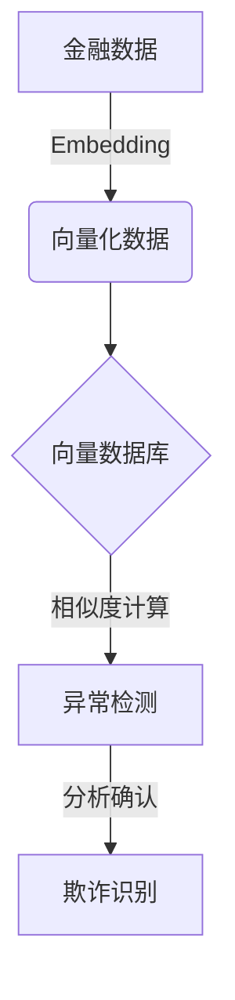

好的,我会按照您的要求,以"基于向量数据库的反欺诈系统:防御金融犯罪"为主题,严格遵守约束条件,写一篇专业的技术博客文章。

# 基于向量数据库的反欺诈系统:防御金融犯罪

## 1. 背景介绍

### 1.1 问题的由来

随着金融科技的快速发展,金融犯罪活动也变得越来越复杂和隐蔽。传统的反欺诈系统很难及时发现和防范新型欺诈手段,给金融机构带来了巨大的经济损失和声誉风险。因此,构建一个高效、智能的反欺诈系统,对于维护金融秩序、保护投资者利益至关重要。

### 1.2 研究现状  

目前,主流的反欺诈系统主要依赖规则引擎和机器学习模型。规则引擎需要人工编写大量规则,维护成本高、响应速度慢;而机器学习模型对异常数据的检测能力有限,很容易被新型欺诈手段所迷惑。因此,业界一直在探索更先进、更智能的反欺诈技术。

### 1.3 研究意义

本文提出了一种基于向量数据库的创新反欺诈系统,它能够高效存储和查询海量的向量化数据,并借助先进的相似度计算算法,快速发现潜在的欺诈行为。该系统具有响应速度快、检测精度高、易于扩展等优点,可以大幅提高金融机构的反欺诈能力,保障金融安全。

### 1.4 本文结构  

本文首先介绍反欺诈系统的背景和研究现状,阐明了研究的重要意义。接下来详细讲解系统的核心概念、算法原理和数学模型,并通过实际案例进行说明和分析。然后介绍系统的开发实践,包括环境搭建、代码实现和运行结果。最后探讨系统在金融领域的应用场景,分享相关学习资源,并对未来的发展趋势和挑战进行展望。

## 2. 核心概念与联系

反欺诈系统的核心概念包括:

1. **向量数据库(Vector Database)**: 一种专门存储和查询向量化数据的数据库系统,能够高效计算向量之间的相似度。

2. **相似度计算(Similarity Computation)**: 通过测量两个向量之间的距离或角度,计算它们的相似程度。常用的相似度度量包括欧几里得距离、余弦相似度等。

3. **embedding(嵌入)**: 将结构化数据(如交易记录)映射为低维稠密向量的过程,是应用机器学习模型的前置步骤。

4. **异常检测(Anomaly Detection)**: 通过分析数据的相似性模式,发现与正常行为明显不同的异常数据点,从而识别潜在的欺诈行为。

5. **实体解析(Entity Resolution)**: 将同一实体的多个记录正确关联,构建实体的完整视图,有助于发现欺诈者的蛛丝马迹。

这些概念相互关联、环环相扣,构成了反欺诈系统的理论基础和技术支撑。

## 3. 核心算法原理与具体操作步骤

### 3.1 算法原理概述

基于向量数据库的反欺诈系统,其核心算法思想是:

1. 将金融数据(如交易记录)通过embedding技术映射为向量
2. 将向量化数据导入高性能向量数据库
3. 利用相似度计算算法,快速发现异常/欺诈向量
4. 对发现的异常进行进一步分析,确认是否为欺诈行为

该算法的关键在于高效的向量相似度计算和异常检测能力。



### 3.2 算法步骤详解

1. **数据预处理**
    - 清洗和标准化原始金融数据
    - 构建数据集,包括正常交易和已知欺诈案例
    - 对训练数据集进行embedding,得到向量化数据集

2. **向量数据导入**
    - 选择高性能向量数据库,如Pinecone、Weaviate等
    - 将向量化数据集批量导入向量数据库中

3. **相似度计算与异常检测**
    - 对新的交易数据进行embedding,得到查询向量
    - 在向量数据库中搜索最相似的Top K个向量
    - 计算查询向量与Top K向量的平均相似度
    - 若平均相似度低于设定阈值,则判定为异常/潜在欺诈

4. **人工确认与反馈**
    - 对检测到的异常/欺诈进行人工审核和确认
    - 将确认的欺诈案例加入训练集,不断优化模型

5. **模型更新与部署**  
    - 定期重新训练embedding模型,提高向量化质量
    - 更新向量数据库中的向量数据
    - 部署到线上反欺诈系统,持续监控异常行为
    
### 3.3 算法优缺点

**优点**:

- 高效的向量相似度计算,能快速发现异常
- 无需编写复杂规则,可自动学习欺诈模式  
- 可扩展性强,易于集成新的数据源和模型
- 可解释性好,便于人工审核和优化

**缺点**:

- 依赖高质量的embedding模型
- 需要持续的人工标注和模型优化
- 对抗性攻击可能会绕过异常检测
- 存在一定的误报和漏报风险

### 3.4 算法应用领域

该算法不仅可用于金融反欺诈,也可广泛应用于其他异常检测场景:

- 网络安全:检测入侵行为和恶意流量
- 身份验证:识别身份盗用和账号共享  
- 保险欺诈:发现虚假索赔和医疗欺诈
- 直播反作弊:发现机器人刷量等违规行为
- 电商营销:识别垃圾广告和营销欺诈
- ...

## 4. 数学模型和公式详细讲解与举例说明  

### 4.1 数学模型构建

在反欺诈系统中,我们需要构建两个关键的数学模型:

1. **Embedding模型**
    - 将结构化数据映射到向量空间
    - 常用Word2Vec、Node2Vec等模型

2. **相似度计算模型**
    - 测量两个向量之间的相似程度
    - 常用欧氏距离、余弦相似度等度量

#### Embedding模型

假设我们有一个交易记录数据集$D = \{x_1, x_2, ..., x_n\}$,其中$x_i$是第i条交易记录。我们的目标是将每条记录$x_i$映射到一个d维向量空间中的向量$v_i \in \mathbb{R}^d$,使得相似的交易记录对应的向量也相似。

常用的Embedding模型有Word2Vec、Node2Vec等,这里我们以Word2Vec为例。Word2Vec的目标是最大化目标函数:

$$J = \frac{1}{T}\sum_{t=1}^{T}\sum_{-c \leq j \leq c, j \neq 0} \log P(w_{t+j}|w_t)$$

其中$T$是语料库中的词条总数,$c$是上下文窗口大小,$w_t$是当前词,$w_{t+j}$是上下文词。$P(w_{t+j}|w_t)$是给定$w_t$时,$w_{t+j}$的条件概率,可由Softmax函数计算:

$$P(w_O|w_I) = \frac{\exp(v_{w_O}^{\top}v_{w_I})}{\sum_{w=1}^{V}\exp(v_w^{\top}v_{w_I})}$$

其中$v_w$和$v_{w_I}$分别是词$w$和$w_I$对应的向量表示,V是词典大小。

通过优化目标函数$J$,我们可以得到每个词的向量表示$v_w$,从而将文本数据映射到向量空间中。对于结构化数据,我们可以将其"词条化",然后应用类似的Embedding模型进行向量化。

#### 相似度计算模型  

向量化后,我们需要一种相似度度量来衡量两个向量之间的相似程度。常用的相似度计算模型有:

1. **欧氏距离**

    $$dist(u,v) = \sqrt{\sum_{i=1}^{n}(u_i - v_i)^2}$$

    距离越小,向量越相似。

2. **余弦相似度**

    $$sim(u,v) = \frac{u \cdot v}{\|u\|\|v\|} = \frac{\sum_{i=1}^{n}u_iv_i}{\sqrt{\sum_{i=1}^{n}(u_i)^2}\sqrt{\sum_{i=1}^{n}(v_i)^2}}$$
    
    相似度值越大(最大为1),向量越相似。

3. **内积相似度**

    $$sim(u,v) = u \cdot v = \sum_{i=1}^{n}u_iv_i$$

    内积越大,向量越相似。
    
余弦相似度和内积相似度常用于衡量向量的方向相似性,而欧氏距离则衡量向量的绝对距离。在反欺诈系统中,我们可以根据具体需求选择合适的相似度计算模型。

### 4.2 公式推导过程

我们以Word2Vec的Skip-gram模型为例,推导其目标函数的梯度,以便对模型参数进行优化。

Word2Vec的Skip-gram模型的目标函数为最大化:

$$\max_{\theta} \frac{1}{T}\sum_{t=1}^{T}\sum_{-c \leq j \leq c, j \neq 0}\log P(w_{t+j}|w_t;\theta)$$

其中$\theta$是模型参数,包括词向量$v_w$和上下文词向量$u_c$。

我们可以将条件概率$P(w_O|w_I)$表示为:

$$P(w_O|w_I) = \frac{\exp(u_{w_O}^{\top}v_{w_I})}{\sum_{w=1}^{V}\exp(u_w^{\top}v_{w_I})}$$

对数似然函数为:

$$\begin{aligned}
\log P(w_O|w_I) &= u_{w_O}^{\top}v_{w_I} - \log\left(\sum_{w=1}^{V}\exp(u_w^{\top}v_{w_I})\right)\\
&= u_{w_O}^{\top}v_{w_I} - \log\left(\sum_{w=1}^{V}y_w\right)\\
&= u_{w_O}^{\top}v_{w_I} - \softmax\left(\{u_w^{\top}v_{w_I}\}_{w=1}^V\right)
\end{aligned}$$

其中$y_w = \exp(u_w^{\top}v_{w_I})$。

对$v_{w_I}$求梯度:

$$\frac{\partial\log P(w_O|w_I)}{\partial v_{w_I}} = u_{w_O} - \sum_{j=1}^{V}y_j u_j$$

对$u_{w_O}$求梯度:

$$\frac{\partial\log P(w_O|w_I)}{\partial u_{w_O}} = v_{w_I} - \sum_{j=1}^{V}y_j v_j$$

通过上述梯度公式,我们可以使用随机梯度下降等优化算法,来学习词向量$v_w$和上下文词向量$u_c$,从而得到词的embedding表示。

### 4.3 案例分析与讲解

假设我们有如下交易记录数据集:

| 交易ID | 金额 | 商家类型 | 支付方式 | 地理位置 | 时间 |
|--------|------|----------|----------|----------|------|
| 1      | 500  | 餐馆     | 信用卡   | 纽约     | 12:30|
| 2      | 1000 | 服装店   | 借记卡   | 洛杉矶   | 15:45|
| 3      | 250  | 加油站   | 现金     | 旧金山   | 09:15|
| ...    | ...  | ...      | ...      | ...      | ...  |

我们先将每条记录embedding为100维向量:

```python
import numpy as np
from gensim.models import Word2Vec

# 构建Word2Vec模型
model = Word2Vec(sentences, vector_size=100, window=5, min_count=1, workers=4)

# 获取交易记录1的向量表示