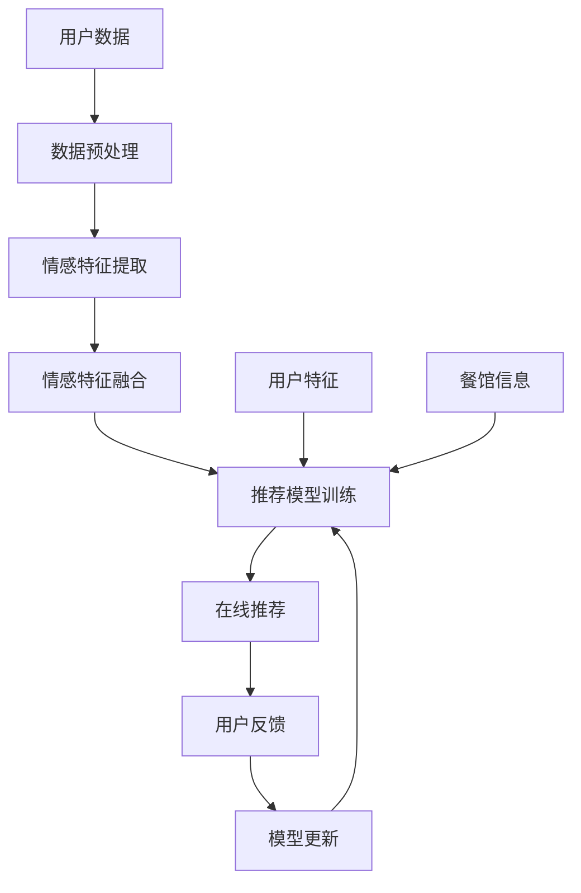

# 基于情感分析技术的餐饮推荐系统的设计与实现

## 1. 背景介绍

### 1.1 问题的由来

在当今快节奏的生活方式中,人们越来越难以挑选合适的餐馆。传统的餐馆推荐系统主要依赖于用户的历史偏好、菜品评分和地理位置等因素,但往往忽视了用户当下的情绪状态。情绪对人们的饮食偏好有着深远的影响,例如当人们感到压力时,可能会倾向于选择高热量、高糖分的食物;而当人们感到放松时,则可能更偏好健康的餐饮选择。

因此,将情感分析技术融入餐馆推荐系统,有望提供更加个性化和人性化的推荐服务。通过分析用户的文本、语音或面部表情等多模态数据,捕捉用户的情绪状态,结合用户的历史偏好和餐馆信息,可以为用户推荐最合适的餐馆,提升用户的用餐体验。

### 1.2 研究现状

情感分析技术在近年来得到了广泛的关注和研究。研究人员已经提出了多种基于机器学习和深度学习的情感分析模型,如支持向量机(SVM)、卷积神经网络(CNN)、循环神经网络(RNN)等。这些模型能够从文本、语音、图像等多模态数据中提取情感特征,并对情感进行分类和预测。

在餐馆推荐系统方面,也有一些研究尝试将情感分析技术应用于推荐过程。例如,有研究通过分析用户的在线评论来捕捉情绪,并将情绪作为一个重要特征融入协同过滤推荐算法中。另有研究利用深度学习模型从用户评论的文本和图像数据中提取情感特征,并将其与传统的协同过滤算法相结合,以提高推荐的准确性。

然而,现有的研究大多局限于单一模态的情感分析,或者只是简单地将情感特征作为辅助特征融入推荐系统,未能充分利用多模态数据和情感信息的潜力。因此,设计一个能够有效融合多模态情感分析和推荐算法的餐馆推荐系统,仍然是一个具有挑战性的研究课题。

### 1.3 研究意义

设计基于情感分析技术的餐馆推荐系统,具有以下重要意义:

1. **提升用户体验**:通过考虑用户的情绪状态,系统能够为用户推荐更加贴合其当下需求的餐馆,提高用户的满意度和忠诚度。

2. **促进商业发展**:为餐馆提供更精准的营销手段,吸引更多潜在顾客,提高餐馆的收益和竞争力。

3. **推动技术创新**:将情感分析技术与推荐系统相结合,是一种创新的尝试,可以推动两个领域的理论和技术发展。

4. **应用价值广泛**:除了餐馆推荐,情感驱动的推荐系统还可以应用于电影、音乐、旅游等多个领域,具有广阔的应用前景。

### 1.4 本文结构

本文将详细介绍基于情感分析技术的餐馆推荐系统的设计与实现过程。文章首先阐述系统的核心概念和技术,包括情感分析、推荐算法等。接下来,重点介绍系统的核心算法原理、数学模型和公式推导。然后,通过一个实际项目案例,展示系统的代码实现和运行结果。最后,探讨系统的应用场景、发展趋势和面临的挑战。

## 2. 核心概念与联系

情感分析和推荐系统是本项目的两大核心技术。情感分析旨在从多模态数据(如文本、语音、图像等)中自动识别、提取和量化人类的情绪状态。推荐系统则是基于用户的偏好和行为,为用户推荐感兴趣的项目(如餐馆、电影等)。

在本项目中,我们将情感分析技术与推荐算法相结合,构建一个新颖的餐馆推荐系统。具体来说,系统首先通过多模态情感分析模型捕捉用户的情绪状态,然后将情绪特征与用户的历史偏好、餐馆信息等传统特征相结合,输入到个性化推荐算法中,最终为用户推荐最合适的餐馆。

该系统的核心思想是:不同的情绪状态会影响人们的饮食偏好,因此将情绪作为一个重要特征纳入推荐算法,有望提高推荐的准确性和个性化程度。例如,当用户处于压力较大的状态时,系统可能会推荐一些口感浓郁、高热量的餐馆;而当用户处于放松愉悦的状态时,系统则可能会推荐一些健康、清淡的餐馆选择。

## 3. 核心算法原理 & 具体操作步骤

### 3.1 算法原理概述

本系统的核心算法包括两个部分:多模态情感分析模型和个性化推荐算法。

**多模态情感分析模型**的主要任务是从用户的文本、语音、图像等多模态数据中提取情感特征,并对用户的情绪状态进行分类和量化。常见的情感分类包括积极、消极、中性等类别。该模型通常采用深度学习技术,如卷积神经网络(CNN)、循环神经网络(RNN)、注意力机制等,对不同模态的数据进行特征提取和融合,最终得到用户的情感表示向量。

**个性化推荐算法**的任务是根据用户的情感特征、历史偏好、餐馆信息等多种特征,为用户推荐最合适的餐馆。常见的推荐算法包括协同过滤(Collaborative Filtering)、矩阵分解(Matrix Factorization)、深度学习推荐等。在本项目中,我们采用了一种基于深度学习的融合推荐算法,能够有效地将情感特征与传统特征相结合,提高推荐的准确性和个性化程度。

### 3.2 算法步骤详解

1. **数据预处理**:对用户的文本、语音、图像数据进行预处理,如文本分词、语音降噪、图像增强等,以提高后续模型的性能。

2. **情感特征提取**:将预处理后的多模态数据输入到情感分析模型中,分别提取文本、语音、图像的情感特征,得到对应的情感表示向量。

3. **情感特征融合**:使用注意力机制或其他融合策略,将多个模态的情感特征进行加权融合,得到用户的综合情感表示向量。

4. **推荐模型训练**:将用户的综合情感表示向量、历史偏好、餐馆信息等特征作为输入,输入到推荐模型中进行训练,目标是最小化用户对推荐餐馆的评分误差。

5. **在线推荐**:对新用户,重复步骤2和3,获取其情感表示向量;将该向量与其他特征一并输入到训练好的推荐模型中,得到该用户的餐馆推荐列表。

6. **反馈与更新**:记录用户对推荐结果的反馈(如点击、评分等),并将这些反馈数据加入训练集,定期重新训练推荐模型,不断提高推荐的准确性。

### 3.3 算法优缺点

**优点**:

1. 融合多模态数据,能够更全面地捕捉用户的情绪状态。
2. 将情感特征与传统特征相结合,提高了推荐的个性化程度和准确性。
3. 基于深度学习技术,具有强大的特征学习和模式挖掘能力。
4. 算法具有一定的通用性,可以应用于其他推荐场景。

**缺点**:

1. 需要大量的标注数据用于模型训练,数据获取和标注工作耗时耗力。
2. 深度学习模型的训练过程复杂,需要大量的计算资源。
3. 情感分析的准确性受多种因素影响,如语言习惯、文化背景等,存在一定的挑战。
4. 算法的可解释性较差,难以解释推荐结果的内在原因。

### 3.4 算法应用领域

除了餐馆推荐场景,该算法还可以应用于多个领域的推荐系统,如:

- **电影推荐**:根据用户的情绪状态推荐不同类型的电影,如轻松喜剧、励志剧情等。
- **音乐推荐**:分析用户的情绪,推荐能够缓解压力或增加愉悦感的音乐作品。
- **旅游推荐**:根据用户的情绪偏好,推荐放松或刺激的旅游景点和路线。
- **购物推荐**:情绪会影响人们的购买决策,可以推荐符合用户当下心理状态的商品。
- **新闻推荐**:不同情绪下,用户对新闻类型的偏好也不尽相同,可以提供个性化的新闻推荐。

## 4. 数学模型和公式 & 详细讲解 & 举例说明

### 4.1 数学模型构建

在本系统中,我们采用了一种基于深度学习的融合推荐模型,能够将情感特征与传统特征相结合,提高推荐的准确性和个性化程度。

假设有 $N$ 个用户和 $M$ 个餐馆,用 $\mathbf{R} \in \mathbb{R}^{N \times M}$ 表示用户-餐馆评分矩阵,其中 $r_{ij}$ 表示用户 $i$ 对餐馆 $j$ 的评分。我们的目标是学习一个函数 $\hat{r}_{ij} = f(\mathbf{x}_i, \mathbf{y}_j)$,能够预测用户 $i$ 对餐馆 $j$ 的评分,其中 $\mathbf{x}_i$ 和 $\mathbf{y}_j$ 分别表示用户 $i$ 和餐馆 $j$ 的特征向量。

在传统的协同过滤推荐算法中,用户特征 $\mathbf{x}_i$ 通常包括用户的历史评分、人口统计信息等,而餐馆特征 $\mathbf{y}_j$ 包括餐馆的类型、位置、菜品信息等。在本项目中,我们将用户的情感表示向量 $\mathbf{e}_i$ 作为一个重要特征,并将其与其他特征相结合,构建融合特征向量:

$$\mathbf{x}_i = [\mathbf{u}_i, \mathbf{e}_i, \mathbf{z}_i]$$

其中 $\mathbf{u}_i$ 表示用户 $i$ 的传统特征向量,如历史评分、人口统计信息等;$\mathbf{e}_i$ 表示用户 $i$ 的情感表示向量;$\mathbf{z}_i$ 表示其他辅助特征向量,如地理位置、时间等。

对于餐馆特征向量 $\mathbf{y}_j$,我们可以将餐馆的基本信息(如类型、位置等)和菜品信息(如菜品描述、图像等)进行编码,得到餐馆的综合特征向量表示。

有了用户特征向量 $\mathbf{x}_i$ 和餐馆特征向量 $\mathbf{y}_j$,我们可以使用深度神经网络来学习预测函数 $\hat{r}_{ij} = f(\mathbf{x}_i, \mathbf{y}_j)$。具体来说,我们采用了一种基于因子分解机(Factorization Machine, FM)的神经网络模型,能够有效地捕捉特征之间的高阶交互关系。

### 4.2 公式推导过程

我们首先定义预测函数 $\hat{r}_{ij}$ 为用户特征向量 $\mathbf{x}_i$ 和餐馆特征向量 $\mathb