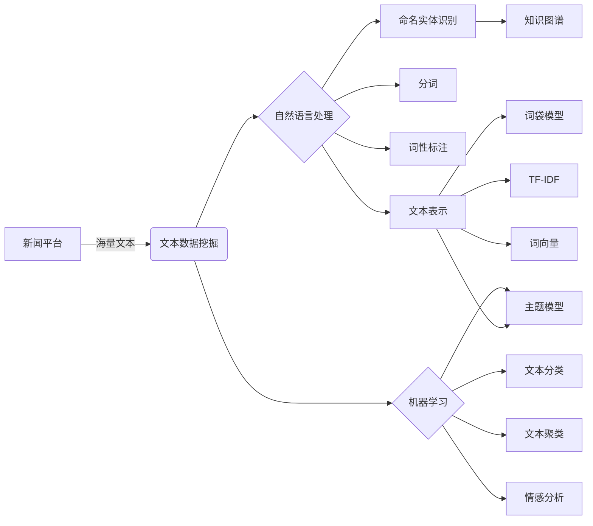
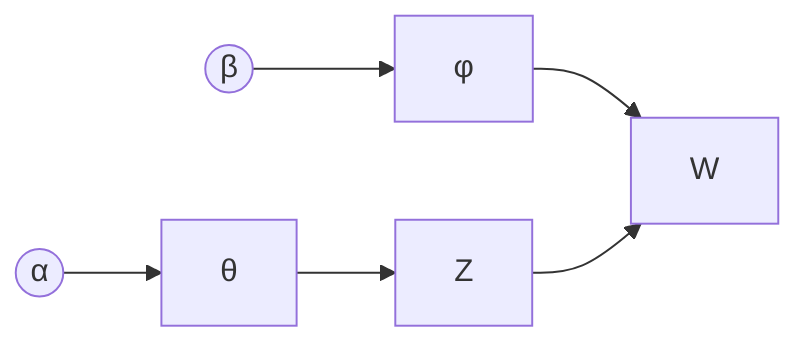

# 基于新闻平台的文本数据挖掘系统

关键词：文本数据挖掘、新闻平台、自然语言处理、机器学习、情感分析、主题模型

## 1. 背景介绍
### 1.1  问题的由来
在当今信息爆炸的时代,新闻平台每天都会产生海量的文本数据。如何从这些海量的非结构化文本数据中挖掘出有价值的信息和知识,已经成为新闻行业面临的重要课题。传统的人工阅读和分析方式已经无法应对如此庞大的数据量,迫切需要借助先进的文本数据挖掘技术来实现新闻数据的自动化处理和分析。

### 1.2  研究现状
目前,国内外学者已经在文本数据挖掘领域开展了大量的研究工作。一些常用的文本挖掘技术如分词、词性标注、命名实体识别、情感分析、主题模型等已经得到广泛应用。但是,针对新闻平台的文本数据挖掘研究还相对较少,尚未形成成熟的技术解决方案。现有的一些研究主要集中在新闻主题发现[1]、新闻情感分析[2]、新闻摘要生成[3]等方面,在实际的新闻生产中应用还不够广泛和深入。

### 1.3  研究意义
开展基于新闻平台的文本数据挖掘研究,对于提升新闻生产的智能化水平、挖掘新闻数据的价值具有重要意义:

(1) 实现新闻内容的自动分类、聚类,快速发现热点话题和事件,为编辑人员提供决策支持;

(2) 自动提取文章的关键词、摘要,生成新闻标签,提高新闻聚合和推荐的精准度;  

(3) 挖掘新闻情感倾向,把握网民的情绪动态,预警负面舆情风险;

(4) 追踪新闻事件的发展脉络,还原事件全貌,为深度报道提供数据支撑。

### 1.4  本文结构
本文将重点介绍一种基于新闻平台的文本数据挖掘系统的设计与实现。第2部分介绍系统涉及的核心概念;第3部分详细阐述系统采用的核心算法原理;第4部分建立系统的数学模型并给出公式推导;第5部分通过代码实例讲解系统的具体实现;第6部分分析系统的实际应用场景;第7部分推荐相关的工具和资源;第8部分对全文进行总结并展望未来挑战;第9部分列出文中的常见问题解答。

## 2. 核心概念与联系

- 文本数据挖掘:从非结构化文本数据中提取有价值的信息和知识的过程,涉及自然语言处理、机器学习、数据挖掘等技术。

- 新闻平台:发布和传播新闻信息的网络平台,如新浪新闻、今日头条等。海量的新闻文本为数据挖掘提供了丰富的数据源。

- 自然语言处理:让计算机理解、处理和生成人类语言的一门技术,在文本挖掘中起关键作用,如分词、词性标注、命名实体识别等。

- 机器学习:通过数据训练计算机模型,使其具备自动学习和预测的能力。常用于文本分类、聚类、情感分析等任务。

- 文本表示:将非结构化文本转化为计算机可以处理的结构化形式,如词袋模型、TF-IDF、主题模型、词向量等。

- 知识图谱:以图的形式表示实体及其关系的语义网络,可以对文本内容进行语义挖掘和推理。

下图展示了这些核心概念之间的联系:

自然语言处理和机器学习是文本挖掘的两大支柱。NLP负责对非结构化文本进行预处理,提取语言学特征,将文本转化为结构化表示;而机器学习则利用文本表示训练分类、聚类等模型,挖掘文本的语义信息。二者相辅相成,共同推动文本挖掘技术的发展。知识图谱则是文本挖掘的高级应用,以结构化的方式表征文本蕴含的知识,为智能问答、推荐等应用奠定基础。

## 3. 核心算法原理 & 具体操作步骤
### 3.1  算法原理概述
本系统采用了主题模型LDA(Latent Dirichlet Allocation)作为核心算法。LDA是一种无监督的贝叶斯概率主题模型,它认为每篇文档都是多个主题的混合,而每个主题又是词语的概率分布[4]。通过LDA可以从大规模文档集中发现隐含的主题结构,挖掘新闻文本的语义信息。

### 3.2  算法步骤详解
LDA的生成过程如下:

(1) 对于语料库中的每篇文档 $d$:
   
   (a) 从狄利克雷分布 $\alpha$ 中取样生成文档 $d$ 的主题分布 $\theta_d$
   
   (b) 对于文档中的每个词 $w$:
      
      (i) 从多项式分布 $\theta_d$ 中取样生成词 $w$ 的主题 $z$
      
      (ii) 从狄利克雷分布 $\beta$ 中取样生成主题 $z$ 对应的词分布 $\phi_z$
      
      (iii) 从多项式分布 $\phi_z$ 中取样生成词 $w$

其中, $\alpha$ 和 $\beta$ 是模型的超参数,控制了主题分布和词分布的先验。通常,可以用Gibbs采样等近似推断算法来估计这些隐变量的后验分布。

### 3.3  算法优缺点
LDA的优点在于:

(1) 可以从词共现模式中发现语义一致的隐含主题;

(2) 对短文本、稀疏数据也有较好的建模能力;

(3) 可解释性强,每个主题可以用一些关键词来描述。

LDA的缺点包括:

(1) 需要人工设定主题数,对聚类结果影响大;

(2) 推断速度慢,在大规模语料上训练耗时;

(3) 忽略了词序信息,无法捕捉词之间的依赖关系。

### 3.4  算法应用领域 
LDA在文本挖掘领域应用广泛,例如:

- 新闻主题发现与追踪[5]
- 用户评论情感分析[6]
- 社交媒体话题检测[7]  
- 学术论文主题建模[8]
- 电影评论主题挖掘[9]

此外,LDA还被用于图像分类、推荐系统、异常检测等任务,体现了其强大的建模能力。

## 4. 数学模型和公式 & 详细讲解 & 举例说明
### 4.1  数学模型构建
我们用概率图模型来刻画LDA的生成过程。设语料库有 $M$ 篇文档,每篇文档有 $N_m$ 个词, $V$ 是词汇表的大小, $K$ 是主题总数。
则LDA的概率图模型如下:

其中, $\alpha$ 是主题分布的超参数, $\beta$ 是词分布的超参数, $\theta$ 是文档的主题分布, $\phi$ 是主题的词分布, $Z$ 是每个词的主题, $W$ 是观测到的词。

### 4.2  公式推导过程
根据概率图模型,我们可以写出如下的联合分布:

$$
P(W,Z,\theta,\phi|\alpha,\beta) = \prod_{k=1}^K P(\phi_k|\beta) \prod_{m=1}^M P(\theta_m|\alpha) \prod_{n=1}^{N_m} P(Z_{m,n}|\theta_m)P(W_{m,n}|\phi_{Z_{m,n}})
$$

其中, $P(\phi_k|\beta)$ 和 $P(\theta_m|\alpha)$ 分别是主题词分布和文档主题分布的先验分布,通常选用Dirichlet分布:

$$
\begin{aligned}
\phi_k|\beta &\sim \mathrm{Dir}(\beta) \\
\theta_m|\alpha &\sim \mathrm{Dir}(\alpha)
\end{aligned}
$$

而 $P(Z_{m,n}|\theta_m)$ 和 $P(W_{m,n}|\phi_{Z_{m,n}})$ 则分别是词主题和词的条件分布,通常选用多项式分布:

$$
\begin{aligned}
Z_{m,n}|\theta_m &\sim \mathrm{Multi}(\theta_m) \\
W_{m,n}|\phi_{Z_{m,n}} &\sim \mathrm{Multi}(\phi_{Z_{m,n}})
\end{aligned}
$$

我们的目标是估计后验分布 $P(\theta,\phi,Z|W,\alpha,\beta)$,但是由于归一化因子的存在,该分布难以直接计算。因此,我们采用吉布斯采样等近似推断算法来获得后验分布的样本。

### 4.3  案例分析与讲解
下面我们用一个简单的例子来说明LDA的工作原理。假设我们有3篇文档,每篇文档有10个词,词汇表大小为5,主题数设为2。

文档1: "苹果 苹果 三星 小米 华为 苹果 三星 三星 小米 华为"
文档2: "特朗普 拜登 奥巴马 希拉里 特朗普 拜登 奥巴马 拜登 希拉里 特朗普" 
文档3: "苹果 三星 特朗普 拜登 小米 华为 奥巴马 希拉里 苹果 三星"

我们希望LDA能够从这些文档中发现两个主题:一个是关于手机品牌的,一个是关于美国政治人物的。

首先,我们随机初始化每个词的主题。然后,对于每个词,我们计算将其重新分配给两个主题的概率:

$$
P(z_i=k|z_{-i},w) \propto \frac{n_{k,-i}^{(w_i)}+\beta}{n_{k,-i}^{(\cdot)}+V\beta} \cdot \frac{n_{m,i}^{(k)}+\alpha}{n_{m,i}^{(\cdot)}+K\alpha}
$$

其中, $n_{k,-i}^{(w_i)}$ 表示第 $k$ 个主题中词 $w_i$ 的出现次数(不包括当前词), $n_{k,-i}^{(\cdot)}$ 表示第 $k$ 个主题的总词数, $n_{m,i}^{(k)}$ 表示第 $m$ 篇文档中主题 $k$ 的出现次数, $n_{m,i}^{(\cdot)}$ 表示第 $m$ 篇文档的总主题数。

根据计算出的概率,我们重新为每个词采样主题,并更新相关计数。重复若干次迭代,直到主题分布收敛。最终,我们可能得到如下的主题-词分布:

主题1: "苹果 三星 小米 华为"
主题2: "特朗普 拜登 奥巴马 希拉里"

这就是LDA通过词共现模式发现潜在语义主题的基本原理。当然,在实际应用中,语料库的规模要大得多,主题的数量也更多,推断过程也更加复杂。

### 4.4  常见问题解答
问:LDA需要预先设定主题数,如何确定最优的主题数?

答:主题数 $K$ 是LDA的一个重要超参数,对最终的主题质量有很大影响。通常,可以通过多次实验,选取perplexity最小的 $K$ 值。Perplexity衡量了模型对测试集的泛化能力,数值越小说明模型越好[10]。此外,还可以考虑主题的可解释性和实际