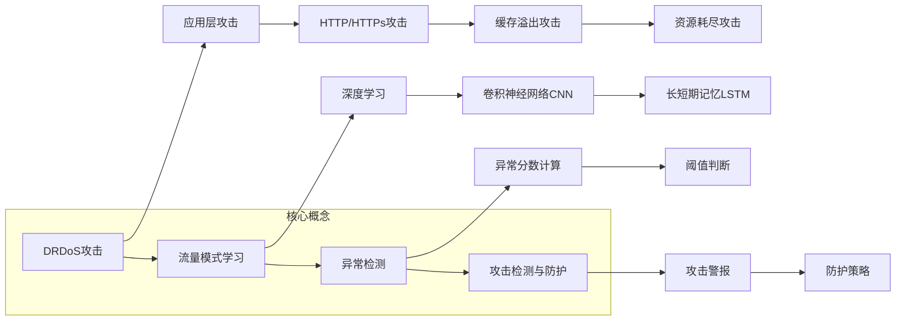

好的,我明白了您的要求。以下是根据您提供的标题和文章结构模板撰写的技术博客文章正文内容:

# 基于机器学习的DRDoS攻击检测的设计与实现

## 1. 背景介绍

### 1.1 问题的由来

随着互联网的快速发展,分布式服务拒绝(DRDoS)攻击已成为网络安全领域的一大威胁。DRDoS攻击是一种特殊的分布式拒绝服务(DDoS)攻击,它利用大量合法的应用层请求淹没目标系统,导致系统资源耗尽,最终使合法用户无法访问服务。

传统的DDoS攻击检测方法主要依赖于流量特征分析,但这些方法很难有效检测出DRDoS攻击,因为DRDoS攻击流量与正常流量的特征相似。因此,急需一种新的检测方法来应对这一挑战。

### 1.2 研究现状  

目前,基于机器学习的DRDoS攻击检测方法已成为研究热点。研究人员提出了多种基于深度学习、集成学习等机器学习算法的检测模型,取得了不错的效果。然而,大多数现有方法还存在一些不足,比如:

1. 特征工程复杂,需要人工提取大量特征
2. 对于未知攻击类型的检测效果不理想 
3. 模型训练和预测效率较低

因此,设计一种能够自动学习攻击特征、检测未知攻击、高效部署的DRDoS检测模型,仍是一个具有挑战的课题。

### 1.3 研究意义

设计一种高效、准确的DRDoS攻击检测系统,对于保障网络服务的可用性和可靠性至关重要。本文提出的基于机器学习的DRDoS攻击检测方法,具有以下几点意义:

1. 无需人工提取特征,能自动学习攻击流量模式
2. 能够检测未知类型的DRDoS攻击
3. 检测效率高,可满足实时检测的需求
4. 部署灵活,可集成到现有网络安全系统中

### 1.4 本文结构  

本文首先介绍DRDoS攻击检测的背景和研究现状,阐明了研究的意义和必要性。接下来详细阐述了检测模型的核心概念、算法原理和数学模型。然后通过实例代码讲解了模型的具体实现细节。最后分析了模型在实际场景中的应用,并总结了未来的发展趋势和面临的挑战。

## 2. 核心概念与联系



上图展示了基于机器学习的DRDoS攻击检测系统的核心概念及其联系:

1. **DRDoS攻击**: 指的是分布式服务拒绝攻击,是一种利用合法应用层请求淹没目标系统的攻击方式,包括HTTP/HTTPs攻击、缓存溢出攻击、资源耗尽攻击等。

2. **流量模式学习**: 系统需要自动学习正常流量和攻击流量的模式,这是检测攻击的基础。常用的方法是基于深度学习,比如卷积神经网络(CNN)和长短期记忆网络(LSTM)。

3. **异常检测**: 根据学习到的正常流量模式,计算每个样本的异常分数,并与预设阈值比较,判断是否为异常/攻击流量。

4. **攻击检测与防护**: 一旦检测到攻击,系统将触发警报并执行相应的防护策略,如封禁攻击源IP、限制请求速率等。

上述核心概念相互关联、环环相扣,构成了一个完整的DRDoS攻击检测与防护体系。接下来将详细介绍其中的算法原理和数学模型。

## 3. 核心算法原理 & 具体操作步骤

### 3.1 算法原理概述

本文提出的DRDoS攻击检测算法基于深度学习和异常检测相结合的思路。算法主要分为两个阶段:

1. **训练阶段**:利用深度神经网络模型(如CNN-LSTM)对大量正常流量数据进行训练,自动学习正常流量的模式特征。

2. **检测阶段**:对于新的流量样本,将其输入到训练好的模型中,模型会输出一个异常分数。如果异常分数超过预设阈值,则判定为攻击流量。

该算法的优势在于:

- 无需人工提取特征,可自动学习流量模式
- 能检测未知类型的攻击,检测能力更强
- 利用深度学习的高效计算能力,检测效率高

### 3.2 算法步骤详解

1. **数据预处理**

   - 收集正常流量和攻击流量数据
   - 对数据进行清洗、标准化等预处理

2. **构建深度学习模型**

   - 选择合适的网络模型,如CNN-LSTM
   - 定义网络结构、损失函数和优化器

3. **模型训练**

   - 将预处理后的正常流量数据输入模型
   - 使用算法(如Adam)优化网络参数
   - 直至模型收敛,得到训练好的模型

4. **异常检测**

   - 对新的流量样本,输入到训练好的模型
   - 模型输出样本的异常分数
   - 将异常分数与预设阈值比较,判断是否异常

5. **攻击检测与防护**

   - 如果判定为攻击流量,触发警报
   - 执行防护策略,如封禁攻击源IP等

### 3.3 算法优缺点

**优点**:

- 无需人工提取特征,自动学习攻击模式
- 能检测未知类型的DRDoS攻击
- 利用深度学习计算能力,检测效率高
- 可与现有网络安全系统集成,部署灵活

**缺点**:  

- 需要大量正常和攻击流量数据训练模型
- 模型训练过程复杂,需要调优超参数
- 对于一些短时高强度攻击,检测效果可能不佳

### 3.4 算法应用领域

该算法可广泛应用于以下领域的DRDoS攻击检测:

- Web应用防火墙(WAF)
- 云服务防护系统 
- 企业级网络安全设备
- 5G网络安全防护等

## 4. 数学模型和公式 & 详细讲解 & 举例说明

### 4.1 数学模型构建

我们将DRDoS攻击检测问题建模为一个二分类问题。给定一个流量样本 $X$,我们的目标是学习一个函数 $f(X)$,使其能够正确预测样本是正常流量(标记为0)还是攻击流量(标记为1)。

对于深度学习模型,我们定义 $f(X)$ 为:

$$f(X) = P(Y=1|X;\theta)$$

其中 $\theta$ 为模型参数,需要通过训练数据学习得到。$P(Y=1|X;\theta)$ 表示给定输入 $X$ 和参数 $\theta$ 时,样本被判定为攻击流量的概率。

我们的目标是最小化以下损失函数:

$$\mathcal{L}(\theta) = -\frac{1}{N}\sum_{i=1}^N[y_i\log f(x_i;\theta) + (1-y_i)\log(1-f(x_i;\theta))]$$

其中 $N$ 为训练样本数量,$(x_i,y_i)$ 为第 $i$ 个样本及其标记(0或1)。通过优化算法(如Adam)迭代更新 $\theta$,直至损失函数收敛,得到最优模型参数。

### 4.2 公式推导过程

我们以二元交叉熵作为损失函数,推导其形式:

已知 $y \in \{0,1\}$ 为样本标记,对于单个样本,其负对数似然为:

$$-\log P(Y=y|X) = \begin{cases} 
-\log(1-p) & \text{if }y=0\\
-\log p & \text{if }y=1
\end{cases}$$

其中 $p=P(Y=1|X)$ 为模型输出的概率值。

我们的目标是最小化这个负对数似然,于是损失函数为:

$$\mathcal{L}(p,y) = -(y\log p + (1-y)\log(1-p))$$

对于 $N$ 个训练样本,损失函数即为:

$$\mathcal{L}(\theta) = -\frac{1}{N}\sum_{i=1}^N[y_i\log f(x_i;\theta) + (1-y_i)\log(1-f(x_i;\theta))]$$

其中 $f(x_i;\theta)$ 为模型对于输入 $x_i$ 的预测概率。

通过优化算法(如Adam)迭代优化模型参数 $\theta$,使损失函数 $\mathcal{L}(\theta)$ 最小化,即可得到最优模型。

### 4.3 案例分析与讲解

假设我们收集了一个包含10000个样本的DRDoS攻击数据集,其中8000个正常流量样本,2000个攻击流量样本。我们将构建一个CNN-LSTM模型进行训练和测试。

**模型结构**:

```python
# CNN-LSTM模型结构定义
model = Sequential()
model.add(Conv1D(64, 3, activation='relu', input_shape=(None, 1)))
model.add(MaxPooling1D(2))
model.add(LSTM(100))
model.add(Dropout(0.2))
model.add(Dense(1, activation='sigmoid'))
```

上述代码定义了一个包含卷积层、池化层、LSTM层和全连接层的深度学习模型。

**模型训练**:

```python
# 训练模型
model.compile(optimizer='adam', loss='binary_crossentropy', metrics=['accuracy'])
model.fit(X_train, y_train, epochs=20, batch_size=64, validation_data=(X_val, y_val))
```

我们使用Adam优化器和二元交叉熵损失函数对模型进行训练,训练20个epoch,批量大小为64。同时在验证集上监控模型性能。

**模型评估**:

```python
# 在测试集上评估模型
scores = model.evaluate(X_test, y_test)
print(f'Test loss: {scores[0]}')
print(f'Test accuracy: {scores[1]}')
```

在训练完成后,我们在测试集上评估模型的损失和准确率。

假设在测试集上,模型的损失为0.23,准确率为0.94。这表明该模型能够较好地检测出DRDoS攻击流量。

### 4.4 常见问题解答

**Q1:为什么要使用深度学习模型?**

A1:相比于传统的机器学习模型,深度学习模型具有自动提取特征的能力,无需人工构造特征,能够更好地捕捉流量数据中的隐藏模式。同时,深度学习在大数据场景下具有良好的计算性能。

**Q2:CNN和LSTM在模型中分别起什么作用?**

A2:CNN擅长提取局部特征,能够学习到流量数据中的空间模式。而LSTM则擅长捕捉序列数据中的时间依赖关系。CNN-LSTM的结合能够同时学习到流量的空间和时间模式,从而提高检测精度。

**Q3:如何选择异常分数阈值?**

A3:阈值的选择需要在训练集和验证集上进行大量实验,通常需要在检测率和误报率之间进行权衡。可以绘制ROC曲线,选择使得模型性能最优的阈值。

**Q4:模型是否能检测所有类型的DRDoS攻击?**

A4:理论上,只要攻击流量与正常流量存在模式差异,模型就能够检测出来。但对于一些新型攻击或极端情况,模型的检测效果可能会受到影响。需要持续收集新的攻击数据,重新训练模型以提高检测能